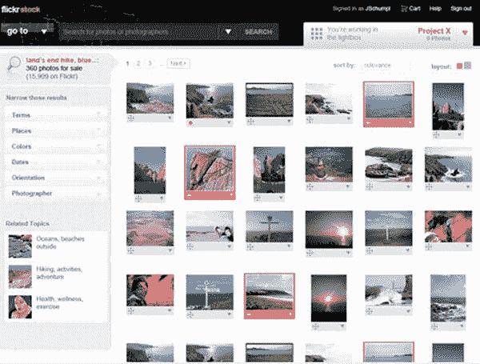

# Flickr 股票——股票照片应该有的样子

> 原文：<https://www.sitepoint.com/flickr-stock-the-way-stock-photos-should-have-been/>

当你想到股票照片时，这些天你可能会想到像 [iStockphoto](http://www.istockphoto.com/) 或 [stock.xchng](http://www.sxc.hu/) 这样的大众内容网站，而不是像 Getty Images(实际拥有 iStockphoto)或 Juperiterimages 这样的传统专业股票图片公司。然而，如果一年前事情有所不同，定义股票照片网站可能是 Flickr。

Flickr 目前是照片分享的主要网站，但是网站的用户被要求选择一个许可证，该许可证至少要求署名(并且通常以某种方式限制使用)，并且出售照片并不容易。然而，大约一年前的 2007 年底，显然有一个计划可以改变这种情况。

[TechCrunch 今天](http://www.techcrunch.com/2009/01/12/the-photo-marketplace-that-never-launched-flickr-stock/)写了一篇 UX 设计师[莎拉·库珀](http://sarahcpr.com/)的博客文章，详细介绍了她在 2007 年被取消的 Flickr 项目“Flickr 股票”中的工作根据库珀的说法，“Flickr 股票的概念是创建一个在线市场，现有的 Flickr 用户可以出售照片，也可以购买他人拍摄的照片。”

然而，这个项目显然被放弃了，去年 7 月，Flickr [宣布与 Getty Images](http://yhoo.client.shareholder.com/releasedetail.cfm?ReleaseID=320377)合作。根据协议条款，Getty 将确定有才华的 Flickr 会员，并与他们接洽，通过 Getty's marketplace 出售他们的图片。这种合作是排他性的，只接受邀请——Getty 的编辑控制着谁可以参与。

据推测，Flickr 的股票会有所不同，会对所有 Flickr 成员开放。对我们来说，这听起来好多了，而且对雅虎来说，这可能会更有利可图。—这对会员来说肯定会更有利可图。尽管 Flickr 和 Getty 之间协议的财务状况不得而知，但在大众制作的业余摄影作品中会有一大笔钱。iStock 2007 年的收入达到了 7190 万美元，其中 2090 万美元是以版税形式分发给会员的。

iStockphoto 只有 320 万张照片出售——Flickr 的图库中有超过 30 亿张 T2 图片。当然，其中很大一部分是库存照片永远做不到的——度假照片、聚会快照、截图等等。—但鉴于 Flickr 吸引了超过其公平份额的超有才华的摄影师，很有可能其照片中至少有 0.001%是有价值的。很可能，这个数字更高。

如果 300 万张有销售价值的照片意味着每年超过 7000 万美元的收入，那么 Flickr 可能已经通过取消 Flickr 股票错过了一座金矿。此外，它将允许 Flickr 的铁杆用户为 Flickr 增加如此多的价值——他们中的许多人通过升级到 Pro 帐户来支付这一特权——赚一点钱，并在过程中为 Flickr 备份几辆 Brinks 卡车。Flickr 股票对所有人都是双赢的(除了 Getty)。让我们希望 Flickr 重新考虑。

库珀已经删除了她的博客文章，但是你仍然可以在谷歌缓存中找到它。此外，一定要查看我们的 [15 个库存照片网站列表，在那里你可以出售你的照片](https://www.sitepoint.com/15-places-to-sell-your-photos/)。

## 分享这篇文章