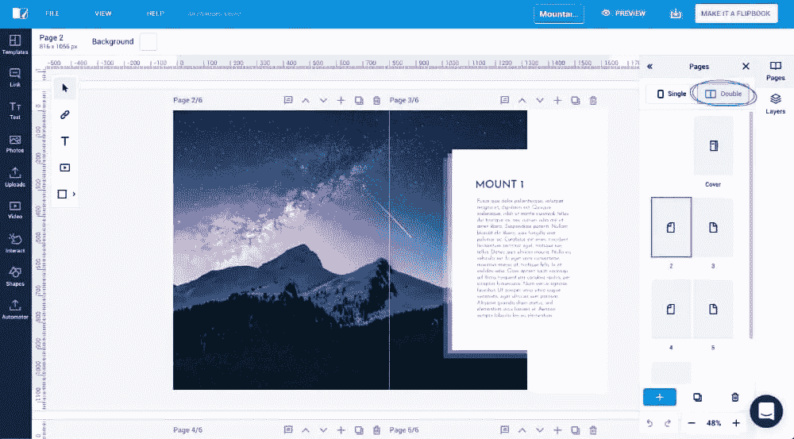

# 认识 Flipsnack，这是一个为不可思议的杂志设计的简单工具

> 原文：<https://www.sitepoint.com/flipsnack-an-easy-design-tool-for-incredible-magazines/>

*本文是与 [Flipsnack](https://www.flipsnack.com/?utm_source=sitepoint&utm_medium=referral&utm_campaign=DesignStudio) 合作创作的。感谢您对使 SitePoint 成为可能的合作伙伴的支持。*

对于任何想要制作任何在线小册子、报告、目录或杂志的人来说，最艰巨的任务之一就是设计。这些通常是推广或内部交流所需要的，所有的公司都需要它们。

你可能已经准备好了所有的内容，或者对内容有了想法，但是你需要专注于设计，因为是设计让所有的内容和谐地融合在一起。

在这种情况下，设计师通常会使用专业工具。最常用的是 InDesign、Affinity Publisher、QuarkXPress 等。

这些设计工具具有不同程度的复杂性，需要不同程度的技术知识，并且具有不同的学习曲线。对于从未打开过 InDesign 或使用过类似专业设计工具的人来说，设计宣传册或目录的想法可能有点吓人。

如果这听起来像你，那么不要惊慌。有一个工具可以帮助你轻松地在线创建专业的设计，它非常适合任何类型的多页面设计(也适用于单页面设计)。它的名字叫 Flipsnack。

就算不纠结设计，还是值得一试。

与大多数专业设计工具不同的是，它非常简单明了。它非常容易使用，事实上，从营销人员、企业主到学生，任何人都可以使用它。

## Flipsnack:设计和发布工具

Flipsnack 现在拥有超过 400 万用户，是全球领先的在线翻页目录数字出版平台之一。来自全球各个角落、拥有各种技能的人都发现 Flipsnack 是创作各种出版物的最佳场所。他们中的一些人使用 Flipsnack 简单地将现成的 pdf 转换为交互式翻页目录，而其他人则喜欢使用其集成设计工具从头开始一页一页地构建目录。集成的设计工具称为“设计工作室”。

完成创作和设计后，如果您愿意，Flipsnack 提供了多种方式来分享您的创作。你可以简单地通过社交媒体分享链接，通过电子邮件发送，在你自己的网站上托管，等等。但是，如果你想让一切保持私密，你也可以这么做。Flipsnack 使用所有顶级安全措施来确保您的数据保持锁定，以确保安全。

## 设计工作室是怎么运作的？

Flipsnack 的[设计工作室](https://www.flipsnack.com/online-design-tool?utm_source=sitepoint&utm_medium=referral&utm_campaign=DesignStudio)是一股不可忽视的力量。它功能强大、直观、易于导航、易于使用。Flipsnack 的目标是把一个人——无论是不是设计师——在设计工作室创作一件艺术品可能需要的一切都带来。

该界面是基于拖放的，尽管易于导航，但它包含了高级功能，这些功能在进行专业设计时至关重要:图层、智能指南、标尺、多选、分组、锁定等。

<video class="wp-video-shortcode" id="video-176566-5" width="1000" height="427" preload="metadata" controls=""><source type="video/mp4" src="https://uploads.sitepoint.com/wp-content/uploads/2020/07/1594085205flipsnack-multiple-align.mp4?_=5">[https://uploads.sitepoint.com/wp-content/uploads/2020/07/1594085205flipsnack-multiple-align.mp4](https://uploads.sitepoint.com/wp-content/uploads/2020/07/1594085205flipsnack-multiple-align.mp4)</video>

就功能而言，即使是专业设计师也会感到满意。几乎你能想到的编辑或设计的每个方面都可以。有很多种字体可用，但是系统也支持字体导入。你所期望的编辑文本的所有选项都在那里。用户可以上传自己的图片，也可以直接从 Flipsnack 使用 Unsplash 的免费库存照片。用不同的图像替换一个图像只需要简单的拖放操作。

你可以做任何事情，从使用文本和图像构建基本布局，到使用图像遮罩、形状甚至交互元素设计更复杂的布局。通过在设计中添加视频、gif、表格、交互式标签或标题，一个基本的设计可以成为一个真正有趣和吸引读者的体验。在目录中添加购物按钮，创建当读者将鼠标悬停在特定区域时显示的标题和描述，并添加链接。

## 双页编辑

Flipsnack 是仅有的提供双页编辑选项的在线工具之一。这意味着在编辑过程中，您可以始终看到两个页面的完整设计。这也意味着您可以非常容易地编辑开放目录的完整布局:在两个页面上添加图像，或者在整个布局上添加标题。

这有很大的不同，它真的在你的创作过程中帮助了你。当你在设计的时候，它可以让你看到读者会看到的东西。

### 模板

当你陷入困境，需要快速创作时，Flipsnack 也能满足你。该平台内置了大量专业制作的模板，可以免费使用，随时可用。模板库不断发展，涵盖了各种出版物类型，从相册、作品集、报告、目录、杂志、指南等等。

在 Design Studio 中编辑模板就像点击几下鼠标一样简单。您在模板上看到的任何内容都可以根据您的喜好进行更改。真的只需要几分钟。

### 印刷

尽管通过在线出版来拯救树木很重要，但有时人们仍然需要订购印刷品。因此，在 Flipsnack 中制作的所有设计都可以作为高质量的 pdf 文件下载，并用于订购印刷品。还有一个选项可以直接通过 Flipsnack 界面从其打印合作伙伴那里订购您制作的任何照片。您可以在一个地方获得所需的所有选项。

## 我为什么要用它？

尽管设计工作室可能很复杂，Flipsnack 提供了很多选项，但它仍然非常容易使用。整个平台是为初学者设计的。

不过，这并不是说专业设计师或编辑不会找到他们确切需要的东西。Flipsnack 适用于任何人和任何人，不管你的技能是什么，它是任何类型的组织、企业或个人的完美工具。

有一个免费版本。[试试看](https://www.flipsnack.com/accounts/sign-up.html?utm_source=sitepoint&utm_medium=referral&utm_campaign=DesignStudio)！

## 分享这篇文章