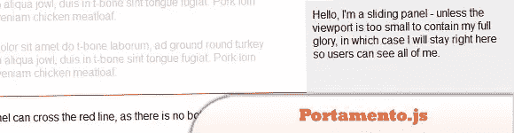
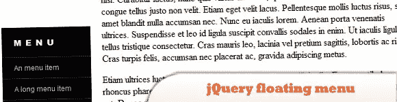
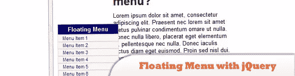
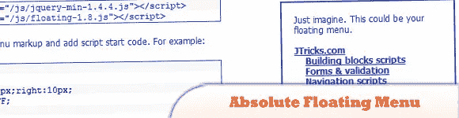
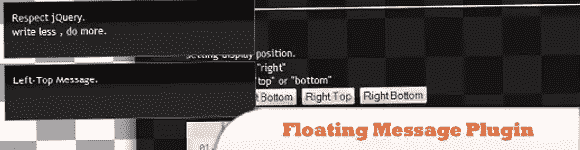
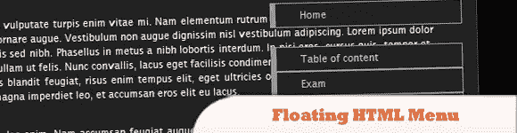
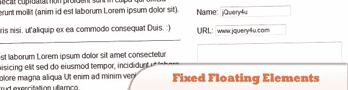
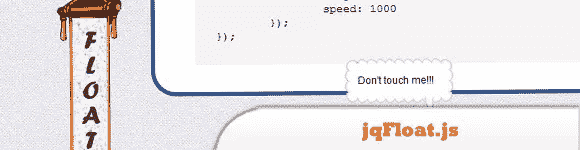
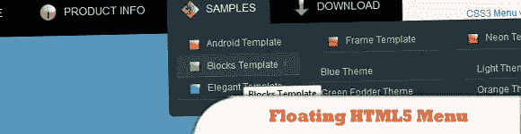
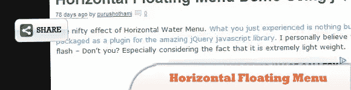

# 10 个 jQuery 浮动菜单和消息插件

> 原文：<https://www.sitepoint.com/floating-message-plugins/>

这些是一些很棒的 jQuery 浮动菜单插件在今天的帖子中，它们将帮助你添加一个浮动的、粘性的菜单，包含重要的网站链接。“漂浮”效果！你会注意到，当你滚动过顶部的菜单栏时，它开始在页面的其余部分浮动。尽情享受吧！

**相关帖子:**

*   [**jQuery 浮动书签地球仪**](http://www.jquery4u.com/fun-and-games/jquery-floating-bookmark-globe/)
*   [**8 JS Dock 菜单插件**](http://www.jquery4u.com/menus/8-js-dock-menu-plugins/)
*   [**10 jQuery 炫酷菜单效果插件**](http://www.jquery4u.com/menus/10-jquery-cool-menu-effect-plugins/)

## 1.Portamento.js

一个 jQuery 插件，它使得向你的网页添加滑动(也称为“浮动”)面板功能变得简单。适用于浮动和绝对定位布局，在所有现代浏览器和一些不太现代的浏览器中也适用。

  
[来源](http://simianstudios.com/portamento/) [演示](http://simianstudios.com/portamento/demos/no-limit.html)

## 2.jQuery 浮动菜单

一个简单的导航菜单,“跟随”页面滚动并在鼠标经过时展开，用 CSS 和 jQuery 制作。

  
[来源](http://manos.malihu.gr/jquery-floating-menu) [演示](http://manos.malihu.gr/tuts/jquery-floating-menu.html)

## 3.用 jQuery 创建浮动菜单

下面的代码可以用来创建一个浮动的 jQuery 菜单，它可以停留在屏幕上的任何位置。确保在您使用的任何页面上都加载了 jQuery。

  
[来源](http://www.warpconduit.net/2009/10/07/create-a-floating-menu-with-jquery/) [演示](https://jsfiddle.net/nMcxQ/)

## 4.作为 jQuery 插件的绝对浮动菜单

也是一个现成的 jQuery 插件(除了独立模式)。当脚本代码被加载时，如果 jQuery 在此之前被加载(即使在使用 noConflict()时)，绝对浮动菜单会将自己注册为 jQuery 插件。

  
[源+演示](http://www.jtricks.com/javascript/navigation/floating/jquery.html)

## 5.jQuery 浮动消息插件

这个插件基本上很容易显示消息。在 MIT 或 GPL 版本 2 许可下的双重许可。

  
[源+演示](http://sideroad.secret.jp/plugins/jQueryFloatingMessage/)

## 6.使用 jQuery 和 CSS 创建浮动 HTML 菜单

对于我们所有处理长网页并需要滚动到顶部菜单的人来说，这里有一个不错的选择:浮动菜单，当你滚动页面时它会移动。这是使用 HTML、CSS 和 jQuery 完成的，并且完全符合 W3C 标准。

  
[来源](http://net.tutsplus.com/tutorials/html-css-techniques/creating-a-floating-html-menu-using-jquery-and-css/) [演示](https://d2o0t5hpnwv4c1.cloudfront.net/018_Floating_Menu/demo/dhtml_float_menu_final_nettut.html)

## 7.固定浮动元素

了解如何用很少的 jQuery 复制固定的浮动边栏或元素。

  
[源+演示](http://jqueryfordesigners.com/demo/fixedfloat.html)

## 8.jqFloat.js

一个 jQuery 插件，可以让任何 HTML 对象看起来像是漂浮在你的网页上。

  
[源+演示](http://www.inwebson.com/demo/jqfloat/)

## 9.浮动 HTML5 菜单

这个菜单与 Firefox、Opera、Chrome 和 Safari 配合得非常好。下拉菜单也适用于 IE7+等非 CSS3 兼容的浏览器，但圆角和阴影不会被渲染。

  
[来源](http://html5-menu.com/floating-html5-menu-twitter.html) [演示](http://html5-menu.com/floating-html5-menu-twitter.jsp?q=aHR0cDovL3d3dy5jc3MzbWVudS5jb20vZWxlZ2FudC1kYXJrLW1lbnUuaHRtbD9hZmZpZD1IVDUtTU4zMQ==)

## 10.使用 jQuery 的水平浮动菜单演示

你刚刚经历的不过是包装成令人惊叹的 jQuery JavaScript 库的插件的水平水菜单。

  
[源+演示](http://codershelpdesk.com/2012/04/24/horizontal-floating-menu-demo-using-jquery/)

## 分享这篇文章