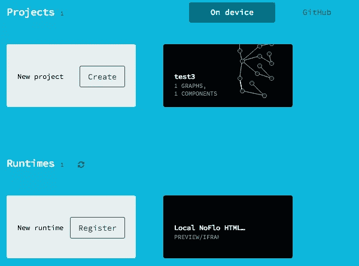
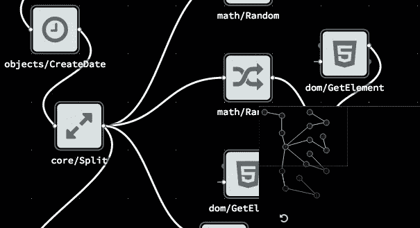
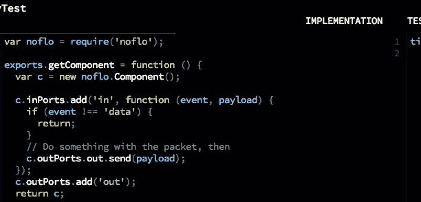

# 使用 NoFlo 进行基于流程的编程

> 原文：<https://www.sitepoint.com/flow-based-programming-noflo/>

令人惊讶的是，随着我们闪电般的技术周期，诞生于喇叭裤和转盘时代的工作流正在复兴。早在 20 世纪 70 年代，一位名叫 j·保罗·莫里森的天才工程师设计了一个类似普通流程图的银行系统。他的软件概念被悄悄地归功于能够以一种非技术人员也能理解的方式可视化地传输复杂的逻辑。多年后，一场运动正在兴起，科技行业的专业人士应该明智地关注这场运动。这篇文章探讨了基于流的编程，或 FBP。

## 迷雾

自从马礼逊的 FBP 银行体系初见成效以来，官方很少提及破坏性概念。然而，FBP 实际上已经在远离软件开发中心的行业崭露头角:视觉效果、电影、人工智能、狂热编程等。

对视觉上吸引人的程序流的需求，以及远离面向对象编程的一步，看起来像是迈向更易理解、更灵活的代码的一步。那么，为什么 FBP 在设计师、产品经理，以及最重要的开发人员中迟迟得不到普遍认可呢？

越来越多的证据表明，这个没有答案的问题可能已经通过 Flowhub 网络的出现得到了成功的解决，特别是针对 Javascript 的 NoFlo。

## 诺弗洛

备受赞誉的补锅匠亨利·贝吉乌斯和 Meemoo 的创造者 T2·福里斯特·奥列芬特组成了在全球获得巨大支持的 T4 Kickstarter 的两个关键部分。NoFlo 项目虽然雄心勃勃，但有几个特点使其有别于 Yahoo Pipes、Quartz Composer 和过去其他成功但有限的类似 FBP 的系统:

*   诺弗洛的图表可以通过 JSON 创建。
*   虽然托管基础设施是封闭的，但底层编程框架是开源的。
*   UI 不生成任何自己的代码。
*   除了 NoFlo/JavaScript 运行时，类似的运行时也在为 Java、Objective-C 和其他语言构建。
*   可以为任何目的创建和测试定制组件。

Flowhub 的程序将逻辑排列成“图形”,图形的“节点”充当程序组件。节点被设置为对传入的信息包(iip)做出反应，使得节点接收然后基于组件类型输出动作。在 OOP 中的大部分时间，开发人员关心的是组件如何通信，而在 FBP 中，唯一关心的是连接哪些组件。NoFlo 最初的 Kickstarter 页面上的一句话很好地总结了一个版本的[神话人月](http://en.wikipedia.org/wiki/The_Mythical_Man-Month):

> “构建软件就是这样；关键是在脚手架因自身重量而倒塌之前，你能搭建多少脚手架……不管你有多少人在上面工作……一个软件开发项目到了一定的规模，你增加一个人，与那个人交流的能量实际上大于他们对项目的净贡献，所以它会慢下来。”史蒂夫·乔布斯

NoFlo 组件可以对不同的输入做出反应，包括 HTTP 请求和 API，并可以输出到不同的目标，如数据库。您甚至可以通过使用 Node.js 库将 NoFlo 图集成到现有的 JavaScript 项目中。这种流程对支配大多数编程逻辑的一步到位的范式提出了挑战，特别是当我们考虑到现代接口随着规模的扩大而处理的大量输入/输出和膨胀的数据源时。

这种哲学转变在开发人员中造成的不安全感是显而易见的，也是可以理解的。如果开发人员的工作被取消，只是被那些很容易理解如何连接千篇一律的组件以适应所有可以想象的任务的设计师和产品经理所吞噬，那会怎么样？然而，最终，FBP 的灵活性可能会给软件开发行业带来远远超过任何后果的好处。还有构建定制组件、用现有代码实现 FBP，以及由于这种编程的可视化本质而导致的潜在用户界面限制等问题。

## 个案研究

让我们用 NoFlo 的 FBP 做一个快速实验，直接了解这个界面。注册需要一个 GitHub 帐户，从而可以选择无缝部署到存储库。根据计划中可用的运行时间，界面可能会有所不同:

当你放大到只能看到整个网络的一部分时，一张方便的地图会给你提供方位。这一功能和其他导航方法对于复杂的水流至关重要，这些水流可能会占用建筑物的可读空间。出于这个原因，缩放就像轻扫触摸板或手指挤压(触摸)一样简单。

四处移动可视区域需要一个*点击-按住-拖动*动作或类似的触摸动作，并且在界面上的全方位移动是直观的。点击搜索栏时，它会列出所有现成的组件，从 CSS 元素和动作，到简单的数据库调用，到常见的数学函数和绘图功能。

目前，您可以通过文本编辑器界面在浏览器中预览输出，以及构建和测试自定义组件:

## 结论

一旦我对启动 IPs 有了感觉，并抛开了对文本的担忧，视觉方法就给了自己一定的自由。如果这个项目有更多层次的复杂性，我感觉程序中的物理逻辑流程可能会有一个更大的概念。协作地，这种可视化描述看起来像一个草图，或者一些图形化的伪代码，一些开发人员在我们将程序翻译成特定语言之前，用它们来勾勒程序的基本流程。许多学科似乎越来越多地出现这种情况，人们可以想象一个文字少得多、图片多得多的世界。

在浏览器中试验[项目代码](https://github.com/sitepoint-examples/noflojs_tut-casestudy_sample)或[(一旦登录 Github)。](http://app.flowhub.io/#project/test3/sp6sa)

## 分享这篇文章