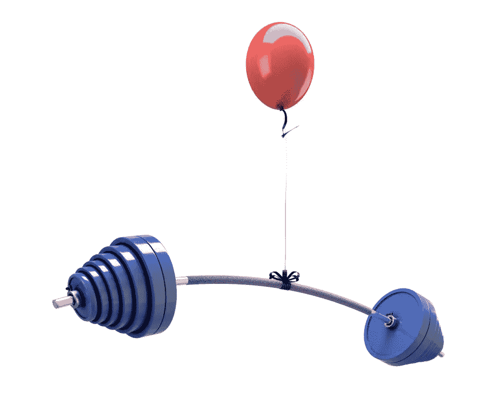

# Flyweight 设计模式和不变性:完美的匹配

> 原文：<https://www.sitepoint.com/flyweight-design-pattern-immutability-perfect-match/>

flyweight 模式在 PHP 中是一个相对不为人知的设计模式。flyweight 模式背后的基本原理是，可以通过在对象被创建后记住它们来节省内存。然后，如果需要再次使用相同的对象，不必浪费资源来重新创建它们。



您可以将 flyweight 模式视为对传统对象工厂的修改。修改是，工厂应该检查是否已经创建了所请求的对象，而不是总是创建新的对象。如果有，它应该返回这个实例，而不是再次创建对象。

flyweight 模式的一个很好的用例是必须加载大文件的应用程序。这些文件就是我们的 flyweight 对象。

## Flyweight 对象

flyweight 对象的一个重要特性是它们是不可变的。这意味着它们一旦被构造就不能被改变。这是因为我们的工厂只有在它也能保证它最初创建的对象没有被修改的情况下，才能保证它记住了正确的对象。

下面是一个非常简单的文件 flyweight 对象的例子。我们可以说它是不可变的，因为“数据”属性在构造函数被调用后不能改变。没有“setData”方法。

```
class File
{
    private $data;

    public function __construct($filePath)
    {
        // Check to make sure the file exists
        if (!file_exists($filePath)) {
            throw new InvalidArgumentException('File does not exist: '.$filePath);
        }

        $this->data = file_get_contents($filePath);
    }

    public function getData()
    {
        return $this->data;
    }
}
```

## 轻量级工厂

我们的 flyweight 工厂需要能够为它创建的 flyweight 对象获得一个惟一的标识符。然后，它可以使用这个唯一标识符来检查它是否已经创建了它所请求的对象。在许多场景中，我们的工厂方法的参数将为我们的 flyweight 形成一个合适的惟一标识符；因为应该是这样的，如果我们用相同的参数调用我们的工厂，它将产生相同的结果。

在下面的例子中，我们使用“files”属性作为关联数组来存储已经创建的对象。唯一标识符最明显的选择是文件路径，因此这将是数组中元素的键。

```
class FileFactory
{
    private $files = array();

    public function getFile($filePath)
    {
        // If the file path isn't in our array, we need to create it
        if (!isset($this->files[$filePath])) {
            $this->files[$filePath] = new File($filePath);
        }

        return $this->files[$filePath];
    }
}
```

现在我们可以使用 FileFactory 类来获取文件，而不用担心多次加载它们！

```
$factory = new FileFactory;

$myLargeImageA = $factory->getFile('/path/to/my/large/image.png');
$myLargeImageB = $factory->getFile('/path/to/my/large/image.png');

if ($myLargeImageA === $myLargeImageB) {
    echo 'Yay, these are the same object!'.PHP_EOL;
} else {
    echo 'Something went wrong :('.PHP_EOL;
}
```

## 关于穿线的一个注记

flyweight 模式在多线程环境中特别有用。flyweight 对象的不变性保证了它们可以被多个线程安全地同时使用。这是因为两个线程不可能试图同时改变同一个对象。

如果您在多线程环境中使用 flyweight 模式，您应该将工厂方法视为一个关键部分。应该使用锁或类似的控制来确保两个线程不会试图同时创建一个对象。

## 思考 PHP

前面我提到过 flyweight 模式是 PHP 中一个相对不为人知的设计模式。其中一个主要原因是内存使用对于许多 PHP 开发人员来说并不是一个需要考虑的问题。我们的大多数 PHP 应用程序不需要做太多的工作，它们的实例在处理传入的 HTTP 请求时只存在几毫秒。

然而，如果我们在长时间运行的应用程序中使用 flyweight 模式，我们需要注意内存泄漏。在 PHP 中，只要在应用程序的范围内存中存在对对象的引用，内存就会一直分配给该对象。由于 flyweight 工厂保存了对它创建的每个对象的引用，当它被要求创建的对象数量是无限的时，应用程序最终会耗尽内存。

flyweight 模式最适合工厂需要创建和记忆的对象数量有限，并且与应用程序的内存约束兼容的场景。也就是说，应用程序在崩溃之前不能被操作来大量地创建和记忆对象。

## 用 Flyweights 枚举

然而，内存优化并不是您选择实现 flyweight 模式的唯一原因。flyweight 模式对于创建枚举对象也很有用。教义 DBAL 是一个这样做的库的例子。它帮助开发人员编写与平台无关的代码，这些代码将与许多不同的存储层无缝协作。

在这个库中，“类型”对象用于在数据库值和 PHP 值之间来回转换。字符串、整数、布尔、浮点、数组、日期等等有不同的“类型”对象。

以下是来自教义 DBAL 的[抽象“类型”类](http://www.doctrine-project.org/api/dbal/2.2/source-class-Doctrine.DBAL.Types.Type.html#138)的一个非常简化的版本:

```
abstract class Type
{
    const INTEGER  = 'integer';
    const STRING   = 'string';
    const DATETIME = 'datetime';

    private static $_typeObjects = array();

    private static $_typesMap = array(
        self::INTEGER  => 'Doctrine\DBAL\Types\IntegerType',
        self::STRING   => 'Doctrine\DBAL\Types\StringType',
        self::DATETIME => 'Doctrine\DBAL\Types\DateTimeType',
    );

    public static function getType($name)
    {
        if (!isset(self::$_typeObjects[$name])) {
            if (!isset(self::$_typesMap[$name])) {
                throw DBALException::unknownColumnType($name);
            }

            self::$_typeObjects[$name] = new self::$_typesMap[$name]();
        }

        return self::$_typeObjects[$name];
    }

    // ...
}
```

如您所见，flyweight 模式用于强制每种类型只创建一个对象。如果开发人员需要获取“类型”对象，他们可以静态调用“getType”方法，如下所示:

```
$integerType = Type::getType(Type::INTEGER);
```

以这种方式使用 flyweight 模式确实有助于减少库的内存占用，但在其他方面也有帮助。

当使用 flyweight 模式时，枚举对象更有意义。没有它，奇怪的事情就会发生。以此为例:

```
$type1 = Type::getType(Type::INTEGER);
$type2 = Type::getType(Type::INTEGER);

if ($type1 === $type2) {
    echo 'Yay, you used the flyweight pattern!'.PHP_EOL;
} else {
    echo 'Well this is confusing :('.PHP_EOL;
}
```

如果没有 flyweight 模式，上述测试将无法通过。在漫长的一天中，这对于新手，甚至是有经验的开发人员来说都是非常困惑的。

使用 flyweight 模式枚举对象的另一个例子是 Marc Bennewitz 的 php-enum。

## 摘要

在共享对象可以显著减少内存使用的应用程序中，flyweight 模式是最有益的。这种模式肯定不是我们在 PHP 应用程序中经常遇到的，但是在一些场景中它会很有用。尽管该模式旨在减少内存使用，但如果使用不当，还是会发生内存泄漏。当使用 flyweight 模式时，枚举对象更有意义，因为每个值只有一个对象实例。

## 分享这篇文章