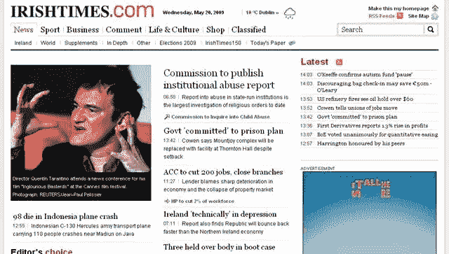
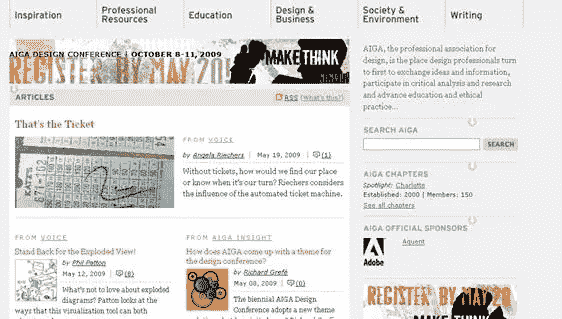
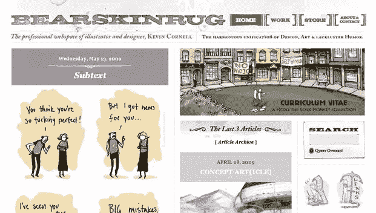
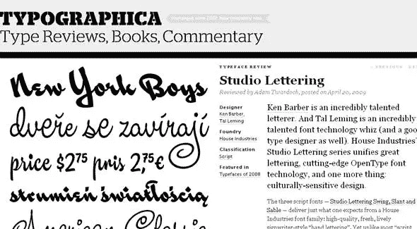
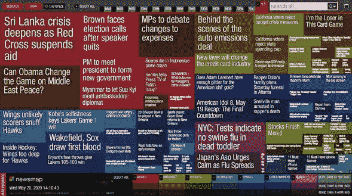

# 关注排版，第 2 部分:层次结构

> 原文：<https://www.sitepoint.com/focus-on-typography-part-2-hierarchy/>

之前我们看了一下如何在排版中使用[对比度](https://www.sitepoint.com/focus-on-typography-part-1-contrast/)来确保网页清晰易读。今天，我们来看看印刷术中的等级观念。通过改变字体的大小，可以区分内容的不同部分。

这个概念我们都很熟悉，每天都能看到，但可能没有意识到这个术语。层次结构引导我们阅读一篇文章，或者浏览一个网页。它告诉我们从哪里开始阅读，页面最重要的部分是什么，页面下一个最重要的部分是什么等等。最明显的线下例子是报纸——大标题在第一页的顶部，有时后面是署名，然后是正文。较小的不太重要的故事有较小的标题。所以你可以用这个理论来引导你的访问者浏览你的页面。主标题(几乎)总是在顶部，但是你也可能在侧边栏中有重要的信息，所以使用大标题来区分这一部分。

当然，你可以使用颜色或背景框颜色来达到这种效果，但是如果你在标题、副标题和副本上保持字体的大小和粗细一致，你就让人们知道了页面上元素的相对重要性。

等级制度不是孤立存在的，它与我们明天要讨论的基本原则，即字体大小，有很大关系。这里有一些来自网络的例子。

《爱尔兰时报》和许多报纸网站一样，遵循相当标准的等级制度。

[AIGA](http://www.aiga.org)

[熊皮地毯](http://www.bearskinrug.co.uk/index.php)

[印刷字体](http://new.typographica.org/)

[新闻地图](http://Newsmap.jp)。我想包括这个，因为我认为这是一个真正的*非典型* **层次结构，因为各部分由颜色和标题大小来区分。**

 **

明天，我们将继续这个系列，看看字体大小也是易读性的一个重要功能。** 

****相关阅读:****

 ***   [关注排版，第一部分:对比](https://www.sitepoint.com/focus-on-typography-part-1-contrast/)
*   [漂亮排版的原则](https://www.sitepoint.com/article/principles-beautiful-typography/)** 

## **分享这篇文章**