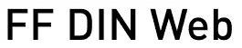
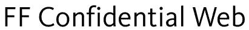

# 字体商店发布 30 个美丽的“网络字体”

> 原文：<https://www.sitepoint.com/fontshop-webfontfonts-typography/>

缓慢但肯定的是，我们开始看到在网站中使用字体的能力发生了一些实质性的变化，而不是有限的“网络安全”字体。在过去，网页设计者不得不小心翼翼地选择字体，以确保文字对搜索引擎友好。使用 web 安全字体的替代方法是使用带有一些替代文本的图像，或者使用 Flash。但我们知道，与简单地改变页面上的文本相比，更新图像和 Flash 可能是一件痛苦的事情。

Typekit 是一项托管字体并以优化、安全的方式提供字体的服务，现在技术已经到位，许多字体代工厂正在签约提供网络优化字体。

Fontshop 宣布他们的 30 种字体与 Typekit 一起被特别重新设计用于网络，他们称之为 [Web FontFonts](https://www.fontshop.com/blog/?p=1763) 。这些字体已经过优化，几乎可以在任何屏幕上显示。它们以 Internet Explorer 和 Firefox 支持的格式交付。格式为 EOT Lite 和[网络开放字体格式](https://people.mozilla.com/~jkew/woff/woff-2009-09-16.html) (WOFF)。对于 Chrome 和 Safari 用户，FontShop 提供了一个免费的 [Typekit 托管选项](https://fontshop.cmail3.com/t/y/l/ojjni/udhkulok/i)。

这套新字体中有一些漂亮的字体。下面就来看几个。

[Clifford Web](https://www.fontshop.com/fonts/downloads/fontfont/ff_clifford_web/?utm_source=NewsletterFeb2410&utm_medium=web&utm_content=CliffordWeb&utm_term=em&utm_campaign=FF52Web)

[超级奇石网](https://www.fontshop.com/fonts/downloads/fontfont/ff_super_grotesk_web/?utm_source=NewsletterFeb2410&utm_medium=web&utm_content=SuperGrotesk&utm_term=em&utm_campaign=FF52Web)

[FF DIN Web](https://www.fontshop.com/fonts/downloads/fontfont/ff_din_web/?utm_source=NewsletterFeb2410&utm_medium=web&utm_content=DINWeb&utm_term=em&utm_campaign=FF52Web)

[FF 机密](https://www.fontshop.com/fonts/singles/fontfont/ff_confidential_web_regular/)

[FF 编织网](https://www.fontshop.com/fonts/downloads/fontfont/ff_kievit_web/)

**如何购买字体**

来自 FontShop 的网络字体格式只能在网站上使用，不能在桌面应用程序中使用，但它们没有任何类型的 DRM 来防止未经授权的使用。web 字体将使用一种新的许可模式提供，这种模式不同于当前脱机字体的“按用户”许可模式。许可将基于每月的页面浏览量，客户将选择他们认为是他们网站页面浏览量的正确许可。这无疑会被认为是有争议的，但由于独家网络专用字体是一个相当新的概念，这是开始测试这些模型并相应调整的正确时间。

你可以在 [FontShop 博客](https://www.fontshop.com/blog/)上阅读更多关于可用字体的信息。

这些字体中有没有让你感兴趣在网络上使用的？

## 分享这篇文章