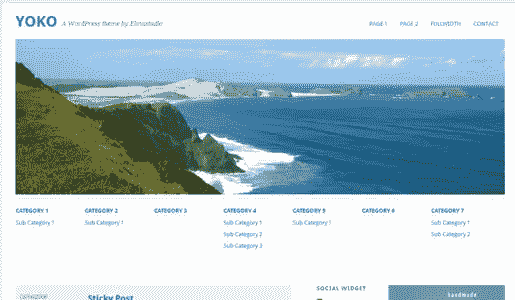
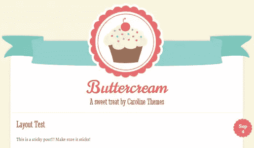
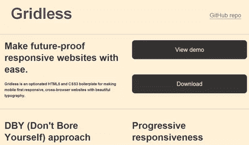
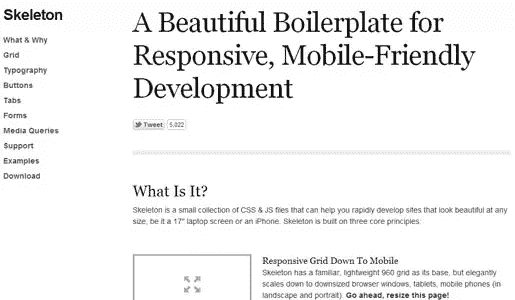
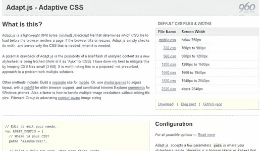
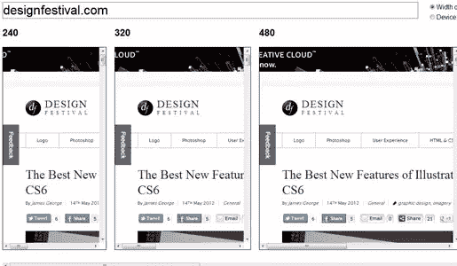
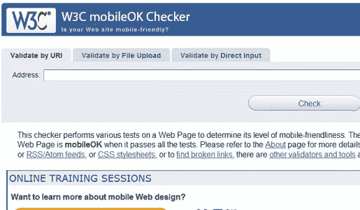
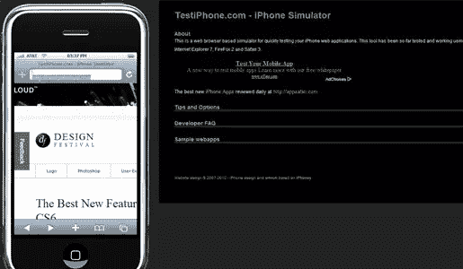
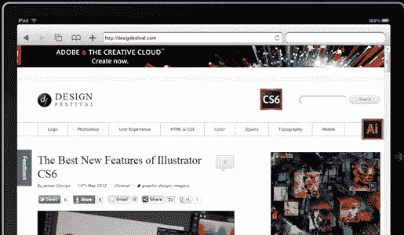
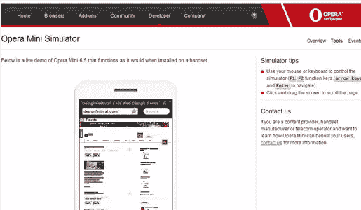

# 是时候建立一个反应灵敏的网络了！:11 响应性设计资源

> 原文：<https://www.sitepoint.com/forget-mobile-sites-time-for-a-responsive-web/>

这对于一个设计师来说可能是一个惊喜，但是我对移动网站已经厌倦了。现在是我们远离创建两个完全独立的设计的时候了——一个用于桌面浏览器，一个用于移动网站。如果我们真的想要一个所有设备都可以访问的网络，我们需要把分裂的技术放在一边。

我承认响应式网页设计并不适合所有人。总会有一些特殊的情况需要只在桌面上传送内容。不过，这些应该是异常值。在绝大多数情况下，网站用户只是想进入你的网站，获取信息，然后转向他们的下一个兴趣点。但是，我们似乎已经接受了检测移动浏览器并将移动用户转发到一个单独网站的繁琐、有问题的过程。

这在许多层面上都是适得其反的:

*   必须维护和更新两个独立的设计。它们很容易不同步或过时。
*   与桌面用户相比，移动用户通常无法获得所有内容。
*   通常，必须维护两组不同的内容。
*   用户代理检测并不总是有效的，所以错误的站点会被发送。

### 我有什么选择？

你有三种方法来解决这个问题:

1.  坚持使用独立的移动网站，因为这很可能就是你现在所在的位置。
2.  为灵活性而设计，但不要创造独特的移动体验。
3.  设计一个能根据屏幕大小做出反应的网站。

最后一个选项是我个人最喜欢的，现在有很多工具可以帮助你设计一个响应用户的网站，但是提供相同的内容。

### 响应式网络方法带来了什么变化？

大多数情况下，你将不得不放弃任何不能在手机浏览器上运行的网络技术。这意味着一些 jQuery 和全 Flash 可能不再适合您。极简主义成为主要的方法论，你将不得不考虑保持你的有效载荷轻。避免那些 1MB 的 PNG 文件，例如(小撕…它们实在是太漂亮了！).

### 响应式网页设计工具

构建响应性网站可能是一个巨大的挑战，因为它总是从网站访问者和他们的需求开始。没有放之四海而皆准的方法，如果你是设计师，你可能会很难向你的客户推销这个概念，他们想要一个光滑，华丽，图形丰富的网站，为每一个浏览设备量身定制。然而，你不必放弃创造性的设计。毕竟这是关于站点架构，而不是内容。

以下是我收集的一些工具，可以帮助你设计出响应用户的网站，这样你就可以摆脱构建和维护两个独立网站的双重方法。无论你有一个 WordPress 站点，一些其他的 CMS，或者只是想把你的设计方法学引向响应，这些工具将会让你走上正确的轨道，并且打开你的思维去接受一些处理响应的新方法。所有这些主题和工具都是免费的。

### 响应 WordPress 主题

如果你和我一样，你正在管理运行在 WordPress 这样的 CMS 上的网站。与其重新设计，不如考虑从这些基本主题中的一个开始，修改它以适应你的设计和品牌需求。下面的主题是免费的，但是不要忘了看看高级主题，它们可能会让你更接近你想要的美学和响应功能。

* * *

#### 约科

另一个极简设计，结合了根据屏幕大小调整大小的图像。很简单，很容易修改。

[搞定](http://wordpress.org/extend/themes/yoko) | [试玩](http://yoko.elmastudio.de/)

* * *

#### 加糖奶油浆

远离极简设计，这是一个很好的例子，一个有很多特色的主题。

[搞定](http://wordpress.org/extend/themes/buttercream) | [试玩](http://buttercream-demo.calobeedoodles.com/)

* * *

### 设计工具

如果你需要一些基线工具来建立你自己的响应网站，这些将会让你走上正轨。其中大多数都是面向一个预构建的系统，您可以使用它作为快速部署站点的起点。

#### 无网格

作为一个灵活的响应网站的系统，Gridless 是一个非常棒的现成的基本文件集。从一个空白的 index.html 文件开始，链接到适当的 CSS 和 JS 文件，就是这样。这些设计非常灵敏，并且向后兼容。

[搞定](http://thatcoolguy.github.com/gridless-boilerplate/) | [试玩](http://thatcoolguy.github.com/gridless-boilerplate/demo/demo.html)

* * *

#### 获取骨架

如果您想从一组可靠的 CSS 和 HTML 兼容文件开始，Get Skeleton 是一个非常好的起点。刚开始添加内容。它并没有变得更容易，Get Skeleton 在旧的浏览器上表现很好。

[搞定](https://github.com/dhgamache/Skeleton/zipball/master) | [试玩](http://www.getskeleton.com/)

* * *

#### Adapt.js

所以，也许你不想用无网格或者 Get Skeleton 这样的模板重新开始。Adapt.js 是一个非常小的 js 文件，它检查屏幕的宽度——即使在调整屏幕大小(如旋转屏幕)之后——并根据需要提供内容。其优势在于，您可以为任何屏幕尺寸设计样式，允许您为任何数量的移动设备和屏幕宽度进行调整。

[搞定](http://adapt.960.gs/) | [试玩](https://github.com/nathansmith/adapt/zipball/master)

* * *

### 测试

那么你已经准备好了你的设计，你怎么能确定它会工作呢？这里有几个测试工具，你可以使用它们来确保你的设计在现实世界中的响应功能。

### 应答的

只需输入网址，就能看到设计对不同屏幕尺寸的反应。这很简单，而且与设备无关。

[使用它](http://mattkersley.com/responsive/)

* * *

### W3C MobileOK 检查器

所有 HTML 的来源，W3C 是验证测试的大本营，他们的 MobileOK checker 可以很容易地确保您的响应式设计能够工作并得到支持。

[使用它](http://validator.w3.org/mobile/)

* * *

### 测试 iPhone

这很简单——如果你想测试你的网站在 iPhone 上如何工作，这是一个很好的小网站。你必须在 iPhone 的浏览器中输入，但它在模拟界面方面做得很好。

[使用它](http://www.testiphone.com/)

* * *

### iPadPeek

像测试 iPhone 一样，iPadPeek 可以让你测试 iPads 将如何解释你的设计。

[使用它](http://ipadpeek.com/)

* * *

### 歌剧迷你模拟器

Opera Mini 是一款在小型手机上非常受欢迎的浏览器，几乎只在世界上的发展中地区使用(也在一些发达国家使用)。在这个设备上测试你的设计总是值得的，尤其是当你使用 JavaScript 的时候。

[使用它](http://www.opera.com/developer/tools/mini/)

* * *

对于响应式网页设计，你使用什么工具和方法？你是否更愿意维护两个版本的网站，以便得到你想要的精确设计？

## 分享这篇文章