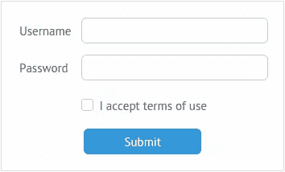
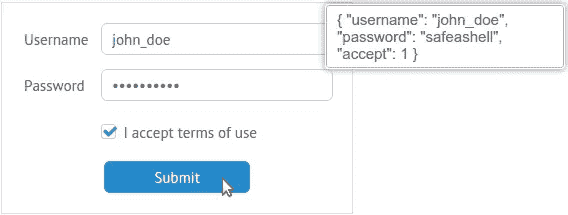

# 用 Webix 框架创建表单——4 个实例

> 原文：<https://www.sitepoint.com/forms-webix-framework/>

这篇文章由西蒙·科灵顿和马洛里·范·阿赫特博格进行了同行评议。感谢 SitePoint 的所有同行评审员使 SitePoint 的内容尽可能做到最好！

作为一名网页设计者，你可能需要经常创建网页表单。这通常是一项费力不讨好的任务，并且令人头疼(尤其是如果您正在做一些更复杂的事情，比如创建一个多步表单)。在这种情况下，最好使用 UI 框架来减轻痛苦并加速开发过程。在这篇文章中，我将概述各种技巧和窍门，让您使用 [Webix 框架](http://webix.com/ "Webix home page")快速创建不同类型的表单。

## Webix 是什么？

Webix 是 HTML5 组件的 JavaScript UI 库，便于创建移动和桌面 web 应用程序。它为您提供了各种各样的组件，从一个简单的按钮到[电子表格小部件](http://docs.webix.com/desktop__spreadsheet.html)，可用于开发类似 Excel 的应用程序。除了 [UI 组件集合](http://docs.webix.com/desktop__components.html "Webix UI components")，还有[事件处理机制](http://docs.webix.com/desktop__event_handling.html)、[离线模式支持](http://docs.webix.com/desktop__server_offline.html)，以及一堆[开发工具](http://webix.com/development-center/)。您还可以使用[皮肤生成器](http://webix.com/skin-builder/)创建自己的皮肤，使用[可视化设计器](http://webix.com/blog/webix-3-0-webix-jet-visual-designer-new-functionality/)进行拖放式 UI 创建，并在在线源代码游戏中玩代码。该项目还有[详尽的文档](http://docs.webix.com/)。

我已经写了一篇介绍性文章,描述了使用这个框架的关键特性和基础知识，所以如果你感兴趣的话，可以提前看一下。

## 包括 Webix

有多种方法可以将所需的 JavaScript 和 CSS 文件包含在项目中。如果你[下载](http://webix.com/download/ "Download Webix")库包，你会在`codebase`文件夹中找到这些文件。您可以按如下方式包括它们:

```
<link rel="stylesheet" href="./codebase/webix.css">
<script src="./codebase/webix.js"></script> 
```

或者，您可以使用 CDN:

```
<link rel="stylesheet" href="http://cdn.webix.com/edge/webix.css">
<script src="http://cdn.webix.com/edge/webix.js"></script> 
```

也可以使用 [NuGet](https://www.nuget.org/ "NuGet") :

```
nuget install Webix 
```

如果您使用 Microsoft Visual Studio，请从软件包管理器控制台执行以下操作:

```
install-package Webix 
```

或者试试[鲍尔](http://bower.io/ "Bower"):

```
bower install webix 
```

## 创建简单的表单

现在，库已经就绪，让我们看看 [Webix 表单小部件](http://docs.webix.com/desktop__form.html "Form Widget")是如何工作的。

```
webix.ui({
  view: "form",
  id: "myForm",
  container: "areaA",
  width: 350,
  elements: [
    { // first form component },
    { // second form component},
    { // n-th form component */}
  ]
}); 
```

我们首先调用`webix`对象的`ui`方法，并向其传递各种参数来配置其输出。

*   `view`属性决定了所创建元素的种类(这里我们创建的是一个表单，但也可以是一个菜单或图表)。
*   属性为表单分配一个 ID，通过它您可以在以后引用它。
*   属性指定了表单应该呈现到的 HTML 元素的 ID。
*   属性用来设置表单元素的宽度。Webix 假设你想在这里使用像素作为度量单位，那么你只需要设置一个合适的数字就可以了。
*   属性是表单将包含的组件数组。您可以在表单中使用任何适当的组件:文本字段、单选按钮、复选框、按钮等。

让我们创建一个简单的登录表单。我们需要两个[文本字段](http://docs.webix.com/desktop__controls.html#text "Text")(一个用于用户名，一个用于密码)，一个[复选框](http://docs.webix.com/desktop__controls.html#checkbox "Checkbox")，当然，还有一个提交[按钮](http://docs.webix.com/desktop__controls.html#button "Button")。

```
webix.ui({
  ...
  elements: [
    { view: "text", label: "Username", name: "username" },
    { view: "text", label: "Password", name: "password", type: "password" },
    { view: "checkbox", labelRight: "I accept the terms of use", name: "accept" },
    { view: "button", value: "Submit", width: 150, align: "center", click: submit }
  ]
}); 
```

注意，我们为表单元素指定了`name`属性，并为密码字段设置了`type: "password"`,以便在输入字符时屏蔽它们。设置元素的`label`属性为该元素定义了一个标签，我们可以使用元素的`click`属性来定义一个事件处理程序，当提交表单时将调用这个事件处理程序。虽然能够检查数据是否一切正常是件好事，但是不要忘记客户端验证应该只是服务器端验证的补充。

在运行这个演示之前，我们需要定义这个事件处理程序。这里我使用 [Webix 消息框](http://docs.webix.com/desktop__message_boxes.html "Webix Message Box")向用户反馈输入的内容:

```
function submit(){
  webix.message(JSON.stringify($$("myForm").getValues(), null, 2));
} 
```

这段代码使用 Webix [getValues 方法](http://docs.webix.com/api__values_getvalues.html "getValues")从 ID 为`myForm`的表单中导出插入的数据，然后使用 [JSON.stringify()](https://developer.mozilla.org/en-US/docs/Web/JavaScript/Reference/Global_Objects/JSON/stringify "JSON.stringify") 将其转换为 JSON 字符串。

好了，一切准备就绪，我们可以检查结果了:



在您插入一些数据并点击提交按钮后，您将得到消息:



这是演示:

通过[码笔](http://codepen.io)上的 SitePoint ( [@SitePoint](http://codepen.io/SitePoint) )看笔 [NNBgWm](http://codepen.io/SitePoint/pen/NNBgWm/) 。