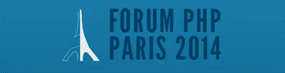
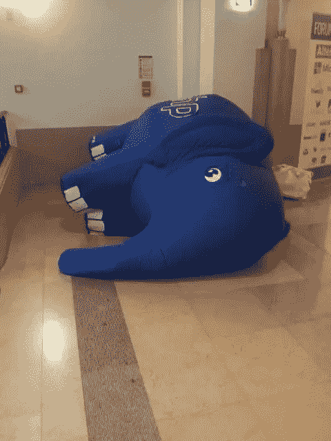
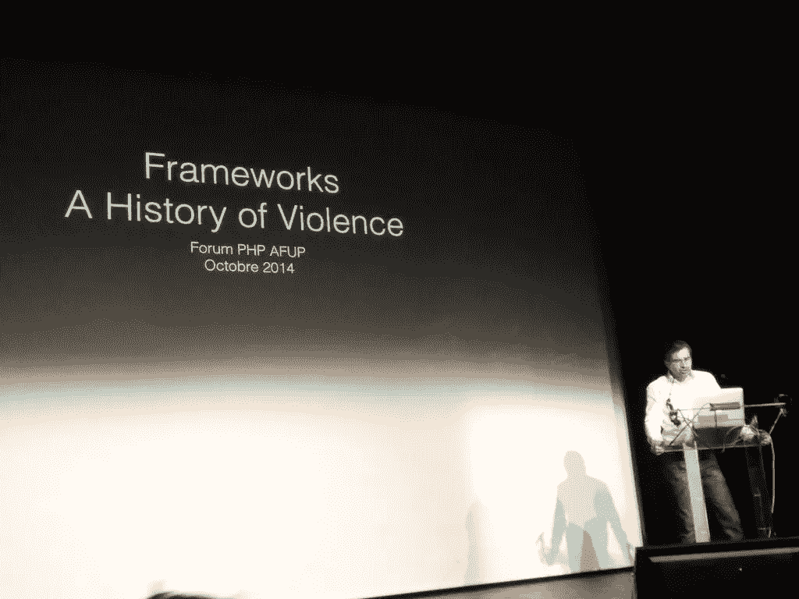
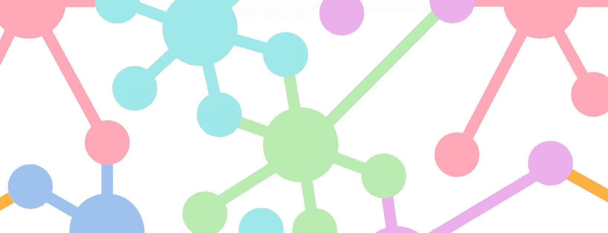
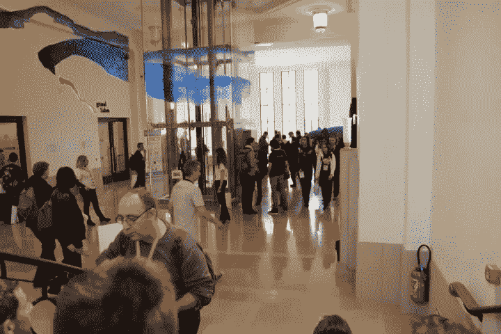

# 论坛 PHP 报告

> 原文：<https://www.sitepoint.com/forum-php-report/>

PHP 论坛是在法国巴黎举行的 PHP 年度会议。今年，我被邀请作为演讲人，用一些有趣的工具和库谈论工作自动化。

## 组织

该会议由法国 PHP 用户协会——也称为法国 PHP 用户组 group 组织。在法布里斯·伯恩哈德、T2、马克西姆·特内尔、T4、蒂埃里·玛丽安和陈月娇的出色领导下，会议在你所见过的最大的大象之家举行。是一个了不起的女人，她与每个人都有联系，并确保所有的安排都井然有序。

所有的演讲者都感到受欢迎，除了像往常一样困扰会议的一些 WiFi 问题(除了 [PHP 夏令营](https://www.sitepoint.com/phpsummercamp-review/)的情况)，一切都井井有条——尽管有小吃和有组织的社交和网络。

## 会谈

大多数讲座听起来都很有趣，尽管由于语言的限制，我没能参加。

塞巴斯蒂安·博格曼关于 DDD 的演讲感觉有点太普通了，也太分散了。我部分倾向于同意[这位 Reddit 评论者](http://www.reddit.com/r/PHP/comments/2kk2do/slides_of_the_forum_php_paris_2014/clmg5x6)的观点，他称这对于这样一个有能力的人来说太弱了——我们习惯于对我们的英雄有更多的期待。尽管如此，如果希望的话，这个演讲还是很有启发性的，我确实学到了新的东西——如果不是关于模式，那么是关于 PHPUnit 背后的人和过程。

Jordi Bogianno 的演讲简直是当头一棒——我期待着 Composer 的首席开发人员做一个英文演讲——如果有 PHP 英雄的话。遗憾的是，尽管会议清单上有英文描述，但结果却是用法语。我尽可能地跟着幻灯片走，了解了它的大概意思，但是从 CPM(每分钟咯咯的笑声)来看，这个演讲非常有趣，让我为没有理解它而感到遗憾。

我设法参加的最后一个讲座是 Beau Siemensen 的，这是一个新鲜空气。作为一名美国演讲者和 [Sculpin](https://sculpin.io) 的主要开发者，Beau 谈到了他在建造它的过程中必须克服的障碍——不仅仅是开发方面(embedded Composer？疯狂！)还要应对来自社区的阻力。

他被迫几次重新评估他建造 Sculpin 的原因——被告知不要推广一种产品，因为存在替代品，被告知不应该重新发明轮子，他被社区欺负到了边缘。在编程领域，你工作的成功只取决于你自己的决心和对你工作领域的热情，一句来自社区边缘杰出成员的不支持的话真的可以搅乱你的船，让你重新评估你到目前为止所做的一切。冷言冷语会毁了项目，告诉某人“长出一对”也无济于事。这就像经过三周的艰苦劳动，在安大略省建造了一座美丽的冰雕，然后有人从明尼苏达州走过来，告诉你他们知道有人在那里花了两年时间制作了一座更大的冰雕，然后用大锤砸碎你的冰雕。社区是一个既令人鼓舞又有害的编码环境，如果你认为你已经发现自己处于后者，谈话的信息是——不要犹豫。继续寻找令人鼓舞的部分，与更多的人交谈，进一步扩大你的社区。最终，你会遇到客观支持你想法的人，不带任何偏见。

## 语言障碍

看到大多数谈话都是用法语进行的，真是令人遗憾。当然，我是作为一个演讲者去的，而不是作为一个游客，但我仍然很想了解其中的一些。至少，官方网站应该在[节目单](https://www.sitepoint.com/phpsummercamp-review/)中注明会谈的语言，以便只说英语的人知道跳过什么，追逐什么。我听到的一个支持全法语会议的常见论点是，一些与会者不会说英语，但我拒绝相信这一点。编程就是用英语和计算机对话，除非你用的是一种[非英语语言](http://en.wikipedia.org/wiki/Non-English-based_programming_languages)(你不是，因为你在参加一个 PHP 会议)，所以你要么在撒谎，拒绝承认你会说英语来降低你的自尊，要么你是一个糟糕的程序员，因为你用心学习编程，而不是通过推理和逻辑。

我真诚地希望论坛 PHP 的这一方面在未来会有所改变。我知道法国人总体上不太喜欢英语，但我确实相信，将会议向国际与会者多开放一点，不会有什么损失，反而会有所收获。

## 社区

法国 PHP 社区充满活力和热情。在非正式的聚会中，我没有英语恐惧症或孤独感，这才是真正的社交中最重要的。如果你能接近一个讲完全不同语言的群体，并让他们接受你并适应，这是一个健康环境的标志。虽然这种态度并不像它本来应该的那样普遍，但找到这样的群体并空降到其中并不困难。奇怪的是，一些特别富有成果的聊天发生在来自活动赞助商的开发人员代表团——特别是 [Jolicode](http://jolicode.com/) 和 [BlaBlaCar](http://www.blablacar.com/) 工作人员——更少的是相互推销，更多的是讨论一切和任何事情。

听说人们在过去一年左右的时间里对 SitePoint 的 PHP 频道越来越感兴趣，这也很有趣——我多次被告知，它现在在人们的日常 feed 阅读器中占据了一个永久的位置，既可以作为通勤和工作期间短暂休息时的轻松阅读来源，也可以在有时间的时候深入阅读教程等内容——这一直是我的目标。

我对这个社区的印象大多是正面的；我很乐意在未来的其他活动中见到大多数人。

## 结论

我并不特别喜欢巴黎这个城市，但如果会议采取更加全球化的方式，我很乐意再次参加 PHP 论坛(就像今年的 [WebcampZG](http://2014.webcampzg.org/) 一样，强制推行全英语计划)。要求所有谈话都用英语的会议吸引了更多样化的人群，并确保你在当地结交的狭窄的朋友圈子分散在来自世界各地的各种聚会中。是的，会议非常拥挤——事实上已经满座了——但是我几乎可以肯定所有的与会者至少在某种程度上都互相认识，用[的男友](http://beausimensen.com/)的话说，交往是关键。

另外，我很自豪地宣布，我们将很快在 SitePoint 的 PHP 频道上看到更多的国家多样性——我与之交换过联系信息的几个人都提到了在我们的频道上发布帖子的愿望(所有这些听起来都非常有趣),所以请继续关注 11 月份出现的一些前沿话题。

再次感谢 AFUP 的邀请和热情欢迎，衷心祝贺这次活动组织得如此之好。我希望我们不久能在更多的国际会议上再次见面！

## 分享这篇文章