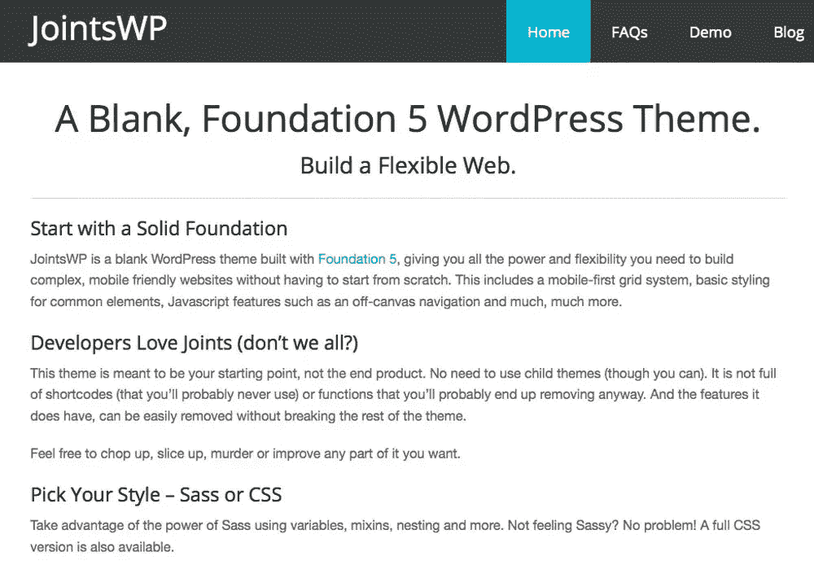
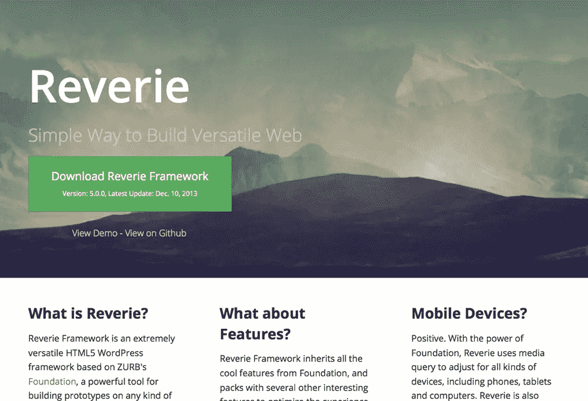
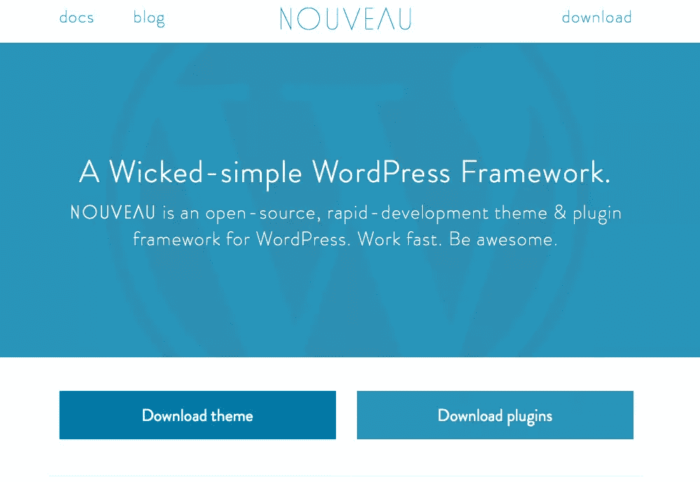
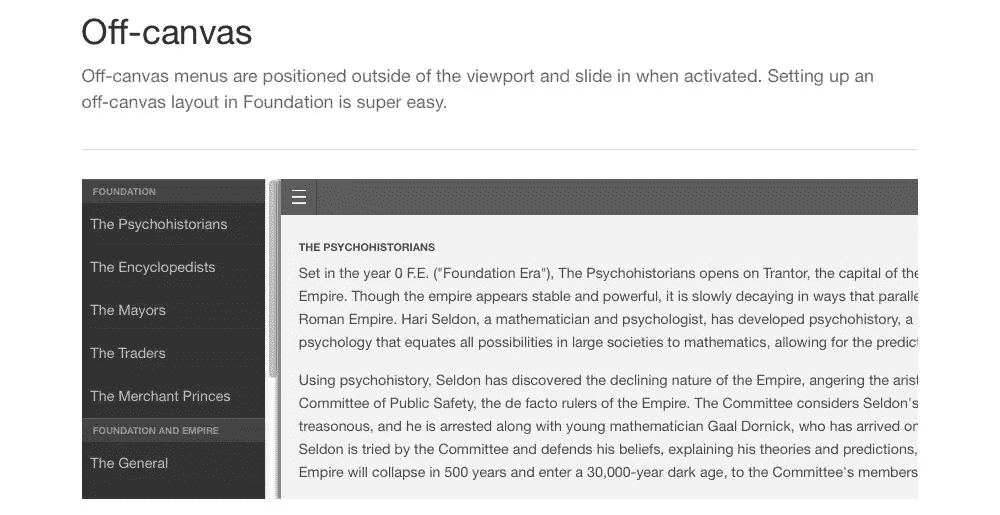
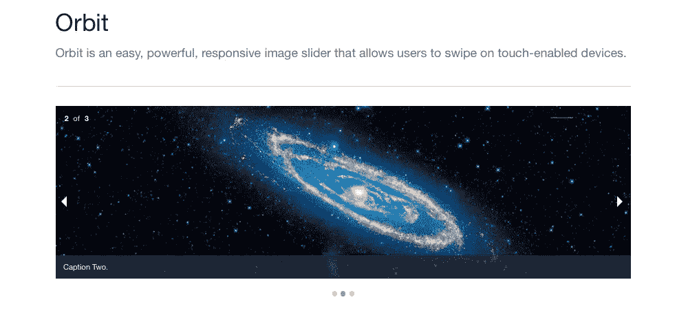
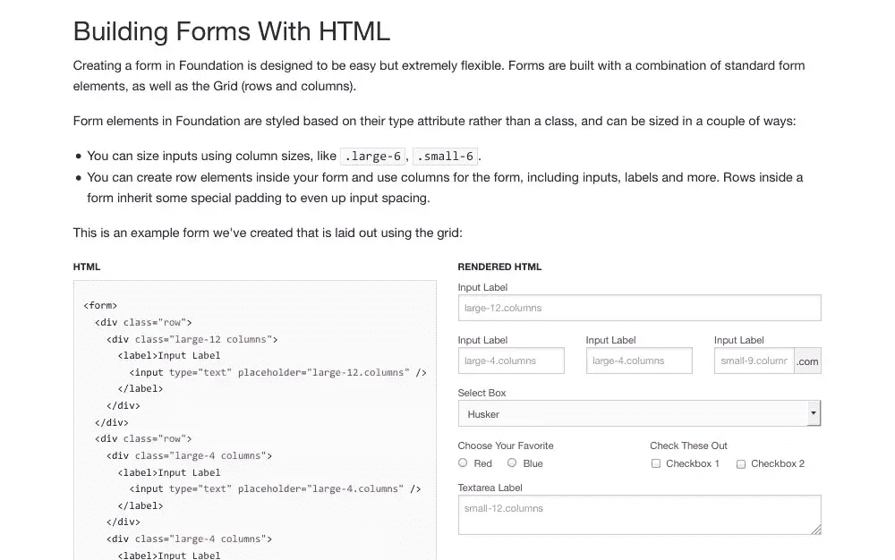
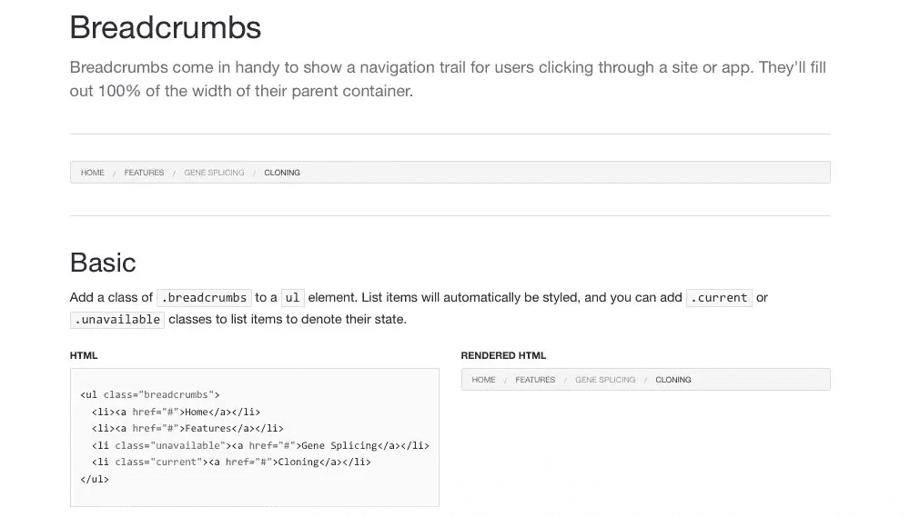
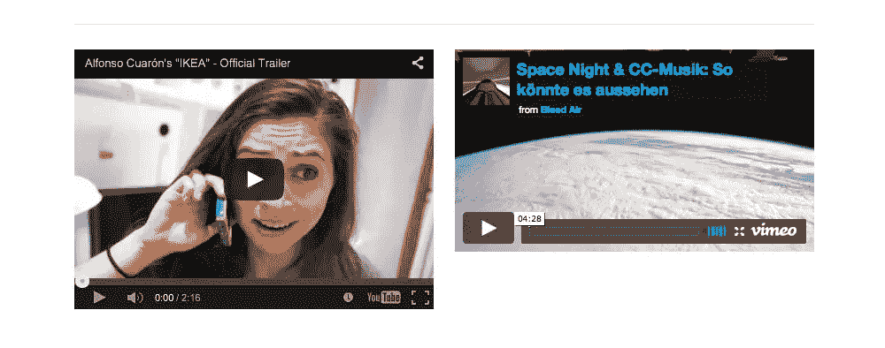
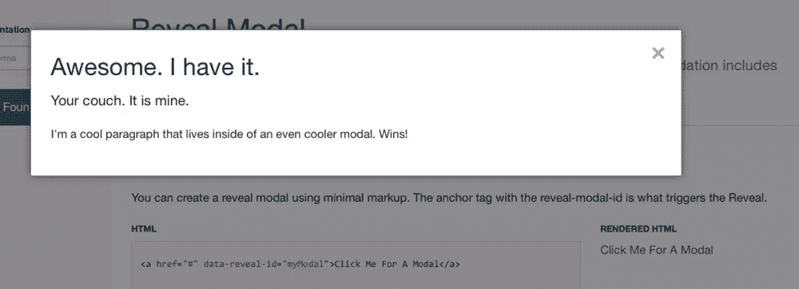

# 开始使用 Foundation 和 WordPress

> 原文：<https://www.sitepoint.com/foundation-and-wordpress/>

我们都听说过结合了 Twitter Bootstrap 和 WordPress 功能的框架。许多开发人员使用这些框架和样板文件来加速他们自定义 WordPress 主题的开发。很多人没有意识到的是，ZURB Foundation 5 也有样板文件和框架。

让我们来看看基础和 WordPress 入门。

有很多资源可以帮助你开始。你需要决定的第一件事是，你是要使用现有的样板文件，还是要自己将 Foundation 5 和 WordPress 结合起来。将 WordPress 和 Foundation 5 结合起来可能需要大量的工作，考虑到许多其他开发人员已经完成了这项工作，首先尝试他们的样板文件，并根据您的需求进行定制会容易得多。

框架中的一些起始主题比其他的更复杂。在下载这些文件并开始使用之前，先看一下文档是很重要的。

让我们来看看几个基础 5，WordPress 空白主题和生物模板，让你开始。

### OleFrederik 出版社

有很多现有的网站使用这个框架。使用这个框架开发一个主题可能会有一个轻微的学习曲线。在开始开发之前，需要做一些事情。比如建议你安装 Grunt，Bower 和 Node.js，也建议你用 SASS 处理你的 CSS。如果您不熟悉这些脚本和方法，这对您来说可能有点高级。

### 接头 WP

JointsWP 是一个空白的 WordPress 主题，由 Foundation 和 WordPress 结合而成。我喜欢这个样板文件是因为它让开发人员更容易开始。他们推荐您使用 SASS 版本，他们也很乐意提供 CSS 版本。如果你理解 WordPress 和 CSS，它可以让你很容易上手，因为你不需要学习任何新的东西就可以上手运行。

### [遐想](http://themefortress.com/reverie/)

Reverie 是一个框架，可以让你很容易开始用 Foundation 开发 WordPress 主题。它们还让您选择使用 SASS 版本，或者使用普通 CSS 的版本。这个框架的一个突出特点是它们提供了对主题定制的支持。Reverie 还标配了分页和自定义 WordPress 菜单功能。

### [新框架](http://www.nouveauframework.com/)

如果你想要一个精简的入门主题而没有臃肿的代码，Nouveau 就是你要的框架。你可以使用 SASS 或者普通的 CSS 来设计你的主题。Nouveau 是你的 WordPress 项目的一个起点，所有的项目都建立在 Foundation 5 框架之上。

## 编辑一个基于基础的 WordPress 主题

想到编辑基于基础框架的 WordPress 主题，你可能会有点害怕。然而，重要的是要记住，框架的存在是为了使事情易于编辑。Foundation 和 WordPress 的关键是理解你的主题是如何构建的。用 HTML 构建的网站和用 WordPress 构建的网站的结构没有什么不同。WordPress 的 PHP 被浏览器翻译成 html。您仍然以同样的方式使用 div，并且使用与在 Foundation 中相同的类。如果你需要看基金会的文件，[你可以在这里获得](http://foundation.zurb.com/docs)。

## 为什么是基金会？

我们都知道其他可用的框架，但是 Foundation 有一些最好的支持。Zurb 从一开始就致力于响应式设计，每个新版本都有更多的改进。Foundation 比 Bootstrap 更有竞争力，因为它的构建方式是模块化的。

普通的 Foundation starter 主题基于一个 12 列的结构，这意味着您可以创建一个布局，其中的列基于构成总数 12 的任意倍数。这给了你很大的灵活性，你如何建立你的网站。

有了 WordPress，也没什么不同。您创建了与 html 网站相同的结构，但是您添加了构成 WordPress 主题的 PHP 组件。你使用 WordPress 的方式不会改变。你只是在使用一个易于使用的结构，这给了你很大的灵活性，同时也给了你构建一个漂亮的、响应迅速的 WordPress 站点的能力。

## 基金会的组成部分

你可以随心所欲地升级你的 WordPress 主题。建立在 Foundation 5 框架之上，你可以像对待其他网站一样编写你自己的 WordPress 网站。您可以实现 Foundation 的几个流行特性，让用户能够定制他们的站点。让我们来看看 Foundation 的几个关键组成部分，它们对 WordPress 开发者很有吸引力。

### 画布外导航

移动菜单和隐藏菜单可以让链接远离内容，直到你的网站访问者准备好与它们互动。此外，您可以使用它来隐藏不常用的功能。有了这个功能，你可以在你的网站上隐藏二级菜单，所有这些都可以通过 WordPress Admin 的菜单部分来控制。

### 动态观察滑块

如果您想要构建自定义滑块，可以使用 Foundation 的动态观察滑块作为基础。您可以编写自己的功能代码，如标题和说明。此外，图片可以从 WordPress 的媒体库中提取。

### 形式

Foundation 为表单打下了一些很好的基础。如果你正在收集电子邮件地址或任何其他重要信息，你可以将 Foundation 的美观和有效性与 WordPress 的数据库结合起来，按照你的意愿存储用户信息。

### 面包屑

Foundation 有一个 breadcrumbs 组件，您可以启用它来帮助用户浏览您的博客或网站的其他部分。当浏览者浏览得太深时，给他们后退一步的能力是一个真正的优势。

### Flex 视频

没有灵活视频选项的实施，响应式设计就不完整。你有能力让你的视频更吸引人，通过安装他们正在使用的设备。这比有一个固定的大小，让观众滚动、挤压和缩放来尝试适应它要好得多。

### 显示模态

尽管每个人都说他们讨厌弹出窗口，但它们确实有效。你不能否认这些数字。Foundation 有一个显示模式，您可以用一个 ID 来指定它。这给了你极大的灵活性，当用户做特定的事情时，你可以在自己的站点上触发一个弹出窗口。根据用户点击的内容，你可以有不同的弹出窗口，满足用户特定的注册表单和建议。如果你要使用弹出窗口，你最好最大化它的有效性。

## 结论

将 WordPress 和 Foundation 的强大功能结合成一个发电站，可能是你的企业需要的解决方案。我们提到的所有东西最好的一点是它消除了对插件的需求。许多设计者和开发者利用插件将所有这些特性添加到他们的网站中。如果你用 Foundation 实现它们，它就和主题融为一体了。您将最终得到一个更轻量级的主题，它实际上创建了更少的服务器请求。您的网站将加载更快，整个用户体验可以定制。

### 附加阅读

如果您想了解关于 Foundation 5 的更多信息，可以看看 SitePoint 上最近发表的一些关于这个强大框架的文章:

*   [网格系统比较:Bootstrap 3 vs. Foundation 5](https://www.sitepoint.com/grid-system-comparison-bootstrap-vs-foundation)
*   [与专家谈基础](https://www.sitepoint.com/talk-foundation-expertsthe-transcript)
*   2014 年最受欢迎的 5 个前端框架对比

## 分享这篇文章