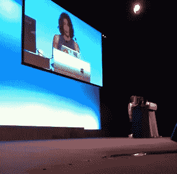
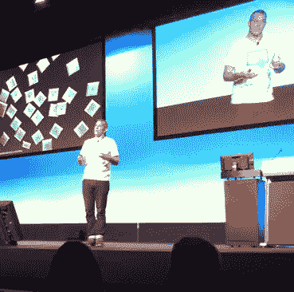
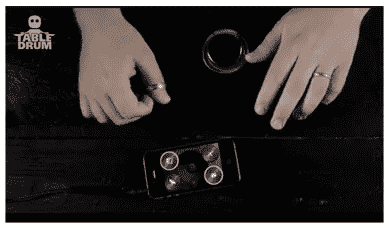
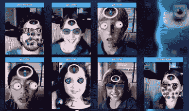
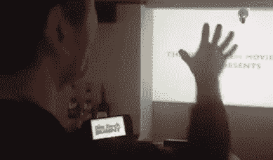

# 2012 年南方网站的四大创意

> 原文：<https://www.sitepoint.com/four-big-ideas-i-took-from-web-directions-south-2012/>

每年十月都会发生。春天降临悉尼城，鲜花盛开，悉尼会展中心散发出万物互联的刺鼻香气。是的，2012 年南方网络指南又过去了一年。

两周后，我仍在思考这些演讲。

### Lea Verou 的十件事(@leaverou)

我爱 Lea。她是那些超级罕见的网络人之一，既有严肃的技术技能，又有对设计的敏锐眼光。

去年，她做了一系列题为“CSS3 秘密:关于 CSS 你可能不知道的 10 件事”的精彩演讲。任何观看这个演讲的前端人员都会在其中找到一些有用的东西，坦率地说，我会很高兴再次“现场”欣赏这个演讲，而不是我最初观看的那个粗糙的视频。

但那不是 Lea 的风格。她漫不经心地推出了“关于 CSS 你可能不知道的另外 10 件事”,并迅速让铁杆 CSS 忍者听到“哇呜”声，并在过道中昏倒。

对我来说，钻石就是她用`background-attachment:local`做的演示。现在我不介意承认我甚至不知道这个 CSS 值的存在，更不用说在一个有用的现实世界应用程序中看到它了。

提示 Lea，他指出谷歌阅读器的内容面板在顶部和底部使用一种微妙的阴影效果(见右图)来指示内容何时在视线之外——这是滚动条的一种优雅的替代方式。请注意当您到达可用内容的末尾时，阴影是如何消失的。

虽然 Google 需要 JavaScript 来执行这个小技巧，但 Lea 向我们展示了如何使用`background-attachment:local`在纯 CSS 中创建效果。如果你感兴趣，她也在她的[博客中概述了这一点](http://lea.verou.me/2012/04/background-attachment-local/ "Background-attachment:local used in scrollbar alternative.")。

这只是她十大挑战死亡的 CSS 奇迹之一。

另一个有趣的侧边栏:Lea 指出，IE10 实际上比 Chrome、Safari、Firefox 或 Opera 更支持她演示中使用的这些尖端规范。

有一句话我从未想过要写出来——但是我要向 MS 脱帽致敬。

### 本·哈默斯利(@本·哈默斯利):田野、花朵和书库

如果我要写一部动作片《间谍席勒》,主角是一个粗犷但迷人的网络极客，我怀疑这个角色可能很像本·哈默斯利。想象一下遇见丹尼尔·克雷格的医生。

该死的，就连他的简历也能让炉边的人大吃一惊:《连线》杂志自由撰稿人、总理的科技城大使超级英雄、阿富汗战区博客作者、英国广播公司和《卫报》记者以及奥莱利出版的作家。

像任何称职的动作英雄一样，本嘲笑危险。坐了 19 个小时的飞机，本在没有幻灯片的帮助下讲了一个小时。然而，他用 140 个字符的注意力跨度吸引了一个小时的观众。这可不是一件容易的事。

本的讲话是“大局”。谈论生活在“前所未有的变化”时代几乎是老生常谈，但我们很容易忘记，仅在五年前，我们很少有人在口袋里有可用的新闻和通信。现在，我们离数据生命线的距离很少超过三英尺。

也不只是我们这些极客。很有可能，你的非技术型朋友，你的理发师，三明治店的伙计，甚至你的父亲在任何时候都随身携带着脸书和易趣的力量。

在本看来，这使我们成为第一代电子人——可能是“有点垃圾的电子人”,但电子人仍然是电子人。

问题是，根据摩尔定律，我们的电子人部件每 18 个月左右就会增加一倍，而政府不知道如何应对这种力量带来的变化。

历史上从未有过箭头在 18 个月内变得两倍尖的情况。电报网络没有在一年内将覆盖范围扩大一倍。马的最高速度没有翻倍。

政府根本不在这些时间范围内工作。他们从 3-5 年的角度考虑，制定 10-20 年的计划，他们“被自己的小心思吓得魂不附体”(用本的话说)，试图进行调整。

这就是为什么我们不断看到政府像 SOPA 和 T2 一样反应过度。

作为这个新世界的设计者和建设者，我们的工作不仅仅是创造它，而是解释它，并倡导它。本问道:“我们如何在不吓坏人们的情况下制作出很酷的东西？”

### 乔什·克拉克(@globalmoxie)

乔什·克拉克给我们做了两次生动有趣的演讲，但真正吸引我注意力的是他的“超越手机”演讲。作为网站建设者，很容易把网站和它的界面想象成一个巨大的屏幕和按钮的集合。

Josh 关注的是这个经典范例之外不断增长的 UI 世界，以及人们是如何为它们设计的。

他涉及了很多领域，但他的一些最酷的例子包括:

1)  [桌鼓:](http://www.tabledrum.com/ "Table Drum")我们以前都见过基于触摸的击鼓应用，但桌鼓让现实世界成为你的 UI。

Table Drum 不仅可以直接播放手机界面(你可以这样做)，还可以让你将现实世界中的物品——眼镜、书籍、餐具——与特定的鼓声联系起来。例如，敲击你的咖啡杯可能会激活一个高帽，而你的书是鼓，等等。

欢迎使用增强音频！

2)[Skinvaders](http://www.youtube.com/watch?v=bCRXXluBo1Y "Skinvaders youtube demo "):Skinvaders 是一款创新的 iPad 儿童游戏。它使用你面部的实时视频作为游戏的游戏面。生物在你的皮肤表面繁殖，而你在努力将它们拒之门外。

3)  [攫取魔法](http://www.youtube.com/watch?v=eYveEdhTgBs "Grab magic Demo"):攫取魔法是来自咸海巴尔干半岛的一个项目，旨在赋予人们超能力。

阿拉尔将一台投影仪、一部 iPhone、一台电脑和一台 Kinect 拼凑在一起，构建了一个系统，可以让你从屏幕上抓取一帧图像，并将其投射到手机屏幕上。

托尼·斯塔克让你伤心欲绝。这一切都是在不到一天的时间里建成的。

### 乔恩·科尔科(@ jko lko)——为社会创新而设计

如果网络是由极客建立的，那么极客们自然会问“如何建立？”。

*   我们怎样才能进入这个数据库？
*   我们应该如何构建这种导航？
*   我们如何优化这段代码？

“如何”可能是科学家的问题，也是我们的“家”问题。

“为什么”是哲学家的问题，也可能是我们很少问的问题。

*   我们为什么要建这个？
*   为什么这是个好主意？
*   是好事吗？

来自奥斯汀设计中心(AC4D)的 Jon Kolko 在他的闭幕主题演讲中向我们发出挑战，要求我们更多地思考这些*为什么* s。

就像邦德的火山巢穴中勤奋的技术人员一样，我们并不总是想问*‘那么，老板，嗯……我们为什么要再次建造这个太空死亡射线？’*。我们可能会想*‘哇，这个死光硬件太棒了！我绝对会在旁边放一个闪电！*。

为了说明这一点，Jon 谈到了麦当劳网站作为优秀设计执行的例子。随后，他用两张图表展示了自 20 世纪 60 年代以来麦当劳的股价，以及美国糖尿病发病率的上升。它们很像镜子。

这是否意味着麦当劳要对美国的糖尿病问题负全部责任？当然不是，但乔恩认为这肯定是一个“放大因素”。

作为对比，乔恩谈到了他的学生们创建的一些解决社会问题的项目。

其中一个节目是亚历克斯·帕帕斯和鲁比·吴的《小时学校》。

小时学校是一项在线服务，它使长期无家可归者能够向他人传授他们所知道的事情。事实证明，这些人通常拥有前世的高水平技能——从摩托车维修到外语再到系统管理，无所不包。

给他们“老师/专家”的身份通常足以启动其他积极的生活变化。

这种“针对社会问题进行设计”的想法真的引起了我的共鸣。

作为网民，我们都有一套强大的技能和工具，我们有全球性的影响力和规模。有这么多大大小小的问题。谁知道呢，也许你能解决其中一个？

这四个演讲让我印象深刻，但我还可以谈很多其他的。即使是排队买咖啡的队伍也是获得建议和新鲜灵感的好地方。

不管怎样，悉尼的春天是最美丽的，约翰和玛克辛总是一起举办令人惊叹的活动。如果你能在十月的日历中留出几天，你不会后悔的。

## 分享这篇文章