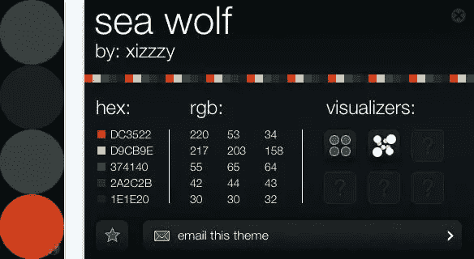
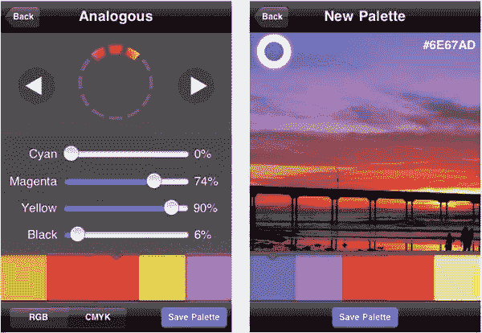
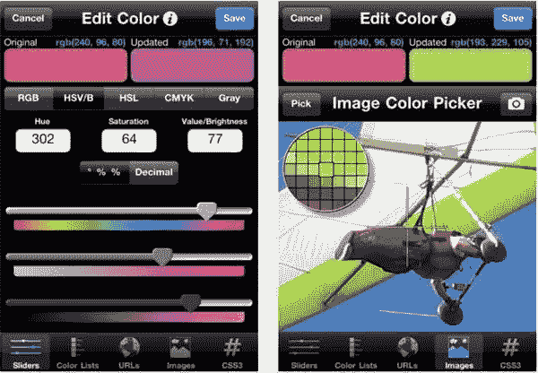
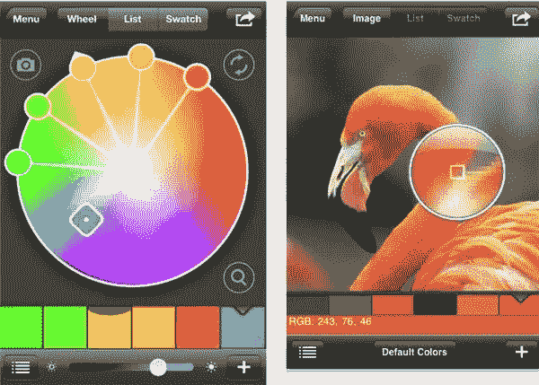

# 四款适合色彩爱好者的 iPhone 应用

> 原文：<https://www.sitepoint.com/four-iphone-apps-for-color-lovers/>

如果你喜欢玩颜色，嘿，谁不喜欢呢？–那么这里有四个 iPhone 应用程序可以满足你的色彩享受。因为我是一个小气鬼，圣诞节后肯定会感到手头拮据，所以这个列表是按价格升序排列的，从 0 美元开始——每年的这个时候总是一个好价格。

1.[饱和度](http://itunes.apple.com/us/app/saturation/id362402941?mt=8)(自由)

尝试 Adobe Kuler 社区创建的颜色主题。饱和度将它们变成互动的灯光表演，这样你就可以看到颜色是如何相互搭配的。点击并拖动手指，使颜色以新的方式移动。您可以获得十六进制和 RGB 颜色值，并使用可视化工具进行处理。

2.[彩色流](http://itunes.apple.com/us/app/color-stream/id327350953?mt=8)(2.99 美元)

Color Stream 允许您创建和存储调色板，这些调色板可以是从零开始创建的，也可以是从照片中生成的，甚至可以是使用我们内置的支持模拟、单色、三色等颜色的配色方案自动生成的。您可以保存多个调色板，给它们命名和评级，将它们放入照片库中或通过电子邮件发送给朋友。你也不需要连接到网络来使用它，对任何类型的设计师来说都很方便。

3. [Palettes Pro](http://itunes.apple.com/app/palettes-pro/id293249989?mt=8) ($7.99 | [免费精简版](http://itunes.apple.com/app/palettes/id297157708?mt=8))

这款应用有免费的“精简版”和 7.99 美元的专业版。该应用程序是一个工具，用于创建和维护调色板和配色方案。您可以从照片、网站中抓取颜色，或者使用五种颜色模型(RGB、HSV (HSB)、HSL、CMYK 或灰度)中的任何一种来添加颜色。有了专业版，你可以创建和存储任何数量的调色板，建兴版是有限的，但你可以很容易地升级，如果你想。

4.[色彩专家](http://itunes.apple.com/app/color-expert/id292243338?mt=8)(9.99 美元)

Color Expert 是一款帮助艺术家和设计师寻找色板和调色板的应用程序。多种配色方案包括单色、模拟、互补、分割互补和三色。您可以通过 Pantone solid coated、Pantone solid uncoated、Pantone Goe coated、Pantone Goe uncoated、Web 安全色和 HTML 色进行搜索。这似乎是唯一一个许可使用 Pantone 颜色的应用程序，Pantone 颜色对平面设计师来说很重要。这是列表中最昂贵的彩色应用程序，也是最复杂的，但如果你同时处理印刷和网络，你会发现它非常有用。

您使用过这些应用程序吗？你觉得它们有用吗？

## 分享这篇文章