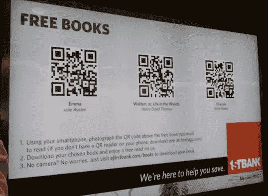
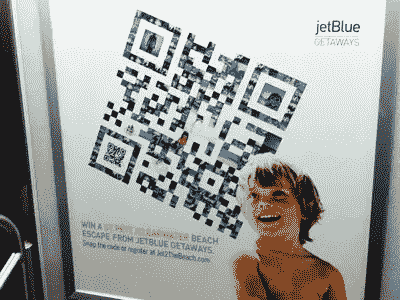

# 二维码设计师的四个问题

> 原文：<https://www.sitepoint.com/four-questions-for-qr-code-designers/>

二维码可能看起来像一种新兴的尖端技术，但实际上它们已经存在了近 20 年。它们最初是在 20 世纪 90 年代中期发明的，用于在制造过程中跟踪汽车零部件，但智能手机(和二维码扫描应用程序)的出现将快速响应码带出利基汽车制造业，进入了更广泛的移动营销行业。现在，智能手机用户只需轻触几下就可以扫描二维码，二维码的设计可能性几乎是无穷无尽的。

但是，二维码近乎无限的使用可能性实际上构成了一个难题。它们可以用于任何事情的事实并不一定意味着它们*应该*用于任何事情。事实上，二维码的最佳实践到底是什么并不十分清楚。很明显，它们不再仅仅用于跟踪汽车零件，但是理想情况下应该如何使用它们呢？设计者已经尝试了各种创造性的、实验性的快速响应代码的实现方式，其中一些比其他的做得更好。关于何时、何地以及如何使用二维码，仍然存在一些问题。

### 二维码放置:外围还是前中？

在平面广告或产品包装的边角上看到一个小的、不显眼的二维码是相当常见的。因为二维码并不完全是主流(许多潜在客户仍然觉得它们奇怪和令人困惑)，大多数广告商不希望在广告活动和其他信息传递工作中过于依赖二维码。因此，最常见的二维码位置是在营销材料的侧面、角落或背面，使它们成为一个“很好的”附加物，但不是设计中真正不可或缺的一部分。

然而，可能会让你惊讶的是，一些勇敢的广告商选择大胆使用二维码，将二维码作为广告设计的重点。看看下面丹佛国际机场的广告。

第一家银行的广告以巨大的二维码为特色。

如果你仔细观察广告，你会发现他们做的和大多数二维码广告完全相反；二维码在前面和中间，公司在角落里不显眼地被提及。尽管品牌并不突出(三个二维码的目的地与赞助商关系不大)，但第一银行发现这些广告在建立品牌忠诚度方面非常有效。事实上，他们有一个完整的营销活动(恰当地命名为[“乐于助人”活动](http://thefinancialbrand.com/14202/firstbank-qr-codes-books-puzzles-giveaway/))不仅仅是基于帮助人们。在这种特殊情况下，疲惫不堪、倒时差、束手无策的旅行者肯定会欣赏他们选择的三部载入智能手机的著名小说。之后，在数十家几乎完全相同、几乎像商品一样的银行之间进行选择时，很难不偏向第一银行。

许多移动营销人员会告诉你，实现这些二维码的“正确方式”应该包括设计一个典型的平面广告，然后将二维码挤压到布局的外围部分。但是，那真的那么有效吗？这家银行大胆、深思熟虑、“有益”的以二维码为中心的广告提出了相反的建议，并使人们很难确定在设计中有效放置二维码的单一正确方法。

### 你应该教一个男人(或女人)扫描吗？

你应该在设计中尝试描述二维码并启发你的潜在客户吗？

一方面，教育一个路人——他很可能时间和注意力都非常有限——什么是二维码以及如何使用它几乎是不可能的。通常，设计的每一个字和每一英寸都要经过审批委员会的严格审查，添加额外的信息可能会分散设计的注意力，分散客户的注意力，或者提高实施设计的总成本。

但是，另一方面，广告、产品包装或其他品牌材料的设计者通常需要将一个信息浓缩成附有一两个简洁句子的视觉信息。难道他们不能按照同样熟悉的流程来说明和描述如何使用二维码吗？

在上面提到的第一银行广告中，设计者有足够的空间来描述利用他们的产品的三步过程。但是，由于这些特殊的二维码在设计中异常突出——使添加的说明成为绝对必要的——这个广告是一个提供简洁、不显眼的二维码说明的糟糕例子。大多数设计对于一个复杂的多步骤指南来说，空间和自由度要小得多。相反，一些设计在二维码附近包含一个简短、有语义、容易记忆的网址，对于不熟悉二维码或没有安装扫描应用程序的感兴趣的观众来说，这显然很有用。其他设计建议扫描主要移动操作系统的应用程序，即“使用 QR Master 扫描 iOS 或可扫描的 Android。”

很难说教客户扫描的好处是否大于坏处。你启发了多少人，就迷惑了多少人。此外，对于一个没有智能手机的客户来说，再多的教学也无济于事。

### QR 码是用于客户、公司还是两者？

起初，二维码似乎纯粹是为了吸引顾客而设计的。但是，二维码可以提供关于其各自广告的功效和表现的大量数据，这一事实可能意味着它们也有利于公司。

很多平面广告没有办法衡量自己的表现。除非有问题的平面广告包含其独特的电话号码、电子邮件地址或 URL，否则平面广告客户将没有任何精确的方法来确定他们的设计引起了多少兴趣。他们通常可以得到一个给定广告位置下他们购买了多少“曝光”或“印象”的大致估计，但是这个指标并不能洞察客户对广告的实际反应有多好(或多差)。

尤其是设计师，如果知道他们的广告设计到底有多吸引人，会受益匪浅；这将为比较类似的基于 QR 的广告的表现和基于真实客户反馈改进广告设计提供可能性。

那么，二维码对客户有利还是对公司有利？聪明的公司和聪明的客户都可以获益，但很难说二维码是为了方便客户还是衡量广告效果的一种方法。

### 低带宽区域是否应该使用二维码？

任何扫描快速响应码的人几乎肯定是在使用蜂窝带宽到达目的地。如果你的基于 QR 的设计在地下地铁系统的深处或者飞机座位的后面，扫描起来会非常困难(如果不是不可能的话)。事实上，它甚至可能损害你的公司的品牌，使扫描仪受挫和失望。你可能会认为这些潜在的问题是显而易见的，可以预见的，可以补救的，但是一些非常大的公司将设计不良的二维码放在了选择不当的地方，最终让客户失望而不是高兴。

带有显著二维码的捷蓝航空广告...纽约地铁隧道地下 300 英尺处。

但是，从另一方面来说，在客户几乎没有带宽的情况下吸引他们的注意力是非常有价值的。如果你能设法在长途飞机或地铁上接触到客户，他们可能除了看你的设计和了解你的产品和服务之外没什么别的事可做。此外，在船、飞机和地铁上也有带宽*为*的情况。最后，大多数设计良好的二维码扫描仪都有扫描历史，允许用户返回到几天或几周前扫描的代码。对于精明的设计师来说，把它写进扫描历史可能是一个有价值的工具。

*您在自己的设计中使用过二维码吗？你有任何有趣的，创造性的二维码使用的例子吗？以上问题你有答案吗？*

## 分享这篇文章