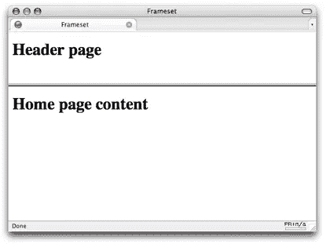
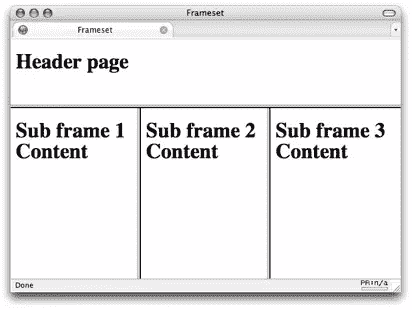

# 框架集(HTML 元素)

> 原文：<https://www.sitepoint.com/frameset-html-element/>

## 描述

框架集用于将一组窗口组合在一起，有时是水平的(使用 [rows](https://reference.sitepoint.com/html/textarea/rows) 属性)，有时是垂直的(使用 [cols](https://reference.sitepoint.com/html/textarea/cols) 属性)，甚至是水平和垂直排列的组合。框架集内的每个子窗口都由[框架](https://reference.sitepoint.com/html/frame)元素定义。

一个框架集需要一个特殊的[特定于框架集的文档类型](https://reference.sitepoint.com/html/doctypes)，并且不允许在页面主体中包含任何内容(框架集实际上取代了主体元素)。

上面显示的简单 HTML 示例将创建一个包含两行的框架集，如图 1 所示。



可以在父框架集中嵌套一个框架集。使用前面的示例，如果我们用新的框架集替换第二个框架，则该子框架集可以包括进一步的框架集合，如下面的标记中所详细说明的:

```
<frameset rows="100,*">
  <frame src="header.html"/>
  *<frameset cols="33%,33%,*">*Nested frameset
    <frame src="subframe1.html"/>
    <frame src="subframe2.html"/>
    <frame src="subframe3.html"/>
  *</frameset>*
</frameset>
```

这个标记的结果如图 2 所示。



当给页面添加书签时，使用框架/框架集会给用户带来额外的困难。如果您使用菜单选项或键盘快捷键来完成此操作，它会将哪个页面存储为收藏夹–框架内容还是整个框架集？为了确保万无一失，用户必须在需要添加为收藏夹的框架上单击鼠标右键(或者对于 Mac 用户，按 CTRL 键),然后从菜单中进行选择。打印页面也不那么简单(您想打印整个框架集还是只打印一部分？).最后，仅使用键盘在页面上导航可能会很麻烦，例如在一个框架上导航，然后跳到另一个框架来阅读内容，然后回到导航框架，等等。

关于搜索引擎的另一个注意事项——如果内容旨在在框架上下文中查看，而页面出现在搜索结果中，当用户点击查看该页面时，他们将不会在最初预期的上下文中看到它——他们会变得有些“孤立”。因此，您可能需要合并一个“在框架集中查看此页面”链接，这几乎肯定需要一些 JavaScript 逻辑，首先要知道页面不在框架集中，其次要知道如何在不丢失页面的情况下将它放回到框架集上下文中。

## 例子

由`frameset`元素定义的两个水平布局的帧
:

```
*<frameset rows="100,*">*
  <frame src="header.html"/>
  <frame src="home.html"/>
*</frameset>*
```

## 将此用于…

使用框架集的一个典型情况是，您希望一个框架中的部分内容保持不变(例如导航块),并让该窗口中的链接在另一个窗口中打开内容。然而，不再需要使用框架(以及隐含的框架集)来创建标题的视觉效果，该标题保持在页面的顶部，而其余的内容滚动——这可以使用级联样式表来实现。

## 分享这篇文章