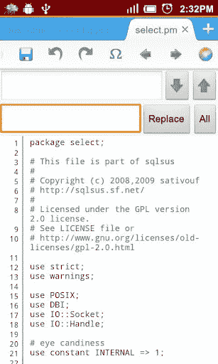
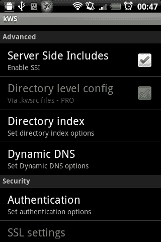
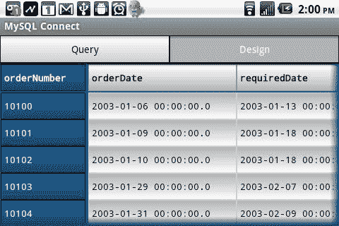
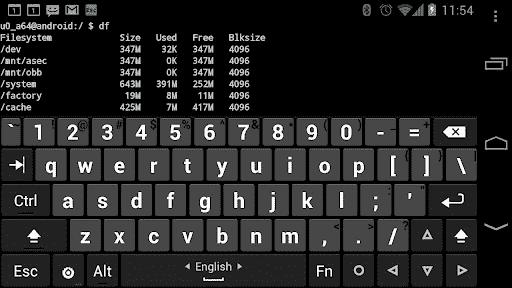

# 6 个最好的 Android 免费网络开发应用

> 原文：<https://www.sitepoint.com/free-android-web-development-apps/>

是的，你没看错标题。网络开发。在安卓上。我不会说智能手机是桌面编码的好替代品，但是在移动中编写和测试代码是可能的。我正坐在去伦敦 SitePoint 聚会的火车上，在平板电脑上用 HTML 撰写这篇文章。

此外，一台还算过得去的设备可以让你不必拖着沉重的 17 英寸笔记本电脑去给客户做演示。额外的好处是，电池寿命通常更长，更小的屏幕意味着来自电子邮件 pings、Twitter 更新和脸书消息的干扰更少*(在这段旅程中，我的工作效率异常高！)*以下是我最喜欢的用于 web 开发的 Android 应用。它们都是免费的，不会用唠叨的广告轰炸你…

## [1。固体探索者](https://play.google.com/store/apps/details?id=pl.solidexplorer)

Android 有一个可访问和可识别的文件系统，但股票文件管理器是有限的。固体探索者是在测试中，但它是惊人的。

该应用程序提供:

*   一个双窗格窗口，便于文件移动
*   多视图设置、搜索、排序和书签
*   本地和远程文件访问，包括 root、网络、FTP、SFTP 和 Dropbox(相比 Dropbox 自己的应用，我更喜欢它)
*   一个基本但非常快速的文本编辑器

即使你不是 web 开发人员，Solid Explorer 对于任何需要浏览文件系统的人来说都是一个很好的应用。

## [2。920 文本编辑器](https://play.google.com/store/apps/details?id=com.jecelyin.editor)

Android 平台上有许多代码编辑器，但我还没有发现比 920 文本编辑器更好的。

它提供:

*   多个文件标签
*   支持网页语法，包括 HTML，CSS，JavaScript 和 PHP
*   可配置的颜色编码
*   会话处理

它没有 Solid Explorer 的基本编辑器快，但更接近你的桌面 IDE。

## [3。VT 视图源](https://play.google.com/store/apps/details?id=com.tozalakyan.viewsource)

Android 浏览器相当小，不提供开发者工具。VT View Source 是一个新颖的应用程序，兼容所有的浏览器，允许你查看底层的 HTML。安装完成后，您只需“共享”页面 URL——VT 打开，然后下载并显示源代码。有几十个颜色主题，但我还没有找到一个好看的！…

## [4。kWS —安卓网络服务器](https://play.google.com/store/apps/details?id=org.xeustechnologies.android.kws)

kWS 是一个快速、轻量级的 HTTP web 服务器。它不是 Apache，只支持服务器端的 includes，但是对于测试和演示 HTML、CSS 和 JavaScript 应用程序是有用的。

有很多基本的 Android 解决方案可以运行 PHP 和其他服务器端语言，但是我很难找到一个可靠的。我相信某个地方的某个人很快就会创造出一个。

## [5。MySQL 连接](https://play.google.com/store/apps/details?id=me.jromero.mysql_connect)

我们都有过需要连接到远程 MySQL 数据库而手边没有 PC 的紧急时刻。好吧，也许这有点夸大了可信度，但是 MySQL Connect 是一款优秀的应用，它击败了许多桌面客户端。它只有几百 kB，你永远不会再捉襟见肘。

## [6。黑客的键盘](https://play.google.com/store/apps/details?id=org.pocketworkstation.pckeyboard)

标准的 Android 键盘或第三方替代品没有什么大问题。它们不是为编码而设计的。Hacker 的键盘提供了完整的 5 行桌面式体验，具有多种布局和语言选项。

## 奖励应用程序！安卓浏览器

现有的 Android 浏览器很棒，但是作为一名网络开发人员，你需要尽可能多的应用程序。去野外安装这一批…

*   [铬合金](https://play.google.com/store/apps/details?id=com.android.chrome)
*   [火狐](https://play.google.com/store/apps/details?id=org.mozilla.firefox)
*   [海豚](https://play.google.com/store/apps/details?id=mobi.mgeek.TunnyBrowser)
*   [迷你歌剧](https://play.google.com/store/apps/details?id=com.opera.mini.android)
*   [歌剧手机](https://play.google.com/store/apps/details?id=com.opera.browser)

Opera Mini 的引擎和你在老款手机和 iOS 上看到的差不多。

无论如何，我可能已经错过了你最喜欢的 Android web 开发应用程序。让我们知道你用什么…

## 分享这篇文章