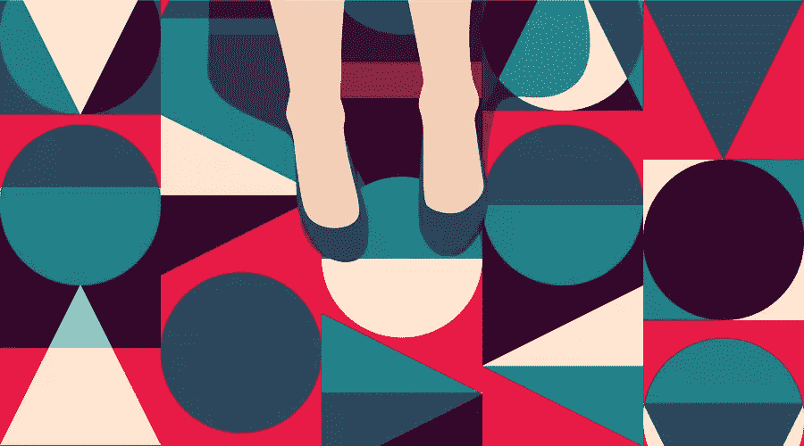
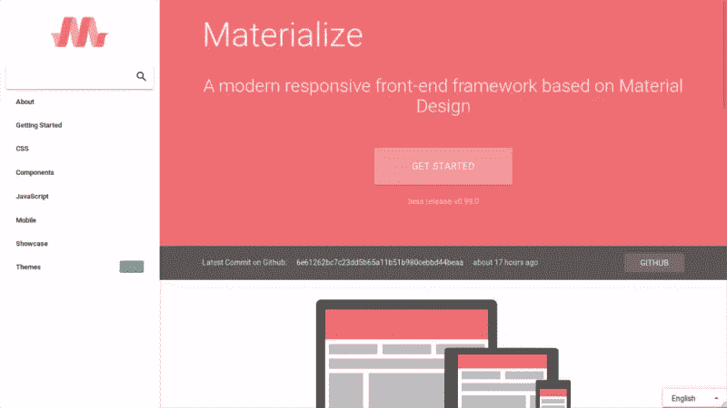
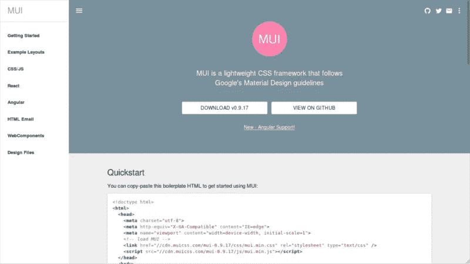
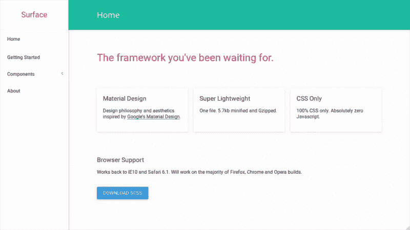
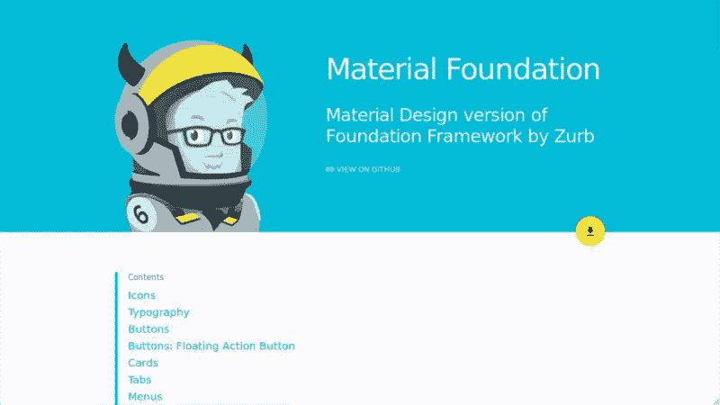
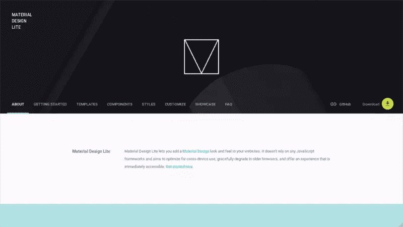
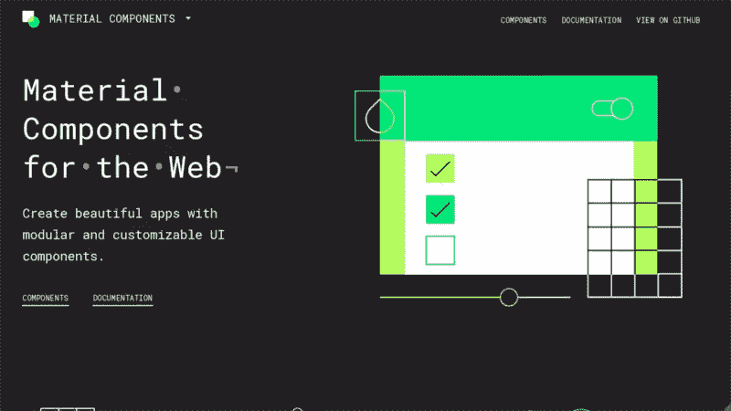
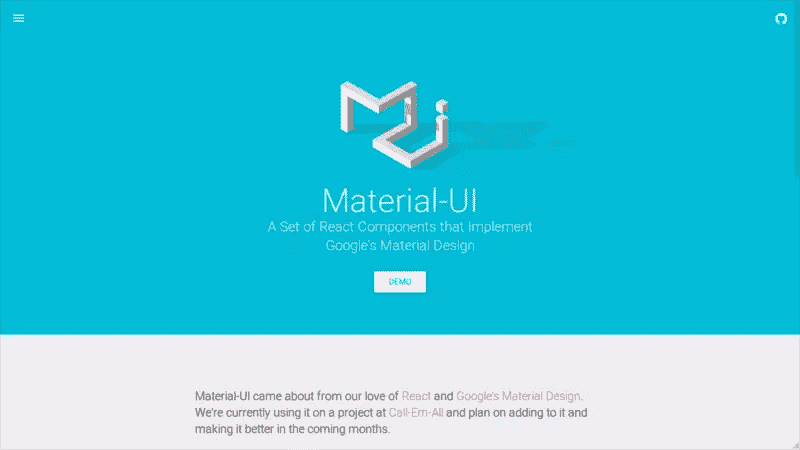

# 6 个 2017 年免费材料设计 CSS 框架对比

> 原文：<https://www.sitepoint.com/free-material-design-css-frameworks-compared/>



谷歌引入[材料设计](https://material.io/)作为他们的设计语言是在 2014 年。从那以后，它被大量的谷歌产品采用和实现，包括 [Gmail](https://mail.google.com/) 、 [Docs](https://docs.google.com/) 和 [Drive](https://drive.google.com/) ，仅举几例。材料设计在原生 Android 和现代网络应用中都可以看到——事实上，如今它已经变得越来越受欢迎。

参与网页开发的人可能希望跟上最新的设计趋势，并在工作中实施材料设计。本文列出了材料设计 CSS 框架和它们的具体特性，希望能帮助你选择最适合你项目的框架。明智地选择你的犯罪伙伴——毕竟，当你创造那些卓越的网络体验时，你将需要帮助！

*需要注意的是，以下一些细节，如框架的多样性和可用特性，可能会随着时间的推移而略有不同。如果您对任何框架感兴趣，请确保查看原始资源以获取最新更新。*

## 1.实现



物化可以说是最著名的材质设计 CSS 框架之一。Materialize 由一组技术高超、充满激情的学生开发，广泛用于许多可用的第三方主题。它提供了一个理想的机会来开始网页的材料设计，而不用把脚伸进冷水里。

*   **维护者:** [艾尔文王](http://materializecss.com/about.html#team)等人。

*   **发布日期:** 2014 年

*   **版本:** 0.99.0

*   **人气:**[GitHub 上 27000 颗星，3900 个叉](https://github.com/Dogfalo/materialize)

*   **描述:**“基于材料设计的现代响应前端框架”

*   核心概念/原则:响应式网页设计和 UX 聚焦

*   **框架大小:** 931 KB(下载)

*   **预处理程序:** Sass

*   **响应:**是

*   **模块化:**是

*   **开始模板/布局:** [是](http://materializecss.com/getting-started.html#templates)

*   **图标:** [材质设计图标](https://google.github.io/material-design-icons/)

*   **排版:** [机器人](https://fonts.google.com/specimen/Roboto)

*   **文献:** [好](http://materializecss.com/getting-started.html)

*   **浏览器支持:**火狐 31+，Chrome 35+，Safari 7+，IE 10+

*   **执照:** [麻省理工](https://github.com/Dogfalo/materialize/blob/master/LICENSE)

*   **代码示例:**

    ```
    <a class="waves-effect waves-light btn">Button</a>
    ```

*   **优点:**庞大的用户群、持续的开发、良好的文档、第三方支持(例如，模板、扩展等。)

*   反对意见:不适用

*   **非常适合:**在网上开始材料设计

## 2.miui



梅也很受欢迎。虽然是个人努力，但它通过为 [Angular](https://angular.io/) 、 [React](https://facebook.github.io/react/) 和 [WebComponents](https://www.webcomponents.org/) 提供开箱即用的支持，提高了标准。详细的文档也值得称赞。

*   **维护者:** [安德烈斯·莫雷](https://github.com/amorey)

*   **发布日期:** 2015 年

*   当前版本: 0.9.17

*   **人气:**[GitHub 上 3400 星 370 叉](https://github.com/muicss/mui)

*   **描述:**“遵循 Google 材料设计准则的轻量级 CSS 框架”

*   **核心概念/原则:**跨平台支持

*   **框架大小:** 461 KB(下载)/ 6.7 KB (NPM 包，缩小)

*   **预处理程序:** Sass

*   **响应:**是

*   **模块化:**是

*   **开始模板/布局:** [是](https://www.muicss.com/docs/v1/example-layouts)

*   **图标:**无捆绑

*   **排版:** [Arial](https://www.fonts.com/font/monotype/arial) ， [Verdana](https://www.fonts.com/font/microsoft-corporation/verdana) ， [Tahoma](https://www.fonts.com/font/microsoft-corporation/tahoma)

*   **文献:** [很好](https://www.muicss.com/docs/v1/css-js)

*   **浏览器支持:**火狐、Chrome、Safari、IE 10+等

*   **执照:** [麻省理工](https://github.com/muicss/mui/blob/master/LICENSE.txt)

*   **代码示例:**

    ```
    <button class="mui-btn mui-btn--primary">Button</button>
    ```

*   **优点:**默认支持 Angular、React、WebComponents 和 HTML 电子邮件，大量文档

*   **缺点:**缺乏第三方支持，如主题、附加组件等。

*   **非常适合:**轻松集成 Angular、React 或 web 组件

## 3.表面



[Surface](http://mildrenben.github.io/surface/) 是采用材质设计的极小、超轻量 CSS 框架。不要期望有大量的文档——尽管它足以帮助你熟悉框架并完成工作。Surface 是快速原型开发和新项目试验的理想选择。

*   **维护者:** [本·米尔德伦](https://github.com/mildrenben)

*   **发布日期:** 2015 年

*   **当前版本:** 1.01

*   **人气:**[GitHub 上 190 星 40 叉](https://github.com/mildrenben/surface)

*   **描述:**“受谷歌材料设计启发的设计哲学和美学”

*   核心概念/原则:极简主义

*   **框架大小:** 195 KB(下载)

*   **预处理程序:** Sass

*   **响应:**是

*   **模块化:**是

*   **开始模板/布局:**否

*   **图标:**无捆绑

*   **文献:** [虚弱](http://mildrenben.github.io/surface/getting-started.html)

*   **浏览器支持:**火狐，Chrome，Opera，Safari 6.1+，IE 10+

*   **执照:** [麻省理工](https://github.com/mildrenben/surface/blob/master/license.md)

*   **代码示例:**

    ```
    <button class="btn--raised">Button</button>
    ```

*   **优点:**重量轻，最小

*   **缺点:**用户基数低，文档薄弱

*   **理想用途:**快速原型制作、实验、极简设计

## 4.物质基础



已经体验过 Zurb 的基础框架？[物质基础](https://eucalyptuss.github.io/material-foundation/)几乎是为你打造的！坏消息呢？开发似乎极其缓慢(甚至可以说被放弃了)，甚至没有任何点发布。用户群看起来也不大。希望有人能在某个时候捡起来，继续进步。

*   **维护者:** [多布鲁克](https://github.com/eucalyptuss)

*   **发布日期:** 2014 年

*   **当前版本:**不适用

*   **支持的基础版本:** 6.2.3

*   **人气:**[GitHub 上的 300 星 60 叉](https://github.com/eucalyptuss/material-foundation)

*   **描述:**“Zurb 基础框架材料设计版本”

*   **核心概念/原则:**基于 Zurb 基金会

*   **框架大小:** 218 KB(下载)

*   **预处理程序:** Sass

*   **响应:**是

*   **模块化:**是

*   **开始模板/布局:**否

*   **图标:** [材质设计图标字体](http://zavoloklom.github.io/material-design-iconic-font/cheatsheet.html)

*   **排版:**无捆绑

*   **文件:** [有限公司](https://eucalyptuss.github.io/material-foundation/#contents)

*   **浏览器支持:**火狐，Chrome，Opera，Safari 6.1+，IE 10+

*   **执照:** [麻省理工](https://github.com/eucalyptuss/material-foundation/blob/master/LICENSE)

*   **代码示例:**

    ```
    <a class="raised-button ink">Button</a>
    ```

*   **优点:**熟悉基础

*   **缺点:**用户基数低，开发缓慢/被放弃，文档薄弱

*   **非常适合:**开发人员使用 Foundation，与 Foundation 集成

## 5.材料设计精简版



Material Design Lite 是由谷歌工程师发布的，因此你可以期待与材料设计概念的一致性和紧密一致性。虽然它曾经[变得越来越受欢迎](https://www.sitepoint.com/practical-introduction-material-design-lite-google/)，但是现在支持有限，因为开发已经转移到了 Web 的材料组件上(下面会提到)。

*   **维护者:** [阿迪·奥斯马尼](https://github.com/addyosmani)等人。

*   **发布日期:** 2014 年

*   **当前版本:** 1.3.0

*   **人气:**[GitHub](https://github.com/google/material-design-lite)上 27800 星 4700 叉

*   **描述:**“允许您为您的网站添加材料设计外观和感觉”

*   **核心概念/原则:**跨设备使用

*   **框架大小:** 205 KB(下载)/ 62 KB (NPM 包，缩小)

*   **预处理程序:** Sass

*   **响应:**是

*   **模块化:**是

*   **开始模板/布局:** [是](https://getmdl.io/templates/index.html)

*   **图标:** [材质图标](https://material.io/icons/)

*   **排版:** [机器人](https://fonts.google.com/specimen/Roboto)

*   **文献:** [很好](https://getmdl.io/components/index.html)

*   **浏览器支持:**火狐、Chrome、Opera、Safari、IE 10+等

*   **许可证:** [阿帕奇许可证 2.0](https://github.com/google/material-design-lite/blob/mdl-1.x/LICENSE)

*   **代码示例:**

    ```
    <button class="mdl-button mdl-js-button mdl-button--raised">Button</button>
    ```

*   **优点:**庞大的用户群，由谷歌开发者维护，与材料设计紧密结合

*   反对意见:支持有限，停止发展

*   **非常适合:**简单的网站，绝对符合谷歌材料设计的外观&的感觉

## 6.Web 的材料组件



[Material Components for the Web](https://material.io/components/web/)是 Material Design Lite 的继任者，由谷歌工程师和设计师维护。它的高层次目标包括模块化、遵守[材料设计指南](https://material.io/guidelines/)以及与其他 JavaScript 框架和库的无缝集成。

*   **维护者:** [阿迪·奥斯马尼](https://github.com/addyosmani)等人。

*   **发布日期:** 2014 年

*   当前版本: 0.13.0

*   **人气:**[GitHub](https://github.com/material-components/material-components-web/)上 5000 星 480 叉

*   **描述:**“使用模块化和可定制的 UI 组件创建漂亮的应用程序”

*   核心概念/原则:模块化以及与 JS 框架/库的集成

*   **框架大小:** 117 KB (NPM 包，缩小)

*   **预处理程序:** Sass

*   **响应:**是

*   **模块化:**是

*   **开始模板/布局:**无

*   **图标:** [材质图标](https://material.io/icons/)

*   **排版:** [机器人](https://fonts.google.com/specimen/Roboto)

*   **文献:** [很好](https://material.io/components/web/docs/)

*   **浏览器支持:**火狐、Chrome、Safari、IE 11/Edge

*   **许可证:** [阿帕奇许可证 2.0](https://github.com/material-components/material-components-web/blob/master/LICENSE)

*   **代码示例:**

    ```
    <button class="mdc-button mdc-button--raised">Button</button>
    ```

*   优点:由 Google 开发者维护，与材料设计紧密结合，与 JavaScript 框架集成

*   **缺点:**用户基数略低

*   **理想:**符合材料设计指南

## 奖励:材质-UI



虽然，严格来说，它不是一个 CSS 框架，但是使用[反应](https://facebook.github.io/react/)组件来实现材质设计， [Material-UI](http://www.material-ui.com/) 是一种有趣的方法。Material-UI 由 [Call-Em-All](https://www.call-em-all.com/) 开发，他们一直在他们的一个项目中使用它，现在在 GitHub 上有数千个星星和叉子。

*   **维护者:** [奥利维耶](https://github.com/oliviertassinari)[海阮](https://github.com/hai-cea)等人。

*   **发布日期:** 2014 年

*   当前版本: 0.18.5

*   **人气:**[GitHub](https://github.com/callemall/material-ui)上 26700 星 4700 叉

*   **描述:**“一套实现 Google 材质设计的 React 组件”

*   **核心概念/原则:**跨平台支持

*   **框架大小:** 429 KB (NPM 包，缩小)

*   **前置处理器:**更少

*   **响应:**是

*   **模块化:**是

*   **开始模板/布局:** [是](http://www.material-ui.com/#/get-started/examples)

*   **图标:**无捆绑

*   **排版:**无捆绑，设计用于与 [Roboto](https://fonts.google.com/specimen/Roboto) 一起工作

*   **文献:** [好](http://www.material-ui.com/#/get-started/)

*   **浏览器支持:**未指定，任何现代浏览器都可以使用

*   **执照:** [麻省理工](https://github.com/callemall/material-ui/blob/master/LICENSE)

*   **代码示例:**

    ```
    <RaisedButton label="Button" primary={true} style={style} />
    ```

*   **优点:**延伸反应

*   **缺点:**需要 React、节点和/或单页面应用程序(spa)的知识

*   **非常适合:**使用上述技术和方法的开发人员

## 结论

几乎不可能在可用的材料设计框架中宣布赢家。最终用户可以根据自己的需要和要求选择使用哪一种。想想操作系统——没有对错之分，每个操作系统都有其独特的优点和缺点。然而，在寻找 CSS 框架时，您可能需要考虑以下几个方面:

*   **用户群:**有多少人在使用框架？更大的用户群不仅表明软件已经过彻底的测试，还表明有可能以模板和扩展的形式得到第三方的支持。
*   **贡献者群体:**谁在开发框架——是公司还是个人在一起工作？代码中的频繁变化，包括错误修复和接受拉请求，表明开发人员和相关方努力使框架变得更好。
*   **开发:**新发布的频率如何？一些框架一直处于最前沿，而另一些则喜欢以较低的速度跟上。如果你喜欢创建原型和尝试新事物，你可能会选择前者。
*   **文档:**官方文档有多详细清晰？好的医生是有帮助的，尤其是对那些刚刚起步的人。代码样本甚至默认模板将帮助你快速开发，而不需要太多麻烦。
*   **可学性:**入门前有什么前提条件吗？如果您只是想立即部署 web 应用程序，并且不希望尝试以前没有使用过的技术，那么您最好使用一个不需要您了解或学习其他技术就能使用它的框架。

最终，基于你的个人技能、喜好和要求，选择完全是你的。

哦，你也许很好奇除了材料设计之外还有什么？务必阅读 [Ivaylo Gerchev](https://www.sitepoint.com/author/igerchev/) 对[2017](https://www.sitepoint.com/most-popular-frontend-frameworks-compared/)最受欢迎的 5 个前端框架的比较。

快乐修补！

你在你的项目中使用过本文中列出的任何材料设计 CSS 框架吗？哪一个，为什么？如果我错过了你最喜欢的 CSS 框架，请在评论中告诉我们！

## 分享这篇文章