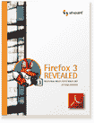

# 免费 PDF 下载:火狐 3 揭晓！

> 原文：<https://www.sitepoint.com/free-pdf-download-firefox-3-revealed/>

我们的新书现在只有 PDF 格式，而且是免费的！

它叫做**火狐 3 透露:什么是新的，什么是热的，&什么不是**。事情是这样的。

当我第一次和 Fabio Cevasco 讨论写一篇文章描述 Firefox 3 的所有新特性以及如何使用它们的想法时，我不太确定会有什么期待。

Fabio 之前只为我们写过一次(CakePHP 的精彩介绍)。知道 Firefox 3 的最终发布迫在眉睫，我们想尽可能在接近官方发布日期的时候发表他的文章。

然而，当他上周提交他的 8000 多字的杰作时，我最初的想法是“那不是一篇文章，而是一本电子书！”

因此，SitePoint 的整个团队在过去的几天里一直在努力工作，以获得 Fabio 对 Firefox 3 新功能的全面指南，该指南经过专业编辑、格式化并可供下载。我很自豪地说，我们成功了！

所以我建议你这么做。

1.  首先，去下载我们的新电子书(它是免费的)， [**火狐 3 透露:什么是新的，什么是热的，&什么不是**](https://s3.amazonaws.com/s3.sitepoint.com/ebooks/firefox-3-revealed/ff3-revealed.pdf) 。我们认为这是所有人最喜爱的浏览器中所有新功能的最全面的指南。
2.  然后，去[下载火狐 3](http://getfirefox.com/) 。今天就做(现在随时都可以做！).你将帮助火狐团队进入吉尼斯世界纪录，成为[单日下载最多的软件应用程序！(也是免费的)](http://www.spreadfirefox.com/en-US/worldrecord/)
3.  最后，在 [digg](http://digg.com/software/FireFox_3_Revealed_Free_ebook_from_SitePoint) 、 [delicious](http://del.icio.us/url/cb29d3b7eb697bbae284ff725ec6f095) 以及任何你喜欢使用的社交网络平台上为这本电子书的赠品投票吧。

我们喜欢把东西送出去，所以我们希望你能帮助我们传播这个信息。

## 分享这篇文章