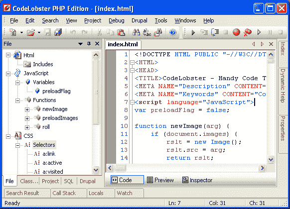

# 免费的 PHP，HTML，CSS，JavaScript 编辑器(IDE)-code lobster PHP 版

> 原文：<https://www.sitepoint.com/free-php-html-css-javascript-editor-ide-codelobster-php-edition-2/>

对于创建网站的有价值的工作，你需要一个好的舒适的编辑器。为此，有许多需要付费的产品，但我们希望在使用编辑器中选择非常
实用且同时简单的免费产品—**[code lobster PHP Edition](http://www.codelobster.com/)**。

*   所有的**代码高亮显示**根据类型的不同，也支持混合代码，
    因此在同一个文件中，HTML 的区域将高亮显示为 HTML，PHP 为 PHP，Javascript 为 Javascript。有多种配色方案可供选择，包括流行的理念。
*   强大的 HTML、PHP、CSS 和 Javascript 自动补全功能，包括 HTML5 和 CSS3。
    对于 PHP 来说，项目的结构是完全可识别的，完整的方法列表在适当的地方。
*   **HTML/CSS** inspector on the type of Firebug, which allows easily to correlate the selected elements of
    page with a code and proper style.
*   所有支持语言的上下文帮助。按 F1 键将打开带有当前标签、属性或功能详细描述的页面。
*   **PHP 调试器**。PHP 调试器允许增量执行 PHP 脚本，观察每行中所有
    变量的值。
*   **SQL manager** 允许对数据库进行所有必要的操作——添加、删除、编辑结构
    和表格中的记录，导出数据，执行 SQL 查询。突出显示和自动完成也适用于 SQL 文件。
*   **Support of FTP** allows to work straight with a remote server and to do all necessary changes with files;
*   **便携式选项**允许在没有预安装的情况下使用编辑器。
*   其他有用的工具:成对突出显示、块选择的可能性、折叠、
    工具提示、在按住 CTRL 键时导航功能和包含的文件、
    查看文件和项目的结构、在浏览器中预览、书签，以及所有其他标准的
    代码工作的可能性。

#### 也有一些特殊的插件

*   CMS: **Drupal，Joomla**
*   PHP 框架: **CakePHP，CodeIgniter，Symfony，Yii**
*   JavaScript library:**JQuery**
*   博客引擎
*   **Smarty** 模板引擎

| 开发者 | Codelobster 软件 |
| 网站 | [http://www.codelobster.com/](http://www.codelobster.com/) |
| 语言 | 英语、俄语、德语、西班牙语、法语、葡萄牙语 |
| 支持的操作系统 | Windows 2000、Windows XP、Windows Vista、Windows 7 |
| 下载链接:[免费 PHP、HTML、CSS、JavaScript 编辑器(IDE)–code lobster PHP 版](http://www.codelobster.com/download/) |

## 分享这篇文章