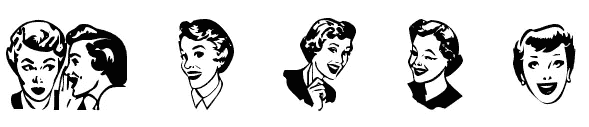
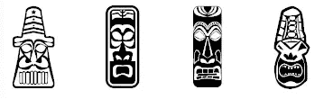
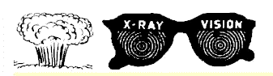
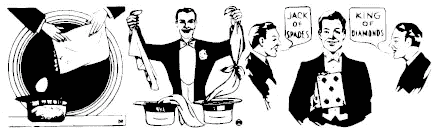
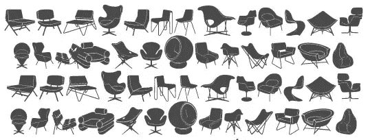
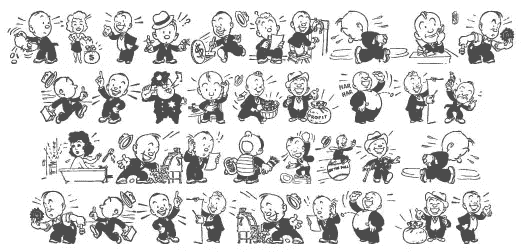

# 免费质量 40 和 50 年代风格的复古丁字裤

> 原文：<https://www.sitepoint.com/free-quality-40s-and-50s-style-retro-dingbats/>

一个朋友问我是否有一些好的博客帖子的免费复古风格剪贴画链接。20 世纪 40 年代和 50 年代广告中使用的卡通风格。我没有任何像样的免费剪贴画链接，但有一些非常好和有趣的游戏可供下载。我喜欢丁贝，因为尽管它们作为字体工作，但它们本质上是矢量，可以放大到任何你想要的大小而不损失质量，非常适合在 Photoshop、Illustrator 或任何让你使用文字的图形程序中使用。如果需要，您可以创建矢量轮廓并进一步编辑它们。像往常一样，检查许可证的使用条款，它们都是免费的，但不一定用于商业用途。

不过，重要的是一开始就要有好的质量。如果其中有主要的人造物品，那么当你把它们放大时，问题就变得更大了。在这些字体中有一些稍微不可靠的图画，但总的来说有足够的好东西来弥补不好的。所以这个列表是我设计包里的一些复古剪贴画，你可能会发现它们对在你的网站上创建复古设计或打印工作很有用。我很想看到更多，所以如果你遇到了，请添加链接。

[复古蝙蝠一号](http://www.urbanfonts.com/dingbats/Retro_Bats_One.htm#)

[逆转器的返回](http://www.fontspace.com/font-a-licious/return-of-the-retrobats)

[Glamocon Retrobats](http://www.fontspace.com/font-a-licious/glamocon)

嘿，孩子们

魔法目录–这里有两套不同的套装可供下载。

最后， [Tackorama 有大量漂亮的复古字体，你可以在这个页面上看到它们。](http://tackorama.net/Fonts/dingbats/1.htm)从人到家具到外星蘑菇，一切都是非常酷的 50 年代复古风格。

你还遇到过其他你认为有趣的复古发型吗？

## 分享这篇文章