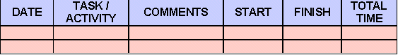
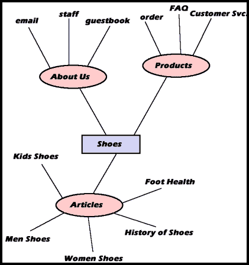

# 网络开发过程 2——一个自由职业者的视角

> 原文：<https://www.sitepoint.com/freelancers-perspective/>

在第一部分中，我们从小型企业的角度考虑了 Web 开发。在这里，我们来看看自由职业者可能采取的方法…

作为一名新的自由职业者，没有什么比开始你的第一个项目更可怕的了。本文将仔细研究开发项目应该遵循的步骤。希望，如果你意识到过程应该是怎样的，你就不会担心把事情做好。我假设这是你的第一个客户，回访业务对你的业务增长至关重要。所以从头到尾遵循这些步骤，你应该既有一个满意的客户，又有一张支票在你手中。

##### 1.跟踪时间

当你在做一个项目时，记录你的时间是很重要的。一旦你开始关注一个项目，就开始记录你的时间。在一个新的日程表上放一个时间日志，在这个日志上写下你的开始和结束时间，以及每次你做那个特定项目的其他详细信息。

这里有一个例子:

出于几个原因，准确使用时间日志是很重要的。首先也是最重要的，你的客户可能希望你分解你的工作时间，这样他们就能确切地看到他们的钱都花到哪里去了。第二，为了提高你的工作效率，彻底检查你的时间都花在哪里是很重要的。当你自由职业一段时间后，经验会让你很容易计算出项目的投标价格。

##### 2.打开案卷

摘要是一个巨大的信封或封套，把你所有的文件放在一起。没有什么比与客户会面后发现自己忘记了重要的文书工作更糟糕的了。为了避免这种可能性，我建议你为每个单独的项目使用一个摘要。

我建议使用黑色记号笔来区分你完成的每个项目。我总是用公司的名字来命名我项目的电脑文件和摘要，然后在后面加上连续的数字。例如，标记为 XYZCompany001 的文件将包含我关于 XYZ 公司第一个项目的所有信息。

##### 3.单篇情报资料

如果这是你第一次和客户一起工作，开始一份关于他们的信息表。你可能认为这并不重要，但是如果这个客户最终成为一个不愿意付账的穷光蛋，你会很高兴在项目早期记下他或她的地址和电话号码。

完成信息表后，将其放入您的摘要中。

##### 4.安排工作的各个阶段

从头到尾考虑这个项目。列出您预计在订单完成生产中将涉及的步骤。使用这个列表作为你的指南——没有它，你可能会发现你必须后退三步才能最终推进项目。

有时候，项目的某些阶段需要返工，因为你没有花时间写下你的游戏计划，或者你的计划不够周密。尽量不要让这种事发生在你身上。如果客户改变了他们对这个项目的想法，你不得不重新制定你的计划，如果你已经有了工作的起点，这将会更容易做到。规划工作的每个阶段至关重要。

##### 5.合同

通过写合同来保护自己免受问题客户的伤害。在你开始项目之前，让你的客户签署并寄回合同。您可以在互联网上找到适合您企业的通用合同，网址为:

*   [管理作业软件](http://www.managejobs.com)
*   [在线数字合同]( http://www.digicontracts.com )
*   [智能协议](http://www.smartagreements.com)
*   [合同刷卡文件](http://www.provider.com/contracts.htm)
*   [Law.net](http://www.law.net/sponsors/usalaw/public_html/)
*   [法律文件在线](http://www.legaldocs.com/labour-s.htm)
*   [自由职业合同样本](http://www.freelancebank.com/resource.asp?id=14114)

##### 6.组织你对这个项目的想法

开始你的项目的一个很好的方法是计划如何组织网站。思维导图是做到这一点的一种方法。写下一两个与你之前关于客户项目的笔记主题相符的单词。用线延伸到相关的主题。这里有一个例子:

你的思维导图类似于流程图。确保所有的导航路线都已绘制出来。如果可能的话，让别人看看你的流程图，看看你是否遗漏了什么。

##### 7.思考艺术

一个好网站最吸引人的地方是它的图形。仔细倾听你的客户，找出他们真正想要的。如果客户无法解释他们对网站的看法，可以问几个问题:

*   哪些网站在视觉上吸引你？
*   从 1 到 10，快速加载网站对您有多重要？
*   你偏爱什么颜色？
*   您是否已经有现成的宣传资料(小册子、目录等)。)?如果是这样，我对你的字体、标志和颜色有什么灵活性？
*   为了完成这个项目，你有我需要的艺术品吗？

如果你很难找到有创造力的自己，那就去看看[CoolHomePages.com](http://www.coolhomepages.com)寻找一些灵感。一旦你知道了你的客户想要什么，你就可以开始为这个网站编故事了。

##### 8.记事板制作

故事板是一种用于布局网站设计和导航的设备。它可能只是一张纸上的草图，然而，我总是在开始实际布局网站之前向客户发送一个故事板。对于您的故事板，尝试在 Illustrator 或 Freehand 中布局草图。用你的思维导图或流程图来引导你完成这个过程。一旦你有了一个完美的故事板，请你的客户签字，这样你就可以确定他们同意你的概念。

##### 9.用计算机修改（图片或照片）

现在你的客户已经在你的故事板上签字了，是时候开始设计过程了。请遵循以下步骤:

1.  拍摄浏览器的屏幕截图。

3.  将此图像导入 Photoshop 并保存文件。

5.  将所有设计元素布局到网站主页的图层中。

7.  设计至少三种不同的网站外观和感觉。

9.  去你当地的服务机构打印两份设计，一份给你，一份给客户。记住向客户收取 5%-10%的打印费用。将每份打印输出的副本放入项目清单中——这就是你的副本。

11.  将其他打印件安装在单独的黑色纸板上。在每张纸的背面贴上你公司名称的标签，并留出空间让客户签字。

如果你的客户是本地人，安排一次会面，向他们展示模型。如果你是异地恋，用联邦快递把模型寄给你的客户，让他们在他们喜欢的模型背面签字。

如果客户不喜欢你的任何布局，这种情况会发生在我们当中最好的人身上，那就要重新开始。但是一定要找出他们不喜欢你任何设计的确切原因。记下他们不喜欢什么，以及他们做了什么。这些将帮助你重新设计到一个可以接受的程度。

一旦您的客户签署了布局，重命名相应的 Photoshop 文件以反映这一点，并将未使用的文件移动到“创意文件”中。没有理由不为你的下一个客户修改这些未使用的模型。将未使用的模型副本从项目清单中取出，将选择的模型留在清单中。

被拒绝的模型绝不是浪费。把它们放在一个活页夹里，新客户可以浏览——这是一个方便的销售工具，可以加快未来客户的设计过程。

现在，转到 Photoshop 文件，获得批准的概念。复制现有的文件，使网站的内页模拟文件。

##### 10.优化图像

现在你已经在 Photoshop 中设计好了所有的页面，是时候剪切出你将在每个网页上使用的图片了。一个很好的经验法则是每页不要超过 30K，否则你的网页将需要很长时间来加载。另外:

*   以 gif 格式保存插图。
*   以 jpeg 格式保存照片。
*   保持图像中的颜色数量最少。
*   锯齿图像比非锯齿图像小。
*   对 jpeg 压缩得越多，图像就越小。

##### 11.建立一个原型

拿起打印好的模型和流程图，用它们来设计你的页面。创建您的页面，使它们都链接在一起。要帮助组织您的文件:

*   将所有图像放在一个名为“图像”的文件夹中。
*   将网站的每个部分放在一个单独的文件中。
*   构建您的目录，以大致匹配您的流程图。
*   确保您的文件名有意义(在每个文件前面有一个公司代码是个好主意。例如，对于 XYZ 公司的“关于我们”页面，我会使用 xyz_about.html)。
*   准备一个存档系统来备份你的文件。相应地命名您的文件，这样您就可以将所有的 html 文件链接在一起，创建一个客户机可以测试的工作原型。

##### 12.测试

在你把原型发给你的客户之前，和几个没有参与过这个项目的朋友一起测试你的设计的可用性。写下他们给你的所有反馈——好的和坏的。此外，尝试尽可能多的不同浏览器、插件和操作系统，因为网站的访问者可能会使用。一定要修复任何问题和错误，并记下哪些有效，哪些无效，以供将来的项目参考。

完成内部检查后，将网站上传到主机服务器，并测试访问速度、插件和配置。当你确定一切正常时，是时候让客户在原型网站上放松了。可能会有几样东西是你的客户不喜欢的。仔细倾听你的客户，并对客户提出的所有建议给予肯定。一旦客户对网站感到满意，让他们在原型上签字，这样你就可以继续下去，让网站活起来。

##### 13.让它活起来

一旦测试阶段完成，是时候推出网站了。祈祷好运吧。不可避免的是，访客总会发现一些他们不满意的东西——而不满意的客户通常意味着你的客户不满意。因此，支持你新推出的网站至少 2 到 4 周，直到任何问题都解决了。

##### 14.审核并开具发票

既然你已经完成了这个项目，是时候履行你的管理职责了。首先，检查你的时间表。计算你在项目上花费的总小时数，并将这个数字分解为项目每个阶段花费的小时数。

为客户复印一份时间表，并创建一份发票，反映你的小时费用和你在工作上花费的时间。请务必在您的发票上注明客户的采购订单编号，否则许多应付账款部门不会支付您的发票。如果你的客户没有给你一个采购订单编号，联系他们确认是否有一个采购订单编号链接到该项目。在您的发票上包括:

1.  您的徽标、姓名、公司名称、地址和电话号码

3.  客户联系人的姓名、公司名称、地址和电话号码

5.  采购订单日期(订购作业的日期)

7.  发票日期

9.  发票号码

11.  付款条件(例如，净 45 天)

13.  项目每个阶段花费了多少小时的细目分类

15.  增加费用(如印刷、快递等)。)

确保你的发票整洁专业，把订单钉在上面，然后寄给客户。

##### 15.将项目存档

现在您已经完成了，您可以使用 docket 来归档这个项目。在每份案卷上放一个归档标签，并确保其内容按字母数字顺序排列。

确保所有该在清单上的东西都在那里。将所有相应的电子文件放在 Zip 或 Jazz 磁盘上，并将其包含在项目的摘要中。所有工作的行政文件，如发票和采购订单也应放在案卷中。最后，确保包括任何与项目相关的打印输出、电子邮件或笔记。

##### 几乎所有东西都可以重复使用

你不应该重复使用你的客户拥有版权的项目。然而，每个项目的部分都是可重用的。例如，您不会重复使用专门为客户创建的设计，但是您可以重复使用为增强其他作业而创建的 Photoshop 路径或纹理。

你会发现，随着你完成越来越多的项目，每一个项目都会变得简单一些。当你开始成为一名自由职业者时，把每个项目当作一次学习经历。记住:你完成的每个项目都会增加你的经验，让你成为更有价值的自由职业者。

## 分享这篇文章