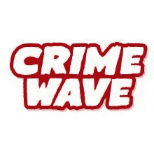
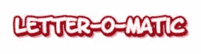
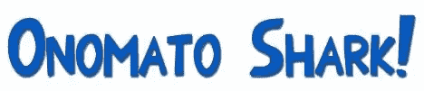
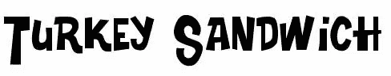
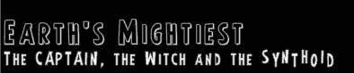
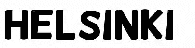
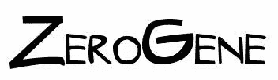
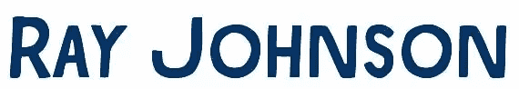

# 朋友不让朋友用漫画书

> 原文：<https://www.sitepoint.com/friends-dont-let-friends-use-comic-sans/>

如果你问设计师，他们最不喜欢的字体是什么，答案通常是漫画字体。它被归类为一种休闲字体，最初由 Vincent Connare 设计，看起来像漫画书中使用的字体。你经常在传单、海报和菜单上看到它，让我们诚实地说，它只是业余的尖叫！也不能有太多的字体成为笑柄:漫画桑斯走进一家酒吧，酒保说，“我们不提供你喜欢的类型。”

谢天谢地，Comic Sans 不是被认为是“网络安全”的字体之一，否则我肯定我们会看到它在网络上被滥用。甚至有一个网站专门致力于彻底消除它。 [Ban Comic Sans](http://bancomicsans.com/home.html) ，有一句很棒的口号“把 Sans 放进 Comic Sans”，主办了一场网上请愿，你可以签名以示你对这场运动的声援。

关于字体已经说得够多了。这篇文章是关于漫画书的替代品，实际上是关于指出一些更符合漫画书排版风格的优秀字体。传统上，所有的漫画书都是手写的，尽管字体是受控的，而且相当机械。我在下面挑选的八种字体就是以这种风格创建的，实际上有上百种可供选择。下面链接的大多数网站都有不止一种漫画字体可供下载。有些更适合网页设计中的标题，而有些则可以用于印刷材料中的小段落。排名不分先后，这里有一些免费的字体供你在你的网站或图形项目中添加一些漫画风格；

Blambot fonts 是最著名的漫画字体铸造厂之一，他们的网站上有许多免费和商业字体。我挑了两个。罪波是这个月的免费字体，

和字母-o-matic

从 DeviantArt 的 [Sharkragon 可以买到 Onomato Shark](http://sharkragon.deviantart.com/)

机器人约翰尼是约翰·马茨的网站，他是多伦多的漫画家和插画家。John 在“玩具软件”的许可下提供了几种字体，也就是说，这些字体对于非商业用途是免费的，但是如果你打算使用它们赚钱，那么他要求你以玩具、书或一些有趣的东西的形式支付许可费。

机器人约翰尼做的火鸡三明治

地球上最强大的字体

赫尔辛基是 Vic Fieger 创作的网络漫画《都柏林人》中单词气球使用的字体。这是受害者自己笔迹的精致版本，经过修改，看起来更像传统的“漫画”字体。-

茶啤酒工作室
茶啤酒字体是免费的非商业或独立漫画使用。如果你想在商业上使用它们，你需要一个许可证。

K-Type 的 Ray Johnson 字体免费供个人使用

为了结束这篇文章，我想提一下另一个网站— [漫画字体](http://www.comicbookfonts.com)。我在上面找不到任何免费的字体，但上面的商业字体非常棒。它包括由戴夫·吉布森创造的字体，他在《守望者》上刻字。

有没有碰到其他你很喜欢的漫画字体？你以前在设计项目中使用过它们吗？

## 分享这篇文章