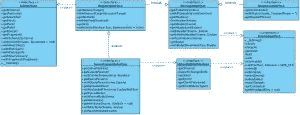

# 从 HTTP 消息到 PSR-7:都是关于什么的？

> 原文：<https://www.sitepoint.com/from-http-messages-to-psr-7-whats-it-all-about/>

这篇文章由安德鲁·卡特同行评审。感谢 SitePoint 的所有同行评审员使 SitePoint 的内容尽可能做到最好！

PHP 框架互操作性小组(PHP-FIG)最近批准了另一个提议，即 [PSR-7: HTTP 消息接口](http://www.php-fig.org/psr/psr-7/)。该文档将 HTTP 消息具体化为 7 个接口，如果它们符合规范，PHP 库应该实现这些接口。在 [PSR-7 举例](https://mwop.net/blog/2015-01-26-psr-7-by-example.html)中，PSR 的编辑马修·威尔·奥芬尼给出了一个有趣的规范概述。那是什么呢？


如果你在浏览器中输入`bbc.co.uk`,你会直接进入 BBC 的主页，但是在浏览器向服务器发送 HTTP 请求和得到响应之间可能发生了很多事情。

这是一个原始请求示例。

```
GET / HTTP/1.1
Host: bbc.co.uk
User-Agent: Mozilla/5.0 (compatible; MSIE 9.0; Windows NT 6.1; Trident/5.0)
Accept: */*
Referer: 
```

它总是由一个请求行(GET / HTTP/1.1)、许多列为`<key>: value`的标题字段行、一个空行和一个用于任何数据负载(例如查询参数或 post 数据)的可选主体组成。

零个或多个标题行后的空行必须是一个 CRLF。这意味着 2 个字符–一个 ASCII 13(回车)，后面跟着 ASCII 10(换行符)或`\r\n`。

让我们通过 curl 从命令行发送这个请求，并查看响应:

```
curl -i -H "Host: bbc.co.uk" -H "User-Agent: Mozilla/5.0 (compatible; MSIE 9.0; Windows NT 6.1; Trident/5.0)" -H "Accept: */*" -X GET http://bbc.co.uk

HTTP/1.1 301 Moved Permanently
Content-Type: text/html
Date: Sun, 02 Oct 2016 20:49:42 GMT
Location: http://www.bbc.co.uk/
Connection: Keep-Alive
Content-Length: 0 
```

感动？有一个重定向。然后，让我们循着线索向`http://www.bbc.co.uk/`发出请求:

```
curl -i -H "Host: www.bbc.co.uk" -H "User-Agent: Mozilla/5.0 (compatible; MSIE 9.0; Windows NT 6.1; Trident/5.0)" -H "Accept: */*" -X GET http://www.bbc.co.uk | less

HTTP/1.1 200 OK
Server: nginx
Content-Type: text/html; charset=utf-8
ETag: W/"29c44-MXo+6t7MoPRad358MSWqwA"
X-Frame-Options: SAMEORIGIN
x-origin-route: xrt-ext
Content-Length: 171076
Date: Sun, 02 Oct 2016 20:54:27 GMT
Connection: keep-alive
Set-Cookie: BBC-UID=15c73fe11704a0731344da5ec13869204c1a22a0c7b444d60a708762e631ac0c0Mozilla/5.0%20(compatible%3b%20MSIE%209.0%3b%20Windows%20NT%206.1%3b%20Trident/5.0); expires=Thu, 01-Oct-20 20:54:27 GMT; path=/; domain=.bbc.co.uk
X-Cache-Action: HIT
X-Cache-Hits: 1223
X-Cache-Age: 55
Cache-Control: private, max-age=0, must-revalidate
Vary: Accept-Encoding, X-CDN, X-BBC-Edge-Scheme

<!DOCTYPE html>
<!--[if lte IE 9]>
  <html lang="en-GB" class="no-js no-flexbox no-flexboxlegacy">
<![endif]-->
<!--[if gt IE 9]><!-->
  <html lang="en-GB" class="no-js">
<!--<![endif]-->
<head> 
```

这还差不多。第一行`HTTP/1.1 200 OK`是状态行。然后我们有标题，与请求的模式类似–`<key>: value`,一个空行，和响应体。注意:我们通过`less`传递输出，这样我们可以看到响应的第一部分。

请求和响应可以分解成一个消息行、许多标题行和正文行。这些共性可以在一个接口(`MessageInterface`)中抽象出来，请求(`RequestInterface`)和响应(`ResponseInterface`)可以用它们独特的 HTTP 消息风格扩展这个接口。

PHP 不仅仅在 web 环境中运行，web 请求可能来自 API。`ServerRequestInterface`被设计用来处理其他类型的 HTTP 请求。

其他三个接口是对消息中特定方面的进一步抽象。回头看看请求消息行:

```
GET / HTTP/1.1 
```

这包括:

*   方法:尽管 [RFC 2616](http://www.rfc-base.org/rfc-2616.html) 定义了安全和幂等类型的方法，但是对于一般的应用程序来说，通过名称来识别它们就足够了——GET、POST、PUT、PATCH、DELETE、OPTIONS、HEAD 和 TRACE。CONNECT 保留用于可以动态切换为隧道的代理，例如 SSL 隧道。

*   目标:这是 URI 或我们的请求目标，这里的事情变得有点有趣，因为我们可以有:

    *   origin-form-URI 的路径和查询字符串。查询字符串可能存在，也可能不存在。
    *   绝对形式——绝对的 URI。
    *   authority-form–URI 的授权部分，最多由 3 部分组成–用户信息(可选)、主机和端口(可选)。用户信息可能也需要密码——用户:密码。我们以 user:password@host:port 的模式结束。用户信息也可能需要一个
    *   星号形式–只有字符串，*号

    我们以`scheme:[//[user:password@]host[:port]][/]path[?query][#fragment]`结束。请求消息的这一部分被抽象为`UriInterface`。

*   版本:这里的选择有限，因为 HTTP/1.1 是当前版本。在此之前，我们有 HTTP/1.0，下一个草案版本是 HTTP/2.0

此外，文件上传需要特别注意。在非 SAPI 环境中，`$_FILES`环境变量是空的，在非 POST 请求等情况下，`$_FILES`根本不会被填充。`UploadedFileInterface`被设计成允许与文件更一致的交互。

消息(请求或响应)需要能够为客户机和服务器有效地处理大量数据。PHP 从 4.3.0 开始就内置了流。PSR-7 的`StreamInterface`部分提供了通用操作的包装器，并将整个流序列化为字符串。



## 挑战

通往 PSR-7 的道路上，每一步都充满了激烈的辩论和不同的意见。

*   不可变对象——对象的不变性或可变性是争论最激烈的问题之一，PSR-7 最终解决了这个问题:

    > 该提议将消息和 URIs 建模为值对象。
    > 
    > 消息是值，其中身份是消息所有部分的集合；对消息的任何方面的改变本质上都是新消息。这正是值对象的定义。变更导致新实例的实践被称为不变性，这是一种旨在确保给定值完整性的特性。

    这意味着，每次您对消息对象进行任何更改，都会得到一个新的副本。URI、头和流的复杂性要求向接口的设计者提供所有合作者完全采用不变性的保证。

    使用不变性，您所做的任何状态更改都需要您指定结果。

    ```
     $request = $request->setHeader('Cache-Control', 'public'); 
    ```

    任何更改当前消息状态的方法都会返回一个包含所做更改的实例。只要进行了结果赋值，就可以用类似 fluent 的语法将任意数量的更改链接起来。

    ```
    $request = $request
            ->setHeader('Cache-Control', 'public')
            ->addHeader('Cache-Control', 'max-age=18600')
            ->setStatus(200); 
    ```

    前缀为“with”的方法必须符合不变性要求。一个问题是，在一个消息接口中支持可变性意味着在所有其他接口中强制执行它。

    另一方面，已经强调的是 [PSR-7 对象并不像通常认为的那样是不可变的](http://andrewcarteruk.github.io/programming/2016/05/22/psr-7-is-not-immutable.html)。值得注意的是，Ruby 和 Node 中类似的 HTTP 对象实现在设计上是可变的。所以，PHP 是一个很好的公司。

*   术语——这些对象被设计为接口。叫它 MessageInterface 是不是多余？接受请求和响应的方法签名太长。比较以下内容:

    ```
    public function __invoke(ServerRequestInterface $request, ResponseInterface $response, callable $next) : ResponseInterface
    {
    } 
    ```

    ```
    public function __invoke(ServerRequest $request, Response $response, callable $next) : Response
    {
    } 
    ```

    别名是那些喜欢放弃接口后缀的人的建议解决方案。

*   中间件——我们已经有了消息接口，就像制作蛋糕的配料，完美地计量出来。我想要一个蛋糕，但我不知道如何烘烤。食谱怎么样？新 PSR 协议仅规定了请求和响应的定义标准。我们如何从请求转向响应？在请求和响应之间做跑腿工作的“中间人”被称为中间件。

    下一步将是统一如何探测 PSR-7 接口，以便符合它们的应用程序和框架可以完全交换。争论的这一部分，也就是为 PSR 7 协议的互操作实现提供一个模板，已经转移到单独的 PSR 15 协议:HTTP 中间件。

## 使用

许多库和框架都以不同的方式增加了对 PSR 7 的支持。

1.  Symfony——[HTTP foundation 组件](http://symfony.com/doc/current/components/http_foundation.html)是 PHP-FIG 之前 HTTP 规范最流行的 OOP 抽象之一。随着 PSR-7 的出现，Symfony 选择了 [PSR-7 桥](http://symfony.com/doc/current/request/psr7.html),它将`HttpFoundation`对象与实现 PSR-7 消息接口的对象相互转换。

2.  Zend Framework(ZF)——他们提出了一个 HTTP 消息接口实现的 Composer 包`zendframework/zend-diactoros`，这并不奇怪，因为 PSR-7 的编辑是 ZF 项目的负责人。[diatoros](https://docs.zendframework.com/zend-diactoros/overview/)更进一步，它包含了一个类似于 [http 提供的服务器。NodeJS 中的服务器](https://nodejs.org/api/http.html)。

3.  斯利姆-[PSR 7 和价值对象](http://www.slimframework.com/docs/concepts/value-objects.html)描述了一种灵活的方法，使斯利姆可以接受任何 PSR 7 的实施。也就是说，如果 Slim 提供的那个不够用的话。

4.  guzzle——作为一个 HTTP 客户端库，PSR 7 和这个库有很大的关系。他们构建了`guzzlehttp/psr7` Composer 包，这是他们所依赖的 PSR-7 的消息实现。 [Guzzle 和 PSR-7](http://docs.guzzlephp.org/en/latest/psr7.html) 很好地概述了他们对规范的理解。

5.  光环——它们包括[光环。路由器](http://auraphp.com/packages/3.x/Router/getting-started.html)，他们独立库包集合中 PSR-7 的网络路由器实现。所有路由器对象都由一个`RouterContainer`管理，您可以从中检索一个`Map`对象的实例。这个`Map`对象的每个方法都可以接受一个 HTTP 消息接口作为它的一个参数。

6.  HTTP plug——一个接口包，允许库和应用程序开发人员创建与 PSR 7 完全兼容的 HTTP 客户端。HttpClient 发送一个 PSR 7 请求并返回一个 PSR 7 响应。参见[用 PHP-HTTP 和 HTTPlug 从 Guzzle5 中挣脱](https://www.sitepoint.com/breaking-free-from-guzzle5-with-php-http-and-httplug/)获得使用这个包的实用方法。

Packagist 有一个 PSR-7 实现的列表,它具有广泛的受欢迎度或接受度。但是，开发人员仍有以下使用选项:

1.  直接——正如规范所述，虽然 Psr \ Http \ Message \ Message interface 可以直接实现，但实现者应该实现 Psr \ Http \ Message \ request interface 和 Psr \ Http \ Message \ response interface。最简单的方法是用 Composer 安装包。

    ```
    composer require psr/http-message 
    ```

2.  间接–通过适配器间接使用接口。例如，Symfony 中的 PSR-7 支持是通过 PSR HTTP 消息桥，一个旨在将 Symfony `Request`和`Response`对象转换成与 PSR-7 完全兼容的对象，以及从 PSR-7 转换回 Symfony 对象的库。

3.  partial——您可能会对更通用的接口感兴趣，比如 StreamInterface、UriInterface 和 UploadedFileInterface。没有什么可以阻止您在非 HTTP 消息上下文中实现它们。Packagist 上有这个软件包，Composer 是你的朋友。

## 结论

PHP 社区在如何与 HTTP 请求和响应交互以及如何管理 HTTP 请求和响应的基本原则上走到了一起，这应该受到称赞。PSR-15 超越了这一点，围绕中间件的激烈辩论不会很快消失，也不应该预期草案会很快被接受。与此同时，PSR 7 号已经为所有人准备好了。

你觉得 PSR 7 号怎么样？你是使用它并订阅它，还是觉得它只是一层复杂化？我们希望收到您的来信！

## 分享这篇文章