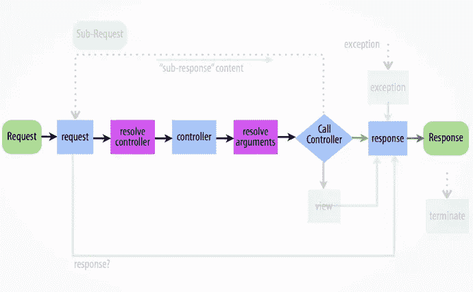

# 从请求到响应:Drupal 8 内部之旅

> 原文：<https://www.sitepoint.com/from-request-to-response-a-journey-into-drupal-8-internals/>

在关于 Drupal 8 模块开发的第一篇文章中，我们看了一下这个过程的路由方面。我们已经看到，创建带有路径的页面现在是声明与控制器匹配的路径的问题。正如我们所见，后者可以返回一个渲染数组，该数组被解释为标记并显示在该页面的主要内容区域。然而，您知道吗，在幕后，Drupal 实际上根据 Symfony 的 [HTTPKernelInterface](http://api.symfony.com/2.7/Symfony/Component/HttpKernel/HttpKernelInterface.html) 的指示，将该数组转换为一个*响应*对象？

在本文中，我想让我们更深入地了解 Drupal 8(和 Symfony2)的内部结构，看看从用户发出请求到用户看到返回响应这一过程中实际发生了什么(以及可能发生什么)。我上面提到的例子只是这个过程可以进行的一个方向，今天我们还将看到其他的可能性。目标是理解系统的灵活性，这反过来可以帮助我们构建出色的应用程序。

在深入研究之前，我强烈建议你看一下这张图，它在合成通常被称为*的渲染管道*方面做了一项惊人的工作。虽然在我看来，它所代表的不仅仅是名字所暗示的，因为渲染系统只是所描绘的一部分，尽管是很大的一部分。

## 前控制器(index.php)

众所周知，Symfony2 现在是 Drupal 的重要组成部分。后者使用了 Symfony 的许多组件，对本文来说最重要的是 [HTTPKernel](http://symfony.com/doc/current/components/http_kernel/introduction.html) 和 [HTTPFoundation](http://symfony.com/doc/current/components/http_foundation/introduction.html) 组件。它们一起负责封装用户请求，将请求传递给应用程序，然后以一致和面向对象的方式返回给用户。

HTTPKernelInterface(你可能[也从其他上下文](https://www.sitepoint.com/stackphp-explained/)中听说过)通过接受一个*请求*对象并总是返回一个*响应*对象，将所有这些粘合在一起。一个非常简单但强大的概念。

该过程在`index.php`文件中启动，该文件通过生成所述[请求](http://api.symfony.com/2.7/Symfony/Component/HttpFoundation/Request.html)对象并将其传递给`HTTPKernel::handle()`方法开始。后者负责返回一个[响应](http://api.symfony.com/2.7/Symfony/Component/HttpFoundation/Response.html)对象。从高层次来看，这种情况在 Drupal 应用程序和 Symfony 应用程序(或任何其他利用 HTTPKernel 组件的应用程序)中都存在。

## HTTPKernel 和事件

HTTPKernel 是任何基于 Symfony 的应用程序的核心。正如我们所看到的，它的`handle()`方法在准备响应方面有很大的责任，它在由事件驱动的[工作流中这样做。这使得应用程序非常灵活，繁重的工作总是委托给这些事件的侦听器。](http://symfony.com/doc/current/components/http_kernel/introduction.html#httpkernel-driven-by-events)

如果您查看前面的图表，您可以看到第二列中描述的工作流，它本质上代表了 Symfony 和 Drupal 之间的粘合。

它从名为`kernel.request`的第一个事件开始。此事件的订阅者处理各种任务。但是 Drupal 8 中两个非常重要的是格式协商和路由。第一个决定需要返回的响应类型(html、json、image、pdf 等)，而第二个决定负责处理的代码是什么(在`routing.yml`文件中路由定义的`_controller`键)。但是像这个事件工作流中的大多数步骤一样，如果一个侦听器返回一个响应对象，那么这个过程将跳过大多数后续步骤(停止传播)并直接进入`kernel.response`。

第二个事件是`kernel.controller`，它在应用程序知道哪个控制器负责处理请求后被调用。此时，侦听器仍然可以对它执行一些覆盖操作。紧接着这一步，内核负责解析传递给控制器的参数。Drupal 中的一个这样的操作是基于请求中的 id 加载对象(例如节点),并将它们直接提供给控制器。最后，控制器被调用，并带有各自的参数。

控制器负责返回某种响应。如果它返回一个`Response`对象，那么这个过程跳到`kernel.response`事件。后者的侦听器可以对对象进行最后的修改，比如修改标题或内容本身。在从`handle()`方法中得到它之后，前端控制器使用`Response`对象上的`send()`方法将其发送回用户，并终止进程。

## 使用渲染数组更深入

如果控制器没有返回一个`Response`对象，内核触发最后一个事件:`kernel.view`。它的订阅者负责将控制器的结果转化为实际的`Response`对象。因此，这意味着您可以选择从控制器返回任何类型的对象，只要您将它与视图事件订阅者耦合，并将其转换为适当的`Response`。

然而，正如我们在[示例](https://www.sitepoint.com/build-drupal-8-module-routing-controllers-menu-links/)中看到的，大多数时间控制器将返回一个渲染数组。通常这代表页面的主要内容(类似于 Drupal 7 中的页面回调)。

为了处理这个问题，Drupal 8 有一个[MainContentViewSubscriber](https://api.drupal.org/api/drupal/core%21lib%21Drupal%21Core%21EventSubscriber%21MainContentViewSubscriber.php/class/MainContentViewSubscriber/8)负责将这个数组转换成合适的`Response`对象。它通过使用一个特定的 [MainContentRenderer](https://api.drupal.org/api/drupal/core%21lib%21Drupal%21Core%21Render%21MainContent%21MainContentRendererInterface.php/interface/MainContentRendererInterface/8) 来实现，这个特定的 [MainContentRenderer【】是在我们之前讨论过的格式协商阶段选择的。虽然](https://api.drupal.org/api/drupal/core%21lib%21Drupal%21Core%21Render%21MainContent%21MainContentRendererInterface.php/interface/MainContentRendererInterface/8)[已经有一些这样的渲染器可用](https://www.drupal.org/developing/api/8/render/pipeline#main-content-renders)，但是默认使用的是[html 渲染器](https://api.drupal.org/api/drupal/core%21lib%21Drupal%21Core%21Render%21MainContent%21HtmlRenderer.php/class/HtmlRenderer/8)。

## html 渲染器

因为这是最常用的主要内容呈现器类型，所以让我们更深入一点，看看它是如何构建页面的。

这个过程中的这一步很酷的一点是页面变体的概念。
这意味着`HTMLRenderer`调度一个事件，负责找出哪种类型的页面将用于包装主内容呈现数组:`RenderEvents::SELECT_PAGE_DISPLAY_VARIANT`。默认情况下，使用[简单页面变量](https://api.drupal.org/api/drupal/core%21lib%21Drupal%21Core%21Render%21Plugin%21DisplayVariant%21SimplePageVariant.php/class/SimplePageVariant/8)，除非块模块被启用。在这种情况下， [BlockPageVariant](https://api.drupal.org/api/drupal/core%21modules%21block%21src%21Plugin%21DisplayVariant%21BlockPageVariant.php/class/BlockPageVariant/8) 开始工作，允许在主要内容周围的区域放置块。如果您愿意，可以在自己的模块中订阅该事件，并提供自己的变体。

所有这些都发生在`HTMLRenderer`的`prepare()`方法中，该方法为`renderResponse()`方法提供了一个`#type => 'page'`呈现数组，该数组包装了主要内容。后两个依次被包装到一个`#type => 'html'`渲染数组中，最终使用[渲染器](https://api.drupal.org/api/drupal/core%21lib%21Drupal%21Core%21Render%21Renderer.php/class/Renderer/8)类(相当于 Drupal 7 中的`drupal_render()`)进行渲染。产生的 HTML 字符串被添加到`Response`对象并返回到前端控制器。

虽然这是一个非常高层次的过程概述，这是基本上发生了什么。现在我们有了一个`Response`对象，这意味着内核可以调度它的`kernel.response`事件。在此之后，前端控制器可以将`Response`发送回用户并终止该过程。

## 结论

在本文中，我们通过跟踪从用户请求到服务器返回响应的管道，对 Drupal 8(和 Symfony2)的内部进行了一次探索。我们已经看到了 Drupal 8 如何利用 HTTPKernel 和 HTTPFoundation Symfony2 组件，以及它基本上是如何在它们之上生存的。此外，我们已经看到了它们之间的粘合剂是如何由内核分派的事件组成的，Drupal 订阅了这些事件的所有功能。最后，我们看到了 HTML 页面是如何在渲染管道的帮助下构建并返回给用户的。

我相信，理解 Drupal 8 应用程序中正在发生的事情将允许您通过确切地知道您在这个流程中有哪些入口点来创建令人敬畏的应用程序。我相信，如果你从这篇文章中只拿走一样东西，那应该是单词*灵活性*。因为在 Drupal 8 中构建我们所需要的东西的灵活性远远超过了 Drupal 7。它真的变得很现代。

## 分享这篇文章