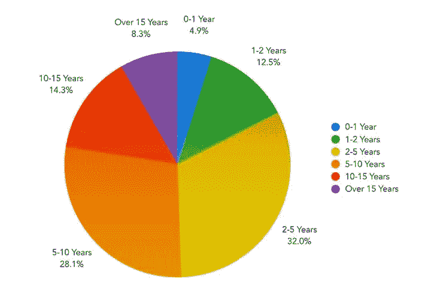
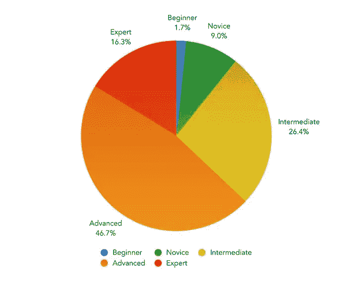
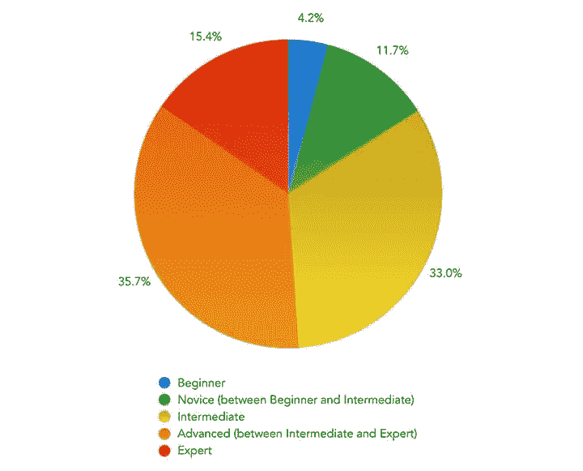
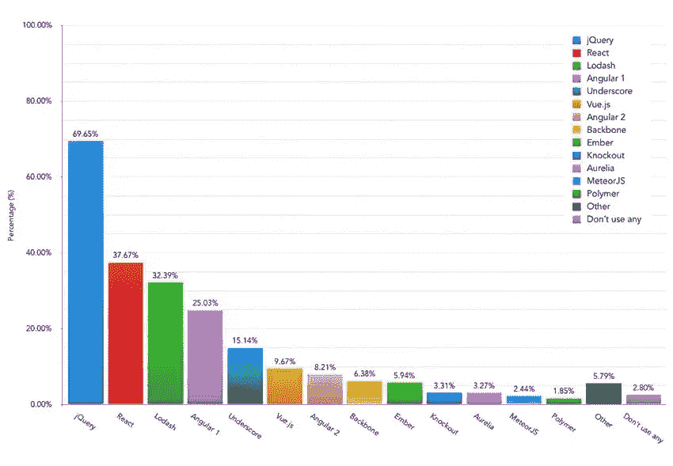

# 2017 年前端工具趋势

> 原文：<https://www.sitepoint.com/front-end-tooling-trends-2017/>

有两年以上的开发经验吗？你的高级 CSS 技能是否得到了 Sass 和 Autoprefixer 的帮助？你的 JavaScript 知识是否合理，你是否乐于使用 Gulp、npm 和 jQuery？如果是这样，根据阿什利·诺兰的前端工具调查，你就是一个典型的开发人员。

## 谎言，该死的谎言，统计和调查

诸如此类的调查有助于发现新工具，突出你知识中的明显差距。在撰写本文时，该调查已收到 5，254 份回复，这是一个比大多数民意调查明显更好的样本。然而，小心不要把它们当成福音真理…

### 全球结果

该调查在全球范围内进行，但将严重偏向英语国家。在其他地方开发或使用的流行工具可能会被忽略。

### 开发者知识

这项调查吸引了有知识的开发人员，他们理解这些问题，知道它的存在，并且有时间和意愿去完成它。

83%的受访者拥有两年或两年以上的前端技术经验，只有 5%的人承认不到一年:

[图片由阿什利·诺兰提供](https://ashleynolan.co.uk/assets/img/blog/tooling-survey/2016/q1.jpg)

前端技能最少的开发人员不太可能完成调查，因此结果可能会有所偏差。

### 观点和偏见

受访者被要求对自己的经历做出判断。有些人可能很谦虚，患有冒名顶替综合症。其他人可能高估了他们的技术能力，因为他们是一个庞大的新手程序员团队中唯一的前端开发人员。自以为是的偏见可能会得到平均，但没有办法证明这一点。

### 过去的活动不代表未来的趋势

结果突出了开发者一直在使用的东西。这并不意味着这些工具是有用的、节省时间的，或者将在未来的项目中使用。

## 半铸钢ˌ钢性铸铁(Cast Semi-Steel)

63%的开发人员将他们的 CSS 知识评为高级或专家:

[图片由阿什利·诺兰提供](https://ashleynolan.co.uk/assets/img/blog/tooling-survey/2016/q2.jpg)

尽管 CSS 是看似简单的属性和值对的集合，但众所周知它很难掌握。CSS3 引入了许多新的特效，想要体验所有的特效越来越难。例如，我对新的 [CSS 网格模块](https://www.w3.org/TR/css-grid-1/)知之甚少，在开发 [Flexbox 布局](https://www.w3.org/TR/css-flexbox-1/)时经常使用 Force(或者随机试错)！

10%承认不到一年开发经验的人声称拥有高级 CSS 知识！我怀疑他们很快就会发现，他们知道的越多，他们就越意识到他们不知道！

### CSS 预处理程序

超过 63%的人使用[Sass](http://sass-lang.com/)——无可争议的预处理器冠军。8%的人还使用 [PostCSS](http://postcss.org/) ，尽管它通常与其他预处理程序结合使用，以提供有用的功能，如 [AutoPrefixer](https://github.com/postcss/autoprefixer) (被 65%的受访者采用)。

几乎 14%的人不使用预处理程序，而喜欢使用原始的 CSS 代码。当您考虑到这是开始前端开发的最简单(也是最好)的方法时，这似乎有点低。平均每个网站发出 7.2 个 CSS 文件请求，如果 86%的开发者使用预处理器，我预计这个数字会更低。

几乎 70%的受访者尝试过[少于](http://lesscss.org/)，19%的人尝试过[手写笔](http://stylus-lang.com/)。80%从未听说过[返工](https://github.com/reworkcss/rework)。

### CSS 命名方案

46%的开发人员使用过命名方案，但是对于那些将他们的 CSS 知识列为高级或专家的人来说，这个数字上升到了 57%。

最受欢迎的选项是 [BEM](http://getbem.com/) 有 40%，其次是 [CSS 模块](https://github.com/css-modules/css-modules) (16%)、 [OOCSS](http://oocss.org/) (15%)和 [SMACSS](https://smacss.com/) (13%)。

### 其他 CSS 工具

39%在当前项目中使用 [Modernizr](https://modernizr.com/) 。这似乎令人惊讶，因为它的主要用途是旧版本的 IE 浏览器，而旧版本的 IE 浏览器已经基本上被废弃了。([微软于 2016 年 1 月结束对 IE10 及以下版本的支持](https://www.microsoft.com/en-gb/windowsforbusiness/end-of-ie-support)。)

14%使用 [Stylelint](https://github.com/stylelint) 检查 CSS 有效性。这看起来很低，但是大多数流行的 ide 和编辑器都有某种类型的 CSS 检查，所以可能没有必要。

23%的开发人员不使用任何 CSS 工具或命名方法。

## Java Script 语言

如果你认为 CSS 工具很复杂，欢迎来到令人眼花缭乱的 JavaScript 世界！

回答更加温和，51%的人将他们的 JavaScript 知识评为高级或专家:

[图片由阿什利·诺兰提供](https://ashleynolan.co.uk/assets/img/blog/tooling-survey/2016/q10.jpg)

### 库和框架

尽管其相关性受到质疑，但超过 99%的开发人员在某个时候使用过 jQuery，31%的人认为它对大多数项目都是必不可少的。70%的人继续在当前项目中使用它，这[类似于 W3Techs](https://w3techs.com/technologies/overview/javascript_library/all) 在野外观察到的数字:

[图片由阿什利·诺兰提供](https://ashleynolan.co.uk/assets/img/blog/tooling-survey/2016/q13.jpg)

框架情况更加混乱:

*   目前 38%的项目已经采用了 React 。然而，只有 29%的开发人员觉得使用它很舒服，18%认为它是必不可少的。只有 0.1%的网站使用 React 进行了观察，但请记住，调查结果是从前端开发人员那里收集的——*并非所有的 web 开发人员*。
*   25%的项目使用 Angular 1，尽管只有 8%的项目认为它是必不可少的。Angular 2 摄取量相对稳定，增加了 8%。只有 3%的人在大多数项目中使用它。
*   10%的项目采用了 Vue.js ,然而只有不到 6%的开发人员对该框架感到满意，3%的人认为它是必不可少的。

也许明年调查的一个有用的问题是:*“你曾经在同一个项目中放弃过一个框架或者切换到另一个框架吗？”*

尽管有大量的 JavaScript 专家，但只有 21%的人认为框架是可选的，并且乐于编写本地代码。这是一个令人担忧的数据吗？30%的开发人员认为他们的框架抽象技能集是他们需要的所有知识吗？

### 任务运行程序和模块打包程序

Gulp 是最大的赢家，几乎有 44%的开发者使用它。然而，更简单的 [npm 脚本](https://docs.npmjs.com/misc/scripts)比 2016 年增长了 23%，达到 26%。

Grunt 已经失宠，下滑至 12%。同样下滑 9%的还有 11%的受访者选择不使用任务运行器。

使用模块捆扎机的用户在 2016 年增加了 20%，达到 68%。Webpack 最受欢迎，占 31%， [Browserify](http://browserify.org/) 占 11%，[requires js](http://requirejs.org/)占 8%。

我很惊讶“其他”模块捆绑器只占不到 4%，而有几个任务运行器插件用于更简单的依赖管理，比如 [gulp-deporder](https://www.npmjs.com/package/gulp-deporder) 。也许是因为每个人都在使用 JavaScript transpiler…

### ES6 至 ES5 运输工具

62%的开发人员正在使用像 [Babel](https://babeljs.io/) 这样的工具，将更简洁的 ES6 代码转换成旧浏览器友好的 ES5 代码。31%的人听说过这些可能性，但没有使用过这些工具，7%的人从未遇到过这个术语。

这个数字似乎非常高。Internet Explorer 和旧的应用程序不支持最新的 JavaScript 语法，但是，如果您正在编写 ES6 代码，为什么要费心去支持它们呢？如果你确实需要支持 IE11 及以下版本，那么写 ES5 代码会不会更简单，更不容易出错？

### 其他 JavaScript 工具

41%的开发人员使用 [ESLint](http://eslint.org/) ，19%使用 [JSLint](http://www.jslint.com/) ，14%使用 [JSHint](http://jshint.com/) 来检查他们代码的有效性——比如缺少括号、省略分号、缩进差等等。

23%的受访者不使用代码验证工具——尽管他们可能会依赖文本编辑器或 IDE 来发现最严重的违规行为。

使用测试工具的人在一年中增加了 12%，达到 52%。从历史上看，JavaScript 测试一直是一个挑战。测试驱动开发(TDD)等技术可以捕捉逻辑问题，但不能捕捉异步事件遇到的问题，比如当 UI 在特定浏览器中做了一些意想不到的事情。幸运的是，行为驱动开发(BDD)的可能性已经出现，以检查真实浏览器中的活动，并使前端测试成为一个更实用的命题。最受欢迎的系统:

*   [摩卡](https://mochajs.org/)–TDD/BDD(23%)
*   茉莉–BDD(17%)
*   QUnit–TDD(4%)
*   [玩笑](https://facebook.github.io/jest/)–TDD/BDD(3%)
*   [艾娃](https://github.com/avajs/ava)–TDD/BDD(2%)

最后，94%的受访者使用过[NPM](https://www.npmjs.com/)—node . js 包管理器。出乎意料的是，32%的人也有过使用[打字稿](https://www.typescriptlang.org/)的经历。

## 2017 年应该用什么？！

关于 CSS，Sass、PostCSS 和 BEM 的知识似乎是显而易见的。也就是说，发展多样性是广泛的。我建议您研究一些预处理程序和命名方案，以便了解每个工具可以实现什么——即使您选择不使用它们。

JavaScript 不太清楚。有一些明显的优势:

*   随着你采用更多的工具，Node.js 和 npm 将变得必不可少。
*   值得一试 [Gulp](https://www.sitepoint.com/introduction-gulp-js/) 和/或 [Webpack](https://www.sitepoint.com/beginners-guide-webpack-module-bundling/) 。
*   即使您继续从事向后兼容的 ES5 项目，也要了解 ES6。

我不羡慕任何人试图为他们的下一个项目选择一个库或框架。单从调查结果来看，jQuery 显然是最受欢迎的。然而，随着 IE 的消亡，jQuery 的跨浏览器支持变得不那么重要了，许多功能在原生浏览器 API 和 CSS 中被复制。

您可以选择 React 这样的框架，因为它很流行— *但是这并不意味着它适合您的应用程序*。甚至 React 最终也会被更好、更大、更亮的东西取代。

我的建议是:学习 HTML、CSS、JavaScript 和浏览器开发的基础知识，然后再选择每天推出的众多框架中的一个。不管 JavaScript 社区采用什么观点和工具集，这些知识都将是无价的。也许你甚至会编写自己的改进系统，并加入框架的乐趣！

感谢 Ashley Nolan 的[前端工具调查](https://ashleynolan.co.uk/blog/frontend-tooling-survey-2016-results)和结果分析。

## 分享这篇文章