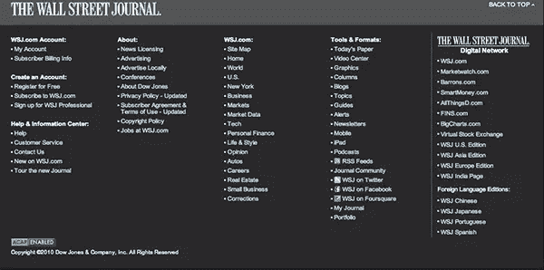
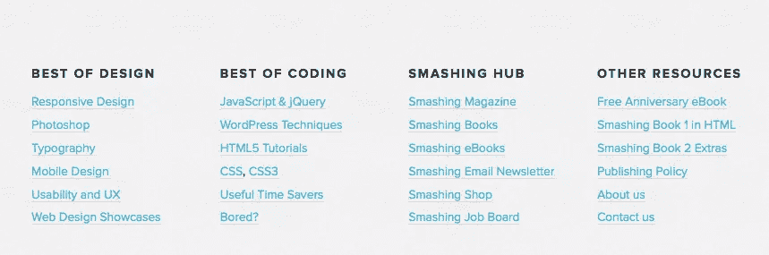
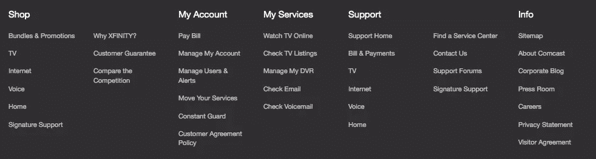
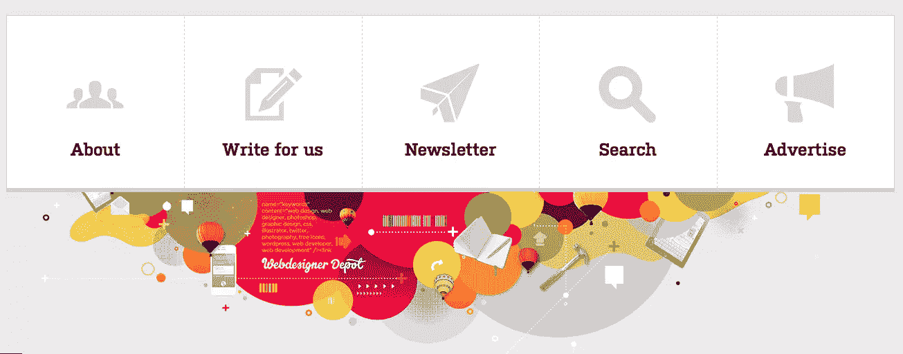
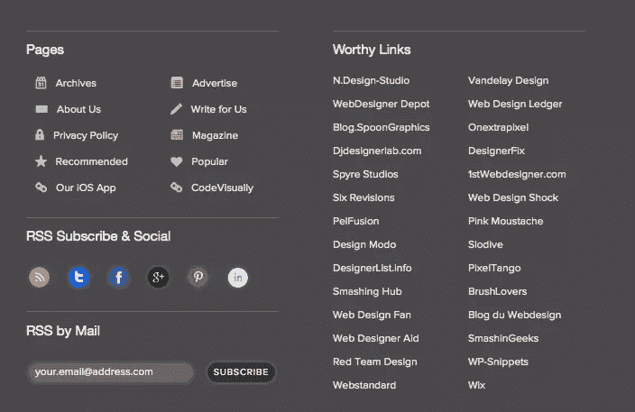
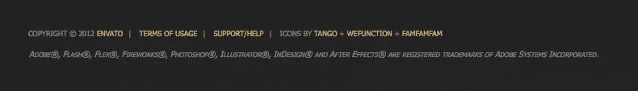

# 功能性页脚设计:普通页脚的 8 项改进

> 原文：<https://www.sitepoint.com/functional-footer-design-8-improvements-for-ordinary-footers/>

如果你是一个网页设计师或开发者，你知道网站的每个元素都有它自己的位置和目的。我们大多数人从上到下设计我们的网站，关注标题、侧边栏和主要内容。许多设计师专注于完善页面上方的一切，结果在这个过程中忽略了网站的页脚。很少有网站的页脚是真正为他们的目的而专门设计的，他们中的许多人最终都是在一个优秀的设计中的一般事后想法。下面是一些可行的设计方案，通过深思熟虑的选择来构建页脚。

### 页脚网站地图

有时候，即使是我们当中最优秀的人在浏览一个网站时也会迷路，尤其是一个有着不寻常或创新设计的网站。一个放置在页脚的网站地图是一个很好的方法来留住那些正在完成你的网页内容并考虑下一步上网的访问者。以简洁、有条理的方式提供你的所有内容是一个很好的方式来重新获得他们的兴趣并让他们留在你的网站上，没有比页脚更好的位置来实现这一点。不同的访问者会被不同的内容所吸引，但是你页脚的网站地图会吸引尽可能多的访问者，并且会增加你网站的浏览量和每个访问者的访问量。

网站地图页脚也可以创造机会在你网站的其他地方做出非正统或异想天开的设计选择。如果页脚包含一个详细的、实用的结构来显示你的所有内容，你就可以自由地让你的网站的其余部分具有高度的创造性，因为你知道你的网站的结构在每个页面的底部已经非常清晰了。

### 联系信息

在页脚放置网站的联系信息(电话号码、电子邮件地址和实际地址)已经是一种常见的做法，但这是一种很受欢迎的选择。遗漏你的联系信息会让那些想联系你的人感到沮丧，而丢失或难以找到的联系信息会让许多原本愉快的客户询问变得痛苦。你想给访问者一切可能的机会与你联系。没有什么比试图找到某人更令人沮丧的了，尤其是当他们在自己的网站上找不到联系方式的时候。

展示联系信息时，避免在电话号码中使用缩写或单词。虽然记住 1-800 和一两个单词真的很容易，但越来越多的人带着智能手机，对自己的记忆越来越少。

我需要联系我的有线电视/互联网提供商，他们有 1-800，他们的名字贴在他们的网站上。实际上，破译基于语义和单词的电话号码要比简单地读出它并以数字形式拨出要困难得多。打电话给问讯处，让他们给我转到有线电视公司更容易。寓意是，使用完整的数字电话号码，如果你通过邮件收款，确保包括你的实际地址。不要让你的网站访问者寻找你的信息。

### 提升重要链接

你的页眉可以将主题分成特定的类别，但是你也可以在你的网站页脚放置精心选择的重要链接。当用户到达一篇文章的底部时，他们可能会退出，但如果你在那里有一些感兴趣的东西，如推广，一篇独特的文章，新的信息等。页脚区再次作为你保持他们注意力的最后努力。不像网站地图，它不提供你的每一个页面，这使得更多的注意力集中在更少的内容选项上。

观察你的流量模式可以非常客观地告诉你这些链接中哪些是真正吸引人的。如果你用那些被证明是高度“可点击”的链接来替换那些不受欢迎的链接，那么只需几次迭代，你就可以得到一个非常有效的页脚。

### 组织您的链接

如果你在你的页脚放置了大量的内容链接(如果你选择呈现一个站点地图，这几乎是必然的)，一个最佳实践是将它们组织成相关的部分，并以列的形式呈现这些部分。例如，如果您有许多法律信息、隐私政策、披露或责任信息，您可以将它们单独放在一个栏中，并将其命名为“法律”或“条款”另一个例子是，你可能有一个“公司新闻”链接，“关于”页面，“就业”页面和“联系”页面。你可以把所有这些链接，按照重要性排列，放到一个标题为“关于<your company="" name="">”的栏目中。保持页脚有条理很重要，这样用户可以快速找到信息。而且，重要的是要考虑你自封的页脚和你的主导航之间的任何组织差异；类别、层次或其他组织方面的巨大差异可能会造成混乱。</your>

### 让它变漂亮

如果你只是有几个主要的链接，你想推广，你可以为你的页脚一个严重的审美机会。这是一个展示你伟大设计技巧的地方，你可以创建一个真正有风格的部分。使用大图标或迷人的设计。基本的设计原则，如[负空间](https://www.sitepoint.com/embracing-negative-space-in-your-designs-white-space-tips-to-consider-and-examples-to-admire/ "Embracing Negative Space in Your Designs: White Space Tips to Consider and Examples to Admire")和对比，真的可以迷住游客。把它和你的网站结合起来，这样可以突出网站的其他部分，给你的用户留下持久的印象。

### 获得互动

现在很常见的是在网站的页脚中看到链接，用户可以在那里与网站所有者或关注他们的其他人进行互动。许多网站，尤其是博客，会在他们网站的页脚放置一个他们有史以来最受欢迎的文章列表，以及最近的社交媒体更新。与其他页脚选项不同的是，这是一个很好的方式来为你的模板添加活力，同时还能让那些接近页面内容末尾的人更多地参与到你的公司或你的主题中。

### 在页脚放置学分和附属链接

你肯定不希望这些链接散布在你更重要的内容中。页脚是放置链接的最佳位置，如服务条款、版权、主机附属链接、合作伙伴、相关服务以及其他不直接宣传您公司的内容。这些很少比你的主要内容更有趣，但是如果这些链接必须是站点范围内的，页脚可能是你最好的选择。

### 包括搜索栏

也许你的用户没有找到他们要找的东西。如果他们没有，页脚是一个放置搜索栏的好地方，访问者可以在这里查找信息或者通过他们正在寻找的关键词或主题进行搜索。这是用户在去其他地方寻找他们想要的东西之前最后会去的地方，所以尽一切可能帮助他们在你的网站上找到他们想要的东西是很重要的。这也为用户提供了找到其他相关页面的机会，他们可以在那里找到相关信息或相关主题，增加浏览量，给你更多的机会将这次访问转化为销售。

如果您想知道页脚搜索栏是否按预期工作，可以考虑使用隐藏的表单字段、URL 变量或单独的表单“动作”,这样您就可以仔细地跟踪您的可搜索页脚为您节省了多少用户。

### 结论

你网站的页脚不一定要很无聊。它可以是一个充满活力的地方，为推广您的网站及其内容、您的产品、社交媒体页面等提供有价值的服务。这完全是关于用户体验的。吸引用户的注意力，让用户容易找到内容，并在您的网站上推广有趣的链接和信息。拥有一个优秀的页脚会增加浏览量，有助于提升你的网站和品牌。

你是如何设计页脚的？你在页脚提供网站地图吗？社交媒体链接怎么样？请在下面的评论中告诉我们你认为设计页脚的最佳方式。

## 分享这篇文章