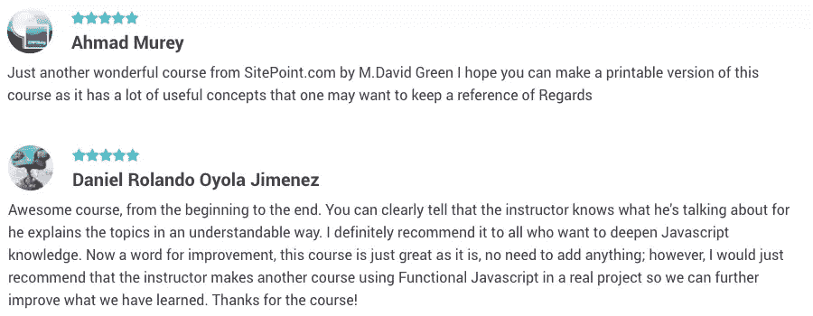

# 为懒惰的开发者(比如我)准备的函数式 JavaScript

> 原文：<https://www.sitepoint.com/functional-javascript-for-lazy-developers-like-me/>

 

## 函数式 JavaScript，懒人的补救措施

驱使我寻求编程技术知识的一个核心概念一直是我自己的懒惰。毕竟，当我第一次开始玩电脑时，吸引我的是它们可以为我做事情的想法。我所要做的就是坐下来告诉他们我想要什么。

但是我很快了解到计算机是非常字面上的。除非我用他们能理解的语言，明确无误地告诉他们我想要什么，否则他们很少会把我想的告诉我。由于懒惰，我不想付出任何不必要的努力来表达我的意图。

然后我看到 JavaScript 从几个必不可少的一行程序发展到大型复杂的面向对象应用程序，复杂性似乎没有尽头。

> 我开始寻找让编码更简单、更有趣的方法。这个搜索直接把我引向了函数式编程。

## 看待问题的新方法

我第一次接触函数式编程是在我还是一名高级前端工程师的时候，当时我在旧金山的一家小型初创公司工作。有一天，一个在公司研究小组内部辛勤工作的编程向导听到我抱怨我正在做的一些混乱的状态依赖代码，用花里胡哨的承诺把我引诱到一个会议室。在那里，他给我做了一个即兴的三个小时的 Haskell 介绍，这是一种经典的函数式编程语言，包括对函数式编程哲学的粗略解释。

当我看到变量消失，方法在不熟悉的类型签名下分裂和合并时，他用函子和单子的故事迷惑了我。当时这一切看起来像是奇怪的魔法，但他向我保证 JavaScript 也有功能性，它们会引领我走向救赎。

当我开始挖掘这个奇异的领域时，这个承诺让我坚持下去。我相信函数式编程技术可以为我提供更好的方法来分解问题，并在微小的、集中的片段中解决它。我很高兴有可能使我的代码更干净、更易移植、更易管理、更易读、更易维护。

一路上，我发现了 JavaScript 函数式编程的一些奇妙之处，今天我将深入探讨。

## 高阶函数

JavaScript 能够处理函数式编程技术的原因之一是它支持[高阶函数](https://www.sitepoint.com/higher-order-functions-javascript/)。在 JavaScript 中，函数被视为一等公民。这意味着一个函数可以将其他函数作为参数，并且可以返回一个函数作为结果。因为这是直接内置于 JavaScript 的基础，所以语法已经很熟悉了。

使用高阶函数是将您的代码视为一组独立的单任务组件的第一步，这些组件可以以不同的方式分解和组合，以解决不同的问题。可以很容易地编写一个函数来调用任何其他函数，只需将它传入，然后在执行过程中调用它，还可以选择返回一个新函数以便以后再次调用。因为函数是通过引用传递的，所以它们在闭包中携带它们的上下文，所以它们可以在被调用时存在的状态中操作，而不是依赖于外部状态的变化可能性。

## 没有副作用的纯功能

函数式编程也带来了一些关于函数应该如何编写的强烈观点。函数式编程中的纯函数是最理想的。纯函数不与任何存在于自身之外的变量相互作用。它们不会对没有在自己的作用域中定义的变量进行任何更改，并且除了作为参数传入的值之外，它们不依赖外部值。

当给定完全相同的一组输入时，纯函数总是返回相同的结果，这使得创建健壮和可靠的测试更加容易。这意味着，只要传递的参数相同，函数的结果就会保持不变。这还允许您进行一些优化，如记忆，通过将结果存储在函数内部的数组中，并在新输入进来时进行计算之前检查该数组，从而避免复杂的计算。

## 组成和分解

当你开始用纯函数构建你的程序时，你会发现你自己创建的模式将更多地与你如何使用简单的可互换部分构建复杂的操作有关。因为 JavaScript 能够利用高阶函数的优势，所以可以根据需要[组合](https://www.sitepoint.com/function-composition-building-blocks-for-maintainable-code/)一个小型的专注于特定任务的纯函数库来执行高度复杂的操作。

纯函数的另一个优点是它们执行一个任务并返回一个结果。通过仔细的命名，这些纯粹的函数变得几乎不言自明。你越是从独立的单任务函数中构建代码，你需要维护和记录的嵌套复杂度就越低。你的挑战变成了思考如何把你的问题分成小块，然后用合理的方式把它们组合在一起。

## 适应现有的 JavaScript

随着 JavaScript 从浏览器中简单的一行程序发展成为维护应用程序的复杂生态系统，语言的语法也在发展。在 ECMAScript 5 中，数组变成了函子，本机支持一个 [Map](https://www.sitepoint.com/map-reduce-functional-javascript/) 方法，用于在数组的每个元素上应用一个函数并返回一个新数组。数组现在也有了函数技术的原生方法，比如归约和[过滤](https://www.sitepoint.com/filtering-and-chaining-in-functional-javascript/)。

ECMAScript 2015 及更高版本中的新功能包括方便的[箭头函数](https://www.sitepoint.com/es6-arrow-functions-new-fat-concise-syntax-javascript/)，这使得使用匿名内联函数编写代码更加容易和直观。[析构](https://www.sitepoint.com/es6-destructuring-assignment/)和[扩展](https://www.sitepoint.com/lodash-features-replace-es6/)操作符也使得处理数组变得更加容易，这些数组在被调用时可能包含未知数量的元素。并且[生成器](https://www.sitepoint.com/ecmascript-2015-generators-and-iterators/)让我们可以原生访问[惰性评估](https://www.sitepoint.com/functional-programming-pure-functions/)的一些魔力，就像我们使用 Haskell 和 Ruby 的朋友多年来一直在做的那样。

最重要的是，我意识到功能技术只是解决问题的一种方式。JavaScript 提供了许多选择，在某些情况下，命令式或面向对象的方法更有意义。将函数式编程添加到我的技能清单中，只是扩大了我在遇到问题时看到的可能性的范围。这些天来，我并不坚持在我所有的 JavaScript 代码中使用函数式技术，但是我通常发现在一些函数式的代码中加入一些函数式的东西会让对每一个编程挑战的推理变得更容易理解。

## 学习函数式编程的新方法

当我开始应用功能性技术时，我看到我的程序、我的解决问题的技能以及我与同事们的关系都得到了改善。我的代码更干净，更自文档化，更易于维护和讨论。我做的工作越来越少，更享受这个过程。

最终，我想和我遇到的每一个人分享这种专注、实用的思维方式。因此，我开始为 SitePoint 撰写关于函数式 JavaScript 的文章，传递我多年前在那个小会议室里接触到的一些秘密。这些文章的流行让我在[开设了一门函数式 JavaScript](https://www.sitepoint.com/premium/courses/functional-javascript-programming-2922/?utm_source=sitepoint&utm_medium=article&utm_campaign=0095_functional_javascript_programming) 课程，我很兴奋地看到它在今年早些时候发布。令人高兴的是，我看到其他人急切地开始学习功能技术，并将它们应用到他们的开发实践中，并获得了积极的评价。

我希望你走出去，探索适合你和你的团队的不同编程技术。如果你对使用函数式技术的好处感到好奇，不要怀疑，而是尝试一下这门课程，并让我知道它如何影响你的代码、你的思维过程和你的职业关系。它不仅对我的工作，也对我的职业生涯产生了重大影响。我想你会发现将功能性问题解决添加到你的编程储备中不仅仅是懒惰，**它也是*高效和有趣的。***

### 函数式 JavaScript 编程值得吗？

成为一名了解函数式代码和命令式代码区别的开发人员。

成为一名能够在面向对象编程和函数式编程之间切换的开发人员。

认识到什么时候使用一种技术比另一种技术更好。

下面我用我的[函数式编程课程](https://www.sitepoint.com/premium/courses/functional-javascript-programming-2922/?utm_source=sitepoint&utm_medium=article&utm_campaign=0095_functional_javascript_programming)给大家展示一下。向开发工具带添加递归、组合、映射等功能，使代码更容易阅读，减少重复。

1.  什么是函数式编程？
2.  使用递归
3.  理解携带
4.  映射、减少和过滤
5.  功能成分
6.  我们学到了什么

## 分享这篇文章