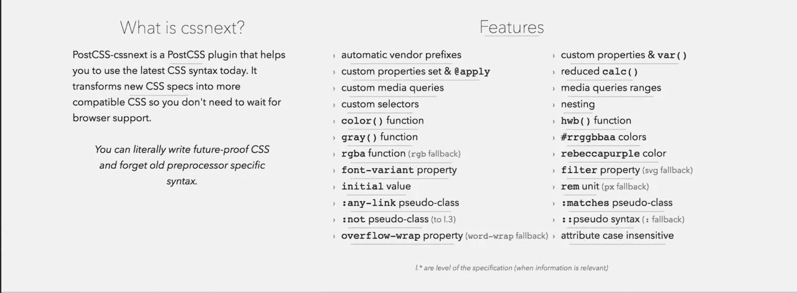

# 从 PostCSS-cssnext 开始了解未来的 CSS

> 原文：<https://www.sitepoint.com/future-css-with-postcss-cssnext/>


要了解 CSS 属性以及如何正确应用它们，请查看我们的 [AtoZ: CSS](https://www.sitepoint.com/premium/courses/atoz-css-2944) 课程，这是 CSS 的完整指南，由前端开发专家和大会伦敦教师盖伊·劳特利奇(Guy Routledge)撰写。


今年早些时候，SitePoint 出版的“7 个 PostCSS 插件让你轻松进入 PostCSS”中出现了一个关于 PostCSS-cssnext 的讨论。PostCSS-cssnext 是一个用于编写下一代 CSS 的插件包。本文提供了对该项目的历史及其好处的深入了解。一旦我们对 PostCSS-cssnext 有了更深的理解，我们将会跳到一些例子中供你使用。到本文结束时，您将对 PostCSS-cssnext 的未来 CSS 语法了如指掌，并能够决定它是否是您希望在即将到来的(或现有的)项目中使用的东西！

## 对下一代 CSS 的需求

不管使用什么语言，开发人员总是追求最新的特性。像 [Babel](https://babeljs.io/) 这样的工具为 JavaScript 开发者提供了对未来 ECMAScript 特性的支持，而 PostCSS-cssnext 为 web 设计者提供了未来的 CSS 特性。目前，这意味着提供对 CSS4 相关特性的支持，比如 [CSS 变量](https://drafts.csswg.org/css-variables/)，嵌套等等！现在，在我们进一步讨论之前，我想指出一个事实，即未来的 CSS 特性可能会发生变化，CSS4 规范在这方面也不例外。尽管如此，PostCSS-cssnext 通过提前通知用户将要发生的任何变化，减轻了这可能对项目产生的负面影响。



## 从 cssnext 到`PostCSS-cssnext`

最初，“cssnext”的意思是执行诸如缩小代码和显示错误消息的任务。这些功能很有帮助，但是它们不支持未来的 CSS 特性，而这正是 PostCSS-cssnext 项目的最终目标。因此，cssnext 团队决定放弃将 cssnext 作为独立工具的想法，理由是花在支持它上的时间可以更好地用于支持未来的 CSS 语法及其任何后续变化。对于其他与 CSS 相关的流程，开发人员可以将 PostCSS-cssnext 与其他技术集成，如用于代码缩减的 [cssnano](http://cssnano.co/) 和用于错误报告的 [postcss-browser-reporter](https://github.com/postcss/postcss-browser-reporter) 。

## 剖析 PostCSS-cssnext

如果我们深入研究 GitHub 上的 [PostCSS-cssnext 存储库，我们可以看到这个插件是多么模块化。在](https://github.com/MoOx/postcss-cssnext) [src/features.js](https://github.com/MoOx/postcss-cssnext/blob/master/src/features.js) 文件中，我们将看到每个未来 CSS 特性的代码都包含在根据相关 CSS 规范命名的模块中。

```
// https://npmjs.com/package/postcss-custom-properties
customProperties: (options) => require("postcss-custom-properties")(options),

// https://npmjs.com/package/postcss-apply
applyRule: (options) => require("postcss-apply")(options),

// https://npmjs.com/package/postcss-calc
calc: (options) => require("postcss-calc")(options),
```

因为是插件包，PostCSS-cssnext 是和 PostCSS 插件捆绑在一起的。这意味着如果我们愿意，我们可以单独安装这些特性，尽管使用 PostCSS-cssnext 意味着我们不必这样做！例如，如果我们只想使用 [CSS 自定义属性](https://drafts.csswg.org/css-variables/)，我们可以像这样通过`npm`安装它:

```
npm install postcss-custom-properties --save-dev
```

要获得 PostCSS-cssnext 支持的所有 CSS 特性的完整列表，请访问 PostCSS-cssnext 网站上的[专用特性页面](http://cssnext.io/features/)。

我们还应该注意到，PostCSS-cssnext 捆绑了 [autoprefixer](https://github.com/postcss/autoprefixer) 和 [pixrem](https://github.com/robwierzbowski/node-pixrem) 。如果您不熟悉这些工具，也不用担心。它们是用于创建跨浏览器兼容 CSS 的后处理器，我们很快就会知道它们是如何工作的。

## 下一个例子

现在我们已经详细了解了 PostCSS，让我们深入一些例子吧！

### 通过`var()`使用自定义属性

自定义属性是最流行的 CSS 特性之一。需要注意的是**所有的自定义属性都被限制在`:root`选择器**中。

```
:root {
  --fontSize: 2em;
}
```

一旦定义好，我们就可以在 CSS 中使用`var()`。除了`root`选择器，我们应该注意在命名定制属性时破折号、`--`的使用。这确保了我们的代码符合 w3c 规范。

参见 [CodePen](http://codepen.io) 上 SitePoint ( [@SitePoint](http://codepen.io/SitePoint) )的笔 [postcss-cssnext 自定义属性](http://codepen.io/SitePoint/pen/edqmbE/)。