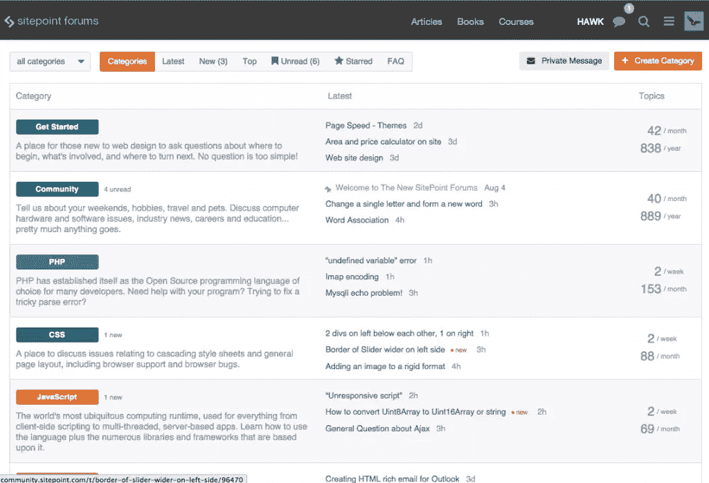
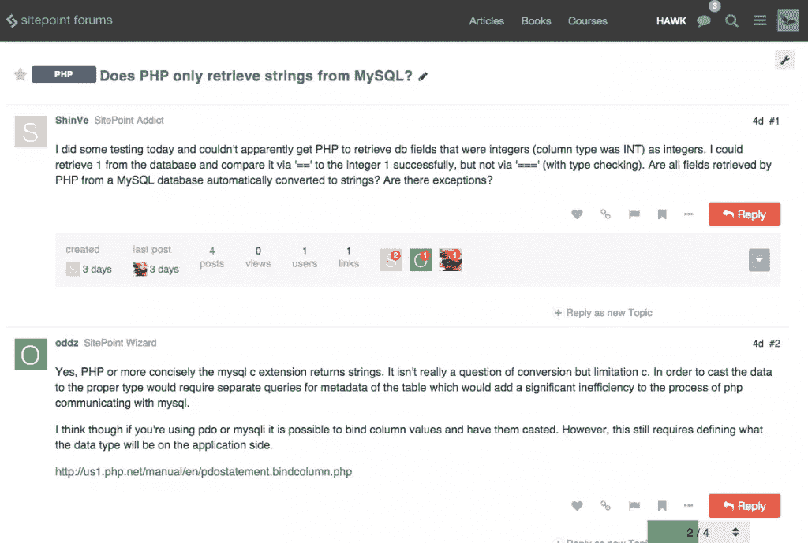

# 刚刚发布:新的站点论坛

> 原文：<https://www.sitepoint.com/future-new-sitepoint-forums/>

经过九个月的努力工作(和大量的焦虑)，我们有了一个新宝宝。自一月份以来，我们一直在努力准备将我们的论坛从 vBulletin 迁移到话语平台上。是时候按下开关了，像任何新父母一样，我对整件事有点兴奋过度！

做出这一决定背后有许多原因，如果你感兴趣，你可以[在这里](https://www.sitepoint.com/sitepoint-moves-to-discourse/ "SitePoint moves to Discourse")详细阅读这些原因。从技术角度来看，SitePoint 和 Discourse 是天作之合。它是一个开源的 JavaScript 应用程序，使用 Ember.js 框架，运行在 Rails 服务器端。我们是 Rails 之家，这意味着我们有资源来维护和定制软件，以便它为我们工作。从社区的角度来看，话语是一个聪明的选择。它通过为社区成员提供工具来赋予他们权力，使他们能够影响他们所看到的内容。

话语是一个令人兴奋的新论坛前沿，而 SitePoint on Discourse 是一个真正美丽的东西。

我知道设计是主观的(每个人都认为自己的宝宝很漂亮)，对于喜欢我们新外观的每个人来说，可能会有人不太喜欢它。这绝对没问题，我对你的反馈很感兴趣，但请让它有建设性。[这里有一个反馈线程](https://community.sitepoint.com/t/feedback-about-sitepoint-on-discourse/742 "Feedback thread on Discourse")。

## 那么…我该如何接近这美丽的东西呢？

好问题。你可以在这里找到新的论坛。如果你在过去 5 年里一直活跃在我们的 vBulletin 论坛，那么我们已经迁移了你现有的用户帐户。如果您的电子邮件地址在 vBulletin 中是最新的，您现在应该已经收到了我们发来的电子邮件，其中说明了如何登录和重置您的密码。如果你在这个过程中有任何问题，给 forums@sitepoint.com[发电子邮件，我们会解决的。](mailto:forums@sitepoint.com "Support email address")

如果您一直很活跃，但没有收到我们的电子邮件(并且您已经检查了您的垃圾邮件文件夹)，可能是我们给你的电子邮件地址有误。在这种情况下，你有几个选择。您可以尝试使用现有的 vBulletin 用户名登录 Discourse，并请求更改密码。如果不起作用，你可以联系 forums@sitepoint.com 寻求帮助。

如果你已经超过 5 年没有活动了，或者是我们社区的新成员，请随时注册一个新帐户加入讨论。

请注意，如果您在已经有一个帐户的情况下注册了一个新帐户，任何迁移的帖子都将与您的旧帐户保持关联。

## 为什么我的旧用户名不能用了？

Discourse 对用户名有比 vBulletin 更严格的规则，这意味着一些用户名可能在迁移中被更改。如果你认为你的用户名可能受到了影响，你可以[在这里](https://community.sitepoint.com/t/discourse-username-rules/980 "Username rules on Discourse")阅读更多关于新用户名规则的信息。如果您的用户名不符合这些规则，它可能已经被删除了一些字符，或者根本没有被迁移。如果你需要帮助找到你的新账户，请联系 forums@sitepoint.com 的 T2。

## 哇哦。这看起来真的不一样。它是如何工作的？

有许多有用的文档可以帮助你开始。你可以在话语欢迎横幅中找到它们的链接(一旦你熟悉周围的路，你可以关闭它)。

*   常见问题文档概述了我们的发布指南和规则，可以在论坛顶部的次级导航栏中找到。
*   [类别图](https://community.sitepoint.com/t/help-where-should-i-post-my-topic/794 "Category map")解释了在哪里可以找到和发布不同的主题以及应用哪些标签。
*   方便的[话语备忘单](https://community.sitepoint.com/t/discourse-cheat-sheet/733 "Discourse Cheat Sheet")解释了如何让你明白如何以话语的方式做事。
*   最后，这里是对信任等级的解释，信任等级是谈话体验的核心部分。请注意，无论您是否有一个迁移的帐户，或者您是否打开了一个新帐户，您都将从信任级别 0 开始(这样您就可以了解诀窍)。不用多久就能升职。

## 我在哪里可以找到一个真正的人来帮助我？

以下链接将带您到员工页面，在那里您可以看到谁当前在线。点击一个名字会把你带到那个人的个人资料页面，在那里你会发现一个大大的红色私人信息按钮。任何工作人员都可以帮助你，或者至少给你指出正确的方向。

[管理员](https://community.sitepoint.com/groups/Administrators/members "Administrators")(可以帮助你处理用户名更改等技术问题的人)。
[团队领导](https://community.sitepoint.com/groups/TeamLeaders/members "Team Leaders")(高级版主)。
[顾问](https://community.sitepoint.com/groups/Advisors/members "Advisors")(可以给你建议，让你的话题移动的版主)。
[导师](https://community.sitepoint.com/groups/Mentors/members "Mentors")(超级乐于助人的人，可以帮你找到路，但不能执行适度的任务)。

## 要学习的一些新术语

一些事物在话语中有了新的名称，用这些术语开始思考是很方便的。在 vBulletin 中，我们过去称之为论坛或分论坛，现在被称为**类别**。
我们过去在 vBulletin 中称线程为**主题**。

## 需要注意一些重要的事情

### 展示和工作类别

全新的 **[展示区](https://community.sitepoint.com/t/about-the-showcase-category/194 "Showcase category")** 是一个你可以尽情自我推销的地方，前提是你已经存在了足够长的时间，向我们表明你真的想成为社区的一部分——这是基于新的[信任级别](https://community.sitepoint.com/t/documentation-an-explanation-of-trust-levels/724 "Trust levels")。

然后是新的 **[岗位](https://community.sitepoint.com/t/about-the-jobs-category/706 "Jobs category")** 类别。自从我们取消了 SitePoint Marketplace 之后，你就再也找不到合适的人来帮你构建脚本或插件了，所以我们给你一个发布帮助广告的地方来纠正这种情况。(请注意，您不能宣传您提供的服务，只能宣传您的需求)。

### 我如何设置我的签名？

你不知道。你们中的许多人会对此感到恼火，有些人会想就此展开辩论。这没有商量的余地。话语不支持签名，我们对此很满意。你可以做的是定制你的个人资料页面，显示一个链接到你的网站。为此，点击屏幕右上角的头像，从下拉菜单中选择个人资料，然后点击首选项按钮。

### 喜欢和标志

关于话语，我最喜欢的一点是它给你多少控制力来影响社区中的行为。

当您看到您喜欢的帖子时，请单击此处。

如果您看到不喜欢的帖子，请点击此处。

话语会处理好剩下的事情。你可以[在这里](https://www.sitepoint.com/sitepoint-moves-to-discourse/ "Discourse announcement")阅读更多关于喜欢和标记的信息。

所以你有它。全新闪亮的 SitePoint 论坛生机勃勃。

你还在等什么？

## 分享这篇文章