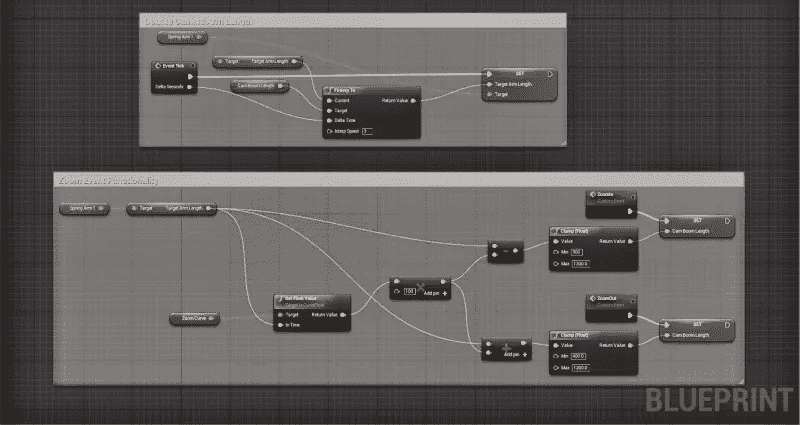
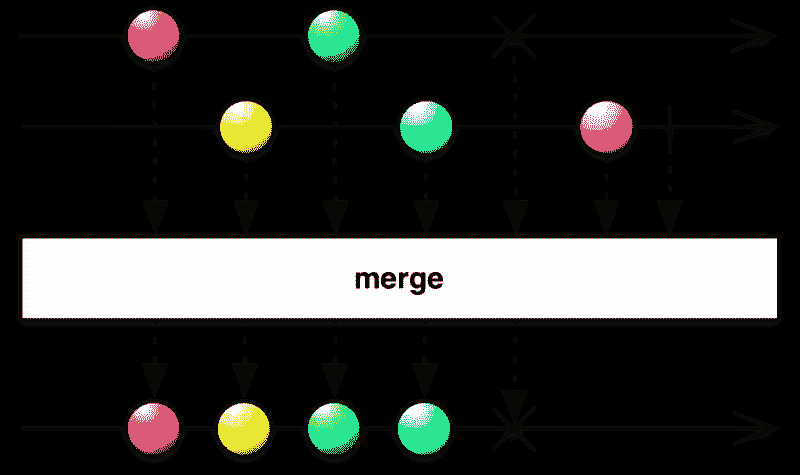
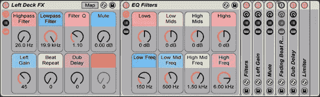
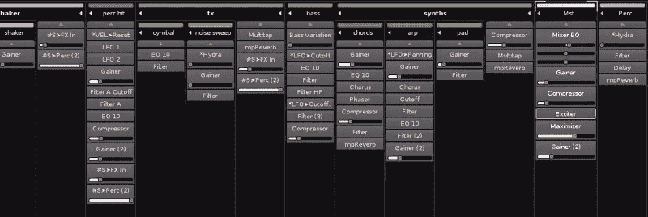
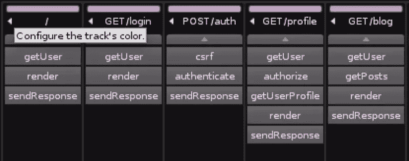
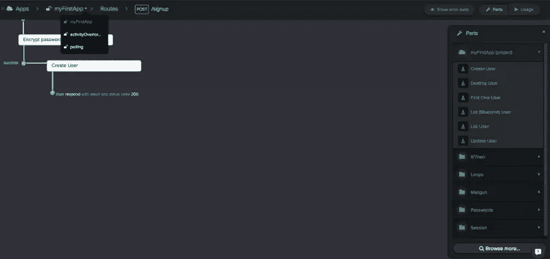

# 编程的未来:web assembly & JavaScript 之后的生活

> 原文：<https://www.sitepoint.com/future-programming-webassembly-life-after-javascript/>

最近我们听说 web 平台正在获得一个新的浏览器原生编译目标，称为 WebAssembly(参见[什么是 WebAssembly:新时代的黎明](https://medium.com/javascript-scene/what-is-webassembly-the-dawn-of-a-new-era-61256ec5a8f6)了解详情)。Wasm 使 web 平台成为对其他语言更有吸引力的编译目标。这让我们想知道 JavaScript 之后会发生什么。

JavaScript 有一些很棒的特性，但是我真诚地希望我们尽快继续。JavaScript 很棒，它教会了我们很多东西，但是编程是会进化的。JavaScript 之后会有生活。

我不是 C++的粉丝(我是 C++的恢复用户和滥用者)，但我是用它构建的许多东西的粉丝，包括 Unreal 引擎，它在编译成 JavaScript 时运行很棒。没有理由永远用 JavaScript 写所有的东西。是时候展望未来了。

我一直在使用 CoffeeScript，并且非常喜欢它，它帮助激发了 ES6 的许多新特性。CoffeeScript 感觉比 JavaScript 简单多了。它有更简洁的语法，但是增加了很多 ES5 中没有的表达能力。当然，我会通过去掉有毒的 class 关键字来进一步简化 CoffeeScript。我也喜欢摆弄哈斯克尔。但是这些语言代表了现在。

那么接下来我们能做什么呢？

无论 JS 之后火了什么，我希望它有这些特点:

*   内置[不可变数据结构](http://clojure.org/data_structures)和[默认不变性](https://medium.com/javascript-scene/the-dao-of-immutability-9f91a70c88cd)。
*   对象、集合和基本类型的文字形式。
*   [更好的默认数字类型](http://dec64.com/)适用于大多数用例。
*   定制的[结构类型](https://en.wikipedia.org/wiki/Structural_type_system)，包括对低级二进制类型的良好支持(如果我们得到可定义的文字语法，这是额外的收获)。
*   带封口的兰姆达斯。
*   内置多功能腰带。类似于 [RxJS 可观察 API](https://github.com/Reactive-Extensions/RxJS/blob/master/doc/api/core/observable.md) 。
*   对对象和工厂组合的本机支持。类似[内置图章](http://chimera.labs.oreilly.com/books/1234000000262/ch03.html#prototypal_inheritance_with_stamps)的东西。
*   实时保证游戏、音乐和视频制作、DSP、科学应用、分布式系统同步等应用的低延迟处理和精确调度
*   最小语法，类似于 Ruby、Python 或 CoffeeScript。既然我已经有机会不用到处都是花括号和分号，我觉得受语法的限制少了很多。

## 对反应式编程的一流支持

在语言中融入了一个简单、一致的 API，围绕所有这些:

*   溪流。
*   连续的数据源(UI 输入、时间、矢量图像等等)。
*   包括数组和对象的集合。

无论数据流是一次一个值地流过函数(即 iterables / generators + yield)、响应发出的事件(例如节点样式的流)还是连续的数据源(例如音频、电信号、UI 输入、传感器，甚至是矢量图形等与时间无关的东西),都应该以相同的方式使用该 API。

像这样的内置 API 可以包装所有类型，这也有可能简化语法。

要获得关于所有这些反应性物质如何工作的真正有见地的观点，请查看[反应性的一般理论](https://github.com/kriskowal/gtor/blob/master/README.md)。

## 更好的工具


*虚幻引擎 4 蓝图*

*   **一个奇妙的[可视化 IDE](https://www.youtube.com/watch?v=IKAcrNHENC8)** 用于轻松建模和可视化系统中的反应关系。想想[诺弗洛](http://noflojs.org/)和一个好得多的 UX。
*   **[时间旅行调试](http://debug.elm-lang.org/)**(JavaScript 的[例子)由不可变的数据结构启用。时间旅行调试让您可以轻松地在实时运行的程序历史中来回穿梭。](https://www.youtube.com/watch?v=Fo86aiBoomE)
*   **编译成 JS & wasm** 极大的支持浏览器和节点。
*   **更好的静态和运行时/动态分析工具**。专为帮助**通过分析反应依赖图使程序更可预测**而设计。这些**也可以创建伟大的可视化报告**，包括*复杂性报告、*和*大理石图*来帮助你进一步理解和预测你的程序的行为。


*大理石图为`.merge()`*

## 可视化 ide 将成为标准

那些熟悉基于流/数据流编程的人会正确地告诉你这并不新鲜。可视化编程工具已经存在了几十年，迄今为止还无法取代基于文本的编程。

将这推向边缘的是对如何可视化建模程序的彻底反思，这将减少困扰大多数基于流的编程解决方案的可视化混乱和布线开销。

这个领域的大多数创新根本没有发生在编程环境中。相反，它发生在以数据流建模为主要任务的生产应用程序中。这一点在音频制作应用中得到了最好的体现。

音频制作应用程序通常通过效果处理器网络发送原始音频。用编程术语来说，您可以将效果处理器想象成一个功能图:一个为列表中的每个元素调用的纯函数，其中这些元素对应于一个音频样本切片。

大多数音频应用程序通过以 skeuomorphic 方式模拟真实的机器和电缆来可视化地模拟这一过程。仿形用户界面是一种试图模拟软件中建模的原始对象的用户界面的界面。

skeuomorphic 设计的问题是它忠实地再现了最初的用户界面的混乱和低效。在音频制作等数据密集型应用中，这种混乱对程序员来说非常熟悉:电线看起来有点像意大利面条——所有优秀的开发人员都知道我们应该避免这种情况。


*【巴亚雷姆·莫拉米特—乔治·p·麦克林— (CC BY-SA 2.0)*

但是最近，像 Ableton Live 和 Renoise 这样的软件已经找到了巧妙的方法，通过使用频道和链来完全摆脱杂乱的电线。


*安博顿现场特效频道。数据从左向右流动。*

换句话说，数据通过通道流动，每个通道由一系列效果组成。不需要线，因为效果是按顺序应用的。


*Renoise 通道，每个都有一个效果链。数据自上而下流动。*

在代码中，通道可能看起来像这样:

```
const channel = input => {  
  return input  
  .filter()  
  .gain()  
  .limit();  
};

export default channel;
```

如果你仔细思考这个问题，你会发现，利用这个模型，你能做的不仅仅是音频和数字信号处理(DSP)。例如，您可以使用它在 Express 中可视化地建模路由和中间件，其中路由由通道表示，中间件由效果表示:


*一个假想的受 Renoise 启发的 UI 来规划路线。*

当然，这意味着链中的每个效果都需要用一个共享的 API 作用于输入。这就是函数式和反应式编程概念的闪光之处。很容易为任何类型的集合提供统一的 API，包括网络请求流。在函数式编程中，这些包装 API 被称为**函子**。简单地说，函子是可以映射的**。**

如果这听起来有点像科幻小说，看一看[树线](https://treeline.io/)。它今天做着非常相似的事情。看看这条用 Treeline 建模的`POST /signup`路线。它加密用户的密码，然后创建用户模型，然后用 status `200 OK`进行响应。这些步骤中的每一步都可以被认为是通道效应:


*树线:数据自上而下流动。*

## 遗传表演程序

遗传编程是通过产生候选程序群体并过滤掉没有通过测试的程序来模拟自然进化系统的过程。通过测试的候选人存活下来并成为下一代的基础。

遗传编程提供了对热门代码和关键算法进行持续、自动改进的可能性。将遗传编程算法指向 git 存储库，并在群体改进之前部署的版本时自动将新一代软件推向生产，这是真正的潜力。

## 人工智能辅助编程


*斯科特·英格拉姆—双神经元(CC BY-NC 2.0)*

强 AI 今天来了。许多人工智能系统正在各种类别的游戏中击败人类。人工智能的一个主要优势是它能够非常快速地分析大量的备选方案。人工智能可以检查你编写的代码，搜索潜在的错误和漏洞，识别可以抽象的模式，建议需要编写的测试，甚至识别遗传编程群体中的模式，并自动调整群体和环境参数，以微调遗传编程算法。

换句话说，从长远来看，人工智能很有可能成为一个无价的编程工具。事实上，很容易想象未来人工智能可以在完全没有任何人类协助的情况下编写程序。

## 结论

不管接下来会发生什么，期待它是技术和创新的一次巨大飞跃。未来会比你想象的更快到来。

## 分享这篇文章