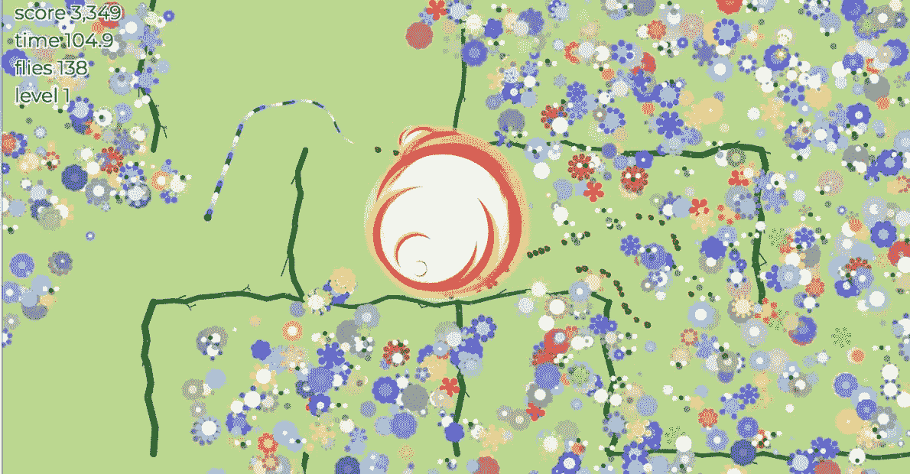
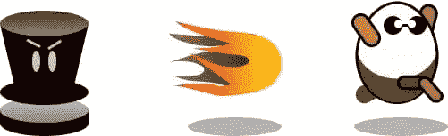
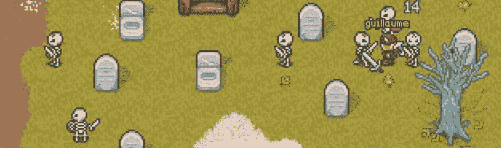
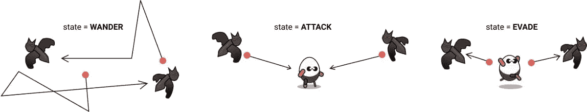

# 游戏 AI:机器人反击了！

> 原文：<https://www.sitepoint.com/game-ai-the-bots-strike-back/>

以下是从我们的新书《HTML5 游戏:从新手到忍者》中摘录的一小段，作者是厄尔·卡斯尔丁。SitePoint Premium 会员可以获得这本书，你也可以在世界各地的书店买到。你可以在这里查看第一章的免费样本。

我们现在有了所有的工具来创造奇妙的细节世界去探索和居住。不幸的是，我们的共同居民还没有证明自己是非常值得的对手。他们是愚蠢的:他们没有情感，没有思想，没有活力。我们可以通过图形、动画以及最重要的人工智能(AI)来灌输这些特征。

人工智能是一个庞大且极其复杂的领域。幸运的是，我们可以得到令人印象深刻的结果，即使有更多的*人工*而不是*智能*。几条简单的规则(结合我们的老朋友`Math.random`)可以给人一种关于意图和思想的过得去的错觉。只要它支持我们的游戏机制，并且有趣，它就不必过于现实。

像碰撞检测一样，人工智能通常在不太好的时候是最好的。电脑对手是超人。他们有全知全能的天赋，可以理解世界上每一个时间点的全部状态。可怜的老*人类*玩家只能看到屏幕上可见的东西。他们通常不是电脑的对手。

但是我们不让他们知道！他们会感觉不好，质疑人类的未来，不想玩我们的游戏。作为游戏设计师，我们的工作是平衡和控制我们游戏的流程，使它们总是公平的，有挑战性的，给玩家带来惊喜。

### 有意运动

选择精灵在游戏中的移动方式非常有趣。功能是你的空白画布，你可以像上帝一样控制你的实体。这有什么不好的！

一个实体移动的方式是由我们在每一帧中改变它的`x`和`y`位置的程度决定的(“把所有东西移动一点点！”).到目前为止，我们与`pos.x += speed * dt`的合作基本上是直线的。增加速度(乘以增量)会使精灵向右移动。减法将其向左移动。改变`y`坐标可以上下移动它。

为了让直线更有趣，注入一点三角学。使用`pos.y += Math.sin(t * 10) * 200 * dt`，精灵通过正弦波上下跳动。`t * 10`是波的频率。`t`是我们更新系统的时间，以秒为单位，所以它总是线性增加。给`Math.sin`一个平滑的正弦波。改变乘数会改变频率:数字越小，振荡越快。`200`是波浪的*振幅*。

你可以结合波得到更有趣的结果。假设你在 y 位置:`pos.y += Math.sin(t * 11) * 200 * dt`加了*另一个*正弦波。它的*几乎和第一个*一模一样，但是频率变化很小。现在，当两个波在同相和异相漂移时相互加强和抵消，实体上下跳动的速度越来越快。大幅改变频率和振幅可以产生一些有趣的弹跳模式。用`Math.cos`改变`x`的位置，你就有圆圈了。

重要的一点是，动作可以被*组合*以做出看起来更复杂的行为。他们可以间歇性地移动，他们可以懒洋洋地漂移。在本章中，他们可以直接冲向玩家，或者直接逃跑。他们将能够穿越迷宫。当你把这些技能结合起来(一个上下摆动的动作和一个冲锋队员一起使用)，或者按顺序排列(逃跑两秒钟，然后上下摆动一秒钟)，它们可以被雕刻成非常逼真的生物。

### 航点

我们需要刺激这些冷漠的幽灵和蝙蝠，给他们一些活下去的理由。我们将从“路点”的概念开始。**路点**是实体将要移动的里程碑或中间目标位置。一旦他们到达这个航路点，他们就继续前进，直到他们到达目的地。一组精心设置的路点可以为游戏角色提供目的感，并可以在关卡设计中发挥巨大作用。



为了让我们能够专注于路点背后的概念，我们将引入一个飞行的坏蛋，他不受迷宫墙壁的约束。最可怕的飞行敌人是蚊子(它是世界上最致命的动物，仅次于人类)。但不是很*阴森森的*。我们选“蝙蝠”。

蝙蝠不会是复杂的野兽；他们是不可预测的。他们只会飞向一个单一的航路点。当他们到达那里，他们会选择一个新的路点。稍后(当我们穿越一个迷宫时)我们将讨论拥有多个结构化的路点。现在，蝙蝠从一个地方飘到另一个地方，通常对玩家来说是个麻烦。

要创建它们，在`entities/Bat.js`中基于一个叫做`Bat`的`TileSprite`创建一个新实体。蝙蝠需要一些智慧来选择它们想要的路点。这可能是一个在屏幕上任意选择一个位置的功能，但为了让它们更强大一点，我们会给它们`findFreeSpot`功能，这样航路点将始终是玩家可能正在旅行的*可步行*区块:

```
const bats = this.add(new Container());
for (let i = 0; i < 5; i++) {
  bats.add(new Bat(() => map.findFreeSpot()))
} 
```

我们为蝙蝠设计了一个新的`Container`，并且我们创造了五个新的。每个人都有一个参考我们的路点选择功能。当被调用时，它运行`map.findFreeSpot`并在迷宫中找到一个空的单元格。这成为蝙蝠的新航路点:

```
class Bat extends TileSprite {
  constructor(findWaypoint) {
    super(texture, 48, 48);
    this.findWaypoint = findWaypoint;
    this.waypoint = findWaypoint();
    ...
  }
} 
```

在`Bat.js`中，我们指定一个初始目标位置，然后在蝙蝠的`update`方法中，我们向它移动。一旦我们足够接近，我们选择另一个位置作为下一个航点:

```
// Move in the direction of the path
const xo = waypoint.x - pos.x;
const yo = waypoint.y - pos.y;
const step = speed * dt;
const xIsClose = Math.abs(xo) <= step;
const yIsClose = Math.abs(yo) <= step; 
```

我们如何“走向”某物，我们如何知道我们是否“足够接近”？要回答这两个问题，我们首先要找出航路点位置和球棒之间的区别。从蝙蝠的位置中减去航路点的`x`和`y`值，我们就得到每个轴上的距离。对于每个轴，我们定义“足够接近”来表示`Math.abs(distance) <= step`。使用`step`(基于`speed`)意味着我们行进得越快，我们就需要离得越近(这样我们就不会永远超调)。

注意:取距离的绝对值，因为如果我们在路点的另一边，它可能是负值。我们不在乎方向，只在乎距离。

```
if (!xIsClose) {
  pos.x += speed * (xo > 0 ? 1 : -1) * dt;
}
if (!yIsClose) {
  pos.y += speed * (yo > 0 ? 1 : -1) * dt;
} 
```

为了向航路点的方向移动，我们将运动分成两个部分。如果我们在`x`或`y`两个方向都不太近，我们将实体向航路点移动。如果幽灵在航路点(`y > 0`)上方，我们将它向下移动，否则我们将它向上移动——对于`x`轴也是如此。这并没有给我们一条直线(当我们开始向玩家射击时会出现)，但它确实让我们每一帧都更接近航路点。

```
if (xIsClose && yIsClose) {
  // New way point
  this.waypoint = this.findWaypoint();
} 
```

最后，如果水平和垂直距离足够近，蝙蝠已经到达目的地，我们将`this.waypoint`重新分配到一个新的位置。现在蝙蝠无意识地在大厅里游荡，就像我们可能期望的那样。

这是一个非常简单的航路点系统。一般来说，你会想要一个构成完整路径的点的列表。当实体到达第一个路点时，它会从列表中被删除，下一个路点会取代它的位置。当我们很快遇到路径查找时，我们将做一些非常类似的事情。

### 向目标移动和射击

回想一下我们第三章的第一次枪战。坏人只是从右往左飞，关心他们自己的事情——而我们，玩家，则消灭那些无脑的僵尸飞行员。从游戏角度来看，为了公平竞争，让事情变得更有趣，我们的敌人至少应该能够向我们发射炮弹。这给了玩家在屏幕上移动的动机，以及摧毁原本相当平静的实体的动机。突然间我们又成了英雄。

向坏人提供玩家的位置是非常容易的:这只是`player.pos`！但是，我们如何利用这些信息让事物朝着一个特定的方向飞奔呢？答案当然是三角学！

```
function angle (a, b) {
  const dx = a.x - b.x;
  const dy = a.y - b.y;
  const angle = Math.atan2(dy, dx);

  return angle;
} 
```

注意:在这一章中，我们将看到几个三角函数来实现我们的直接目标“更好的坏人”——但我们不会真正探究它们是如何工作的。这是下一章的主题…所以如果你对数学有点生疏，你可以暂时放松一下。

以同样的方式我们实现了`math.distance`，我们首先需要获得两个点(`dx`和`dy`)之间的*差*，然后我们使用内置的反正切数学运算符`Math.atan2`来获得两个向量之间创建的角度。注意，`atan2`将`y`差值作为第一个参数，将`x`作为第二个参数。在`utils/math.js`上增加`angle`功能。

在我们游戏的大部分时间里，我们会寻找两个*实体*之间的角度(而不是点)。所以我们通常对实体的*中心*之间的角度感兴趣，而不是由`pos`定义的它们的左上角。我们还可以给`utils/entity.js`添加一个角度函数，它首先找到两个实体的中心，然后*调用`math.angle`:*

```
function angle(a, b) {
  return math.angle(center(a), center(b));
} 
```

`angle`函数返回两个位置之间的角度，以弧度为单位。使用*这一*信息，我们现在可以计算我们必须修改实体的`x`和`y`位置以朝着正确的方向移动的金额:

```
const angleToPlayer = entity.angle(player.pos, baddie.pos);
pos.x += Math.cos(angle) * speed * dt;
pos.y += Math.sin(angle) * speed * dt; 
```

要在游戏中使用角度，请记住，角度的余弦值是在角度方向上移动一个像素时，您需要沿`x`轴移动的距离。角度的正弦值就是你需要沿着`y`轴移动多远。乘以一个标量(`speed`)数量的像素，精灵在正确的方向上移动。

在游戏开发中，知道两个事物之间的角度是非常重要的。记住这个等式，因为你会经常用到它。例如，我们现在可以直接用*射击*的东西——让我们开始吧！创建一个`Bullet.js`精灵作为抛射体:

```
class Bullet extends Sprite {
  constructor(dir, speed = 100) {
    super(texture);
    this.speed = speed;
    this.dir = dir;
    this.life = 3;
  }
} 
```

一个`Bullet`将是一个小精灵，创建时带有一个位置、一个速度(速度和方向)和一个“生命”(默认为三秒)。当生命到达 0 时，子弹将被设置为`dead` …我们不会以数百万颗子弹飞向无穷大而告终(就像第三章中的子弹一样)。

```
update(dt) {
  const { pos, speed, dir } = this;

  // Move in the direction of the path
  pos.x += speed * dt * dir.x;
  pos.y += speed * dt * dir.y;

  if ((this.life -= dt) < 0) {
    this.dead = true;
  }
} 
```

与第 3 章中的项目符号不同的是，它们现在按照实例化时给出的方向移动。因为`x`和`y`将代表两个实体之间的角度，子弹将沿着直线*射向目标*——也就是我们。

子弹不会凭空神秘出现。需要有东西来激发它们。我们需要另一个新的坏蛋！我们将部署一些哨兵，以礼帽图腾的形式出现。图腾是地下城的守卫，他们从迷宫的中心监视着世界，摧毁任何偷宝的主角。



`Totem.js`实体生成`Bullets`并向`Player`发射它们。所以他们需要一个对播放器的引用(他们不知道这是一个播放器，他们只是认为它是`target`)和一个在需要生成子弹时要调用的函数。我们将调用那个`onFire`，并从`GameScreen`传入它，这样`Totem`就不需要担心`Bullets`:

```
class Totem extends TileSprite {
  constructor(target, onFire) {
    super(texture, 48, 48);
    this.target = target;
    this.onFire = onFire;
    this.fireIn = 0;
  }
} 
```

当一个新的`Totem`被创建时，它被分配一个目标，并被赋予一个函数在它拍摄一个`Bullet`时调用。该函数会将子弹添加到主游戏容器中，以便检查是否有碰撞。现在勇敢挖掘者必须避开`Bats`T5 和 T3。我们将容器重命名为`baddies`,因为两者的冲突逻辑是相同的:

```
new Totem(player, bullet => baddies.add(bullet))) 
```

要在屏幕上显示一个实体，它需要进入`Container` 中的*才能包含在我们的场景图中。我们有很多方法可以做到这一点。我们可以让我们的主`GameScreen`对象成为一个全局变量，并从任何地方调用`gameScreen.add`。这是可行的，但是对于信息封装来说并不好。通过传入一个函数，我们可以只指定*我们希望`Totem`执行的*功能。一如既往，这最终取决于你。*

*警告:在我们的`Container`逻辑中有一个隐藏的陷阱。如果我们在容器自己的`update`调用期间向容器添加一个实体，这个实体将不会被添加！例如，如果`Totem`在`baddies`里面，它试图给`baddies`也添加一个新的子弹，这个子弹就不会出现。看看`Container`的代码，看看能不能看出原因。我们将在第 9 章“数组循环”一节中解决这个问题。*

图腾应该在什么时候向玩家开火？当然是随机啦！到了拍摄的时候，`fireIn`变量会被设置成倒计时。在倒计时的同时，图腾有一个小动画(在两帧之间切换)。在游戏设计中，这被称为**向**发出电报——一种微妙的*视觉指示*给玩家，他们最好保持警惕。如果没有电报，我们的图腾会突然随机向玩家射击，即使他们离得很近。他们没有机会躲避子弹，会感到被欺骗和烦恼。

```
if (math.randOneIn(250)) {
  this.fireIn = 1;
}
if (this.fireIn > 0) {
  this.fireIn -= dt;
  // Telegraph to the player
  this.frame.x = [2, 4][Math.floor(t / 0.1) % 2];
  if (this.fireIn < 0) {
    this.fireAtTarget();
  }
} 
```

图腾每一帧都有 250 分之一的几率开火。当这是真的，倒计时开始一秒钟。在倒计时之后，`fireAtTarget`方法将完成计算射弹击中目标所需轨迹的艰苦工作:

```
fireAtTarget() {
  const { target, onFire } = this;
  const totemPos = entity.center(this);
  const targetPos = entity.center(target);
  const angle = math.angle(targetPos, totemPos);
  ...
} 
```

第一步是使用`math.angle`获得目标和图腾之间的角度。我们*可以*使用助手`entity.angle`(它为我们执行`entity.center`的调用)，但是我们也需要图腾的中心位置来正确设置子弹的起始位置:

```
const x = Math.cos(angle);
const y = Math.sin(angle);
const bullet = new Bullet({ x, y }, 300);
bullet.pos.x = totemPos.x - bullet.w / 2;
bullet.pos.y = totemPos.y - bullet.h / 2;

onFire(bullet); 
```

一旦我们有了角度，我们就用余弦和正弦来计算方向的分量。(嗯，再一次:也许你想把它变成另一个数学函数，为你做这件事？)然后我们创建一个新的`Bullet`，它将朝着正确的方向前进。

这突然让迷宫穿越变得很有挑战性！你应该花些时间玩玩“射击”代码:改变随机间隔机会，或者让它成为一个持续每几秒发射一次的定时器…或者一个短时间发射一排子弹的子弹地狱产卵器。

*注意:在这本书里，我们已经看到了许多解释各种概念的小技巧。不要忘记游戏机制是灵活的。它们可以重复使用，并与其他机制、控件或图形重新组合，以创造更多的游戏创意和游戏类型！例如，如果你将“鼠标点击”与“航路点”和“向…开火”结合起来，我们就有了一个基本的塔防游戏！为敌人创建一个路径点路径:点击鼠标添加一个炮塔(使用`math.distance`找到最近的敌人),然后向它开火。*

### 聪明的坏人:攻击和逃避

我们的坏人只有一根筋。他们被给予一个简单的任务(随机射击时向左飞；射向玩家…)他们永远做着同样的事情，就像一些无脑自动机一样。但真正的坏人不是这样的:他们策划，他们游荡，他们无所事事，他们有不同阶段的警觉，他们攻击，他们撤退，他们停下来吃冰淇淋…



模拟这些欲望的一种方式是通过一个状态机。一个**状态机**协调一组状态之间的行为变化。不同的事件可以导致从当前状态到新状态的*转换*。*状态*将是游戏特有的行为，如“闲着”、“走路”、“攻击”、“停下来吃冰淇淋”。你不能攻击*和*停下来吃冰淇淋。实现状态机可以像存储一个状态变量一样简单，我们将它限制为列表中的一项。下面是我们可能的 bat 状态的初始列表(在`Bat.js`文件中定义):

```
const states = {
  ATTACK: 0,
  EVADE: 1,
  WANDER: 2
}; 
```

注意:没有必要像这样定义一个对象的状态。我们可以用字符串“攻击”、“躲避”和“徘徊”。使用像这样的对象只是让我们组织我们的想法——在一个地方列出所有可能的状态——如果我们犯了错误，我们的工具可以警告我们(比如指定一个不存在的状态)。虽然字符串是好的！

在任何时候，蝙蝠只能处于`ATTACK`、`EVADE`或`WANDER`状态中的一种。攻击会飞向玩家，躲避会直接飞向远离玩家的地方，游荡会随机飞来飞去。在函数构造函数中，我们将把`ATTACK`的初始状态赋值为:`this.state = state.ATTACK`。在`update`内部，我们根据当前状态切换行为:

```
const angle = entity.angle(target, this);
const distance = entity.distance(target, this);

if (state === states.ATTACK) {
  ...
} else if (state === states.EVADE) {
  ...
} else if (state === states.WANDER) {
  ...
} 
```

根据当前状态(并结合到玩家的距离和角度)，一个`Bat`可以决定它应该如何行动。例如，如果它正在攻击，它可以将*直接移向*玩家:

```
xo = Math.cos(angle) * speed * dt;
yo = Math.sin(angle) * speed * dt;
if (distance < 60) {
  this.state = states.EVADE;
} 
```

但事实证明，我们的蝙蝠有一部分是鸡:当它们太靠近目标(60 像素以内)时，状态会切换到`state.EVADE`。躲避和攻击是一样的，但是我们取消了速度，所以它们直接从玩家那里飞离:

```
xo = -Math.cos(angle) * speed * dt;
yo = -Math.sin(angle) * speed * dt;
if (distance > 120) {
  if (math.randOneIn(2)) {
    this.state = states.WANDER;
    this.waypoint = findFreeSpot();
  } else {
    this.state = states.ATTACK;
  }
} 
```

在躲避的时候，蝙蝠不断地考虑它的下一步行动。如果它离玩家足够远而感到安全(120 像素)，它会重新评估自己的情况。也许它想再次攻击，或者它想向一个随机的路点游走。



以这种方式组合和排序行为是在你的游戏中制作可信和有深度的角色的关键。当各种实体的状态机受到其他实体状态的影响时，会更加有趣——导致**紧急行为**。这是实体的明显特征神奇地出现的时候——即使你，作为程序员，没有专门设计它们。

注:这方面的一个例子是在《我的世界》。动物在受到伤害后会逃避。如果你攻击一头牛，它会逃命(所以狩猎对玩家来说更具挑战性)。游戏中的狼也有攻击状态(因为它们是狼)。这些状态机的意外结果是，您有时可以看到狼参与到快节奏的牧羊活动中！这种行为没有被明确添加，但它是系统组合的结果。

### 更庄严的国家机器

在编排游戏时，状态机被大量使用——不仅仅是在实体人工智能中。他们可以控制屏幕的定时(比如“准备好！”对话框)，设置游戏的节奏和规则(例如管理冷却时间和计数器)，并且对于将任何复杂的行为分解成小的、可重复使用的部分非常有帮助。(不同状态下的功能可以由不同类型的实体共享。)

用独立变量和`if … else`子句处理所有这些状态会变得难以处理。一种更强大的方法是将状态机抽象成它自己的类，该类可以重用并扩展附加功能(比如记住我们以前所处的状态)。这将在我们制作的大多数游戏中使用，所以让我们为它创建一个名为`State.js`的新文件，并将其添加到 Pop 库中:

```
class State {
  constructor(state) {
    this.set(state);
  }

  set(state) {
    this.last = this.state;
    this.state = state;
    this.time = 0;
    this.justSetState = true;
  }

  update(dt) {
    this.first = this.justSetState;
    this.justSetState = false;
    ...
  }
} 
```

`State`类将保存当前和以前的状态，以及记住我们已经处于*当前状态*多长时间。它还可以告诉我们是否是当前状态下的第*个*帧。这是通过一个标志(`justSetState`)来实现的。每一帧，我们必须更新`state`对象(和我们对`MouseControls`做的一样)，这样我们就可以做时间计算。如果是第一次更新，我们还在这里设置了`first`标志。这对于执行状态初始化任务(如重置计数器)很有用。

```
if (state.first) {
  // just entered this state!
  this.spawnEnemy();
} 
```

当一个状态被设置时(通过`state.set("ATTACK")`，属性`first`将被设置为`true`。后续更新会将标志重置为`false`。增量时间也被传递到`update`中，这样我们就可以跟踪当前状态被激活的时间。如果是第一帧，我们把时间重置为 0；否则，我们添加`dt`:

```
this.time += this.first ? 0 : dt; 
```

我们现在可以改进我们的追逐-躲避-徘徊示例，使用状态机，并删除我们的`if` s 的嵌套:

```
switch (state.get()) {
  case states.ATTACK:
    break;
  case states.EVADE:
    break;
  case states.WANDER:
    break;
}
state.update(dt); 
```

这对于我们`Bat`的*大脑*来说是一些很好的文档——考虑到当前的输入，决定下一步做什么。因为状态的`first`框架有一个标志，所以现在也有了一个添加任何初始化任务的好地方。例如，当`Bat`开始`WANDER` ing 时，它需要选择一个新的航路点位置:

```
case states.WANDER:
  if (state.first) {
    this.waypoint = findFreeSpot();
  }
  ...
  break;
} 
```

在第`state.first`帧执行初始化任务通常是一个好主意，而不是当你将前一帧的*过渡到*帧时。例如，我们可以像设置`state.set("WANDER")`那样设置航路点。如果状态逻辑是独立的，就更容易测试。我们可以*默认*一个`Bat`到`this.state = state.WANDER`并且知道航路点将被设置在更新的第一帧中。

我们将为`State.js`添加几个其他方便的函数来查询当前状态:

```
is(state) {
  return this.state === state;
}

isIn(...states) {
  return states.some(s => this.is(s));
} 
```

使用这些帮助函数，我们可以方便地发现我们是否处于一个或多个状态:

```
if (state.isIn("EVADE", "WANDER")) {
  // Evading or wandering - but not attacking.
} 
```

我们为实体选择的状态可以根据需要进行细化。我们可能有“出生”(当实体第一次被创建时)、“死亡”(当它被击中并昏迷时)和“死亡”(当它全部结束时)的状态，在我们的类中给我们离散的位置来处理逻辑和动画代码。

### 控制游戏流程

状态机在任何需要控制动作流的地方都很有用。一个优秀的应用是管理我们的高级游戏状态。当地下城游戏开始时，玩家不应该被扔进怪物和不知从哪里飞来的子弹的疯狂攻击中。取而代之的是，一个友好的“准备好”信息出现了，给了玩家几秒钟的时间来调查情况，并为即将到来的混乱做好心理准备。

一个状态机可以将`GameScreen`更新中的主逻辑分解成“READY”、“PLAYING”、“GAMEOVER”等片段。它使我们应该如何构建代码，以及整个游戏将如何流动变得更加清晰。没有必要在`update`函数中处理所有事情；switch 语句可以分派给其他方法。例如，所有用于“播放”状态的代码可以被分组到一个`updatePlaying`函数中:

```
switch(state.get()) {
  case "READY":
    if (state.first) {
      this.scoreText.text = "GET READY";
    }
    if (state.time > 2) {
      state.set("PLAYING");
    }
    break;

  case "PLAYING":
    if (entity.hit(player, bat)) {
      state.set("GAMEOVER");
    }
    break;

  case "GAMEOVER":
    if (controls.action) {
      state.set("READY");
    }
    break;
}
state.update(dt); 
```

`GameScreen`将在`READY`状态下启动，并显示“准备好”信息。两秒钟后(`state.time > 2`)它转换到“正在玩”，游戏开始。当玩家被击中时，状态转移到“GAMEOVER”，我们可以等到空格键被按下后再重新开始。

## 分享这篇文章