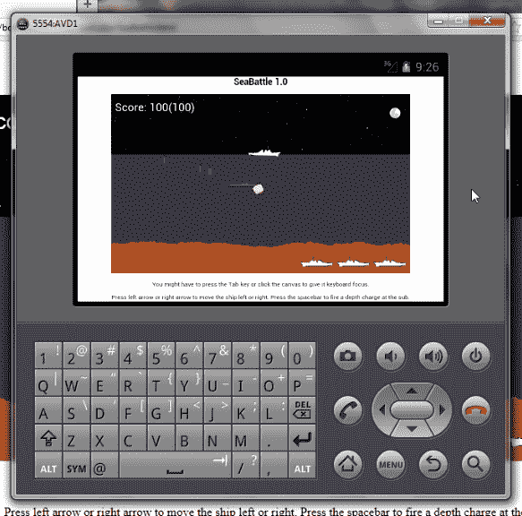

# 游戏:公海之战，第 5 部分

> 原文：<https://www.sitepoint.com/gaming-battle-on-the-high-seas-part-5/>

*SeaBattle* 是一款 HTML5 游戏，展示了 HTML5 的音频、画布和网络存储 API 的有用性。本文通过探索 SeaBattle 的`draw()`和`allResourcesLoaded()`功能来完成我们的[五部分游戏系列](https://www.sitepoint.com/gaming-battle-on-the-high-seas-part-4 "Gaming: Battle on the High Seas, Part 4")。它还通过讨论游戏增强功能和在移动环境中检查 SeaBattle 来回顾这些 API。

## 画场景

清单 1 中所示的`SeaBattle`对象的`draw()`函数被调用来根据更新后的状态绘制游戏场景。

```
draw: function() {
  if (SeaBattle.state == SeaBattle.STATE_INIT)
    if (!SeaBattle.allResourcesLoaded())
    {
      SeaBattle.ctx.fillStyle = "#000";
      SeaBattle.ctx.fillRect(0, 0, SeaBattle.width, SeaBattle.height);
      SeaBattle.ctx.fillStyle = "#fff";
      SeaBattle.ctx.fillText("Initializing...",
      SeaBattle.width/2, SeaBattle.height/2);
      return;
    }
    else
      SeaBattle.state = SeaBattle.STATE_TITLE;

  if (SeaBattle.state == SeaBattle.STATE_TITLE)
  {
    SeaBattle.ctx.drawImage(SeaBattle.imgTitle, 0, 0);
    return;
  }

  SeaBattle.ctx.drawImage(SeaBattle.imgSky, 0, 0);
  SeaBattle.ctx.fillStyle = "#404040"
  SeaBattle.ctx.fillRect(0, SeaBattle.height/3, SeaBattle.width, 2*SeaBattle.height/3);
  SeaBattle.ctx.drawImage(SeaBattle.imgMoon, SeaBattle.width-65, 25);
  SeaBattle.ctx.strokeStyle = "rgb(255, 102, 0)"; // orange
  for (var i = 0; i < SeaBattle.width; i++)
  {
    SeaBattle.ctx.beginPath();
    SeaBattle.ctx.moveTo(i, SeaBattle.hillTops[i]);
    SeaBattle.ctx.lineTo(i, SeaBattle.height);
    SeaBattle.ctx.stroke();
  }

  for (var i = 0; i < SeaBattle.MAX_DC; i++)
    if (SeaBattle.dc[i] != null)
      SeaBattle.dc[i].draw();

  for (var i = 0; i < SeaBattle.MAX_TORP; i++)
    if (SeaBattle.torp[i] != null)
      SeaBattle.torp[i].draw();

  if ((SeaBattle.ship != null && SeaBattle.explosion == null) ||
      (SeaBattle.explosion != null && !SeaBattle.ship.exploded))
    SeaBattle.ship.draw();

  if ((SeaBattle.sub != null && SeaBattle.explosion == null) ||
      (SeaBattle.explosion != null && !SeaBattle.sub.exploded))
    SeaBattle.sub.draw();

  if (SeaBattle.explosion != null)
    SeaBattle.explosion.draw();

  SeaBattle.ctx.fillStyle = "rgba(0, 0, 255, 0.1)";
  SeaBattle.ctx.fillRect(0, SeaBattle.height/3, SeaBattle.width, SeaBattle.height);
  SeaBattle.ctx.fillStyle = "#fff";
  var align = SeaBattle.ctx.textAlign;
  SeaBattle.ctx.textAlign = "left";
  SeaBattle.ctx.fillText("Score: "+SeaBattle.score+"("+SeaBattle.hiScore+")", 10, 45);
  SeaBattle.ctx.textAlign = align;

  for (var i = 0; i < SeaBattle.lives-1; i++)
  {
    var x = SeaBattle.width-(i+1)*(SeaBattle.imgShipLeft.width+10);
    var y = SeaBattle.height-SeaBattle.imgShipLeft.height;
    SeaBattle.ctx.drawImage(SeaBattle.imgShipLeft, x, y);
  }

  if (SeaBattle.state == SeaBattle.STATE_WINLOSE ||
      SeaBattle.state == SeaBattle.STATE_RESTART)
  {
    SeaBattle.ctx.fillStyle = "#fff";
    SeaBattle.ctx.fillText(SeaBattle.msg, SeaBattle.width/2, SeaBattle.height/2);
  }
}
```

**清单 1:** 在所有游戏资源加载完毕之前，会显示一个初始化屏幕。

清单 1 首先确定游戏是否处于初始化状态。如果是这样，如果不是所有的游戏资源都已加载，将出现一个“黑底白字”的初始化屏幕。在所有游戏资源都已加载后，状态恢复到标题状态，并显示标题屏幕。

如果游戏没有初始化或显示标题，清单 1 将根据游戏的当前状态绘制当前场景。它在绘制船只和潜艇之前绘制深水炸弹和鱼雷，这样它们从游戏对象中出现时看起来更自然。

在绘制船舶或潜艇之前，必须满足两个复合条件中的任何一个。对于船来说，它的游戏对象必须存在而没有爆炸对象，或者爆炸对象必须存在而船必须还在爆炸。同样的条件也适用于潜艇。

在绘制了天空、水、月亮、海底地形和游戏对象之后，清单 1 绘制了当前和高分，并绘制了左侧的生命。最后，它会在场景中央绘制一条消息，但仅在游戏处于赢/输或重启状态时。

## 检测所有加载的资源

`draw()`函数依靠`SeaBattle`的`allResourcesLoaded()`函数来告诉它何时所有的图像和音频游戏资源都已加载完毕。在所有这些资源都可用之前，继续进行是没有意义的。清单 2 展示了这个函数的实现。

```
allResourcesLoaded: function() {
  var status = SeaBattle.imgTitle.complete &&
               SeaBattle.imgSky.complete &&
               SeaBattle.imgMoon.complete &&
               SeaBattle.imgShipLeft.complete &&
               SeaBattle.imgShipRight.complete &&
               SeaBattle.imgSubLeft.complete &&
               SeaBattle.imgSubRight.complete;
  for (var i = 0; i < SeaBattle.imgExplosion.length; i++)
    status = status && SeaBattle.imgExplosion[i].complete;
  status = status && SeaBattle.audBombLoaded;
  return status;
}
```

**清单 2:**`complete`和`audBombLoaded`属性的布尔值被合并。

清单 2 将每个`Image`对象的`complete`属性的布尔真/假值与`SeaBattle`的`audBombLoaded`属性的布尔真/假值合并，以获得一个指示是否所有游戏资源都已加载的结果。

## 回顾 HTML5 的音频、画布和 Web 存储 API

如果不能访问 HTML5 的音频、画布和 Web 存储 API，SeaBattle 就不会存在。本节简要回顾了音频、画布和 Web 存储，以方便那些希望完全理解这款游戏但没有牢固掌握这些 API 的新手。

### 查看音频 API

HTML5 的[音频元素](http://dev.w3.org/html5/spec-preview/the-audio-element.html)可以让你表现一个声音或者一个音频流。您可以通过使用`Audio()`构造函数以编程方式创建和操作这个元素的实例。不幸的是，Safari 不支持这个构造函数，所以我使用了 DOM 的`createElement()`函数。

结果实例的类型为`HTMLAudioElement`，其`play()`函数用于开始播放爆炸声音效果。当 QuickTime 未安装时，此功能会在 Safari 浏览器上引发异常。`HTMLAudioElement`还提供了一个`onloadeddata`事件处理程序，我用它来接收音频数据加载后的通知，并将 true 赋给`SeaBattle`的`audBombLoaded`属性。

### 查看画布 API

HTML5 的 [canvas 元素](https://www.w3.org/TR/2011/WD-html5-20110405/the-canvas-element.html)允许你分配一个网页的矩形区域，并在这个区域上绘图。您可以通过使用 Canvas API 以编程方式创建和操作该元素的实例。

与 Audio API 不同，没有用于以编程方式创建 canvas 实例的构造函数。相反，您使用 DOM 的`createElement()`函数，如`SeaBattle`的`init(width, height)`函数所示。结果实例的类型是`HTMLCanvasElement`。在画布上绘图之前，您需要获得一个绘图上下文。您可以通过调用 `getContext()`函数来获得这个上下文。

您通常用一个`"2D"`或`"2d"`参数调用这个函数来返回一个 2D 上下文。2D 上下文返回的对象属于类型`CanvasRenderingContext2D`。 [`CanvasRenderingContext2D`](http://dev.w3.org/html5/2dcontext/) 声明各种函数和非函数属性。`init(width, height)`函数演示了`font`和`textAlign`属性。本文前面演示了其他属性。

### 查看 Web 存储 API

[Web 存储](http://dev.w3.org/html5/webstorage/)为浏览器和其他 Web 客户端中的键值对数据提供持久的数据存储。SeaBattle 依靠本地存储来保存高分，并在下次游戏运行时检索这个分数。当浏览器窗口关闭时，高分不会被保存，因为 Opera 没有提供检测窗口关闭事件的可靠方法。

检测对本地存储的支持相当于首先检查全局`window`对象上是否存在`localStorage`属性，然后确保该属性的值既不是`null`也不是`undefined`。

Internet Explorer 9 不支持本地文件的本地存储。有关更多信息，请参见 stackoverflow 的“当从文件系统直接访问网站时，IE9 中的[本地存储失败】主题。](http://stackoverflow.com/questions/8706006/local-storage-in-ie9-fails-when-the-website-is-accessed-directly-from-the-file-s)

属性的最终类型是`Storage`。调用这个属性的`void setItem(DOMString key, DOMString value)`函数来存储一个键值对，调用它的`DOMString getItem(DOMString key)`函数来返回指定键值。

每个浏览器都提供自己的本地存储。这意味着一个浏览器保存的特定高分不会被另一个浏览器检索到。比如火狐上有可能高分 500，Opera 上有可能高分 300。

## 增强海上乒乓球

在我看来，SeaBattle 是完整的。然而，一个游戏有没有完成过？你可能会想到很多改进这个游戏的方法。例如，考虑增加鱼雷的速度，使驱逐舰更难避开。

考虑鱼雷对象的以下摘录:

```
this.move = function move() {
  this.y--;
  if (this.y < this.bound)
    return false;
  return true;
}
```

要让鱼雷移动得更快，只需将`this.y`减少一个更大的值；比如`this.y -= 2;`。

也许现在摧毁潜艇太容易了，或者躲避鱼雷太难了。这些可能性带来了游戏层次的概念。第一关可能很容易赢，第二关可能更难。也许第三级可以实现多艘潜艇，等等。

一种额外的增强可能性是引入虚假的动画。例如，天空偶尔会出现流星，或者星星会闪烁。介绍一下穿越海底地形的海洋生物怎么样？

## 走向移动

在考虑 SeaBattle 增强时，有一个重要的增强需要考虑。游戏应该在移动设备浏览器上进行测试。如果你希望你的 HTML5 游戏赚钱，你不能把它们限制在桌面浏览器上。你可能会首先在 iOS 和 Android 平台上测试你的游戏。

之前安装了 Android 4.1 模拟器，我决定在默认浏览器应用上测试 SeaBattle。我首先关心的是能够完整地查看画布。事实证明这不是问题，如图 1 所示。



图 1:800 x480 像素尺寸的画布在横向模式下更容易看到。

除了游戏运行缓慢之外，我在浏览器应用中运行 SeaBattle 时还发现了两个问题:

*   缺少音频，可能是因为不支持 WAV 文件。
*   浏览器偶尔会陷入循环，反复显示初始化屏幕和游戏播放屏幕。

作为练习，验证第一个问题的原因并调整游戏以进行补偿。(提示:您可以通过`navigator.userAgent.indexOf()`识别当前浏览器，然后进行相应操作。)然而，第二个问题可能更难解决。

## 结论

SeaBattle 是一个有趣游戏的例子，可以用 HTML5 的音频、画布和 Web 存储 API 创建。现在您已经了解了它如何与这些 API 交互，您可能想要增强游戏。可以从下载 [SeaBattle 源代码](https://github.com/jsprodotcom/source/blob/master/SeaBattleGame.zip "SeaBattle Source Code")开始。如果你计划将你的游戏版本货币化，不要忘记在各种移动设备上全面测试游戏。祝你好运！

## 分享这篇文章