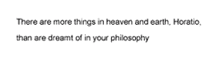
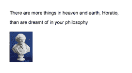
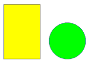
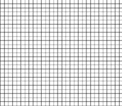
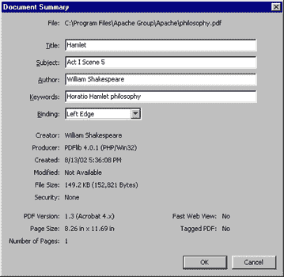
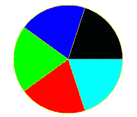
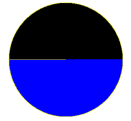

# 用 PHP 生成 pdf

> 原文：<https://www.sitepoint.com/generate-pdfs-php/>

这篇文章写于 2003 年，至今仍是我们最受欢迎的帖子之一。如果你热衷于学习更多关于 pdf 和文档的知识，你可能会对最近这篇关于创建 HTML5 文档编辑器的文章很感兴趣。

## 领先

我如此喜欢 PHP 的原因之一是它对新技术的一贯支持。这种语言具有可扩展性，使开发人员可以轻松地向核心引擎添加新模块，广泛的社区支持使 PHP 成为功能最全的 Web 编程语言之一，支持各种各样的模块化扩展。今天可用的扩展允许开发人员使用 PHP 来执行 IMAP 和 POP3 操作；动态构建图像和 Shockwave Flash 电影；执行信用卡验证；加密敏感数据；和解析 XML 编码的数据。

然而，这还不是全部。目前与 PHP 捆绑在一起的更有趣的项目之一是 PDFLib 扩展，它允许开发人员动态生成 Adobe 可移植文档格式(PDF)的文档。在接下来的几页中，我将快速浏览一下这个模块，为您提供其功能的简要概述，并演示如何在 PHP 开发中使用它。所以进来吧，我们走吧！

## 入门指南

为了使用 PHP 的 PDF 操作功能，您需要在系统上安装 PDFLib 库。如果你使用的是 Linux，你可以从 http://www.pdflib.com/pdflib/index.html 下载一份，然后在你的机器上编译。如果您运行的是 Windows，您的工作就更简单了——预构建的 PDF 库与您的发行版捆绑在一起，您所需要做的就是通过取消注释 PHP 配置文件中的适当行来激活它。

此外，您还需要一份(免费！)Adobe Acrobat PDF reader，以便您可以查看通过 PDFLib 库创建的文档。你可以从[http://www.adobe.com/](http://www.adobe.com/)下载这款阅读器

一旦一切就绪，就该创建一个简单的 PDF 文件了。这是:

```
<?php

 create handle for new PDF document $pdf = pdf_new();

 open a file pdf_open_file($pdf, "philosophy.pdf");

 start a new page (A4) pdf_begin_page($pdf, 595, 842);

 get and use a font object $arial = pdf_findfont($pdf, "Arial", "host", 1); pdf_setfont($pdf, $arial, 10);

 print text pdf_show_xy($pdf, "There are more things in heaven and earth, Horatio,", 50, 750); pdf_show_xy($pdf, "than are dreamt of in your philosophy", 50, 730);

 end page pdf_end_page($pdf);

 close and save file pdf_close($pdf);
?>
```

保存此文件，然后通过 Web 浏览器浏览到它。PHP 将执行该脚本，一个新的 PDF 文件将被创建并存储在脚本顶部指定的位置。打开文件时，您将看到以下内容:



## 解剖课

让我们仔细看看上面例子中使用的代码。

用 PHP 创建一个 PDF 文件包括四个基本步骤:为文档创建一个句柄；注册文档的字体和颜色；用各种预定义的功能在手柄上书写或绘图；并保存最终文档。

让我们开始第一步——为 PDF 文档创建一个句柄。

```
 create handle for new PDF document $pdf = pdf_new();
```

这是通过`pdf_new()`函数完成的，该函数返回文档的句柄。然后，该句柄将用于所有涉及 PDF 文档的后续操作。

接下来，您需要给 PDF 文件起一个名字——这是通过`pdf_open_file()`函数完成的，它需要在前面的操作中返回的句柄，以及一个用户定义的文件名。

```
 open a file pdf_open_file($pdf, "philosophy.pdf");
```

文档创建后，您可以使用
`pdf_begin_page()`功能在文档中插入新页面。

```
 start a new page (A4) pdf_begin_page($pdf, 595, 842);
```

并以–你猜对了！–`pdf_end_page()`功能。

```
 end page pdf_end_page($pdf);
```

注意，`pdf_begin_page()`函数需要两个额外的参数，它们以磅为单位表示要创建的页面的宽度和高度(一个磅等于 1/72 英寸)。如果数学不是你的强项，PHP 手册提供了大多数标准页面尺寸的宽度和高度测量，包括上面例子中使用的 A4。

在对`pdf_begin_page()`和`pdf_end_page()`的调用之间是实际向 PDF 文档写入内容的代码，可以是文本、图像或几何图形。在这种情况下，我所做的就是向文档中写入一行文本——所以我需要做的就是选择一种字体，然后使用该字体向文档中写入我需要的文本字符串。

通过`pdf_findfont()`和`pdf_setfont()`功能完成字体的选择和注册。`pdf_findfont()`函数准备在文档中使用的字体，并需要字体的名称、要使用的编码以及一个布尔值，该值指示该字体是否应该嵌入 PDF 文件中；它返回一个字体对象，可以通过调用`pdf_setfont()`来使用。

```
$arial = pdf_findfont($pdf, "Arial", "host", 1); pdf_setfont($pdf, $arial, 10); 
```

一旦设置了字体，就可以使用`pdf_show_xy()`功能将文本字符串写入页面上的特定位置。

```
 print text pdf_show_xy($pdf, "There are more things in heaven and earth, Horatio,", 50, 750); pdf_show_xy($pdf, "than are dreamt of in your philosophy", 50, 730); 
```

正如您所看到的，这个函数需要一个 PDF 文档的句柄、一个要使用的字体对象的引用、要写入的文本字符串(显然！)，以及开始书写文本的位置的 X 和 Y 坐标。这些坐标是相对于位于文档左下角的原点(0，0)指定的。

一旦文本被写入，页面通过调用`pdf_end_page()`关闭。然后你可以添加一个或多个额外的页面，或者——就像我在这里做的那样——通过`pdf_close()`简单地关闭文档。这将把文档内容保存到最初调用`pdf_open_file()`时指定的文件中，并销毁创建的文档句柄。

## 非常漂亮

这是一个非常简单的例子——但是 PHP 的 PDF 扩展允许你做更多的事情，而不仅仅是在页面上写文本。因为一张图片胜过千言万语，所以考虑下一个例子，它演示了向新制作的 PDF 文档添加图像的过程。

```
<?php
 create handle for new PDF document $pdf = pdf_new();

 open a file pdf_open_file($pdf, "philosophy.pdf");

 start a new page (A4) pdf_begin_page($pdf, 595, 842);

 get and use a font object $arial = pdf_findfont($pdf, "Arial", "host", 1); pdf_setfont($pdf, $arial, 10);

 print text pdf_show_xy($pdf, "There are more things in heaven and earth, Horatio,", 50, 750); pdf_show_xy($pdf, "than are dreamt of in your philosophy", 50, 730);

 add an image under the text $image = pdf_open_image_file($pdf, "jpeg", "shakespeare.jpg"); pdf_place_image($pdf, $image, 50, 650, 0.25);

 end page pdf_end_page($pdf);

 close and save file pdf_close($pdf);
?>
```

以下是 PDF 输出:



这里的大部分魔法都是通过`pdf_open_image_file()`和
T1 函数实现的。第一个函数接受图像类型——GIF、JPEG、TIFF 或 PNG——和文件名作为参数，并返回一个图像句柄，然后可以在文档中多次重复使用。

上一步返回的图像句柄可以由`pdf_place_image()`函数使用，它实际上负责将图像定位在页面上的特定点。提供给该函数的坐标(第二个和第三个参数)指的是图像左下角的位置，而第四个参数指定显示图像时使用的缩放因子(缩放因子 1 将按实际大小显示图像，而因子 0.5 将图像缩小到其一半大小)。

## 两点之间的最短距离

为什么停在那里？PHP 的 PDF 扩展附带了一整套功能，用于在 PDF 文档中绘制线条、圆形和其他形状。考虑下面的例子，它演示了画线的过程。

```
<?php
 create handle for new PDF document $pdf = pdf_new();

 open a file pdf_open_file($pdf, "letterhead.pdf");

 start a new page (A4) pdf_begin_page($pdf, 595, 842);

 get and use a font object $arial = pdf_findfont($pdf, "Arial", "host", 1); pdf_setfont($pdf, $arial, 12);

 set a colour for the line pdf_setcolor($pdf, "stroke", "rgb", 0, 0, 0);

 place a logo in the top left corner $image = pdf_open_image_file($pdf, "jpeg", "logo.jpg"); pdf_place_image($pdf, $image, 50, 785, 0.5);

 draw a line under the logo pdf_moveto($pdf, 20, 780);
pdf_lineto($pdf, 575, 780);
pdf_stroke($pdf);

 draw another line near the bottom of the page pdf_moveto($pdf, 20, 50); pdf_lineto($pdf, 575, 50); pdf_stroke($pdf);

 and write some text under it pdf_show_xy($pdf, "Confidential and proprietary", 200, 35);

 end page pdf_end_page($pdf);

 close and save file pdf_close($pdf);
?>
```

以下是您应该在 PDF 文档中看到的内容:


在这种情况下，画线的过程包括创造性地使用`pdf_moveto()`、`pdf_lineto()`和`pdf_stroke()`功能。

在上面的例子中，我想从位置(20，780)到新位置(575，780)画一条线。为此，我首先需要通过调用`pdf_moveto()`将光标放在起点(20，780)。

```
pdf_moveto($pdf, 20, 780);
```

接下来，我需要通过`pdf_lineto()`设置直线的终点:

```
pdf_lineto($pdf, 575, 780);
```

最后，使用`pdf_stroke()`实际渲染该行。

```
pdf_stroke($pdf);
```

通过调用`pdf_setcolor()`来设置描边颜色，该调用接受许多参数:PDF 文档句柄，设置的颜色是用于“描边”、“填充”还是“两者”，要使用的配色方案(RGB 或 CMYK)，以及适合所选配色方案的颜色值列表。

```
pdf_setcolor($pdf, "stroke", "rgb", 0, 0, 0);
```

需要注意的是，提供给
`pdf_setcolor()`的颜色值列表必须以百分比强度的形式指定——即该颜色的强度，以可能的最大强度的百分比表示。因此，如果我想将红色(RGB: 255，0，0)设置为笔画颜色，我对`pdf_setcolor()`的调用将如下所示:

```
pdf_setcolor($pdf, "stroke", "rgb", 1, 0, 0);
```

而黄色(RGB: 255，255，0)的填充颜色将是:

```
pdf_setcolor($pdf, "fill", "rgb", 1, 1, 0);
```

## 方钉，圆孔

线条不是你唯一可以画的东西——圆形和矩形在菜单上也很突出。看一下下面的例子，它演示了。

```
<?php
 create handle for new PDF document $pdf = pdf_new();

 open a file pdf_open_file($pdf, "shapes.pdf");

 start a new page (A4) pdf_begin_page($pdf, 595, 842);

 set a fill colour pdf_setcolor($pdf, "fill", "rgb", 1, 1, 0);

 set a stroke colour pdf_setcolor($pdf, "stroke", "rgb", 0, 0, 0);

 draw a rectangle pdf_rect($pdf, 50, 500, 200, 300);
pdf_fill_stroke($pdf);

 set a fill colour pdf_setcolor($pdf, "fill", "rgb", 0, 1, 0);

 set a stroke colour pdf_setcolor($pdf, "stroke", "rgb", 0, 0, 1);

 draw a circle pdf_circle($pdf, 400, 600, 100);
pdf_fill_stroke($pdf);

 end page pdf_end_page($pdf);

 close and save file pdf_close($pdf);
?>
```

以下是输出结果:



在本例中，`pdf_rect()`函数被用来绘制一个矩形，给出左下角的坐标以及高度和宽度。然后，通过`pdf_fill_stroke()`功能，用两种不同的颜色填充和勾勒出这个矩形。

```
pdf_setcolor($pdf, "fill", "rgb", 1, 1, 0);

pdf_setcolor($pdf, "stroke", "rgb", 0, 0, 0);

pdf_rect($pdf, 50, 500, 200, 300);

pdf_fill_stroke($pdf);
```

圆由`pdf_circle()`函数处理，它接受三个
参数:圆心的 X 和 Y 坐标，以及圆半径的长度。

```
pdf_circle($pdf, 400, 600, 100);
```

这种即时绘制几何图形的能力在许多不同的情况下都会派上用场。考虑下面的例子，其中几个“for”循环与`pdf_lineto()`函数结合起来生成了一个 PDF 线条网格。

```
<?php
 create handle for new PDF document $pdf = pdf_new();

 open a file pdf_open_file($pdf, "grid.pdf");

 start a new page (A4) pdf_begin_page($pdf, 595, 842);

 set a stroke colour pdf_setcolor($pdf, "stroke", "rgb", 0, 0, 0);

 draw vertical lines (move along X axis) for ($x=0; $x<=595; $x+=20)
{
pdf_moveto($pdf, $x, 0);
pdf_lineto($pdf, $x, 842);
pdf_stroke($pdf);
}

 draw horizontal lines (move along Y axis) for ($y=0; $y<=842; $y+=20)
{
pdf_moveto($pdf, 0, $y);
pdf_lineto($pdf, 595, $y);
pdf_stroke($pdf);
}

 end page pdf_end_page($pdf);

 close and save file pdf_close($pdf);
?>
```

以下是输出结果:



## 天堂是地球上的一个地方

您可以使用`pdf_set_info_*()`系列功能设置文档信息；该信息标识文档创建者、标题和内容。以下示例演示了:

```
<?php
 create handle for new PDF document $pdf = pdf_new();

 open a file pdf_open_file($pdf, "philosophy.pdf");

 start a new page (A4) pdf_begin_page($pdf, 595, 842);

 set document information pdf_set_info_author($pdf, "William Shakespeare"); pdf_set_info_creator($pdf, "William Shakespeare"); pdf_set_info_title($pdf, "Hamlet"); pdf_set_info_subject($pdf, "Act I Scene 5"); pdf_set_info_keywords($pdf, "Horatio Hamlet philosophy");

 get and use a font object $arial = pdf_findfont($pdf, "Arial", "host", 1); pdf_setfont($pdf, $arial, 10);

 print text pdf_show_xy($pdf, "There are more things in heaven and earth, Horatio,", 50, 750); pdf_show_xy($pdf, "than are dreamt of in your philosophy", 50, 730);

 end page pdf_end_page($pdf);

 close and save file pdf_close($pdf);
?>
```

现在，当您在 Acrobat Reader 中查看动态生成的 PDF 文件时，您将在文档属性窗口中看到此信息。



## 一块馅饼

既然您已经对如何创建 PDF 文件有了很好的理解，那么是时候看看实际应用程序了。下面的例子演示了 PHP 如何接受数字数据并将其转换成图形——特别是一个多色饼图。

下面的表单要求一系列数据“切片”，以数字数据的形式，用逗号分隔。一旦你输入了一些数字,“pie.php”脚本将它们从绝对数字转换成不同相对大小的数据块，并使用这些数据块创建一个包含饼图的 PDF 文档，标出不同的饼图切片并用不同的颜色填充它们。

```
<html>
<head>
<basefont face=arial>
</head>

<body>
<h3>Pie Chart Generator</h3>
<table cellspacing="5" cellpadding="5">
<form action="pie.php" method=POST>
<tr>
<td>Enter numeric values (pie segments), separated by commas</td> </tr> <tr> <td><input type=text name=data></td> </tr> <tr> <td><input name="submit" type=submit value="Generate PDF Pie Chart"></td> </tr> </form> </table>

</body>
</html>
```

下面是完成所有工作的脚本:

```
<?php  raw data
$data = $_POST['data'];
$slices = explode(",", $data);

 initialize some variables $sum = 0;
$degrees = Array();
$diameter = 200;
$radius = $diameter/2;

 set up colours array for pie slices (rgb, as percentages of intensity) // add more to these if you like $colours = array(
array(0,0,0),
array(0,0,1),
array(0,1,0),
array(1,0,0),
array(0,1,1),
array(1,1,0),
array(1,0,1),
);

 calculate sum of slices $sum = array_sum($slices);

 convert each slice into corresponding percentage of 360-degree circle for ($y=0; $y<sizeof($slices); $y++) { $degrees[$y] = ($slices[$y]/$sum) * 360;
}

 start building the PDF document
 create handle for new PDF document $pdf = pdf_new();

 open a file pdf_open_file($pdf, "chart.pdf");

 start a new page (A4) pdf_begin_page($pdf, 500, 500);

 set a stroke colour pdf_setcolor($pdf, "stroke", "rgb", 1, 1, 0);

 draw baseline pdf_moveto($pdf, 250, 250);
pdf_lineto($pdf, 350, 250);
pdf_stroke($pdf);

for ($z=0; $z<sizeof($slices); $z++)
{
 set a fill colour pdf_setcolor($pdf, "fill", "rgb", $colours[$z][0], $colours[$z][1], $colours[$z][2]);

 calculate coordinate of end-point of each arc by obtaining
 length of segment and adding radius
 remember that cos() and sin() return value in radians
 and have to be converted back to degrees!
$end_x = round(250 + ($radius * cos($last_angle*pi()/180)));
$end_y = round(250 + ($radius * sin($last_angle*pi()/180)));

demarcate slice with line pdf_moveto($pdf, 250, 250);
pdf_lineto($pdf, $end_x, $end_y);

 calculate and draw arc corresponding to each slice pdf_arc($pdf, 250, 250, $radius, $last_angle, ($last_angle+$degrees[$z]));

 store last angle $last_angle = $last_angle+$degrees[$z];

 fill slice with colour pdf_fill_stroke($pdf);
}

 redraw the circle outline pdf_circle($pdf, 250, 250, 100);
pdf_stroke($pdf);

 end page pdf_end_page($pdf);

 close and save file pdf_close($pdf);

?>
```

输入表单的数据通过一个名为$data 的变量传递给“pie.php”脚本；然后用`explode()`函数将这些数据分割成单独的部分，每个单独的值都放在$slices 数组中。然后，一个循环将这些数字转换成圆的度数，并为每个切片画出弧线。在循环的每次迭代中，还会计算圆弧终点的坐标，并绘制一条线段来区分圆弧和圆的其余部分。一旦绘制了饼图段，就使用`pdf_fill_stroke()`函数来填充颜色；这个颜色是从`$colours`数组中获得的。

我不打算详细说明脚本是如何计算每个圆弧和线段的长度的——该脚本包括注释代码片段，应该解释了大部分细节。

如果您输入五个等值的数据切片，您的饼图将如下所示，



然而，如果您输入两个等值的切片，它将看起来像这样:



继续——摆弄它，看看各种切片如何改变形状，以反映数据块的相对大小。当你玩得开心的时候，我要跟你说再见了…下次见！

*注意:本文中的所有例子都是在装有 Apache 1.3.12 和 PHP 4.2.0 的 Linux/i586 上测试过的。这些示例仅用于说明，并不适用于生产环境。Melonfire 对本文中描述的源代码不提供任何担保或支持。YMMV！*
版权所有[梅龙菲尔](http://www.melonfire.com/)，2000 年。保留所有权利。

如果你喜欢读这篇文章，你会爱上[可学的](https://learnable.com/)；向大师们学习新技能和技术的地方。会员可以即时访问 SitePoint 的所有电子书和互动在线课程，如[WordPress](https://learnable.com/courses/the-beginners-guide-to-web-design-with-wordpress-120)网站设计初学者指南。

## 分享这篇文章