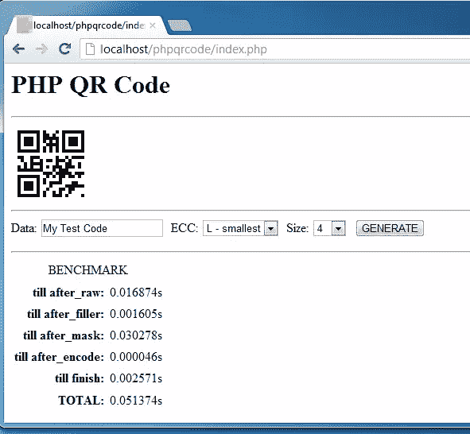
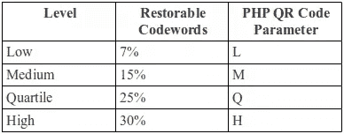
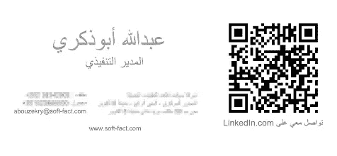

# 用 PHP 生成二维码

> 原文：<https://www.sitepoint.com/generate-qr-codes-in-php/>

QR 码广泛应用于各种最新应用中，可以在可乐罐、名片、寿司店和博物馆中看到。QR 码是日本发明的二维条形码规范。它是有专利的。但它的发明者 Denso Wave 选择不使用它，并为了所有人的利益而开放该标准。自那以后，这种代码越来越受欢迎，因为它能够在一张图像中包含大量数据，以及带有扫描应用程序的智能手机的激增。

在本文中，我将向您展示如何在您的 PHP 应用程序中轻松生成 QR 码，并分享一些关于如何以及何时使用它们的想法，我们将使用 [PHP QR 码](https://github.com/t0k4rt/phpqrcode "t0k4rt/phpqrcode")，这是一个用 PHP 编写的用于生成 QR 码的库，除了创建图像的标准 GD2 图形扩展之外，它不需要任何依赖。

## 生成您的第一个 QR 码

先从 GitHub 下载最新的 PHP 二维码库开始。我假设您已经成功地提取了它，并且您可以在您的开发环境中访问 http://localhost/phpqrcode 来找到工作的演示版本。您可以在数据字段中插入任何想要转换为 QR 码图像的文本，如下图所示。如果你对此有任何问题，确保你已经安装了带有 GD2 扩展的 PHP，必要时使用 PHP 信息页面仔细检查。



使用以下代码创建一个新的 PHP 脚本:

```
<?php
include "phpqrcode/qrlib.php";

// create a QR Code with this text and display it
QRcode::png("My First QR Code");
```

你看这有多简单？只需两行代码，您就可以为您的应用获得一个完美的 QR 码。机会是无穷的！但是等等，这显然不是故事的全部。图书馆有更多值得一看的特色。

## PHP 二维码库的特性

对于完整的示例，请尝试以下代码:

```
<?php
QRcode::png("http://www.sitepoint.com", "test.png", "L", 4, 4);
```

第一个参数指定将被编码到图像中的文本或数据，并作为普通字符串传递。第二个参数是生成的 PNG 图像的输出文件的名称(如果有的话)。默认值为布尔值 false，在这种情况下，图像将被刷新到浏览器。

第三个参数是生成的条形码的纠错级别，作为单个字母字符串传递。这指定了使用 [Reed-Solomon 纠错算法](http://en.wikipedia.org/wiki/Reed%E2%80%93Solomon_error_correction "Reed-Solomon error correction - Wikipedia, the free encyclopedia")可以为失真或损坏的 QR 码图像恢复多少数据码字(每个码字 8 位)。对于给定的尺寸，校正级别越高，条形码的数据容量就越小。下面的表格将级别映射到它们的恢复百分比以及调用`QRcode::png()`时使用的字符串常量。(我从维基百科的文章中编译了这个关于 QR 码和 PHP QR 码库中的方法签名的表格。)



第四个参数指定每个条形码方块的大小，以像素为单位。每个代码方块(也称为“像素”或“模块”)为 4×4px。第五个参数指定条形码周围的白边边界，以代码正方形度量(例如，4×4px 代码正方形每边 16px 的边距)。

该库支持导出 PNG、SVG 和 EPS 图像，您只需将方法名称从`png()`更改为`svg()`或`eps()`，并为生成的图像文件名使用正确的扩展名，即可生成任何格式的 QR 码。

此外，您可以通过将背景和前景色作为附加参数传递来更改它们:

```
<?php
$backColor = 0xFFFF00;
$foreColor = 0xFF00FF;

// Create a QR Code and export to SVG
QRcode::svg("http://www.sitepoint.com", "test-me.svg", "L", 4, 4, false, $backColor, $foreColor);
```

第六个参数(上例中为 false)似乎是一个无用的参数。对于保存到文件和导出到浏览器应该是真的，但在检查了几次后，它对我来说根本不起作用，所以保持它为假。

如果你愿意，你可以查看这个库的更多特性，例如缓存和图像生成基准测试。

## 获得最终条形码的尺寸

为了提前得到图像的最终尺寸，这里有一个简单的公式可以使用(由于图像是正方形，我们只需要计算一个维度，其他的也是一样的):

```
Image Size (px) = (Pixels per Module) × (Module Size + 8)
```

如前所述，每个模块的像素在方法调用中被指定为第四个参数，模块尺寸从这些条形码尺寸表中选择，如下所示:

1.  选择字符串类型的列(数据位、数字、字母数字、二进制或汉字)。这些指定了在某个条形码中要包装的这种类型的最大数据长度。之前我使用了字母数字，但是如果你使用 UTF-8 编码的字符串，那么你可以使用二进制类型。日本汉字是用于日语的，但是没有经过库作者的测试。
2.  选择所需的纠错级别，并为您的字符串长度找到至少可以处理那么多字符的最小版本号。该示例在 L 级使用了 24 个或更多字母数字类型的字符，因此该值将是版本 1 的第一行。
3.  获取您选择的版本的模块，这里将是模块 21×21，其中模块大小将是 21。PHP 二维码库取而代之的是下一个版本为了更多的空间安全起见，所以再上一个。

如果您为示例中使用的版本计算模块大小，您会发现生成的图像大小应为:

```
Image Size = 4 × (21 + 8) = 116×116px
```

但生成的图像却是 132×132px。PHP 二维码采用了下一个版本(版本 2 而不是版本 1，或者只是模块 25×25)，所以实际生成的大小将是:

```
Image Size = 4 × (25 + 8) = 132×132px
```

## QR 码的常见用途

QR 码最常见的应用是对网站的 URL 进行编码，例如你的最新产品、公司等的脸书粉丝页面。选择是无穷无尽的。我自己在我的名片上使用它，并将 URL 编码到我的 LinkedIn 个人资料中。



QR 码还可以存储电话号码、vCards 和电子邮件地址。一些网站把它们放在博客文章旁边作为书签。

当谈到使用二维码时，你唯一的限制实际上是码的数据容量和你将显示它的空间。

## 摘要

在本文中，您看到了如何在 PHP 中为各种打印和 web 应用程序轻松生成 QR 码。我还向您展示了如何提前计算最终生成的图像大小，因为该库不提供这样的功能。简而言之，使用二维码是一件令人愉快的事情，会带来很多机会。如何用它们来增强您的 PHP 应用程序？

图片 via[Fotolia](http://us.fotolia.com/?utm_source=sitepoint&utm_medium=website_link&utm=campaign=sitepoint "Royalty Free Stock Photos at Fotolia.com")

## 分享这篇文章