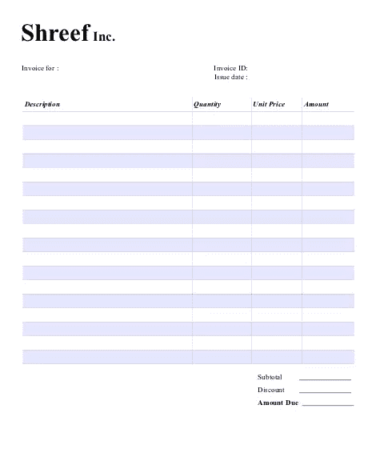
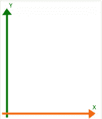

# 使用 Zend_Pdf 生成发票

> 原文：<https://www.sitepoint.com/generating-invoices-with-zend-pdf/>

PDF 格式是目前交换文档最常用的格式。如果您为网站用户提供发票、活动门票和其他类似文档的可打印版本，您很可能希望即时生成 pdf 格式。在本文中，您将看到如何使用 Zend_Pdf 自动生成 Pdf 发票。

## 入门指南

Zend_Pdf 允许您创建新的 Pdf 文档或加载现有文档并进行修改。虽然创建一个新文档并不困难，但创建一个包含不变信息(公司名称、地址、徽标等)的发票模板更有意义。).最好在 Microsoft Word 或 LibreOffice Writer 之类的程序中设计您的发票，并将其导出为 PDF。然后，您可以用 Zend_Pdf 更新 PDF，其中包含客户和交易特定的信息。您将节省编码时间，因为您不必定位每个元素，并且生成 PDF 的时间会更少。

这就是我将在本文中使用的发票模板的样子。根据您的需要，您的发票可以看起来不同，但本文中的概念将保持不变。



如果这是你第一次使用 Zend Framework，从[www.zendframework.com](http://www.zendframework.com "Zend Framework")下载最新版本，在你的服务器上上传并解压压缩文件，在你的脚本顶部使用下面几行来配置类自动加载器。自动加载器将允许您创建新对象，而不必在代码中显式包含所有必需的文件。

```
<?php
define("ZF_PATH", realpath("/path/to/zf/library/"));
set_include_path(get_include_path() . PATH_SEPARATOR . ZF_PATH);
require_once "Zend/Loader/Autoloader.php";
$loader = Zend_Loader_Autoloader::getInstance();
```

记得将`ZF_PATH`常量的值更改为您上传 Zend 框架库副本的路径。

***编者按 2012 年 10 月 14 日:**GitHub 上附带的代码已经更新为使用 Composer 安装 Zend Framework。由于 ZF2 不向后兼容 ZF1，因此版本已锁定在 1.11.11。请参考适用 ZF 路径的代码。*

## 加载 PDF 模板

Zend_Pdf 允许您使用静态`load()`方法加载现有的 Pdf 文档。

```
<?php
// load the invoice
$invoice = Zend_Pdf::load("/path/to/invoice-template.pdf");
```

`load()`方法读取给定路径下的文件，并返回一个`Zend_Pdf`对象的实例，该对象管理与 PDF 相关的一切。

`Zend_Pdf`将 PDF 的每个页面表示为`Zend_Pdf_Page`对象的实例。它的公共字段`pages`是一个对象数组，按照页面在文档中出现的顺序排列。如果您有一个包含许多页面的 PDF 文档，并且您想要对其页面进行重新排序，您可以从这种行为中受益；无论`Zend_Pdf_Page`对象在`pages`数组中的顺序是什么，这就是页面在最终文档中呈现的顺序。

```
<?php
// access the first page
$page = $invoice->pages[0];
```

## 指定字体和颜色

当您将文本写入 PDF 页面时，您实际上是在绘制看起来像文本的形状，这些形状是由所选字体定义的。因此，在书写/绘制文本之前，您必须指定要使用的字体。`Zend_Pdf_Font`类用于创建一个字体资源，然后使用它来指定放置文本时使用的字体。

有两种方法加载字体。第一种是使用静态方法`fontWithName()`并提供以下常量之一，这些常量代表所有 PDF 查看器支持的 14 种标准字体:

*   `Zend_Pdf_Font::FONT_COURIER` ( `_BOLD`、`_ITALIC`、`_BOLD_ITALIC`)
*   `Zend_Pdf_Font::FONT_HELVETICA` ( `_BOLD`、`_ITALIC`、`_BOLD_ITALIC`)
*   `Zend_Pdf_Font::FONT_TIMES` ( `_BOLD`、`_ITALIC`、`_BOLD_ITALIC`)
*   `Zend_Pdf_Font::FONT_SYMBOL`
*   `Zend_Pdf_Font::FONT_ZAPFDINGBATS`

第二种方法是向静态方法`fontWithPath()`提供驻留在文件系统中的字体文件的路径。确保字体是 TrueType 字体，否则`fontWithPath()`将抛出一个`Zend_Pdf_Exception`。

```
<?php
//loading a font by its name
$font = Zend_Pdf_Font::fontWithName(Zend_Pdf_Font::FONT_TIMES_BOLD);

//load font from file system
$font = Zend_Pdf_Font::fontWithPath("/path/to/myfont.ttf");
```

然后将字体资源作为第一个参数传递给`Zend_Pdf_Page`的`setFont()`实例方法，以*为单位测量的字体大小作为第二个参数指向*(1 磅= 1/72 英寸)。每当文本被绘制到该页面时，将使用所表示的字体。

```
<?php
$page->setFont($font, 12);
```

在绘制文本之前，不一定要设置颜色；如果没有指定，默认情况下将使用黑色。但是如果你想使用某种颜色，你可以用一个`Zend_Pdf_Color*`对象来指定。Zend_Pdf 支持三种不同的色彩空间；您可以使用灰度、RGB 或 CMYK。此外，您可以使用 HTML 样式的符号来指定颜色。

```
<?php
// Gray Scale colors range from 0.0 (black) to 1.0 (white)
$color = new Zend_Pdf_Color_GrayScale(0.7);

// RGB uses 3 float values from 0.0 to 1.0 for each color component
$color = new Zend_Pdf_Color_Rgb($r,$g,$b);

// CMYK uses 4 float values from 0.0 to 1.0 for each color component
$color = new Zend_Pdf_Color_Cmyk($c,$m,$y,$k);

// HTML uses any valid color name or hex notation
$color = new Zend_Pdf_Color_HTML("blue");
$color = new Zend_Pdf_Color_HTML("#FF52ED");
```

然后将颜色传递给`Zend_Pdf_Page`实例的`setFillColor()`方法。

```
<?php
$page->setFillColor($color)
```

## 添加内容

使用`Zend_Pdf_Page`的`drawText()`实例方法在页面上绘制文本。它接受一个文本字符串，以及要放置文本的 X 和 Y 坐标。坐标以磅为单位，原点 0，0 位于页面的左下角。增加 X 值会向右移动位置，增加 Y 值会向上移动位置。



通常情况下，您将从数据库中检索和计算要放在发票上的信息，但为了举例，我提出了以下内容:

```
<?php
$customerName = "Angelina Jolie";
$invoiceId = "DF-00025786423";

// items in the array are product description,
// quantity purchased, unit price, and total price
$items = array(array("Golden Globe Polish", 1, 25.50, 25.50),
               array("Trophy Shelf", 2, 180.00, 360.00),
               array("DIY Tattoo Kit", 1, 149.99, 149.99));

$subtotal = 535.49;
$discount = 10;
$amountDue = 481.94;
```

最棘手的部分是找到在页面上放置文本的正确位置，即使你已经仔细测量了距离，你也可能需要一些反复试验。好消息是，由于模板元素是静态的，一旦知道使用什么坐标，它们就不会改变。

```
<?php
// specify font
$fontBold = Zend_Pdf_Font::fontWithName(Zend_Pdf_Font::FONT_TIMES_BOLD);
$page->setFont($fontBold, 12);

// specify color
$color = new Zend_Pdf_Color_HTML("navy");
$page->setFillColor($color);

$page->drawText($customerName, 110,641);
// another font
$fontNormal = Zend_Pdf_Font::fontWithName(Zend_Pdf_Font::FONT_TIMES);
$page->setFont($fontNormal, 12);

// invoice information
$page->drawText($invoiceId, 420,642);
$page->drawText(date("M d, Y"), 420,628);
$page->drawText('$' . number_format($subtotal, 2), 510,143);
$page->drawText($discount . "%", 510,123);
$page->drawText('$' . number_format($amountDue, 2), 510,103);

// purchase items
$posY = 560;
foreach ($itmes as $item) {
    $page->drawText($item[0], 50, $posY);
    $page->drawText($item[1], 350, $posY);
    $page->drawText(number_format($item[2], 2), 430, $posY);
    $page->drawText(number_format($item[3], 2), 510, $posY);
    $posY -= 22.7;
}
```

## 提交发票

将信息添加到模板后，您可以将其保存到不同的文件中(注意不要覆盖您的模板！)或者发送到浏览器。为了保存它，您使用了`Zend_Pdf`的实例方法`save()`。

```
<?php
$invoice->save($pathToFile);
```

使用实例方法`render()`将返回一个字符串形式的 PDF 文档。如果您正在动态生成一个文档，并且希望用户下载它而不首先在您的服务器上保存文档的副本，这可能是您想要的。您可以输出正确的 HTTP 头，以便浏览器知道如何处理文件，然后发送文档字符串。

```
<?php
// instruct browser to download the PDF
header("Content-Type: application/x-pdf");
header("Content-Disposition: attachment; filename=invoice-". date("Y-m-d-H-i") . ".pdf");
header("Cache-Control: no-cache, must-revalidate");

// output the PDF
echo $invoice->render();
```

## 摘要

现在您已经知道了使用 Zend_PDF 创建 PDF 文档的基本知识，尽管还有比我在本文中提到的更多的特性。如果你想克隆和试验这篇文章的[源代码，可以在 GitHub 上找到。当然，如果您遇到任何问题，请随时发表评论。](https://github.com/phpmasterdotcom/GeneratingInvoicesWithZendPdf "phpmasterdotcom/GeneratingInvoicesWithZendPdf")

<small>图片 via [克里斯蒂娜·德里德](http://www.shutterstock.com/gallery-58978p1.html "Stock Photos | Shutterstock: Royalty-Free Subscription Stock Photography & Vector Art") / [梭托](http://www.shutterstock.com "Stock Photos and Royalty-Free Images by Subscription")</small>

## 分享这篇文章