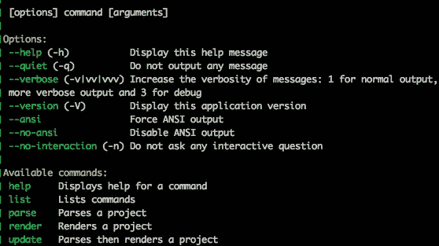
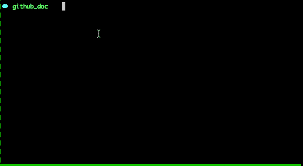
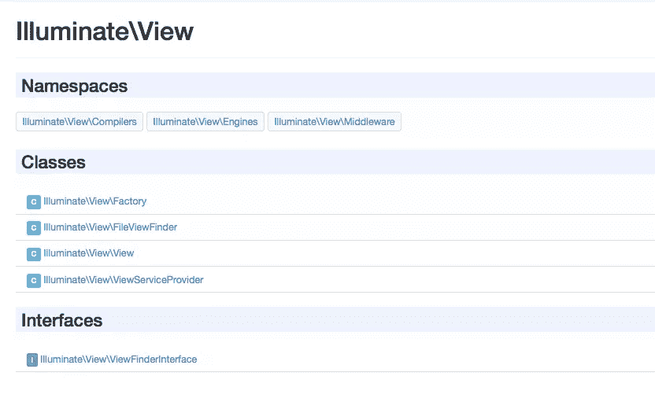

# 用 Sami 生成 PHP 文档

> 原文：<https://www.sitepoint.com/generating-php-documentation-sami/>

记录你的方法、类和函数已经成为每个人的第二天性，所以有一种方法生成一个单独的文档而不是浏览源代码是有意义的。在本文中，我将向您介绍新的 API 文档生成器 [Sami](https://github.com/FriendsOfPHP/Sami) 。


## 什么是文档块？

文档块是插入在实现(类、接口、方法、属性等)顶部的多行注释。为了澄清这一点，让我们使用一些来自 Laravel 的代码片段。

```
abstract class Manager
{
  /**
   * The application instance.
   *
   * @var \Illuminate\Foundation\Application
   */
  protected $app;

  /**
   * Create a new manager instance.
   *
   * @param \Illuminate\Foundation\Application $app
   * @return void
   */
  public function __construct($app)
  {
    $this->app = $app;
  }
}
```

文档块必须以`/**`开始，以`*/`结束，中间的每一行都应该以`*`开始。
当定义一个类属性或方法时，我们编写一个描述，以及一个或多个注释来定义关于实现的更多信息。在这些例子中，使用了 [@param](http://phpdoc.org/docs/latest/references/phpdoc/tags/param.html) 和 [@var](http://phpdoc.org/docs/latest/references/phpdoc/tags/var.html) 注释标签。您可以访问每个注释的文档，查看 phpDocumentor 支持的注释列表。

## API 文档生成器

有许多 API 文档生成器，但是最好的一个是 phpDocumentor。然而，我喜欢 [Sami](https://github.com/FriendsOfPHP/Sami) 的一个主要原因是能够在 Github 上使用你的版本化文档，你也可以使用 [Twig](http://twig.sensiolabs.org/) 来生成模板。

## 安装 Sami

安装 Sami 有两种方法。第一个是[下载](http://get.sensiolabs.org/sami.phar)PHAR 档案并使用 php 运行它。

```
php sami.phar
```

另一种方式是通过[作曲家](https://getcomposer.org)。您可以运行`composer require sami/sami:3.0.*`命令将包添加到您的项目中。

```
php vendor/sami/sami/sami.php
```



## 克隆 Laravel 的文档

对于我们的例子，我将为 [Laravel Illuminate 包](https://github.com/laravel/framework)生成文档。

```
git clone git@github.com:laravel/framework.git docs
```

现在我们的文件夹结构如下所示。

```
docs/
vendor/
composer.json
```

`update`命令负责刷新文档，其用法如下。

```
php vendor/sami/sami/sami.php update config/config.php
```

其中,`config.php`是描述文档结构和输出呈现方式的文件。

## 配置

配置文件必须返回一个`Sami\Sami`的实例。它接受一个`Symfony\Component\Finder\Finder`实例和一组选项。

```
// config/config.php

$dir = __DIR__ . '/../docs';

$iterator = Symfony\Component\Finder\Finder::create()
    ->files()
    ->name('*.php')
    ->exclude('build')
    ->exclude('tests')
    ->in($dir);

$options = [
    'theme'                => 'default',
    'title'                => 'Laravel API Documentation',
    'build_dir'            => __DIR__ . '/../build/laravel',
    'cache_dir'            => __DIR__ . '/../cache/laravel',
];

$sami = new Sami\Sami($iterator, $options);

return $sami;
```

`$dir`变量保存我们的源文件位置。`$iterator`将获取所有文件并选择`*.php`，排除我们源路径中的`build`和`test`目录。
`$options`变量是自我解释的。这个`theme`被设置为默认，但是我们稍后会讨论制作你自己的主题。`build_dir`保存我们的输出文件，`cache_dir`用于 Twig 缓存，而`title`是生成的文档的标题。

现在，打开命令行并运行前面的更新命令。

```
php vendor/sami/sami/sami.php update config/config.php
```



命令执行后，您可以运行内置的 PHP 服务器来查看您的文档是如何工作的。运行`php -S localhost:8000 -t build/`，访问`http://localhost:8000/laravel/`查看结果。

### 使用 Git 版本控制

我之前提到过，我喜欢 Sami 的一个主要原因是它的 Git 版本集成。`options['versions']`参数接受一个保存 Git 存储库配置的`Sami\Version\GitVersionCollection`。例如，让我们为`5.0`和`4.2`分支创建文档。

```
$dir = __DIR__ . '/../docs/src';

$iterator = Symfony\Component\Finder\Finder::create()
    ->files()
    ->name('*.php')
    ->in($dir);

$versions = Sami\Version\GitVersionCollection::create($dir)
    ->add('5.0', 'Master')
    ->add('4.2', '4.2');

$options = [
    'theme'                => 'default',
    'versions'             => $versions,
    'title'                => 'Laravel API Documentation',
    'build_dir'            => __DIR__ . '/../build/laravel/%version%',
    'cache_dir'            => __DIR__ . '/../cache/laravel/%version%',
];

$sami = new Sami\Sami($iterator, $options);

return $sami;
```

当使用版本时，你的`build_dir`和`cache_dir`必须包含`%version%`标签。`add`方法的第二个参数是显示在选择选项中的标签。您还可以使用`addFromTags`、`setFilter`方法来过滤版本。

```
php vendor/sami/sami/sami.php update config/config.php
```

现在您的构建目录将为每个版本包含一个文件夹，用户将能够选择他想要阅读的版本。

### 创建主题

到目前为止，我们只使用了`default`主题，但是 Sami 非常灵活，可以让我们创建自己的主题。

默认主题在`vendor/sami/sami/Sami/Resources/themes`文件夹中。然而，你不能把你自己的主题放在那里。Sami 提供了一种将您自己的主题路径添加到查找路径的方法。

```
// config/config.php

$templates = $sami['template_dirs'];
$templates[] = __DIR__ . '/../themes/';

$sami['template_dirs'] = $templates;
```

现在我们可以在应用程序的根目录中拥有我们的`themes`文件夹。要创建一个新的主题，您需要创建一个文件夹，并将一个`manifest.yml`文件放入其中。

```
// themes/laravel/manifest.yml

name: laravel
parent: default
```

我们的新主题叫做`laravel`，它将扩展`default`主题属性。例如，我们将尝试向页面添加一些资产，并覆盖模板的行为。

## 添加资产

让我们在主题文件夹中创建一个`css`文件夹，并在其中创建一个`laravel.css`文件。

```
// themes/laravel/css/laravel.css

#api-tree a {
    color: #F4645F;
}
```

```
// themes/laravel/manifest.yml
…
static:
    'css/laravel.css': 'css/laravel.css'
```

静态配置部分告诉 Sami 复制指定目的地中的文件。构建文件夹将在`build/laravel/%version%/css/laravel.css`中包含新文件。

```
// themes/laravel/manifest.yml
…
global:
    'layout/base.twig': 'layout/base.twig'
```

```
// themes/laravel/layout/base.twig




    {{ parent()  }}
    <link rel="stylesheet" href="css/laravel.css" />

```

每次 Sami 想要加载`base`布局时，它都会使用你的主题中定义的文件。我们扩展了默认的基本布局以保持默认的外观，并将样式表链接注入到`head`块。调用`parent()`函数将导致 Twig 保留`head`块中的任何现有内容，并在我们的`link`标签之前输出。

```
// config/config.php

$options = [
    'theme'  => 'laravel',
    //...
];
```

```
php vendor/sami/sami/sami.php render config/config.php --force
```

默认情况下，如果没有任何变化，Sami 不会重新加载文档。然而，使用`--force`标志将强制它刷新文件。访问浏览器中的文档页面，查看左侧导航链接的颜色是否发生了变化。

## 更改标记

```
// themes/laravel/manifest.yml

global:
    'namespaces.twig': 'namespaces.twig'
```

顾名思义，`namespaces`文件定义了我们的名称空间内容是如何呈现的。

```
// themes/laravel/namespaces.twig



```

如果你打开`default/namespaces.twig`页面，你会看到萨米正在使用[宏](http://twig.sensiolabs.org/doc/tags/macro.html)来简化扩展模板的过程。我们将创建自己的`macros.twig`文件来覆盖默认标记。
因为 Twig 不支持继承和覆盖宏中的函数，我将复制并粘贴默认的主题宏，并开始编辑它们。

```
// themes/laravel/macros.twig


    <div class="container-fluid underlined">
        
            <div class="row">
                <div class="col-md-6">
                    
                        <span class="label label-primary">I</span>
                    
                        <span class="label label-info">C</span>
                    

                    {{ _self.class_link(class, true) }}
                </div>
                <div class="col-md-6">
                    {{ class.shortdesc|desc(class) }}
                </div>
            </div>
        
    </div>

```

在这个宏中，我们唯一改变的是区分类和接口的方式。Sami 过去一直强调界面，但是我们将根据每个项目的类型在每个项目前插入一个彩色标签。我们在页面上没有做太多的改变，但是你可能想尝试在你的页面上使用引导样式，让菜单更加灵敏，等等。
现在，重新生成文档后，您可以看到当您列出名称空间时，类和接口前面都有标签。



## 结论

在本文中，我们介绍了一个新的 Symfony 工具，它可以帮助您管理软件包的文档。您还可以为您的包文档创建一个独特的主题。你可以在 [Github](https://github.com/sitepoint-editors/SamiDemo) 上找到我们例子的最终结果。如果您有任何问题或意见，可以在下面发表。

u = swader