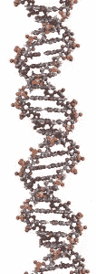

# Ruby 中的遗传算法，第一部分

> 原文：<https://www.sitepoint.com/genetic-algorithms-in-ruby-part-i/>

查尔斯·达尔文提出了“适者生存”的理论(尽管这个术语是由赫伯特·斯潘塞创造的)，这意味着在特定环境中最适合和适应最快的生物将永远胜过其他生物。这很有道理；更强壮的生物更有可能生存下来，也更有可能传递它们的遗传密码。有趣的是，生物体的染色体偶尔会发生突变。因此，一个突变可能会产生一只视力比其他大象好得多的大象，它可能会活得更久，因为它能比其他大象更好地躲避狮子，并把它的特殊特征传递下去。这意味着，如果我们想“优化”某种动物的力量，我们可能只需等待几百万年，突变就会发生，适者胜之。

20 世纪 50 年代的计算机科学家和数学家开始从生物学中借鉴思想，并将它们引入计算机科学。其中一个想法是遗传算法。通过遗传算法(GAs)，我们在计算机上复制进化过程，以优化功能或执行搜索查询。说白了，我们定义了一个规则，告诉你一个“有机体”什么时候比另一个更好。我们对这些进行轻微的变异，并进行最适者繁殖，以获得(经过一定数量的循环后)一个最佳的“有机体”。我说“有机体”(在引号中)是因为实际上没有任何有机体；我们只是用一个简化的模型。因此，事实证明，遗传算法使计算机能够为优化或搜索(或许多其他应用程序)做出“聪明”的决定。

如果你没有真正理解以上的大部分内容，那也没关系。我们将编写我们自己的遗传算法代码(当然是用 Ruby)来解决一个优化问题，这个过程中的每一步都将有比上面更深入的解释。

## 细节

让我们从一个例题开始，从中我们将发展出遗传算法的思想。

假设我们有一台机器，当给定一个四位长的二进制数(意味着它在二进制中有四个数字)时，它对数字 1010 执行 XOR 运算，并输出结果。例如，如果输入是 1100，则输出将是 0110(或十进制的 6)。

我们想找出什么样的输入能使这台机器的输出尽可能大。

使用遗传算法时，我们遵循一些步骤:

1.  一个生物体由一条染色体代表，它只是一个字符串
2.  我们随机生成一堆有机体(即字符串)
3.  我们通过获取每个生物体的字符串并记录来自“适应度函数”(即机器遵循的规则)的返回值来确定生物体的适应度；在我们的例子中，XOR 运算)
4.  我们根据适合度为每种生物分配概率(即适合度越高，概率越高。)之后，我们挑选一个有机体，然后我们“繁殖”，不能繁殖的有机体就灭绝了。
5.  所有的生物都找到了配对，它们的弦被“交换”了。
6.  我们执行这个循环的许多迭代。

同样，不要担心这对你来说太快了。我们将详细介绍每个步骤。

所以，在这种情况下，我们的有机体很容易被表现出来；它们只是比特串。我们会得到一个 4 位长的二进制数。类似 1011 的东西，代表机器的输入。

然后，我们必须随机生成这些位串，这很容易做到。

我们获取所有随机生成的位串(称为生物体/染色体池),并通过将它们传递给适应度函数(即 XOR 运算)来测量它们的适应度。

您可能想知道为什么我们没有一个足够大的池来包含所有可能的输入。然后，我们可以把它们插入适应度函数，选择最适合的生物体；我们总共只有 16 位字符串(因为我们考虑的是 4 位)。假设我们考虑的不是 4 位，而是 40 位。如果我们要建立一个所有可能的位串的池，我们将有 1099511627776 个位；太多了！简而言之，正是因为效率，我们才没有考虑所有可能的投入，而且，在某些情况下，可能有无限多的投入。事实上，使用遗传算法的关键是提高优化效率，如果这不是一个问题，蛮力方法更容易实现。

回到算法上。概率是基于适合度分配的，然后挑选一些生物体进行“克隆”，即染色体的副本被插入到染色体池中。

然后，为了产生新的染色体(基于旧的)，染色体与其他染色体交配，部分染色体相互交换。

这就是遗传算法的基本思想。不要期望理解所有的事情；但是，一个总的想法应该开始形成。继续读就好；一切都会水落石出。

## 生物体

遗传算法的基本结构是有机体，因此，围绕它定义一个类将对我们有益。