# 工具包中需要的 6 种独特的几何字体

> 原文：<https://www.sitepoint.com/geometric-fonts/>

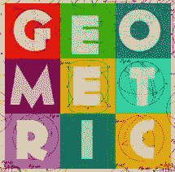

排版是设计中最具活力和不断变化的领域之一，对你作品的整体 UX 有着巨大的影响。事实上，字体设计给了我们一个机会，只要根据环境选择合适的字体，就能唤起用户的情绪和感受。

在网站和移动应用程序中，无衬线字体通常是首选，因为它们缺乏视觉修饰——衬线被认为在纸上比在屏幕上效果更好。这使得 sans-serif 非常适合平面设计美学，同时保持较高的整体可读性。

但是有更多的类别，而不仅仅是衬线和无衬线。无衬线字体分为四类:**人文主义，怪诞新怪诞&几何**

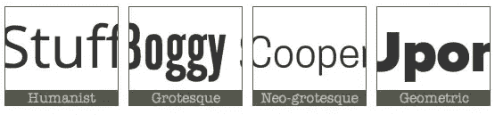

在这篇文章中，我们将看看一些真正知道如何很好地使用几何字体的设计师，然后我们将挑选一些最好的几何字体用于我们自己的项目。

我们走吧！

## “几何字体”是什么意思？

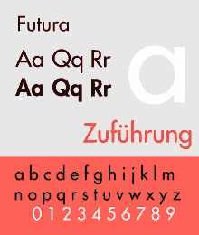

顾名思义，这些字体是基于简单的几何形状，如圆形和方形。几何字体主要用于印刷作品的标题，但也适用于 web 或移动设计项目。

专家将几何字体的兴起追溯到 1919 年至 1933 年开办的德国艺术学校包豪斯。最著名的几何字体之一, [Futura](https://en.wikipedia.org/wiki/Futura_(typeface)) 于 1927 年由深受包豪斯运动影响的艺术家保罗·伦纳发布，这绝非巧合。

包豪斯的主要原则之一是强调简单和功能，而不是多余的装饰。Futura 是切割金属精度和低调优雅的经典组合。

## 狂野的几何字体

让我们来看一些例子，看看几何字体是如何产生良好效果的。

### Jova

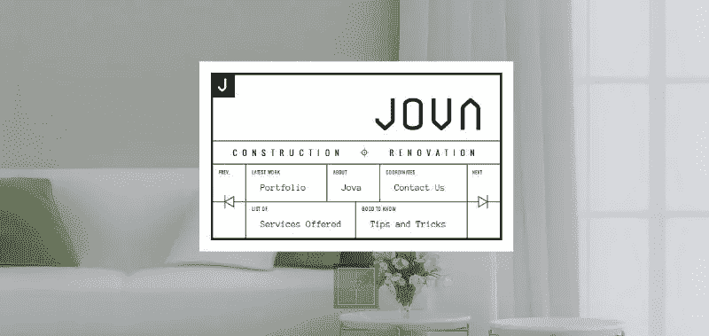

Jova 是一家专门从事房屋和商店翻新的建筑企业。

他们的网站有一个非常规的导航菜单，基于网格风格的布局，它创造了一个专业、简单和精致的外观，与品牌形象很好地匹配。

设计师们决定用几何字体来书写文字:我认为这是一个很好的选择，因为微妙的字体的线性加强了整体设计。

### 唱片公园

我的第二个例子是“ [Le Parc Records](http://leparcrecords.com/) ”，一个音乐厂牌。在这里，由于丰富的背景图片和独特的字体选择的结合，网站能够唤起一种黑暗的，当代的，强大的情绪。

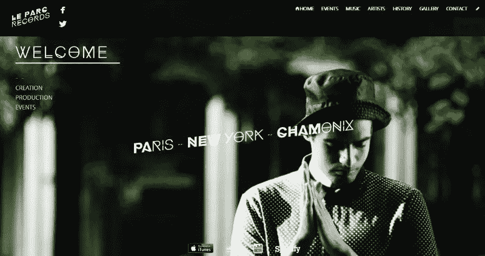

事实上，虽然摄影是壮观的，字体工作漂亮，有助于结合在一起的视觉效果。虽然字体有点诡异，但绝对吸引人。这种字体是一种几何字体，在字母的顶端没有装饰性的衬线，而是在一些字母中使用小的插入物，如“O”和“X”。

这表明，几何字体不仅在 Jova 这样清晰、优雅和干净的环境中工作得很好，而且在 Le Parc 这样更酷、更前卫的环境中也很好。

### 喜剧中心

最后一个例子是美国电视频道“[喜剧中心](http://www.cc.com/)”。几年前，喜剧中心经历了更名过程，引入了新的标志和新的外观。

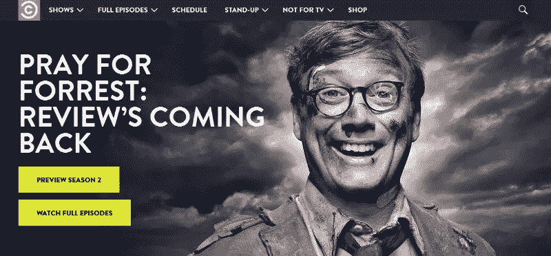

这个项目由创意制作机构“ [theLab](http://www.thelabnyc.com/) ”执行，该公司决定使用几何字体“ [Brandon Grotesque](https://typekit.com/fonts/brandon-grotesque) ”来证明公司的自信和成熟。

字体总是以大写形式出现，它被用在标识中，以及几乎所有出现在网站上的文本中。这唤起了优雅和能力的概念，但同时，在一些图像的帮助下，它让幽默感泄漏出来，这使喜剧中心与众不同。

## 您的资料库的几何字体

既然我们已经看到了几何字体是如何使用的，是时候从网上下载一些最好的字体了。

## 态度

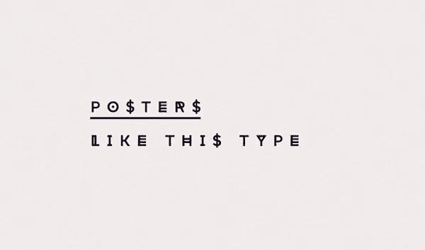

“Attitude”的设计者埃米尔·科泽尔(Emil Kozole)说，这种字体的创作灵感来自 90 年代初的日本和美国流行文化。有了这种字体，设计师当然想尝试字母和形状。其结果是一种字体，与“ *Le Parc Records* ”中使用的字体没有什么不同。

字体有 7 个不同的版本:“常规”、“内嵌”、“3d”、“切片”、“士兵”、“醉了”、“废了”。每个版本，除了“内联”，有 2 种不同的风格:“常规”和“交替”。由于“态度”是最小的，但也是时尚的，它可以很好地用于海报，服装设计，杂志和 cd 封面，当然，也可以用于网站的标题。

字体可以免费下载: **[下载链接](https://www.behance.net/gallery/Attitude-font/6822285)**

## 比卡

Biko 是一种几何无衬线字体，由马可·乌戈利尼为 [Monofonts](http://www.monofonts.com/) 创作。这个名字是为了纪念南非反种族隔离的活动家 *[史蒂夫·比科](https://en.wikipedia.org/wiki/Steve_Biko)* 。

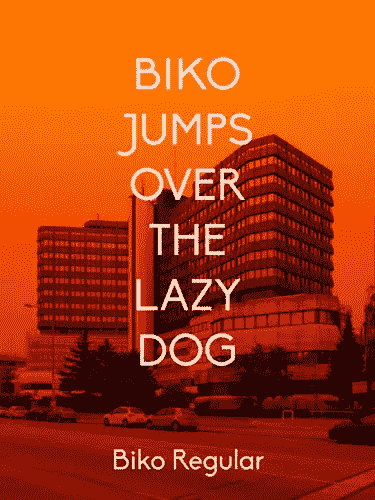

Biko 有一个友好但强大的字符，这使得字体适合网站，移动应用程序，文本和标志。它有四个不同的系列可供选择:浅色、普通、粗体和黑色。

如果需要个人使用的字体，可以在: **[下载链接](http://www.dafont.com/biko.font)** 免费下载 Biko

否则，如果你需要它用于商业目的，你可以在[www.monofonts.com/products/biko](http://www.google.com/url?q=http%3A%2F%2Fwww.monofonts.com%2Fproducts%2Fbiko&sa=D&sntz=1&usg=AFQjCNHaavfOXHLUSQCufFfRGgsaAghCZQ)购买许可证。价格根据你寻找的许可证的种类而变化，如果你对一个单独的系列感兴趣，你可以联系字体创建者。

## 风水

Geomancy 是由" [One By Four Studio](http://www.onebyfourstudio.com) 开发的一种字体，它清楚地显示了受法国和美国装饰艺术风格启发的几何图案。字体被设计成只包含大写字母，所以我们不建议在正文中使用这种字体。我认为风水更适合标题和大海报。

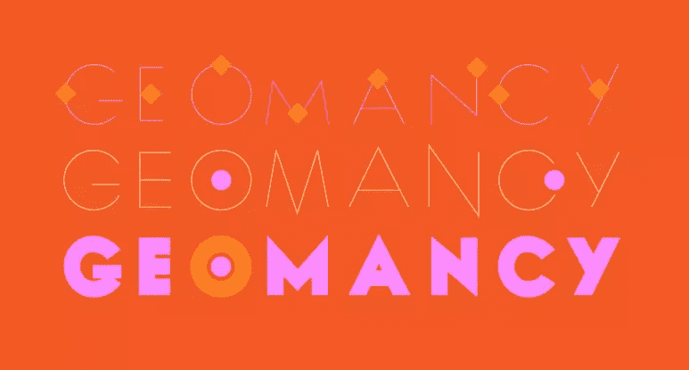

在包装中你可以找到两种不同版本的字体:“超粗体”和更细的“发际线”。根据您想要创造的效果，您可以单独或一起使用这些系列。

字体可以在这里免费下载: **[下载链接](http://www.onebyfourstudio.com/projects/fonts/2010/geomancy/)**

## prometric

托马斯·理查森(Thomas Richardson)设计的 Rometric 从新古典主义建筑风格中汲取了大量灵感，融入了现代角度和几何形状。最常见的形状是圆形和三角形，它们是新古典主义的常见主题。

设计者的目标是创造一种字体，这种字体可以在一种独特的字体中探索并结合新旧趋势。

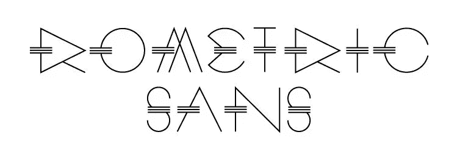

我真正喜欢这种字体的是每个字母上的三条水平线:它们增加了现代的吸引力，使这种字体令人难忘。这是 techno 和 art deco 之间一个奇怪但令人愉快的交汇点。

当然，这种字体不应该用在长文章中，而只能用在标题中。

您可以在: **[下载链接](https://www.behance.net/gallery/ROMETRIC-geometric-font/11176637)** 免费下载 Rometric

## 建筑物

Building 是意大利人莱昂纳多·古比奥尼设计的字体。他告诉我们，创造这种字体是为了*“在一个我们不断受到感官刺激的世界里抓住观众的注意力”*。

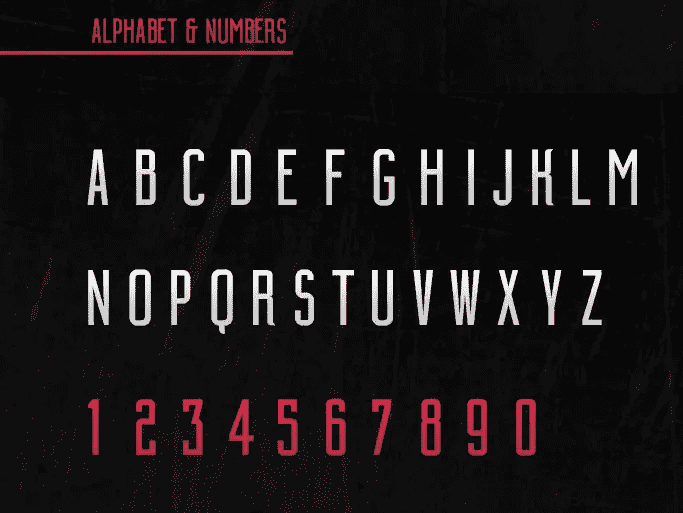

建筑在页面标题、包装和服装设计上表现尤为出色。

字体由大写字母组成。 **[下载链接](https://www.behance.net/gallery/15876377/BUILDING-Free-Font%5D)**

## 现代无

Moderne Sans 是一种干净的无衬线字体，由 Marius Kempken 设计。该字体的灵感来自 20 世纪 20 年代的印刷术。在这里，字母比以往任何时候都基于几何形状:“O”是一个完美的圆形，而“M”和“N”是由三角形组合而成的。

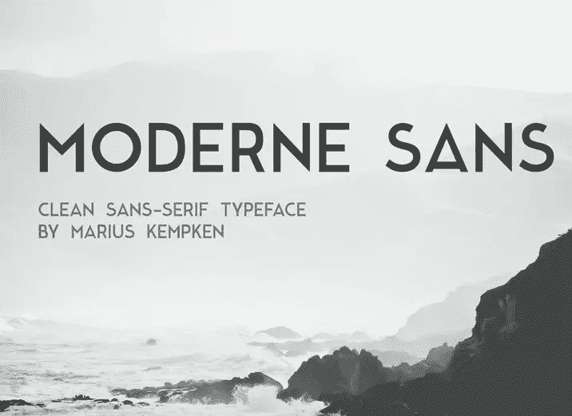

如果你下载字体，这是免费的，你会得到大写版本以及小写版本。

字体可以在这里下载: **[下载链接](https://www.behance.net/gallery/15574861/Moderne-Sans-Free-Typeface)**

### 交给你了。开始设计吧！

我列出的字体只是我个人最喜欢的几种，但网络上充斥着几何字体和各种免费字体，等待下载和使用。

有时简单的形状可以做出最引人注目和鼓舞人心的设计声明。

## 分享这篇文章