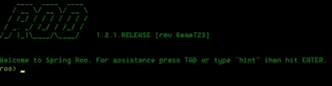
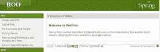

# 借助 CloudFoundry 实现云计算

> 原文：<https://www.sitepoint.com/get-in-the-cloud-with-cloudfoundry/>

今天，我们将学习如何通过 VMWare 的云平台 CloudFoundry 进入云计算。在路上，我们将设置一大堆东西，这些东西是未来冒险的可重用资产！所以事不宜迟，让我们来一探究竟。

## 使用 Spring Roo 示例启动并运行

Spring roo 是一个用于 Java 的快速应用开发(RAD)工具。它提供了各种各样的功能，并与各种框架集成。我们感兴趣的是启动并运行一个我们可以在本教程中使用的项目。您可以从这里的[下载 Roo，然后解压到一个合适的目录中。修改 PATH 变量以包含 Roo 的“bin”子目录。要检查我们是否都设置正确，在命令提示符下键入“roo ”,它应该显示如下屏幕:](http://www.springsource.org/spring-community-download)



如果 Roo 运行良好，那么我们离项目就绪只有一步之遥。转到 Roo 目录中的 samples 目录，并将“clinic.roo”文件复制到您希望项目所在的位置。导航到放置 clinic.roo 文件的目录。现在输入“roo ”,这将带您进入 roo 命令提示符，然后运行以下命令。

[sourcecode]

脚本–文件 clinic.roo

[/sourcecode]

这将为一个样本宠物诊所项目生成代码。通过在任何文本编辑器中检查 clinic.roo 文件，可以看到向 roo 发出了什么命令。一旦项目生成，您可以用“exit”命令退出 roo 提示符。要测试我们是否创建了项目，请从 project 和 pom.xml 文件所在的目录运行命令“mvn tomcat:run”。该命令将调用一个嵌入式容器并在其中托管项目。当命令执行完成时，您会注意到端口和项目主机:

[sourcecode]

2012-04-11 09:29:11657[main]INFO org . spring framework . web . servlet . dispatcher servlet–framework servlet ' pet clinic ':初始化完成于 1918 ms
2012 年 4 月 11 日上午 9:29:11 org . Apache . Coyote . HTTP 11 . HTTP 11 协议初始化信息:在 http-8080 上初始化 Coyote HTTP/1.1
2012 年 4 月 11 日

[/sourcecode]

要检查应用程序，请点击 URL“[http://127 . 0 . 0 . 1:8080/pet clinic/](http://127.0.0.1:8080/petclinic/)”。您可以试用该应用程序来了解它所提供的功能。如果一切顺利，我们已经在不到十分钟的时间内从零开始创建了一个项目！



返回到 roo 命令提示符和 fire 命令

[源代码]
$执行包
[/源代码]

这个命令需要一些时间，并将我们的应用程序打包成所需的依赖项和 web 应用程序格式。如果您检查目标目录，它将有一个构建的快照目录，例如在我的例子中:“petclinic-0.1.0.BUILD-SNAPSHOT”。当我们准备好云服务器后，就可以部署了。

## 安装红宝石和云铸造 VMC

从[这里](http://www.ruby-lang.org/en/downloads/)安装适合你平台的支持版本 ruby (1.8.7 & 1.9.2)，用“ruby -v”检查安装的正确性。我们将安装命令行界面(CLI)——“VMC ”,这是一个 ruby gem。我们将对 CloudFoundry 上的所有操作使用 vmc cli。我们的界面将是相同的，不管我们是为一个 PaaS 实例发出命令，还是为我们机器上的一个微实例发出命令。要安装 vmc gem，启动命令(对于基于 linux/unix 的系统，您必须以“sudo”为前缀，并拥有适当的权限):

[源代码]
$ gem 安装 VMC
[/源代码]

为了快速测试我们的安装，使用命令“vmc info ”,它将给出类似下面的输出。我们将在后面的章节中用一个应用程序进行测试。

[sourcecode]
VMware 的云应用平台
寻求支持访问 http://support.cloudfoundry.com
目标:http://api.cloudfoundry.com(v 0.999)
客户端:v0.3.15
[/sourcecode]

要获得完整的命令列表:

[源代码]
$ vmc 帮助
[/源代码]

## 安装 VM 播放器并启动 CloudFoundry Micro

如果您想跳过 Cloudfoundry 微实例安装等，或者只是想在进入设置微实例的细节之前快速测试云实例，您可以跳过这一部分并跳到“将您的应用部署到 CloudFoundry 云”。

在我们安装 CloudFoundry micro 之前，请在 http://cloudfoundry.com/注册一个帐户，这对我们以后会有帮助。创建帐户后，转到 https://cloudfoundry.com/micro/dns，为您的 micro CloudFoundry 创建一个域名&记下创建的配置令牌。一旦你创建了域名，就会有下载“Micro CloudFoundry VM”和一个“VM player”的链接，当我们了解到底发生了什么时，开始下载这些。

CloudFoundry micro 是一个虚拟机&我们需要一个可以运行虚拟机的播放器。您可以使用“VMWare fusion”、“VMWare workstation”或“VMWare player”中的一种。最简单当然也是免费的选择是使用 VMWare player。安装 VMWare 播放器并将 CloudFoundry micro 解压缩到所需的目标位置。启动 VMWare Player 在 VMWare Player 中打开“micro.vmx”。你会看到“micro CloudFoundry vm”处于关闭状态，打开它。


打开虚拟机会将您带到配置菜单；我们选 1 做配置吧。密码配置完成后，下一步是配置网络，我选择了 DHCP 和无代理，您可以根据您的设置进行配置。在这之后，菜单将要求您提供我们在 CloudFoundry 在线生成的 CloudFoundry 配置令牌。在虚拟机联系服务器和 CloudFoundry micro 准备好使用之前，需要几分钟时间。控制台将显示当前配置，即本地 CloudFoundry 微实例可用的 URL 等。例如，在我的例子中，它显示如下信息的配置:

【源代码】
当前配置:

身份:cf-hostname.cloudfoundry.me (ok)

管理员:[email_addd@gmail.com](mailto:email_addd@gmail.com)

IP 地址:122.156.80.122(网络启动)

要访问您的 Micro Cloud Foundry 实例，请使用:

vmc 目标 http://API . cf-hostname . cloud foundry . me
[/source code]

## 将您的应用部署到 CloudFoundry micro

我们都准备好了！假设前面的所有步骤都已成功完成，打开 Ruby vmc 命令提示符，让我们尝试在 vmc 中注册 CloudFoundry 微实例，为此我们先设置目标，然后进行注册。

[source code]
$ VMC target http://API . cf-hostname . cloud foundry . me

$vmc 寄存器
[/sourcecode]

```
该注册将为 CloudFoundry micro Ubuntu VM 创建一个用户名，并将使用我们在上一节创建虚拟机时提供的密码。提供适当的用户名和以前使用的密码。现在导航到我们构建项目快照和启动命令的目录
[sourcecode] 
 $vmc push 
是否要从当前目录部署？y
应用程序部署的 URL[pet clinic . vishalbiyani . cloud foundry . me]:
检测到一个 Java SpringSource 的 Spring 应用，这样对吗？y
内存预留(64M、128M、256M、512M、1G) [512M]:
创建应用程序:好
是否要将任何服务绑定到“petclinic”？y
以下是可用的系统服务
1: mongodb
2: mysql
3: postgresql
4: rabbitmq
5: redis
请选择您要设置的一个:2
指定服务的名称[mysql-e3d94]: vb-test
正在创建服务:正常
绑定服务[vb-test]:好的
上传应用程序:
检查可用资源:正常
处理资源:正常
包装应用:好的
上传(18M):好的
推送状态:正常
暂存应用程序:正常
启动应用程序:OK 
 [/sourcecode]
现在，应用程序成功托管在[http://pet clinic . cf-hostname . cloud foundry . me](http://petclinic.cf-hostname.cloudfoundry.me)上，您将看到一个类似于我们使用嵌入式容器运行 Roo 应用程序时的屏幕。
将您的应用部署到 CloudFoundry 云
如果您的应用已经在 CloudFoundry 上运行，只需将目标指向 CloudFoundry
[源代码] 
 $vmc 目标 api.cloudfoundry.com
[/源代码]
您的云应用程序只是一个“vmc 推送”。参考上一节，将重复相同的提示来配置您的云应用程序。

## 云中的扩展和管理

让我们看看一些方便的命令来配置和扩展您的应用程序。

要查看您当前可用和提供的服务:

【源代码】
 ====系统服务= = = = = = = = = = = = = = = =
+—+——+——————————————————+
|服务|版本|说明|【T4+—+——————————————————————————————————————————+

+—+——+—————————————+
= = = =提供的服务= = = = = = = = = = = = = = = = T12+——+———+
| name | service |
+————+——+
| mongbb-7fb 72 |

查看实例中部署的应用程序:

[source code]
$ VMC apps
+————————+————————————————————————————————+
|应用| # |健康|网址|服务|
+————————————————————+——————————————————————————————————————+
| cloudspring-pet clinic

将应用程序扩展到两个实例并查看运行的实例

[sourcecode] 
 $vmc 实例 petclinic 2 
将应用实例扩展到 2: OK

$ VMC instances pet clinic
+——+——————————+
|索引|状态|开始时间|
+——————————————+
| 0 |正在运行| 04/15/2012 11:50AM | 
 | 1 |开始| 04/15/2012 03:33PM |
+——-———————————————

## 终于！

我们使用 RAD 技术开发了一个应用程序。我们安装了 Ruby，这将是我们云之旅中非常有用的工具。我们创建了一个 CloudFoundry 微实例，并在其中本地运行一个应用程序。我们还在云上部署了相同的应用程序，这一切都非常快！虽然我们今天用 CloudFoundry 做的只是蛋糕的一小部分！探索并享受您在这个开源 PAAS 和云中的旅程。

[铸造图像](http://www.shutterstock.com/cat.mhtml?lang=en&search_source=search_form&version=llv1&anyorall=all&safesearch=1&searchterm=foundry&search_group=#id=57736003&src=0e3ab0d0862867318bd41d1bdba7855a-1-1)通过 Shutterstock

## 分享这篇文章

```