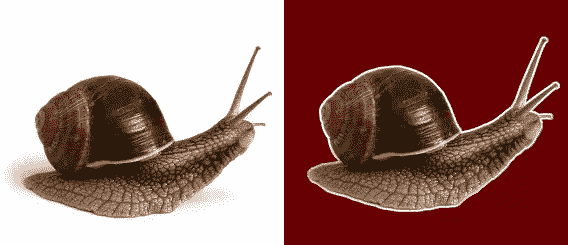
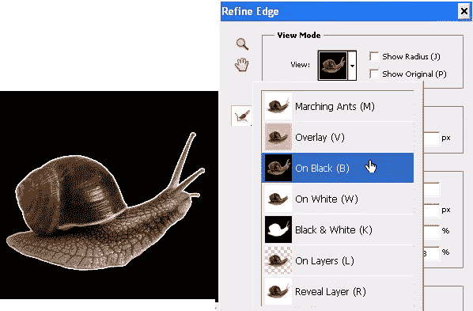
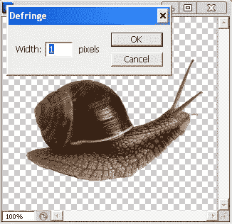

# 在 Photoshop 中去掉那些讨厌的边缘光晕

> 原文：<https://www.sitepoint.com/get-rid-of-those-pesky-edge-halos-in-photoshop/>

当您在 Photoshop 中选择一个图像，然后将该选择粘贴到另一个图像或背景时，您经常会发现(当它被放置在不同颜色的背景上时)您的初始选择周围有一个顽固的像素环。这被称为边缘光晕、边缘或杂边。

这里有一个相当极端的例子。蜗牛在白色背景上被选中，然后粘贴到深红色背景上。我们可以清楚地看到白色的光晕。这类事情对网页设计师来说是个问题。如果你想让一个物体位于一个彩色背景上，你需要在去除背景后去除边缘光晕，但是用橡皮擦几乎不可能做到，那么你如何去除它呢？和 Photoshop 经常出现的情况一样，给猫剥皮的方法不止一种。这里有三个选择。

**1。收缩选区**
在原始图像上进行初始选区时，使用“优化边缘”对话框(这将为您提供预览)或选择“选择>修改>收缩”来收缩选区。当你还有行进中的蚂蚁显示你的选择时，使用这个技术。使用优化边缘滑块，您将能够获得更好的选择。

**2。使用去边缘命令**
你可以在删除背景后使用该命令(它不适用于图层蒙版或选择处于活动状态时)。做出你的选择，然后删除背景，然后选择图层>抠图>去模糊，并输入像素值。Photoshop 会分析活动图层，并用附近像素的颜色替换对象边缘周围像素的颜色。例如，如果你输入 2 像素，它将替换对象周围 2 像素的颜色边缘。

**3。移除黑/白抠图**
如果你的光晕只是黑色或白色，Photoshop 可以自动移除。删除背景后，选择包含感兴趣对象的图层，然后选择图层>抠图>移除黑色抠图或移除白色抠图。像“去边缘”命令一样，这不适用于图层蒙版，也不适用于激活的选区。

如果你喜欢读这篇文章，你会爱上[可学的](https://learnable.com/)；向大师们学习新技能和技术的地方。会员可以即时访问 SitePoint 的所有电子书和互动在线课程，如[Photoshop](https://learnable.com/courses/foundations-of-photoshop-2712)基础。

对本文的评论已经关闭。对 Photoshop 有疑问？为什么不在我们的[论坛](https://www.sitepoint.com/forums/forumdisplay.php?8-Graphics?utm_source=sitepoint&utm_medium=link&utm_campaign=forumlink)上问呢？

## 分享这篇文章