# 如何开始使用 Vuetify

> 原文：<https://www.sitepoint.com/get-started-vuetify/>

在本文中，您将学习如何使用 [Vuetify](https://vuetifyjs.com) 快速构建一个有吸引力的交互式前端。构建一个友好的用户体验良好的应用程序界面是一项需要实践和知识的技能。虽然 Vuetify 不会让你一夜之间成为熟练的 UX 从业者，但它将有助于为这一领域的新手提供一个坚实的开端。

作为 Vue.js 开发人员，有许多专门为 Vue 开发的全功能 CSS 框架可以利用。一个很好的例子就是 [Bootstrap-Vue](https://bootstrap-vue.js.org/) 。我使用过它，它确实使构建组件比仅仅使用传统的 CSS 框架更容易。然而，你可能想给你的应用一个[材质设计的外观和感觉](https://material.io/)，让新用户熟悉它。

据材料设计的制作者说:

> “材料设计不是单一的风格。这是一个受纸和墨水启发的适应性设计系统。并且经过精心设计，使您能够更快地构建美观、实用的产品。”

我希望你现在已经注意到我那强有力的声明了。目前， **Vuetify** 是遵循 Google Material 设计规范的最完整的 Vue 应用程序用户界面组件库。让我们快速进入主题，看看如何开始。

## 先决条件

本指南是为具有 Vue.js 中级或高级知识的开发人员编写的。如果您从未使用过 Vue.js 构建应用程序，请查看以下文章:

*   [Jump Start Vue](https://www.sitepoint.com/premium/books/jump-start-vue-js) ，我们对 Vue.js 的完整介绍
*   [vue . js](https://www.sitepoint.com/getting-started-with-vue-js/)快速入门
*   [开始使用 Vue.js 2.0 框架](https://www.sitepoint.com/up-and-running-vue-js-2-0/)

## 什么是 Vuetify？

Vuetify 是麻省理工学院的一个开源项目，用于为 web 和移动应用程序构建用户界面。这个项目得到了来自 Vue 社区的赞助商和志愿者的支持。该项目得到了一个充满活力的 [Discord 社区论坛](https://community.vuetifyjs.com/)的支持，在这里你可以问 JavaScript 问题——即使这些问题与 Vuetify 无关。[开发团队](https://vuetifyjs.com/en/getting-started/meet-the-team)致力于通过一致的更新周期修复错误并提供增强。还有每周补丁来修复社区提出的问题。

大多数开源前端库没有得到这种程度的关注。因此，当您开始在项目中使用 Vuetify 时，您可以放心，将来不会因为没有支持而无所适从。Vuetify 支持所有主流浏览器。IE11 和 Safari 9 等旧浏览器也可以工作，但需要`babel-polyfill`。不支持任何比这更早的版本。Vuetify 是为语义而构建的。这意味着您学习的每个组件和专有名称都将易于记忆和重用，而无需频繁查看文档。

Vuetify 还附带了[免费/付费主题](https://vuetifyjs.com/en/themes/premium)和[预制布局](https://vuetifyjs.com/en/framework/pre-made-layouts)，您可以使用它们快速为您的应用程序添加主题。在撰写本文时，Vuetify v1.5.13 是当前版本，它利用了[材料设计规范 v1](https://material.io/archive/guidelines/material-design/introduction.html) 。Vuetify 的 2.x 版本将利用[材料设计规范 v2](https://material.io/design/) ，该规范将很快提供。让我们转到下一节，看看将 Vuetify 安装到我们的项目中的几种方法。

## 安装 Vuetify

如果您已经有一个现有的 Vue 项目，该项目是用旧版本的 Vue CLI 工具或其他方式创建的，您可以简单地安装 Vuetify，如下所示:

```
 npm install vuetify 
```

更新您的`index.js`或`main.js`，并加入以下代码:

```
import Vue from "vue";
import Vuetify from "vuetify";
import "vuetify/dist/vuetify.min.css";

Vue.use(Vuetify); 
```

您还需要安装材料图标，您可以将其作为链接标签包含在您的`index.html`文件中:

```
<head>
  <link href='https://fonts.googleapis.com/css?family=Roboto:100,300,400,500,700,900|Material+Icons' rel="stylesheet">
</head 
```

如果你正在开始一个新项目，安装 Vuetify 是非常容易的。只需遵循以下步骤:

```
$ vue create vuetify-demo
>
$ cd vuetify-demo
$ vue add vuetify
$ ? Choose a preset: (Use arrow keys)
$ > Default (recommended)
$   Prototype (rapid development)
$   Configure (advanced) 
```

当要求预置时，只需选择`Default`，它代表了[点菜](https://vuetifyjs.com/en/framework/a-la-carte)系统。基本上，这意味着当您为部署构建应用程序时，只有使用的 Vuetify 组件会被捆绑，而不是整个 Vuetify 库。这将有助于大幅降低你的建设规模。您也可以使用 [Vue UI](https://vuetifyjs.com/en/getting-started/quick-start#vue-ui) 在您的项目中安装 Vuetify。现在 Vuetify 已经安装好了，让我们开始使用它。

## 基础知识

在将 Vuetify 添加到我们的项目之后，您会注意到我们的项目结构和代码发生了相当多的变化。现在对我们来说重要的是。

```
<template>
  <v-app>
    <v-toolbar app dark class="indigo">
      <v-toolbar-title class="headline text-uppercase">
        <span>Vuetify &nbsp;</span>
        <span class="font-weight-light">MATERIAL DESIGN</span>
      </v-toolbar-title>
      <v-spacer></v-spacer>
      <v-btn
        flat
        href="https://github.com/vuetifyjs/vuetify/releases/latest"
        target="_blank"
      >
        <span class="mr-2">Latest Release</span>
      </v-btn>
    </v-toolbar>

    <v-content>
      <HelloWorld />
    </v-content>
  </v-app>
</template> 
```

如果您启动服务器并打开 [localhost:8080](http://localhost:8080) ，您应该看到以下视图:

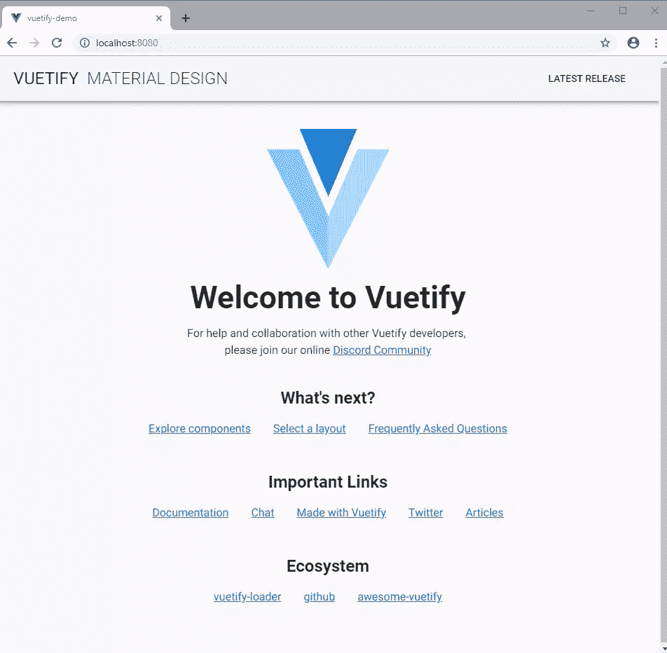

请注意，该页面现在看起来与通常使用 Vue CLI `create app`命令创建的默认起始页面有多么不同。这意味着 Vuetify 设置正确。让我们分解 Vuetify 代码，从这个组件开始:

```
<v-app>
  <!-- put content here.... -->
</v-app> 
```

`v-app`组件是您的应用程序正常工作所必需的强制包装器。它用于确定布局的网格断点。它可以存在于`<body>`内部的任何地方，但是必须是所有 vue 化组件的**的父级。`v-content`组件必须是`v-app`的直接后代。**

我们将讨论的下一个组件是`v-toolbar`。这可以用作应用程序的主要工具栏。你可以在里面放置图标、菜单和其他项目。

```
<v-app>
  <v-toolbar app>
    <!-- put content here.... -->
  </v-toolbar>
</v-app> 
```

你会遇到的第一个道具是`app`。这只是告诉工具栏在用户开始向下滚动时保持在顶部。如果您移除`app`支撑，工具栏将会和页面的其余部分一起滚动。你自己试试，看看会发生什么。我们可以进一步添加更多的道具来定制工具栏的外观。

使用 Vuetify 你会发现，你几乎不需要编写任何 CSS 代码来定制你的应用程序的外观。但是，如果您希望您的应用程序支持多个主题，那么您可能需要定义多个样式表。Vuetify 确实提供了一个[主题生成器](https://theme-generator.vuetifyjs.com/)来帮助你为你的主题选择一组颜色。

现在，让我们专注于使用道具定制我们的应用程序。我们要学的第一个叫`dark`。只需更新您的代码，如下所示:

```
<v-app>
  <v-toolbar app dark>
    <!-- put content here.... -->
  </v-toolbar>
</v-app> 
```

您的浏览器页面应该更新如下:

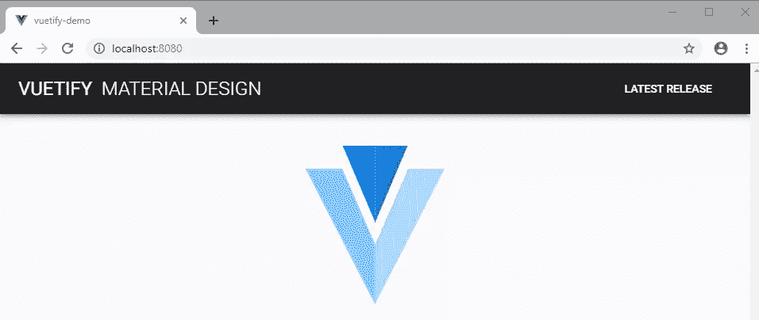

深色道具只是将背景改为黑色，文字改为白色。让我们使用另一个叫做`color`的道具:

```
<v-app>
  <v-toolbar app dark color="red">
    <!-- put content here.... -->
  </v-toolbar>
</v-app> 
```

正如所料，您的浏览器页面应该更新如下:

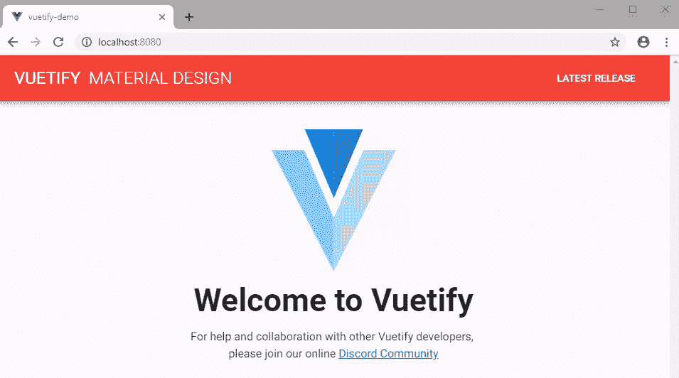

移除`dark`支柱，看看会发生什么:

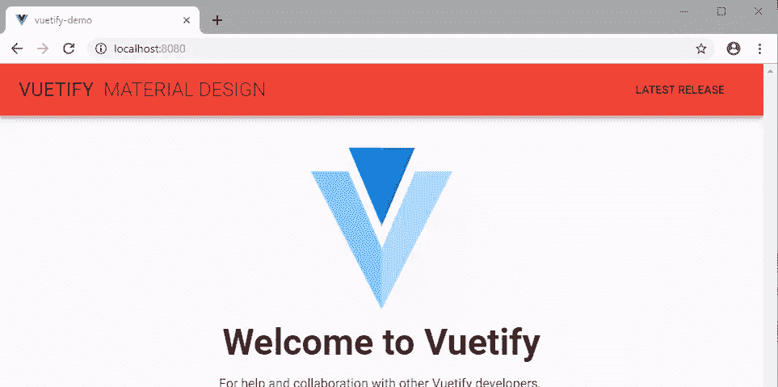

刚刚发生了什么？文本恢复为默认的黑色。当您指定`color`属性时，它会覆盖由`dark`属性定义的背景颜色。要使文本变白，你可以重新添加`dark`道具，或者你可以这样做:

```
<v-app>
  <v-toolbar app color="red white--text">
    <!-- put content here.... -->
  </v-toolbar>
</v-app> 
```

您的浏览器页面应该更新如下:

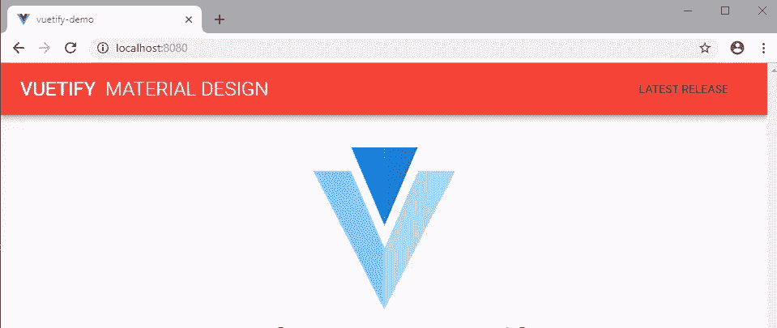

文本字体颜色变为白色，但`button`组件颜色保持不变。你可以给`button`组件添加道具`dark`或者`color="white--text`，使其为白色。不使用道具`color`，你也可以使用`class`，它会给你同样的结果。根据经验，您自己指定的任何颜色都会成为背景色。要指定字体颜色，需要在颜色名称后面加上`--text`。随意使用任何非白色或红色的颜色——尝试橙色、蓝色、绿色等。下一步做点酷的吧。按如下方式更新工具栏代码:

```
<v-app>
  <v-toolbar app dark color="purple pink--text">
    <!-- put content here.... -->
  </v-toolbar>
</v-app> 
```

您的浏览器页面应该更新如下:

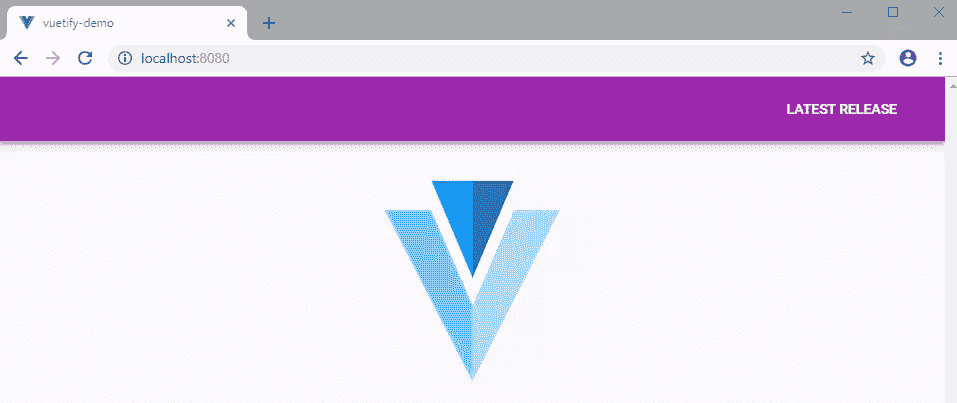

这篇课文不是很清楚，是吗？解决这个问题的一个方法是使用相互对比的颜色。另一个我们可以解决的方法是使背景变暗，前景变亮。按如下方式更新代码:

```
<v-app>
  <v-toolbar app dark color="purple darken-4 pink--text text--lighten-3">
    <!-- put content here.... -->
  </v-toolbar>
</v-app> 
```

您的浏览器页面应该更新如下:

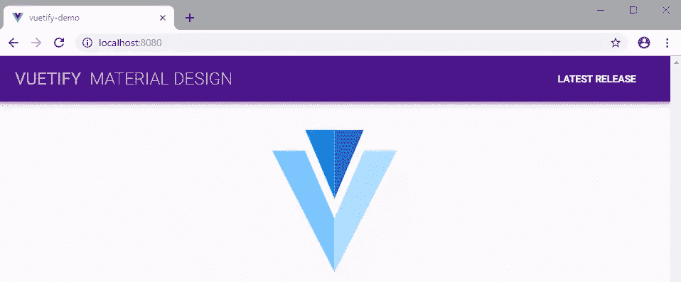

这篇课文现在清晰多了。要使背景变暗，可以使用从`darken-1`到`darken-4`的值。每一级都会增加黑暗。您可以使用从`lighten-1`到`lighten-4`的值来使背景变亮。如果您想要更改文本颜色，请在变亮或变暗属性前添加`text--`，例如`text--lighten-3`。我们还有`accent-1`到`accent-4`似乎是控制饱和度的。`accent-1`降低色彩饱和度，而`accent-4`增加饱和度，变得更加鲜明。

请注意，我不是凭空扯出这些道具和价值。这里是关于虚拟化颜色的文档。

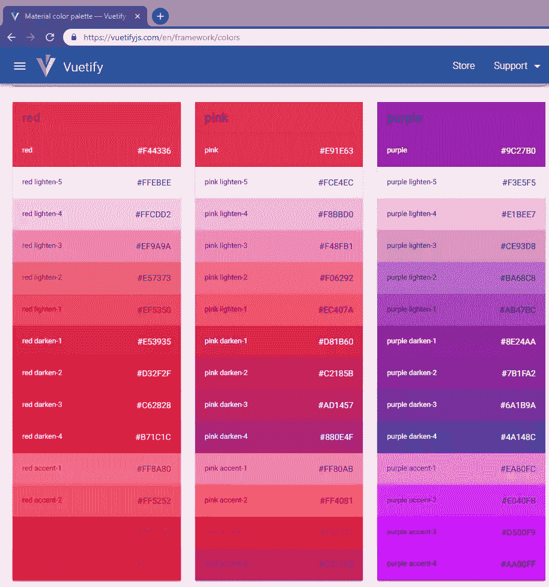

不要费心去记忆道具或职业的名字。只需访问 Vuetify 文档，您就会找到您想要的内容。这里是 [`v-toolbar`](https://vuetifyjs.com/en/components/toolbars#api) 的文档。请注意，有很多道具我们还没有尝试过，例如:

*   `height`
*   `light`
*   `card`
*   `dense`

请随意和他们玩得开心。看他们怎么做。请注意，大多数 Vuetify 组件共享相同的道具，如`color`。接下来，我们简单看一下网格系统。

## 网格系统

Vuetify 使用 12 点网格系统来布局应用程序的内容。它是使用 [CSS Flexbox 布局模块](https://developer.mozilla.org/en-US/docs/Web/CSS/CSS_Flexible_Box_Layout/Basic_Concepts_of_Flexbox)构建的，这是一个在响应性布局结构中分发项目的系统，不使用浮动或位置。网格支持针对特定屏幕尺寸或方向的 5 个媒体断点。

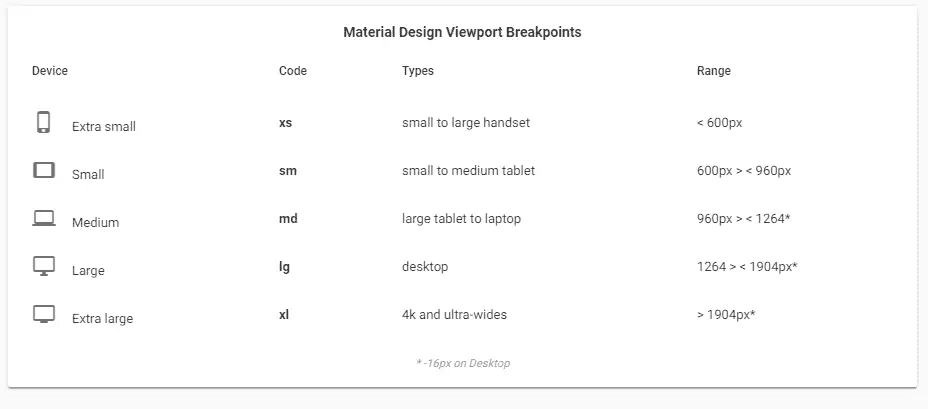

为了进行实际演示，请前往`components/HelloWorld.vue`并查看文件。下面是代码的简化版本:

```
<template>
  <v-container>
    <v-layout text-xs-center wrap>
      <v-flex xs12>
        <v-img
          :src="require('../assets/logo.svg')"
          class="my-3"
          contain
          height="200"
        ></v-img>
      </v-flex>

      <v-flex mb-4>
        <h1 class="display-2 font-weight-bold mb-3">Welcome to Vuetify</h1>
        <p class="subheading font-weight-regular">
          For help and collaboration with other Vuetify developers,
          <br />please join our online
          <a href="https://community.vuetifyjs.com" target="_blank"
            >Discord Community</a
          >
        </p>
      </v-flex>

      <v-flex mb-5 xs12>
        <h2 class="headline font-weight-bold mb-3">What's next?</h2>
        <v-layout justify-center>
          <a href="#" class="subheading mx-3">Explore Components</a>
          <a href="#" class="subheading mx-3">Select a layout</a>
          <a href="#" class="subheading mx-3">F.A.Q</a>
        </v-layout>
      </v-flex>
    </v-layout>
  </v-container>
</template> 
```

组件只是将你的内容放在屏幕的中间。如果您添加了`fluid`道具，您的内容将占据屏幕的整个宽度。`v-layout`用于对内容进行分组和对齐。有一个`v-layout`的[现场演示](https://vuetifyjs.com/en/framework/grid#layout-playground)，可以帮助你了解它的使用方法。`v-flex`组件基本上是一个包含一列或多列内容的盒子。

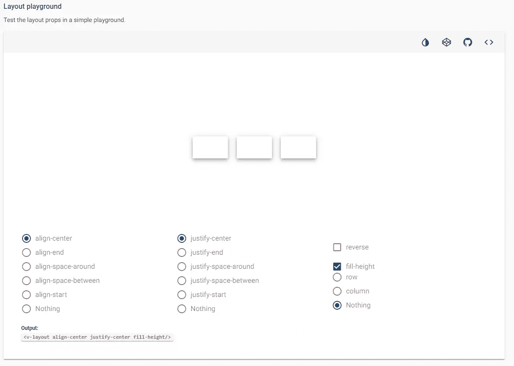

我们不会详细讨论 Vuetify 网格——这是一个值得单独撰写一篇文章的主题。如果你是网格的新手，你可以看看我们的文章，[CSS 网格布局模块简介](https://www.sitepoint.com/introduction-css-grid-layout-module/)。否则，只需向下滚动到下一部分，了解如何在 Vuetify 中设置路线和导航。

## 路由和导航

在安装过程中，有一个安装路由器包的选项。如果您这样做了，那么您应该在`views`文件夹中有一些文件。确认文件`router.js`存在并且设置正确。Vuetify 是在考虑`vue-router`的情况下建造的。因此你会发现你不需要使用`router-link`组件。通过简单地指定`to`属性，许多 Vuetify 组件可以充当路由链接。

用以下代码替换`App.vue`中的代码:

```
<template>
  <v-app>
    <!-- Start of Navigation -->
    <nav>
      <!-- Start of app toolbar -->
      <v-toolbar app>
        <v-toolbar-side-icon
          @click.stop="drawer = !drawer"
          class="hidden-md-and-up"
        ></v-toolbar-side-icon>
        <v-toolbar-title class="headline text-uppercase"
          >Vuetify Demo</v-toolbar-title
        >
        <v-spacer></v-spacer>
        <v-toolbar-items class="hidden-sm-and-down">
          <v-btn flat to="/" exact>Home</v-btn>
          <v-btn flat to="/about">About</v-btn>
        </v-toolbar-items>
      </v-toolbar>
      <!-- End of app toolbar -->

      <!-- Start of mobile side menu -->
      <v-navigation-drawer app v-model="drawer" right>
        <!-- Menu title -->
        <v-toolbar flat>
          <v-list>
            <v-list-tile>
              <v-list-tile-title class="title">Menu</v-list-tile-title>
            </v-list-tile>
          </v-list>
        </v-toolbar>
        <v-divider></v-divider>
        <!-- Menu Links -->
        <v-list>
          <v-list-tile to="/" exact>
            <v-list-tile-action>
              <v-icon>home</v-icon>
            </v-list-tile-action>
            <v-list-tile-content>Home</v-list-tile-content>
          </v-list-tile>
          <v-list-tile to="/about">
            <v-list-tile-action>
              <v-icon>description</v-icon>
            </v-list-tile-action>
            <v-list-tile-content>About</v-list-tile-content>
          </v-list-tile>
        </v-list>
      </v-navigation-drawer>
      <!-- End of mobile side menu -->
    </nav>
    <!-- End of Navigation -->

    <v-content>
      <!-- Display view pages here based on route -->
      <router-view></router-view>
    </v-content>
  </v-app>
</template>

<script> export default {
    name: "App",
    data() {
      return {
        drawer: false // Hide mobile side menu by default
      };
    }
  }; </script> 
```

我在代码中添加了注释，这样您就可以理解了。明智的做法是将菜单项放入数组数据结构中。然而，为了简单起见，我保留了完整的代码复制，以便您可以轻松理解 Vuetify 组件的结构。下面是我们刚刚使用的一些组件的文档链接:

*   [v 型工具栏](https://vuetifyjs.com/en/components/toolbars)
*   [v 形分割线](https://vuetifyjs.com/en/components/dividers)
*   [v-list](https://vuetifyjs.com/en/components/lists)
*   [垂直导航抽屉](https://vuetifyjs.com/en/components/navigation-drawers)
*   [材料图标](https://material.io/tools/icons/?style=baseline)

如果你没有注意到，Vuetify 自动在`index.html`中添加了一个材质图标的链接。您可以立即开始访问材质图标。接下来，将`views/Home.vue`中的代码替换为:

```
<template>
  <v-container>
    <v-layout>
      <h1>Home page</h1>
    </v-layout>
  </v-container>
</template> 
```

另外，将`views/About.vue`中的代码替换为:

```
<template>
  <v-container>
    <v-layout>
      <v-flex xs12>
        <h1 class="display-1">About Page</h1>
        <p>
          Lorem ipsum dolor, sit amet consectetur adipisicing elit. Excepturi
          obcaecati tempora sunt debitis, minima deleniti ex inventore
          laboriosam at animi praesentium, quaerat corrupti molestiae recusandae
          corporis necessitatibus vitae, nam saepe?
        </p>
      </v-flex>
    </v-layout>
  </v-container>
</template> 
```

完成上述更改后，您的浏览器应该会自动更新。这是应用程序在完整桌面视图下的外观:

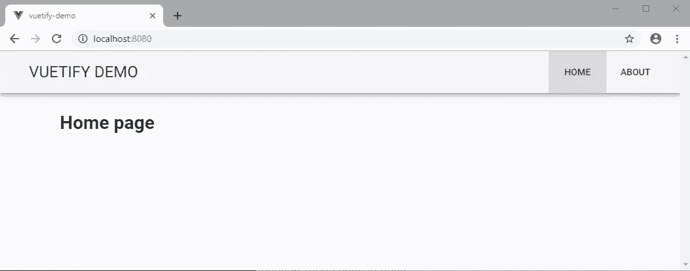

当您调整浏览器大小时，应用程序应该切换到移动视图。侧面菜单打开时，它应该是这样的:

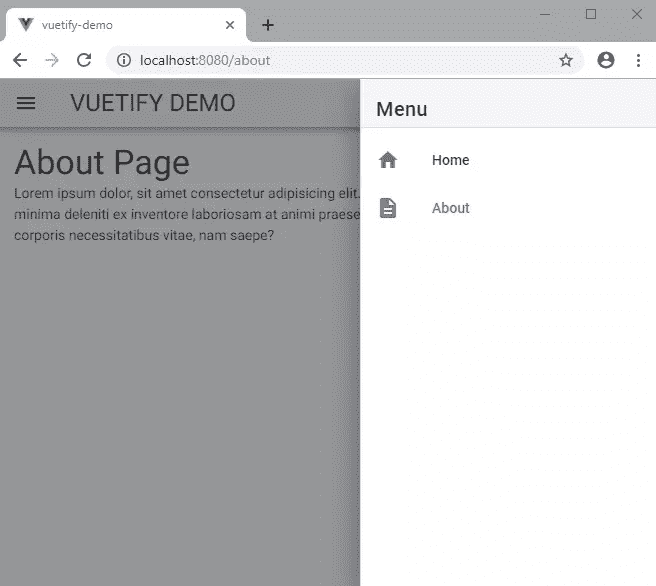

我认为我们用很少的代码就构建了一个有吸引力的响应性 web 应用程序，这是非常不可思议的。让我们在下一节构建一个`LoginForm`组件来结束。

## 构建登录表单

构建登录表单非常简单。创建文件`components/Login.vue`并复制以下代码:

```
<template>
  <v-layout align-center justify-center>
    <v-flex xs12 sm8 md4>
      <v-card class="elevation-12">
        <v-toolbar dark color="purple">
          <v-toolbar-title>Login Form</v-toolbar-title>
        </v-toolbar>
        <v-card-text>
          <v-form>
            <v-text-field
              prepend-icon="person"
              name="login"
              label="Login"
              id="login"
              type="text"
            ></v-text-field>
            <v-text-field
              prepend-icon="lock"
              name="password"
              label="Password"
              id="password"
              type="password"
            ></v-text-field>
          </v-form>
        </v-card-text>
        <v-card-actions>
          <v-spacer></v-spacer>
          <v-btn dark color="pink">Login</v-btn>
        </v-card-actions>
      </v-card>
    </v-flex>
  </v-layout>
</template> 
```

我使用了以下组件来构建登录屏幕:

*   [T2`v-card`](https://vuetifyjs.com/en/components/cards)
*   [T2`v-form`](https://vuetifyjs.com/en/components/forms#form)
*   [T2`v-btn`](https://vuetifyjs.com/en/components/buttons)

请务必查看每个组件的文档，看看还可以对它们进行哪些定制。下一次更新`views/Home.vue`如下:

```
<template>
  <v-container>
    <v-layout>
      <h1>Home page</h1>
    </v-layout>
    <Login class="mt-5" />
  </v-container>
</template>

<script> import Login from "../components/Login";

  export default {
    components: {
      Login
    }
  }; </script> 
```

如果您想知道类`mt-5`是什么意思，它只是添加了一个 48px 的`margin-top`。查看[间距](https://vuetifyjs.com/en/framework/spacing#spacing)的文档，了解它在 Vuetify 中是如何工作的。通过指定类别，您可以轻松地在内容的任何方向添加预设边距和填充。您的主页现在应该显示以下内容:

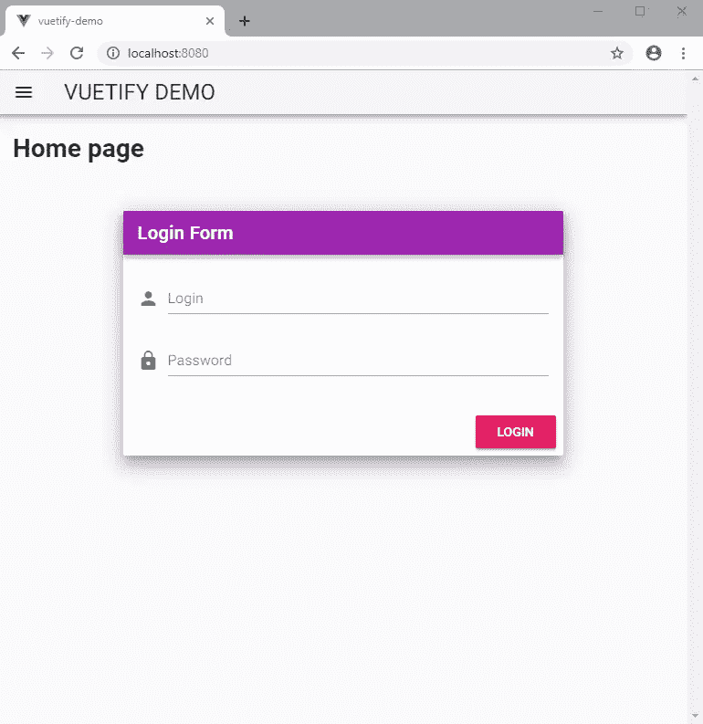

## 摘要

既然您已经阅读完了这篇介绍性文章，您应该知道我们只是触及了皮毛。如果你有使用其他 CSS 框架的经验，比如 Bootstrap，你会发现 Vuetify 非常容易使用。事实上，你会发现 Vuetify 比大多数流行的 CSS 框架有更多有用的特性和组件。如果你想构建一个完全自定义外观的 web 应用程序，Vuetify 可能不适合你。Vuetify 是为那些希望使用大多数人熟悉的设计快速构建 web 界面的人准备的。材料设计是一个流行的系统，已经在每个没有安装自定义皮肤的 Android 设备上实现。

Vuetify 通过使用经过高度研究的前端设计，可以帮助您节省时间和金钱。你不必花很多时间去创造你自己的设计语言。除了为应用程序主题声明默认颜色之外，您甚至不必编写 CSS。

我希望你喜欢学习 Vuetify，并且它将成为你将来构建 Vue.js 应用程序的 UI 框架！

## 分享这篇文章