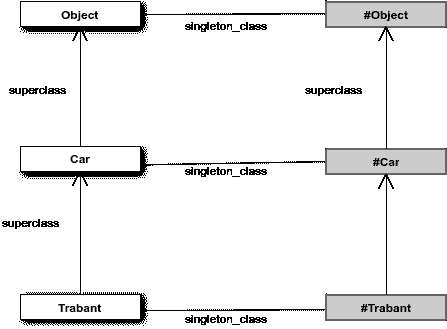
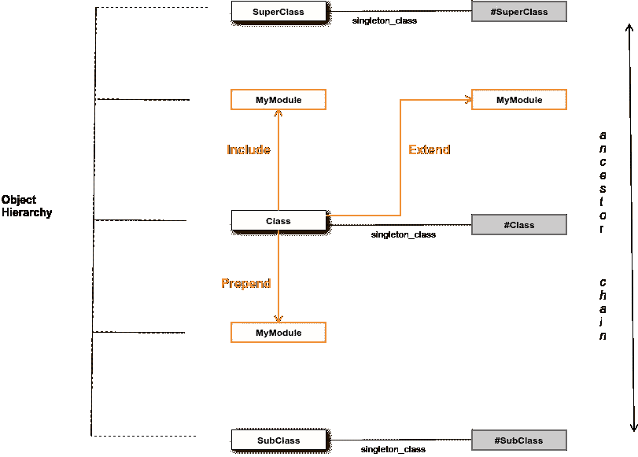
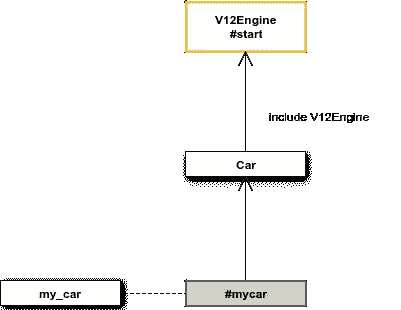
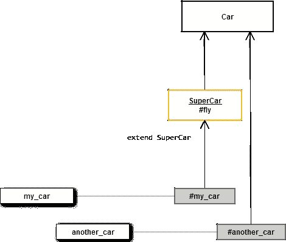

# 了解 Ruby 模块的内幕

> 原文：<https://www.sitepoint.com/get-the-low-down-on-ruby-modules/>


模块是非常灵活的语言结构，可以应用于各种各样的用例，比如命名空间、继承和修饰。然而，一些开发人员仍然对模块如何工作以及它们如何与自己的代码交互感到困惑。本文旨在阐明模块及其用法。

## Ruby 对象模型(ROM)

和 Ruby 的大多数东西一样，一旦我们理解了模块如何适应 Ruby 对象模型(ROM ),模块就非常容易使用。ROM 由作为类的对象(*类对象*，又名类)和作为类实例的对象(*实例对象*)填充。哦，还有模块！让我们创建几个类:

```
class Car
  def drive
    "driving"
  end
end

class Trabant < Car
end 
```

如果我们在 2D 平原上想象 ROM，那么对象层次看起来像这样:



我们的类所派生的类对象位于我们的类之上。从我们的类派生的类对象位于它的下面。在我们类的右边，是它的特征类(也称为单例类或元类)。特征类也是类对象，因此，它们有超类，通常是我们类的超类的特征类，或者在实例对象的情况下，是对象本身的类。对特征类的完整描述超出了本文的范围，它本身就值得写一篇文章。现在，不要太担心他们，只要知道他们在那里，他们有一个目的。

那么，当我们基于类实例化一个对象时会发生什么呢？

```
my_car = Car.new 
```

Ruby 将直接在我们的 Car 类下创建我们对象的 eigenclass。它会把我们的新实例(`my_car`)放在它的特征类的左边，在对象层次之外。

我们实际上可以在 Ruby 的`irb`中验证这一切:

```
 my_car.class
        => Car 
> my_car.singleton_class
        => #<Class:#<Car:0x0000000165e568>> 
> my_car.singleton_class.class
        => Class 
> my_car.singleton_class.superclass
        => Car 
```

### 方法查找

让我们在对象上调用一个方法。

```
my_car.drive 
```

我们在(`my_car`)上调用方法的对象被称为*接收者*对象。Ruby 有一个非常简单的查找方法的算法:

> 接收器–>向右看–>向上看


当我们在`my_car`上调用`drive`方法时，Ruby 将首先在`my_car`的特征类对象中向右看。它不会在那里找到方法定义，所以它会查找 Car 对象，在那里它会找到`drive`的定义。了解这一点使得理解如何使用模块变得容易。

## 他们环境中的模块

我们可以用一个模块做三件事:

1.  包括在我们的类对象中
2.  将它添加到我们的类对象中
3.  用它扩展我们的类对象或实例对象

### 直升机规则



Ruby 通过遵循我称之为直升机规则将模块插入 ROM。我这样称呼它是因为在我扭曲的想象中，这个图看起来像一架直升机，如上图所示。直升机规则意味着:

1.  在我们的对象中包含一个模块会将它直接放置在我们的对象之上。
2.  在我们的对象前添加一个模块会把它直接放在我们的对象下面。
3.  用一个模块扩展我们的对象将会把它直接放在我们的对象的本征类之上。

让我们用代码验证这一点:

```
 module A; end
  module B; end
  module C; end

  class MyClass
    include A
    prepend B
    extend C
          end

   MyClass.ancestors
   => [B, MyClass, A, Object, Kernel, BasicObject] 
   MyClass.singleton_class.ancestors
   => [#<Class:MyClass>, C, #<Class:Object>, #<Class:BasicObject>, Class, Module, Object, Kernel, BasicObject] 
```

我们注意到模块 A 直接放置在`MyClass`(包含)之上，模块 B 直接放置在`MyClass`(前置)之下，模块 C 直接放置在`MyClass`的特征类(扩展)之上

**注意:**在一个类对象上调用超类方法会给我们一个在祖先链中高于我们类的下一个更高的类。然而，由于模块在技术上不是类，`superclass`不会显示任何直接在类之上的模块。为此，我们需要使用`ancestors`方法。

### 包括

让我们打开汽车类并包含一个模块:

```
module V12Engine
  def start; "...roar!"; end
end

class Car
  include V12Engine
end 
```

当我们在类中包含一个模块时，Ruby 会把它直接放在类的上面。这意味着当我们在实例对象上调用一个方法时，Ruby 会在对象层次结构中找到它并运行它:

```
my_car.start 
=>  ...roar!" 
```



这是在 Ruby 中实现多重继承的常用方法，因为我们可以在类中包含许多模块，从而赋予它许多额外的功能。用于这种效果的模块被称为“mixins”。

**注意:**这也意味着如果我们在 Car 类中定义了一个同名的方法，Ruby 将会找到并运行这个方法，而我们的模块方法将永远不会被调用。

### 假装

当我们在类前添加一个模块时，Ruby 会把它直接放在类的下面。这意味着，在方法查找过程中，Ruby 会先遇到模块中定义的方法，再遇到类中定义的方法。因此，任何模块方法都将有效地覆盖任何同名的类方法。让我们试试这个:

```
module ElectricEngine
  def drive; "eco-driving!"; end
end

class Car
  prepend ElectricEngine
end

my_car = Car.new

my_car.drive
=> eco-driving! 
```


注意，如果我们现在调用`my_car`上的`drive`方法，我们将获得该方法的前置模块的实现，而不是`Car`类的实现。当我们希望根据各种外部条件来确定方法逻辑的范围时，前置模块非常有用。比方说，我们想要测量我们的方法在测试环境中运行时的性能。不要用`if`语句和检测代码污染我们的方法，我们可以将我们的专用方法放在一个单独的模块中，并且只有在测试环境中才会将该模块添加到我们的类中:

```
module Instrumentable
  require 'objspace'
  def drive
    puts ObjectSpace.count_objects[:FREE]
    super
    puts ObjectSpace.count_objects[:FREE]
  end
end

class Car
  prepend Instrumentable if ENV['RACK_ENV'] = 'test'
end

my_car = Car.new.drive
=> 711
=> driving
=> 678 
```

### 使用实例包括和前置

因为实例对象被放置在 ROM 层次结构之外，所以没有“上面”或“下面”来放置模块(参见方法查找图)。这意味着我们不能在实例对象中包含或添加模块。

### 扩展类

当我们用一个模块扩展我们的类对象时，Ruby 把它直接放在我们对象的特征类之上:

```
module SuperCar
  def fly; "flying!"; end
end

class Car
  extend SuperCar
end 
```


我们的汽车实例不能访问`fly`方法，因为方法查找将从汽车实例`my_car`开始，向右移动到特征类`my_car`，然后向上移动到`Car`类及其祖先。在那条道路上永远找不到`fly`方法:

```
my_car.fly
=> NoMethodError: undefined method `fly' for #<Car:0x000000019ae8d0> 
```

但是如果我们调用类对象上的方法呢？

```
Car.fly
=> flying 
```

我们的 receiver 对象现在是`Car`类本身。Ruby 将首先向右看(`Car`)，然后向上看`SuperCar`模块，你瞧，它将找到`fly`方法。所以，用一个模块扩展一个类，有效地给了我们的类新的类方法。

### 扩展实例

我们可以扩展类的一个特定实例，如下所示:

```
my_car.extend(SuperCar) 
```

这将把超级跑车模块放在我们物体的本征类之上。



我们现在可以在车上打电话给`fly`:

```
my_car.fly
=> flying 
```

但在其他车上没有:

```
another_car.fly
=> NoMethodError: undefined method `fly' for #<Car:0x000000012ae868> 
```

用模块扩展实例对象是动态修饰特定类实例的好方法。我在 Rails 应用程序中一直使用它来轻松快速地实现 Presenter 模式(即，对我希望在视图中显示的对象进行建模)

```
<%=  my_article.extend(Presentable).title %> 
```

## 收场白

模块的内容远远超出了一篇文章所能涵盖的范围。理解模块如何适应 Ruby 对象模型对于充分和创造性地使用它们是至关重要的。让我们知道模块如何适合你的设计，以及你用它们做的所有很酷的事情！

## 分享这篇文章