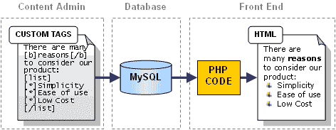
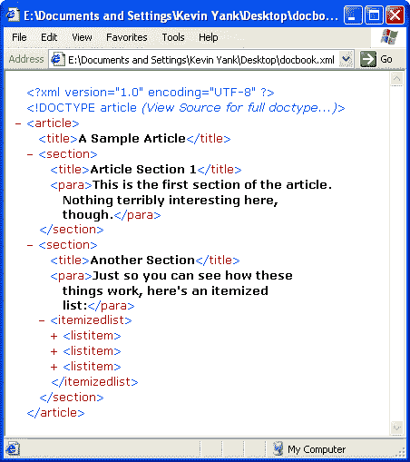
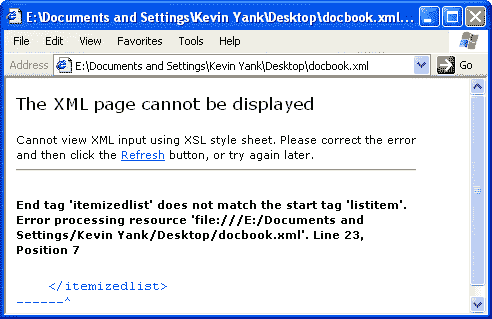
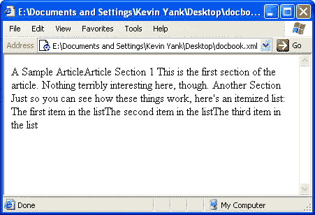
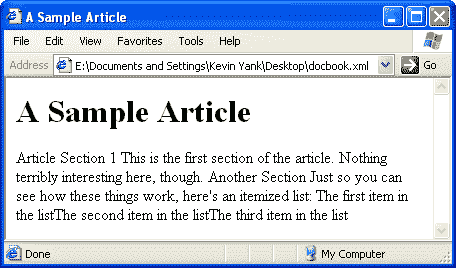
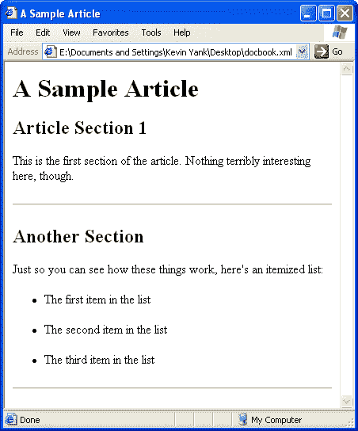
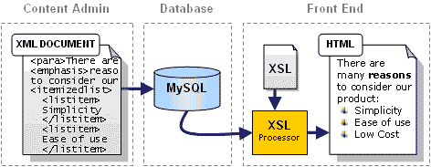
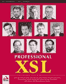
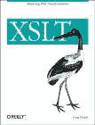

# 让 XSL 来做你的脏活

> 原文：<https://www.sitepoint.com/get-xsl-dirty-work/>

以编写内容管理系统(CMSs)为生是一件麻烦的事情，尤其是如果你完全依赖于像 PHP 这样的服务器端脚本语言。无论你为 CMS 编写的代码有多好，无论你投入了多少面向对象的模块性，当需要格式化你的显示内容时，你仍然不得不面对麻烦的、不可靠的代码。

如果这听起来对您来说很熟悉，如果您发现自己每次需要调整站点文章的格式时都在处理基于复杂正则表达式的烦人代码，那么可能是时候看看 XSL 了。

##### 重新发明轮子

如果你和我一样，你已经在许多内容驱动的网站上工作过，并且已经为他们所依赖的内容管理系统的设计提出了一个非常标准的公式:

1.  您创建了一个简单的、**自定义标签集**,供用户格式化他们的文章(教程、FAQ、评论等等)。

3.  您将夹杂着这些定制标签的文章文本存储在一个数据库中。

5.  当一个网站的访问者浏览其中一篇文章时，你会有一大堆代码将这些标记文本翻译成一个格式整齐的 **HTML 页面**供他们浏览。

图 1 展示了一个普通的基于 PHP/MySQL 的站点的结构:

**Fig. 1: A Typical Content-Based Site Design**

现在，像这样的系统当然可以工作，而且通常工作得很好。那么问题出在哪里？根据您是哪种类型的开发人员，您可能会遇到这种方法的两个问题之一:

*   缺乏**鲁棒性**
*   **复杂代码**用于相对简单的任务

让我们看一个例子。图 1 所示的`[b]...[/b]`标记转换成等价的 HTML 语法进行显示是一件相当简单的事情。下面是用 PHP 实现的方法:

```
$document = str_replace('[b]','<b>',$document); 

$document = str_replace('[/b],'</b>',$document);
```

不用动脑筋，对吧？但是如果有人忘记输入结束标签怎么办？如果他或她使用两个`[b]`标签呢？好吧，要么忍受这种错误导致的无效 HTML 输出，要么通过使用正则表达式只检测有效的标记对，将代码提升到更高的复杂程度:

```
$document = ereg_replace('[b](.*)[/b]','<b>\1</b>',$document);
```

更好，但是这段代码仍然没有指出编码错误，比如在应该输入`[b]`的时候输入了无效的`[v]`标签；它只是忽略了它们。要捕捉这样的错误需要更复杂的代码…所有这些都是为了处理你系统中最简单的标签之一！想象一下确保一个`[list]`标签包含一个或多个`[*]`标签，并且`[*]`标签没有出现在`[list]`标签之外的噩梦！

大多数遵循上面讨论的设计模式的站点会选择简单的、定制的标签处理代码，这些代码缺乏实施这些类型的约束和防止操作错误的健壮性。

那么，还有什么选择呢？不要多此一举！一个用 XSL 构建的系统不仅会为你做所有的解析和检查，而且它从一开始就被设计用来将定制的基于标签的文档转换成 HTML 页面和其他流行的文档格式。听起来不错吧？请继续阅读！

##### XSL:2 分钟之旅

**可扩展样式表语言**，或简称为 **XSL** ，是三种独立语言的组合，它们都被[万维网联盟(W3C)](https://www.w3.org/) 认可:

*   **XSL 转换(XSLT)** 让您定义一组规则，这些规则获取 XML 文档，分割它，然后以另一种格式生成文档。XSLT 1.0 于 1999 年 11 月正式发布，更新的版本正在开发中。
*   **XML 路径语言(XPath)** 允许您指向 XML 文档中的标签、属性和其他内容，其路径类似于您的计算机用来访问硬盘上的文件的文件名和目录名。XSLT 使用 XPath 来挑选 XML 文档的部分，用于转换成另一种文档类型。XPath 1.0 是在 1999 年 11 月与 XSLT 同时标准化的，从那以后一直保持稳定。
*   **XSL 格式化对象(XSL-FO)** 包含 XSL 标准的一部分，当要创建的文档类型支持颜色、字体和间距等属性时，它允许您通过指定这些属性来格式化使用 XSLT 创建的文档的各个部分(如 PDF)。XSL-FO 直到 2001 年 10 月 15 日才最终确定，这一事件预示着完整的 [XSL 1.0 规范](https://www.w3.org/Style/XSL/)的正式发布。

抛开令人困惑的标准组合不谈，XSL 是一种更健壮、更简单的处理定制标记文档以显示为格式化 HTML 页面的方式。

**Fig. 2: XML to Formatted HTML Conversion with XSL**

如图 2 所示，您只需将 XML 文档和 XSL 样式表一起输入 XSL 处理器，XSL 样式表包含将其转换为 HTML 的规则(有相当多的可用[)。XSL 处理器处理对丢失或无效标签的所有检查，然后执行 XSL 样式表中指定的转换。生成的是完全格式化的 HTML 文档，可以发送到用户的浏览器了！](http://www.xmlsoftware.com/xslt/)

Microsoft Internet Explorer 6+和 Netscape 6+都内置了符合标准的 XSLT 处理器(也就是说，它们支持 XSL 转换，但不支持 XSL 标准中新引入的 XSL-FO 部分)，这使得在将 XSL 用于您的站点之前，在您自己的计算机上学习 XSL 变得非常容易。让我们看一个例子来演示 XSL 的基础知识。

##### 我们的样本文档

下面是一篇以 XML 文档形式撰写的文章的简单示例。就其本质而言，XML 允许您定义自己的标签，因此您站点的文档格式可以简单或复杂。然而，对于这个例子，我使用 DocBook XML 文档格式的标记，前提是在有标准的情况下使用标准总是更好。有关 DocBook 格式的更多信息，请参见本文末尾的进一步阅读部分。

```
<?xml version="1.0" encoding="UTF-8"?>   

<!DOCTYPE article PUBLIC "-//OASIS//DTD DocBook V4.0//EN"   

          "http://www.oasis-open.org/docbook/xml/4.0/docbookx.dtd">   

<article>   

  <title>A Sample Article</title>   

  <section>   

    <title>Article Section 1</title>   

    <para>   

    This is the first section of the article. Nothing terribly   

    interesting here, though.   

    </para>   

  </section>   

  <section>   

    <title>Another Section</title>   

    <para>   

    Just so you can see how these things work, here's an   

    itemized list:   

    </para>   

    <itemizedlist>   

      <listitem>   

        <para>The first item in the list</para>   

      </listitem>   

      <listitem>   

        <para>The second item in the list</para>   

      </listitem>   

      <listitem>   

        <para>The third item in the list</para>   

      </listitem>   

    </itemizedlist>   

  </section>   

</article>
```

除了前几行之外，这看起来应该很简单。让我们仔细看看这些:

```
<?xml version="1.0" encoding="UTF-8"?>
```

这一行其实是可选的。它将文件的其余部分标识为 XML 文档，指出它所遵循的 XML 标准的版本(1.0)，并设置文档编码(UTF-8)。如果这个文档要在所有文档都是 XML 的系统中使用，您可以省去这一行，没有问题。

```
<!DOCTYPE article PUBLIC "-//OASIS//DTD DocBook V4.0//EN"   

          "http://www.oasis-open.org/docbook/xml/4.0/docbookx.dtd">
```

这个看起来相当可怕的东西是**文档类型(`DOCTYPE`)声明**。它告诉任何读取这个文档的程序(对于我们的目的，XSL 处理器)在哪里可以找到**文档类型定义(DTD)** ，它描述了在这个文档的什么结构中允许什么标签。在这个例子中，我们指出文档应该遵守 DocBook 4.1.2 标准，该标准是在所示的 URL 中定义的(如果您很好奇，可以使用 Web 浏览器查看一下——要了解更多关于 dtd 的信息，可以阅读任何关于 XML 的好书)。如果文档的其余部分不遵守该 URL 定义的规则，XSL 处理器在处理文档时会指出错误。

`DOCTYPE`声明实际上也是可选的，但是如果你不包含它，XSL 处理器将不会检查你的文档是否用有效的标签正确构建。如果没有 DTD，它只会检查你使用的标签是否都与结束标签匹配，是否嵌套正确(比如`<b><i>this is good</i></b>`，但是`<b><i>this is not</b></i>`)。

<q>*如果您决定使用 DTD 来验证您站点上使用的标签，您可能希望在文档被处理之前自动向文档添加* `DOCTYPE` *声明，而不是强迫用户在每篇文章的顶部键入它。你甚至可以自动添加* `<article>` *和* `</article>` *标签，以减少用户需要输入的标签数量。*</q>

将上述文件另存为`docbook.xml`，然后在 MSIE 6 或更高版本中打开。您应该会看到如图 3 所示的内容。

**Fig. 3: An XML Document in MSIE 6**

默认情况下，MSIE 在这个吸引人的可折叠代码视图中显示 XML 文档(您可以通过单击开始标记旁边的红色+和–图标来展开和折叠文档的各个部分)。不管您相信与否，这种视图实际上是由内置的 XSL 样式表在动态 HTML 中生成的，只要 XML 文档没有自己的样式表，就会应用 XSL 样式表。

关于 Internet Explorer 的 XML 处理引擎，您可能还会注意到，它忽略了 DTD 中规定的可接受的标签和文档结构规则。如果您将`<article>`和`</article>`标签更改为`<invalidtag>`和`</invalidtag>`(或任何其他不在[DocBook 标准](http://www.docbook.org/tdg/en/html/docbook.html)中的标签)，Internet Explorer 不会抱怨。那是因为 MSIE 中的 XML 处理器据说是**非验证**。更高级的是，**验证** XML 处理器*将*验证标签。

但是，Internet Explorer 会检查 XML 文档的格式是否正确。尝试删除`<itemizedlist>`中的一个`</listitem>`标签；您应该会得到如图 4 所示的错误消息。

**Fig. 4: Internet Explorer spots an unclosed tag**

我们的 XML 文档已经准备好了，下一步是创建一个 XSL 样式表来格式化它以便显示。

##### 您的第一个 XSL 样式表

就像创建它们来格式化的文档一样，XSL 样式表是 XML 文档。因此，您可以在任何方便的文本编辑器中编写第一个 XSL 样式表。输入以下内容并将其保存为`docbook.xsl`:

```
<?xml version="1.0" encoding="UTF-8"?>    

<xsl:stylesheet version="1.0"    

  xmlns:xsl="https://www.w3.org/1999/XSL/Transform">    

  <xsl:output method="xml" indent="yes" encoding="utf-8"    

    doctype-public="-//W3C//DTD XHTML 1.0 Strict//EN"    

    doctype-system="https://www.w3.org/TR/xhtml1/DTD/xhtml1-strict.dtd" />    

  <!-- templates go here -->    

</xsl:stylesheet>
```

这是任何输出 HTML 文档的 XSL 样式表的基本外壳。您将再次看到，它以可选的(但也是可取的)`<?xml ...?>`标记开始，标记为 XML 文件。您不需要为一个`<!DOCTYPE>`标签而烦恼，因为 XSL 处理器知道所有关于 XSL 文件的信息，以及在没有 DTD 的帮助下哪些标签是允许的，哪些是不允许的。

标签应该是每个 XSL 文件的外部元素。`version`属性表明我们使用的是 XSL 1.0 版语法。`xmlns:xsl`属性为我们所有的 XSL 标签设置了一个 **XML 名称空间**。基本上，这个属性表示所有以`xsl:`(这被称为**前缀**)开头的标签都与 URL `https://www.w3.org/1999/XSL/Transform`相关。如果您尝试在 Web 浏览器中访问该 URL，您会看到消息“这是 XSLT 名称空间。”这个页面实际上没有向 XSL 处理器提供任何信息，但是所有的 XSL 处理器只会处理与那个 URL 相关的标签。这允许您在自己的文档中使用诸如`<stylesheet>`和`<output>`这样的标签，XSL 处理器会忽略这些标签。您可以使用任何您喜欢的前缀将文档中的 XSL 标签与该 URL 相关联(例如，如果属性是`xmlns:exesel="https://www.w3.org/1999/XSL/Transform"`，那么所有 XSL 标签都必须以前缀`exesel:`开头)，但是`xsl:`是事实上的标准。

在`<xsl:stylesheet>`内部，我们的基本“外壳”中只有一个标签:`<xsl:output ... />`。这告诉 XSL 处理器这个样式表将输出 XHTML 文档，而不是文本文件。这个标签的属性看起来有点复杂，但实际上它们只是设置将出现在生成的 XHTML 文档中的`<?xml ...?>`和`<!DOCTYPE>`标签中的值。这个标签末尾的`/`表示它是一个空标签，因此不需要结束标签。

和 HTML 一样，XML 文档中的注释是用`<!-- -->`标签创建的；因此，标签`<!-- templates go here -->`将被 XSL 处理器忽略。

让我们看看将这个简单的样式表应用到我们在上一节中创建的文章(`docbook.xml`)时会发生什么。对于大多数 XSL 处理程序，我们会指定要处理的文档和样式表，它会生成 HTML 文件。但是，在支持 XSL 的浏览器中，如 Internet Explorer 5+和 Netscape 6+,您需要向 XML 文档添加一个标记，告诉它在显示文档时使用哪个样式表。在 docbook.xml 的顶部，就在`<!DOCTYPE>`标签之后和`<article>`之前，添加下面一行:

```
<?xml-stylesheet href="docbook.xsl" type="text/xsl"?>
```

这是一个**处理指令**，它告诉基于浏览器的 XSL 处理器(以及一些支持它的独立处理器)在哪里可以找到适合这个文档的 XSL 样式表。在这个例子中，我们告诉它使用`"docbook.xsl"`，它与当前文档位于同一个目录中。保存这个更改，确保这两个文件在同一个目录中，然后在 IE6+或 NS6+中查看`docbook.xml`。图 5 展示了它在 MSIE 6 中的样子。

**Fig. 5: A DocBook with Minimal Style**

如您所见，XSL 样式表的默认行为是一次遍历 XML 文档中的一个标记，并打印出其中包含的文本。为了改变这种行为并使我们的文档可读，我们需要在样式表中添加一些规则。在 XSL 语言中，这些规则被称为**模板**。下面是一个模板示例:

```
 **<xsl:template match="/article">**    

  <html>    

  <head>    

  <title>**<xsl:value-of select="title"/>**</title>    

  </head>    

  <body>    

  <h1>**<xsl:value-of select="title"/>**</h1>    

  **<xsl:apply-templates select="section"/>**    

  </body>    

  </html>    

  **</xsl:template>**
```

如您所见，这是 XSL 标签(由前缀`xsl:`标识，以粗体显示)和大家熟悉的 HTML 标签的混合，它们都包含在一个`<xsl:template>`标签中。大多数 XSL 模板通过匹配出现在要处理的 XML 文档中的标签来工作。要匹配的标签在`<xsl:template>`标签的`match`属性中指定。

在这种情况下，我们的模板被设置为匹配`/article`。这是一个 XPath 表达式(记住，XPath 是指向 XML 文档中标签的标准)。开头的`/`表示 XML 文档的‘根’,所以`/article`意味着这个模板应该匹配出现在 XML 文档的根中的任何`<article>`标签。因为我们的 DocBook 文档以一个`<article>`标签开始，这个模板将匹配那个标签。

所以 XSL 处理器看到在我们文档的根中有一个匹配`<article>`标签的模板。现在怎么办？处理器查看`<xsl:template>`标签内部，看看该做些什么。模板以三个 HTML 标签开始:`<html>`、`<head>`和`<title>`。由于这些不是 XSL 标签(它们不以`xsl:`前缀开头)，处理器将这些标签直接写入输出文档。

下一个标签是一个 XSL 标签:`<xsl:value-of select="title"/>`。`<xsl:value-of>`标签允许您选择一个带有 XPath 表达式的标签，并在文件的特定位置输出它所包含的文本(它的值)。用`select`属性指定要输出其值的标签。在这种情况下，我们有`select="title"`。这表示我们想要选择当前标签内的`<title>`标签(当前标签是匹配模板的标签— `<article>`)。回头看看示例文档，您应该会发现`<article>`标签包含一个`<title>`标签，标签中有文章的标题(“一篇示例文章”)。所以我们刚才所做的就是把这个标题作为要创建的 HTML 文档中的页面标题！

<q>*注意，由于* < xsl:value-of > *标签不包含任何文本或标签，我们通过用斜线(* `/` *)结束标签，使结束标签* < /xsl:value-of > *标签成为开始标签的一部分。如果没有这个快捷键，我们将不得不键入* `<xsl:value-of select="title"></xsl:value-of>` *。*</q>

在几个 HTML 标签(`</title>`、`</head>`、`<body>`)之后，我们有了另一个被 HTML `<h1>...</h1>`标签包围的< xsl:value-of >标签。这个标签和用于页面标题的标签是一样的，所以它会再次打印出我们文档的标题，但是这次是在`<h1>...</h1>`标签之间，所以它会在页面顶部以大写字母显示。

文档中的下一个 XSL 标签是`<xsl:apply-templates select="section"/>`。这个强大的标签告诉 XSL 处理器获取当前标签(`<article>`)中出现的任何和所有`<section>`标签，并对它们应用任何匹配的模板。在这个阶段，我们的 XSL 样式表中只有这一个模板，所以输出标签和任何子标签内容的默认行为生效。

一旦以这种方式处理了两个`<section>`标签，XSL 处理器返回到这里，通过输出`</body>`和`</html>`标签来完成这个模板。已经到达文档的末尾(在结束的`</article>`标签之后没有更多的标签)，XSL 处理器终止。

下面是 XSL 样式表从示例文档中生成的 HTML 文档:

```
<?xml version="1.0" encoding="utf-8"?>    

<!DOCTYPE html PUBLIC "-//W3C//DTD XHTML 1.0 Strict//EN"    

"https://www.w3.org/TR/xhtml11/DTD/xhtml1-strict.dtd">    

<html>    

   <head>    

      <title>A Sample Article</title>    

   </head>    

   <body>    

      <h1>A Sample Article</h1>    

      Article Section 1    

      This is the first section of the article. Nothing terribly    

      interesting here, though.    

      Another Section    

      Just so you can see how these things work, here's an    

      itemized list:    

      The first item in the list    

      The second item in the list    

      The third item in the list    

   </body>    

</html>
```

如果您用上面的模板更新您的`docbook.xsl`副本，然后再次在浏览器中查看`docbook.xml`，您将看到如图 6 所示的这个 HTML 文档。

**Fig. 6: A Slightly More Stylish DocBook**

让我们在样式表中再添加几个模板:

```
 <xsl:template match="section">    

    <xsl:apply-templates/>    

    <hr/>    

  </xsl:template>
```

这个模板匹配`<section>`标签，并将被上面模板中的`<xsl:apply-templates select="section"/>`标签触发。对于`<article>`中的每个`<section>`，它会将模板(或默认行为)应用于任何子标签，然后输出一个`<hr/>`标签。

```
 <xsl:template match="section/title">    

    <h2><xsl:apply-templates/></h2>    

  </xsl:template>
```

该模板匹配出现在`<section>`标签内的`<title>`标签(即它不会匹配`<article>`顶部的`<title>`标签)，并输出`<h2>...</h2>`标签之间的标签内容(应用任何适用的模板)。

剩下的三个模板应该是不言自明的:

```
 <xsl:template match="para">    

    <p><xsl:apply-templates/></p>    

  </xsl:template>    

  <xsl:template match="itemizedlist">    

    <ul><xsl:apply-templates/></ul>    

  </xsl:template>    

  <xsl:template match="listitem">    

    <li><xsl:apply-templates/></li>    

  </xsl:template>
```

[点击此处](http://www.webmasterbase.com/examples/xslcms/docbook.xsl)下载完整的`docbook.xsl`文件如果你对如何将所有这些组合在一起有任何疑问，那么在你最喜欢的浏览器中再次查看`docbook.xml`文件，这次是完整的模板。它应该如图 7 所示显示。

**Fig. 7: The Fully Styled Article**

如果您有兴趣查看更加时尚的文档版本， [DocBook 开放存储库](http://docbook.sourceforge.net/projects/)包含一个[官方 XSL 样式表分发版](http://docbook.sourceforge.net/projects/xsl/index.html)，旨在支持和格式化 DocBook 标准中定义的所有标签。如果您感兴趣，可以下载最新的稳定版本，看看应用了该样式表的文章是什么样子。

##### 把所有的放在一起

虽然这篇文章只让我们了解了 XSL 的皮毛，但我希望至少我已经让您相信，编写 XSL 样式表将您的定制标记文档转换成可视的 HTML 页面比用 ASP、PHP 或 Perl 编写等效的脚本要容易得多。

最终，所有常用的浏览器都将像 Internet Explorer 6+和 Netscape 6+那样内置对 XSL 的支持，这时我们只需向浏览器发送一个带有 XSL 样式表的 XML 文件来显示它。然而，就目前而言，实际应用 XSL 处理器必须集成到服务器中，如图 8 所示。

**Fig. 8: An XML-Based CMS**

如果这看起来比传统的 CMS 设置起来更复杂，在传统的 CMS 中，文档格式是用定制代码来完成的，那么它就是如此。然而，额外设置时间的回报远远超过了补偿:

*   代码更加简单和**更加可重用**。
*   XSL 模板**更容易维护**。
*   标签解析器是为你编写的，并且**更加健壮**。
*   XSL 解析器给了**比定制代码更好的性能**。

在以后的文章中，我们将更深入地研究 XSL，以创建更强大的模板，并学习如何设置 PHP 和其他服务器端语言来使用 XSL 处理器。不过，现在，我将把相关资源的列表留给您，这将让您在设计下一个 CMS 之前有足够的时间来思考。

##### 进一步阅读

**XSL**

 [专业 XSL ](http://amazon.com/exec/obidos/ASIN/1861003579/webmasterresou05/) (Wrox 出版社)

这是一本优秀的参考资料，也是我个人对当前可用的 XSL 书籍的精选，这本书不仅涵盖了 XSL 的核心语言元素，还讨论了 XSL-FO、到更深奥的文档类型(如 SVG 和 VoiceXML)的转换，并提供了一个在使用 ASP 的内容管理系统中使用 XSL 的实际案例研究。总之，这是一个非常全面和完整的 XSL 世界指南。

 [ XSLT](http://amazon.com/exec/obidos/ASIN/0596000537/webmasterresou05/)

这是一本设计精美、可读性很强的书，涵盖了关于 XSL 转换(XSLT)的所有知识。不幸的是，这本书没有涉及 XSL-FO(它完善了 XSL 标准，但只是刚刚定稿)，也没有涵盖 Wrox 的书所关注的围绕 XSL 的许多工具。我还在这本书的代码片段中发现了一些令人烦恼的印刷错误，这表明这本书可能是仓促出版的。也就是说，我发现用这本书学习 XSL 稍微容易一些，因为写作风格更加清晰简洁。

**DocBook**

DocBook 的简明指南(IBM DeveloperWorks)

”这篇文章解释了什么是 DocBook，以及如何使用 DocBook 创建一个简单的文档。Joe Brockmeier 引导您创建一个文档，并使用 SGML-tools Lite 解析文档，生成 HTML、PostScript、纯文本和 PDF 版本的文档。他还提供了关于 DocBook 的更多参考资料，以及在哪里可以找到 SGML-tools lite 和其他 DocBook 工具的提示。

DocBook:权威指南

O'Reilly 的书的免费在线版本，作为 DocBook 标准的官方文档。这本书的一个旧的硬拷贝版本也在各大书店有售。

[DocBook XML DTD](http://xml.coverpages.org/docBook.html)(XML 封面)

跟踪与 DocBook XML 标准相关的最新发展、文章和资源的网站。

## 分享这篇文章