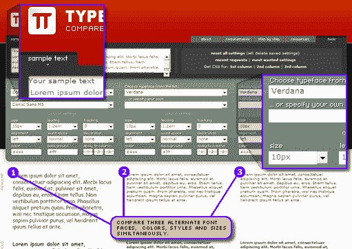

# 用排字机感受字体

> 原文：<https://www.sitepoint.com/getting-a-feel-type-with-typetester/>

我总是认为你可以从印刷设计背景中挑选网页设计师。他们通常崇拜字体——事实上，崇拜与字体有关的一切——并且通常仍然带着近乎疯狂的伤疤，这是因为他们被剥夺了他们在印刷作品中曾经拥有的控制和微妙。

毫无疑问，获得正确的类型是几乎任何设计工作的最基本元素之一，无论是网页还是其他。它渗透了网站设计的所有层面，从 logo 到页脚，印刷设计师通常比大多数人对它的 ems 语言、点、字距、行距和空白有更好的感觉。

[进入一个很棒的小工具——type tester](http://typetester.maratz.com/)。如果你想更好地理解字体的自然流动、比例和平衡感，TypeTester 是一个很好的方法，可以让不同的文本处理互相对比。

它的操作相当简单。

*   使用提供的“lorem”文本，或者，如果您愿意，插入您自己的测试副本。
*   从常用系统字体(PC 和 Mac)列表中选择，或者从您的家庭系统中选择任何字体——这在您考虑筛选字体时很有用。
*   调整它的大小，给它上色，拉伸它，压缩它，给它加下划线，通常把这个地方混在一起。
*   查看页面下方以粗体、斜体、粗体斜体、大写、小型大写等形式显示的设置的实时变化。
*   在色谱柱之间转换您喜欢的任何组合，以便更好地调整相似的设计。
*   当你高兴的时候，转到右上角的“工具”标签，选择下载任何一个栏目的 CSS。

这是一个很棒的想法，已经很好地实现了。我们经常与以印刷为中心的设计公司合作，这些公司对网页字体的困难和局限性没有深刻的认识——这给了他们一种动手操作但相对非技术性的工作方法。类似地，我们可以想象把挑剔的客户送到 Typetester，给我们有用的建议，告诉我们他们希望他们的文本如何显示。

向 Maratz.com 致敬。

## 分享这篇文章