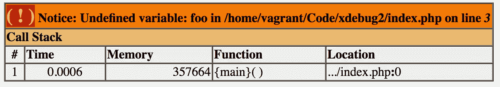
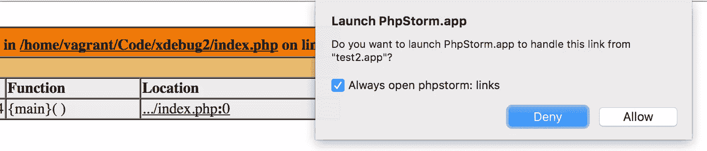
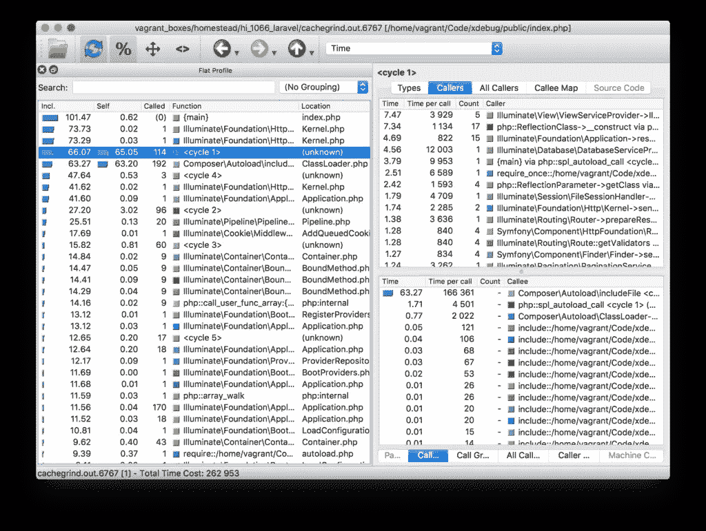
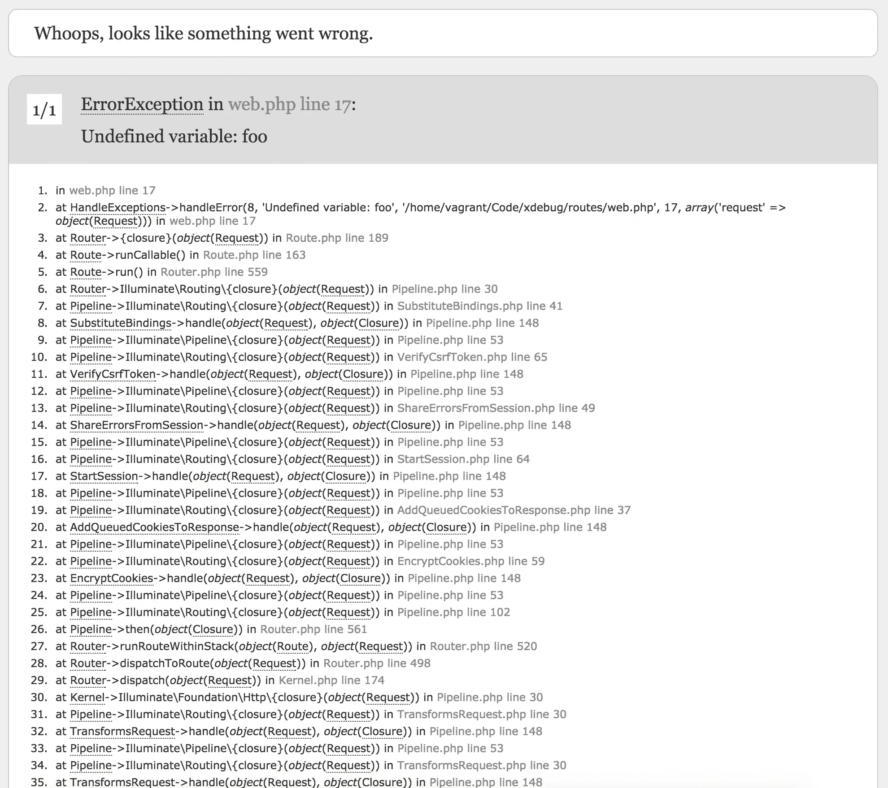
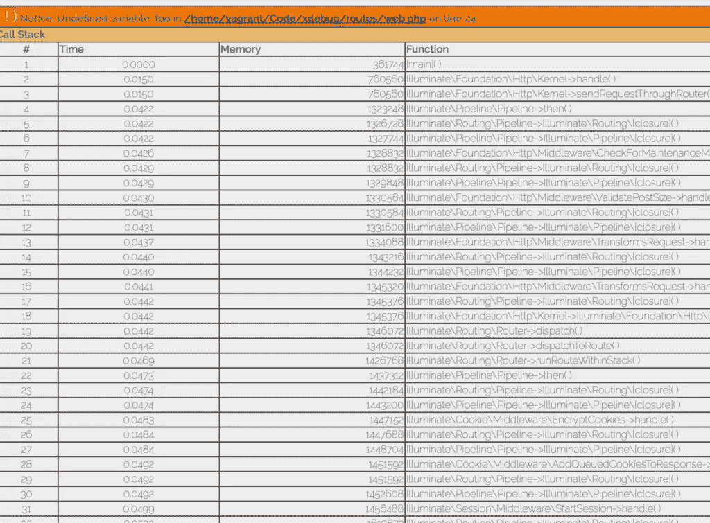

# 了解并爱上 Xdebug

> 原文：<https://www.sitepoint.com/getting-know-love-xdebug/>

Xdebug 第一次出来已经 15 年了。我们认为这是向世界重新介绍它的绝佳机会，并解释它是如何以及为什么会这样做。


Xdebug 是一个 PHP 扩展(意味着它需要被编译并安装到 PHP 安装中)，它为开发人员提供了一些调试功能。这些包括:

*   堆栈跟踪——应用程序到达给定错误的路径的详细输出，包括传递给函数的参数，以便于跟踪错误。
*   一个更漂亮的`var_dump`输出，产生彩色编码信息和结构化视图，类似于 [VarDumper](https://www.sitepoint.com/var-dump-introducing-symfony-vardumper/) ，以及一个超级全局转储器
*   一个探查器，用于找出代码中的瓶颈在哪里，以及在外部工具中可视化那些性能图的能力。这导致了一个类似于[黑火](https://www.sitepoint.com/an-in-depth-walkthrough-of-supercharging-apps-with-blackfire/)产生的图形。
*   远程调试器，可用于远程连接 Xdebug 和正在运行的代码，以及像 IDE 或浏览器这样的终端客户端，以单步调试代码中的断点并逐行执行您的应用程序。
*   代码覆盖率告诉你在一个请求中有多少代码被执行。这几乎完全是为了帮助单元测试，并找出测试覆盖了多少代码。

## 我如何使用它？

Xdebug 附带了一个详细的[安装页面](https://xdebug.org/docs/install)，它可以处理大多数(如果不是所有)用例，但是如果你想玩下面介绍的功能，我们建议使用 [Homestead 改进版](https://www.sitepoint.com/quick-tip-get-homestead-vagrant-vm-running/)，它附带了预安装和激活的扩展。

## 有了现代的 ide 和 Blackfire，甚至还需要 Xdebug 吗？

ide 确实提供了很好的代码查找功能，所以[链接格式](https://xdebug.org/docs/all_settings#file_link_format)功能的有用性似乎值得怀疑。现在也有各种各样的记录器可以处理错误和异常。同样，Blackfire 中的函数跟踪和剖析做得非常好。然而，文件链接格式只是 Xdebug 的一部分，使用 Blackfire 也有自己的障碍——安装扩展，设置密钥，然后付费保留跟踪历史。记录器的使用也需要很多远见，并且不容易添加到应用程序中。

然而，Xdebug 不仅仅是这样——它仍然是正确的单元测试所必需的(测试框架依赖于它来获得代码覆盖报告),通过其他方式进行远程断点调试远非易事，而且它是一个如此古老和稳定的工具，以至于已经接近完美。

如果您当前的工具可以处理它提供的一切，或者您不需要它提供的功能，那么当然就没有必要使用 Xdebug，但是我还没有开始一个没有它也可以高效完成的项目。

## 让我们试一试

我假设您现在已经安装了 Xdebug。如果没有，请考虑用[宅基地改良](https://www.sitepoint.com/quick-tip-get-homestead-vagrant-vm-running/)。

让我们用一个简单的`index.php`文件创建一个新的项目文件夹，并回显一个不存在的变量，如`$foo`:

```
<?php

echo $foo; 
```

这是我们得到的结果:



### 关闭 Xdebug

像这样的屏幕现在是如此普遍，如此普遍的默认，以至于大多数人甚至没有意识到这已经是 Xdebug 风格的了。为了证明这一点，让我们来看看没有 Xdebug 时是什么样子。为了禁用 Xdebug，我们编辑了[家园改进版](https://www.sitepoint.com/quick-tip-get-homestead-vagrant-vm-running/)中的文件`/etc/php/7.1/fpm/conf.d/20-xdebug.ini`，并注释掉第一行:

```
;zend_extension=xdebug.so
xdebug.remote_enable = 1
xdebug.remote_connect_back = 1
xdebug.remote_port = 9000
xdebug.max_nesting_level = 512 
```

之后我们需要重启 PHP-FPM:

```
sudo service php7.1-fpm restart 
```

*注意:如果你使用另一个安装了不同 PHP 的开发环境，你的 Xdebug ini 文件可能在别的地方。请查阅您的系统文档以了解确切位置，或者在下面的评论中询问。*


看起来很贫瘠，不是吗？它缺少整个调用堆栈。当然，这些信息在这一点上不是特别有用，因为我们只处理单个文件中的一行，但是我们稍后会看到更多的使用。

现在通过删除之前编辑的文件中的注释来重新激活 Xdebug，让我们继续。别忘了重启 PHP！

### 文件点击率

如果你是一个固定在 IDE 上的开发人员(就像我在 PhpStorm 上一样)，能够点击堆栈跟踪中的文件并在 IDE 中直接访问它们肯定是有用的。毫无疑问，这是调试速度的重大提升。我将演示 PhpStorm 的这个特性的实现。

首先，让我们打开之前编辑的`20-xdebug.ini`文件，并向其中添加以下内容:

```
xdebug.file_link_format = phpstorm://open?%f:%l 
```

请注意，这在某些浏览器中可以工作，在其他浏览器中则不行。例如，Opera 的链接有问题，会很乐意崩溃，而 Firefox 和 Chrome 工作得很好。

如果我们现在刷新无效的 PHP 页面，我们将获得可点击的链接，这些链接将在错误的准确位置打开 IDE:



对于其他 ide 和编辑器来说，这个过程是相同的。

## Xdebug 与流浪者和 PhpStorm

但是，为什么要止步于此呢？今天，许多人在虚拟机上开发，确保 PHP 运行时的任何部分都不会接触到他们的主机，保持一切快速流畅。Xdebug 在这些情况下表现如何？此外，在使用如此复杂的环境时，是否有可能进行断点调试，即逐句通过代码并分别检查每一行？

幸运的是，Xdebug 完美地支持断点续传远程连接。我们之前已经讨论过这个过程，所以要获得完整的 gif 设置教程，请遵循[这个指南](https://www.sitepoint.com/install-xdebug-phpstorm-vagrant/)。

## 使用分析器

作为最后一个快速提示，让我们检查一个经常被忽略的特性:分析器。为此，我们需要一个像 Laravel 这样的大型应用程序。

```
composer create-project --prefer-dist laravel/laravel xdebug 
```

我们再次需要编辑`20-xdebug.ini`文件，并添加以下内容:

```
xdebug.profiler_enable_trigger = 1
xdebug.profiler_output_dir = /home/vagrant/Code/ 
```

注意，我们没有使用`xdebug.profiler_enable = 1`,因为我们不想让它一直保持 100%的时间。相反，我们将使用触发查询参数“XDEBUG_PROFILE”来有选择地激活它。我们还将 cachegrind 配置文件输出到 VM 的主共享文件夹中，以便我们可以使用主机操作系统上的工具来检查它。

重启 PHP 后，我们可以通过执行`homestead.app/?XDEBUG_PROFILE`来尝试一下(用您选择的 vhost 或 VM 的 IP 替换 homestead.app)。果然，文件就在那里:


每个操作系统都有自己的 cachegrind inspector 工具，在 OS X，qcachegrind 就是其中之一，可以通过自制软件轻松安装。有关安装说明，请参考您的操作系统的首选可视化工具。安装后…

```
 brew install qcachegrind --with-graphviz 
```

…在查看器中打开文件，我们可以看到执行流程的详细分解:



profiler 提供了不可估量的数据财富，以及对代码行为方式的真正深入的洞察，就像 Blackfire 一样。然而，有了概要分析器的本地输出，自动化对性能和执行复杂性的持续跟踪比以往任何时候都更容易。

## 在 Laravel 上强制 Xdebug 的渲染

默认情况下，Laravel 有自定义的错误报告和渲染设置。在 Laravel 中，类似于我们之前使用未定义变量导致的错误将如下所示:

```
<?php

use Illuminate\Http\Request;

Route::get('/', function(Request $request){
    echo $foo;
    return view('welcome');
}); 
```



虽然 Symfony 的错误屏幕(这是 Laravel 在这里使用的)配置为也可以很好地与 Xdebug 的点击通过(尝试一下，你现在可以点击这些文件和它们的行！)，我真的很怀念内存输出(Xdebug 默认也输出 stacktrace 中每个时间点的内存使用情况)。让我们在开发模式下将其恢复到 Xdebug 的屏幕，这样我们就可以检查该属性。

```
<?php
use Illuminate\Http\Request;

Route::get('/', function(Request $request){
    ini_set('display_errors', 1);
    restore_error_handler();
    echo $foo;
    return view('welcome');
}); 
```

您可以在这里看到我们更新了默认路由，以便它首先激活错误显示(我们之前看到的屏幕本身不是显示的错误，而是一个被捕获的异常，其堆栈跟踪是手动提取和呈现的)，然后我们将错误处理程序恢复为其默认值，覆盖 Laravel 的。

刷新之后，果不其然，我们的旧屏幕又回来了——看看那个栈迹塔和内存消耗就知道了！



我鼓励你自己做进一步的调查——在文档中四处寻找，尝试各种选项，看看你能从你的应用中找到什么。

## 结论

Xdebug 对于任何开发人员来说都是一个很有价值的工具。这是一个强大的扩展，完全符合这个词，扩展了我们日常工作的语言，使之更加冗长，更加用户友好，并且在出现错误时不那么神秘。

整整 15 年过去了，Xdebug 为调试工具树立了一个高标准。我要感谢吴镇男一直以来对它的开发和维护，如果你选择写一两篇关于深入使用、注意事项或之前没有人想到的秘密功能组合的教程，我会很高兴。让我们把这个词传播出去，帮助它在下一个 15 年里茁壮成长。

生日快乐，Xdebug！

## 分享这篇文章