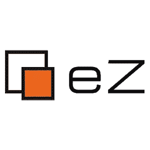
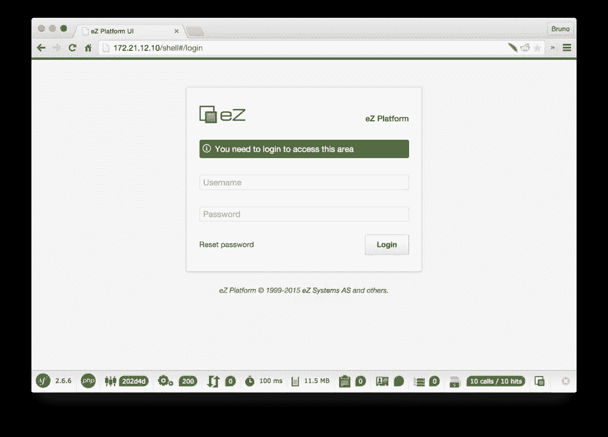
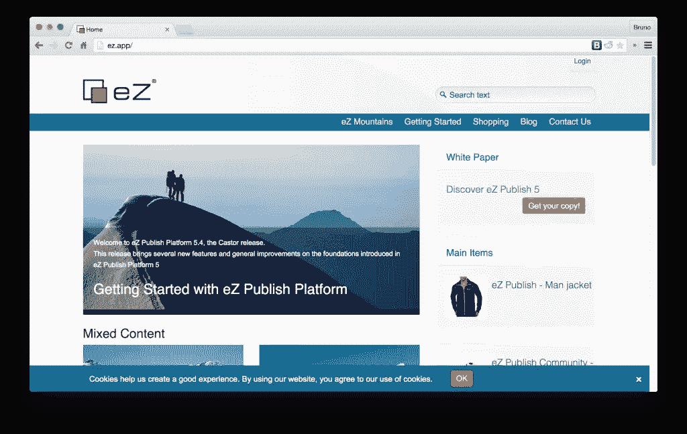

# 流浪者上的 eZ 平台入门

> 原文：<https://www.sitepoint.com/getting-started-ez-platform-vagrant/>

去年，我在一个流浪者盒子上安装 eZ Publish 时有过一次不愉快的经历。从那以后，他们通过[全力以赴移除遗留堆栈](http://share.ez.no/blogs/core-development-team/farewell-ez-publish-legacy-welcome-ez-platform)，显著改善了软件和虚拟机友好性。我们将在本教程中使用的虚拟机设置来自 [NetGen](http://www.netgenlabs.com/) 的实验室和 [@vranac](https://twitter.com/vranac) 的头脑，并遵循由您真正修改的我们自己的[家园改进](https://www.sitepoint.com/quick-tip-get-homestead-vagrant-vm-running/)上的安装程序。



注意:新的 eZ 系统，现在被称为 eZ 平台，仍然处于深度 alpha 模式，并没有真正包含旧系统的所有功能。事实上，如果你想做任何类型的严肃的内容管理和修改，你需要将遗留堆栈添加到混合中，其过程在这里[描述](https://doc.ez.no/display/EZP/Installing+eZ+Publish+Legacy+on+top+of+eZ+Platform)。

## Vranac setup

Vranac 定义了一个可行的方法，为原始 Ubuntu/Trusty box 提供 eZ 平台的所有先决条件。这意味着，虽然它使您的 raw box 对于其他项目保持高度可重用性(从而节省磁盘空间)，但是配置过程可能会非常长(超过 40 分钟)。同样，要使用这种方法，你需要主机上的 Ansible，不像用 [Homestead 改进的](https://www.sitepoint.com/quick-tip-get-homestead-vagrant-vm-running/)。您可以选择自己更喜欢的设置，两者都很好。家园改进的说明在下一节，但首先，让我们看看 Vranac 的方法。

### 要求

您的主机应该具有:

*   [流浪者](http://vagrantup.com)
*   [可回答的](http://www.ansible.com/home)
*   [虚拟盒](https://www.virtualbox.org/)

注意，如果你在 Windows 上，Ansible 是不可用的。然而，配置将确保它在来宾 VM 中下载和安装 Ansible，并从内部执行它，所以不用担心。

### 克隆和升级

为了设置一个环境，我们将克隆 [@vranac](https://twitter.com/vranac) 的[流浪文件设置](https://github.com/netgen/vagrant-ansible-ezpublish.git)并`vagrant up`它。

```
git clone https://github.com/netgen/vagrant-ansible-ezpublish.git
cd vagrant-ansible-ezpublish
vagrant up
```

`up`过程应该自动处理所有供应，包括文件夹共享。这可能需要一段时间，取决于您的机器和互联网连接的速度。由于使用 NFS 进行文件共享，它可能还会要求您在主机上输入管理员密码(或者在 Windows 上显示 UAC 对话框)。

默认情况下，您所在的文件夹(`vagrant-ansible-ezpublish`)将链接到虚拟机内部的`var/www/ezpublish`。一个名为`ezpublish`的数据库也将自动创建，用户名为`ez`，密码为`ez`。

### 最后的步骤

现在，有几个注意事项要记住。

由于一些 Apache 2.4 的诡计，团队无法避开，VM 中与主机共享的文件夹是`var/www/ezpublish`而不是传统的`var/www`。因此，要在这个虚拟机上启动 eZ 平台实例，您需要在使用`vagrant ssh`进入机器后执行以下操作

```
cd /var/www/ezpublish
composer create-project ezsystems/ezplatform
mv ezplatform/* .
```

我们需要这样做，因为 create project 命令在`ezplatform`文件夹中创建了一个 eZ 项目，Apache 的 vhost 链接到了`ezpublish`中。

然后，安装演示包并使用以下命令清除缓存:

```
php ezpublish/console ezplatform:install --env prod demo
php ezpublish/console cache:clear --env prod
```

要访问前端，请转到`172.21.12.10`，要访问后端，请转到`172.21.12.10/shell`:



登录凭证为`admin` / `publish`。

**重要提示**:由于这种设置，如果出现问题，你不应该`rm -rf`文件夹`ezpublish`的内容，并假设如果你创建一个新项目，一切都会好的。如果删除该文件夹或其内容，实际上是删除了主机上该文件夹的内容，包括资源调配脚本和浮动文件。要避免这些问题，您可以:

*   在`/var/www/ezpublish`中创建类似 so `/var/www/ezpublish/project1`的子项目，并配置新的 Apache 虚拟主机来适应这种情况

或者遵循下面的说明，适用于 [Homestead 改进的](https://www.sitepoint.com/quick-tip-get-homestead-vagrant-vm-running/)，但也很容易适用于所有其他系统和虚拟机环境。

## 改进了在家园上配置 eZ

上面的设置倾向于 Apache 而不是 Nginx，在多项目设置方面有点笨拙。让我们在一个我们现在熟悉的环境中进行设置，这样我们可以在 10 分钟内启动并运行: [Homestead Improved](https://www.sitepoint.com/quick-tip-get-homestead-vagrant-vm-running/) 。按照教程进行设置。然后，`vagrant halt`它进入关机模式并建立一个新站点:

```
- map: ez.app
      to: /home/vagrant/Code/ezplatform/web
```

使用`vagrant provision`重新配置。

现在我们的新 Nginx 主机已经设置好了，让我们进入 VM 并创建一个新的 MySQL 数据库:

```
mysql -u homestead -psecret -e "create database ezpublish";
```

注意，根据默认的 Homestead 配置，用户名和密码是`homestead` / `secret`。

我们还需要安装一些 PHP 扩展:

```
sudo apt-get update
sudo apt-get install php5-intl php5-xsl
```

现在，让我们进入 VM 中的代码文件夹并创建项目。

```
cd ~/Code
composer create-project ezsystems/ezplatform
```

这可能需要一段时间，所以拿一个杯子放松一下。完成后，通过安装演示包并清除缓存来结束安装。

```
cd ezplatform
php ezpublish/console ezplatform:install --env prod demo
php ezpublish/console cache:clear --env prod
```

按照[家园改进快速入门](https://www.sitepoint.com/quick-tip-get-homestead-vagrant-vm-running/)中的说明，不要忘记将`ez.app`(或者你选择的任何一个网站名称)添加到你在主机上的`/etc/hosts`文件中。

现在，访问网址[http://ez.app/](http://ez.app/)(后面的斜线很重要，因为它迫使你的浏览器直接寻找该网站，而不是使用谷歌搜索它，如果 DNS 服务器不解析它)并享受！

[](https://www.sitepoint.com/wp-content/uploads/2015/05/1431010707Screenshot-2015-05-07-16.53.18.png)

## 潜入 PHPSummerCamp 的 EZPublish 和 Symfony

安装完成后，我们终于可以投入并构建非常复杂的系统，即使是最苛刻的网站也无法超越。对系统保持耐心是很重要的——在 alpha 模式下，它仍然非常不稳定，非常慢，但正在向那个方向发展。继续测试，用建议帮助团队——让我们通过提供尽可能多的反馈来确保它尽快发布。在开发工具打开的情况下使用它，查看错误，在[论坛](http://share.ez.no/forums)上讨论，[在论坛上发微博](https://twitter.com/ezsystems)，或者在下面的评论中告诉我们。

要深入了解这个平台，你可以去阅读[文档](https://doc.ez.no/display/MAIN/eZ+Documentation+Center)，或者你也可以来参加我们的[PHP summer camp](http://2015.phpsummercamp.com)——去年我们也参加了[的这个活动](https://www.sitepoint.com/phpsummercamp-review)。这一次，一些更加引人注目的演讲者将会飞来，包括但不限于:

*   KNPLabs 的 Ryan Weaver，
*   [伯恩哈德·舒塞克](https://twitter.com/webmozart),[普利](http://docs.puli.io/en/latest/)的创作者
*   [的大卫·布克曼](https://www.liip.ch/en)利普成名
*   来自[西里乌斯](http://sylius.org)的帕韦尔·杰德泽耶夫斯基
*   [尼古拉斯·格雷卡斯](https://twitter.com/nicolasgrekas)来自[感官实验室](http://sensiolabs.com/)

…以及更多主题，如:

*   借助 Symfony 深入了解面向对象编程
*   用普利管理资产
*   使用 Varnish 的 HTTP 缓存
*   利用 Lionframe 快速开发 API
*   示例建模
*   剖析 PHP 应用程序(Blackfire)
*   迁移到 Symfony 3.0

不仅有整整三天的实践研讨会(而不是你通常在会议上得到的传统理论轰炸)，还有乘船旅行、午餐和克罗地亚海岸线的体验(你不应该错过的东西——相信我),这是显而易见的。


该活动刚刚宣布了超级早鸟价格，门票也可供购买，所以请确保你[查看了公告栏](http://www.netgenlabs.com/Blog/Summer-Camp-Super-Early-Bird-Gets-the-Best-Price)。

太贵了？只要[说服你的老板](http://2015.phpsummercamp.com/Convince-your-boss)！确保他们知道，从长远来看，你的教育和培训比你多工作三天对公司更有好处。

## 结论

如你所见，自去年以来，安装已经进行了很长时间。系统得到了很大程度的升级，Symfony 的 DX 程序帮助解决了多平台方面和 symlink 的问题， [NetGen](http://www.netgenlabs.com/) 和 [@vranac](https://twitter.com/vranac) 的出色工作使流量得到了不可估量的提升。现在就安装 eZ 吧，玩玩它，告诉我们你的想法。用它来启动一个不仅仅需要博客的 CMS，让我们知道你对它的感受。如果你用它做了一些有趣的事情，保持联系，我喜欢更多的 eZ 教程！

反馈？评论？把他们留在下面或者告诉我在 [PHP 夏令营](http://2015.phpsummercamp.com/)的直播！

## 分享这篇文章