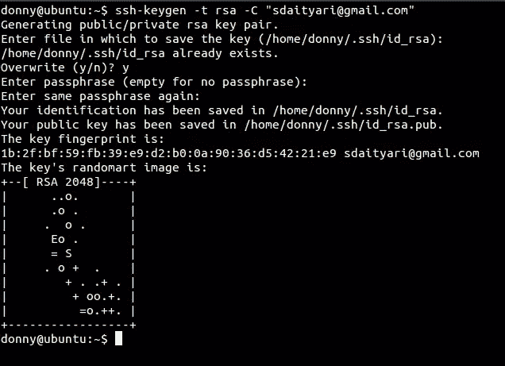
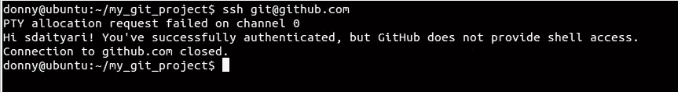
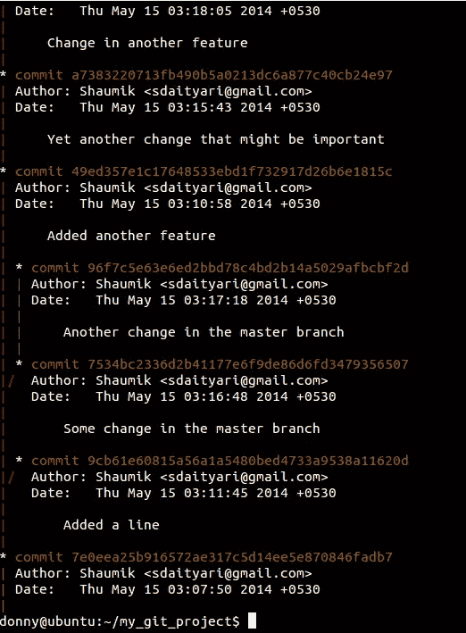
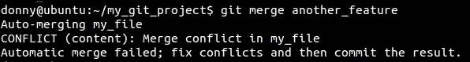
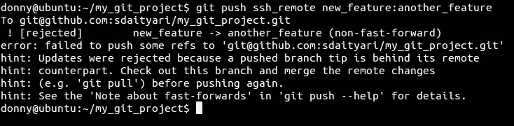
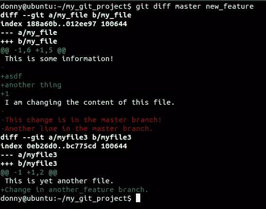
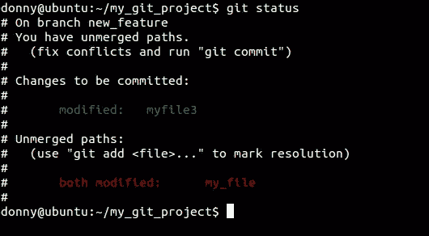
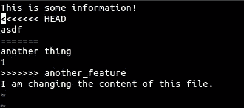
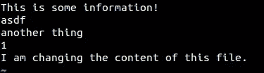

# 在团队环境中开始使用 Git

> 原文：<https://www.sitepoint.com/getting-started-git-team-environment/>

在之前的一篇文章中，我讨论了[Git](https://www.sitepoint.com/git-for-beginners/)入门，主要关注在单独工作时使用 Git。然而，Git 的核心理念围绕着分布式版本控制系统的概念。

“分布式”的概念意味着一个项目存在许多独立的版本，每个版本都有自己的历史。因此， **Git 是一个帮助你与地理上分散的团队合作的工具**。

在前一篇教程中，我们讨论了如何使用 git 管理文件，但目的是熟悉 Git 的概念(添加、提交、推送)。既然您已经知道 Git 在本地是如何工作的，那么您就可以开始使用更高级的特性了。

## 克隆

该过程的第一步是从远程资源获取代码(假设安装了 Git)。`remote`指的是存储库或项目的远程版本。我们首先使用命令`git clone`克隆资源。

```
git clone https://github.com/sdaityari/my_git_project.git
```

克隆 URL 可以从 GitHub 存储库主页的侧边栏中获得。成功克隆存储库后，会创建一个目录(默认情况下，它与项目同名)。另一个有趣的事实是，`origin` remote 现在指向我从中克隆存储库的资源(在本例中是`https://github.com/sdaityari/my_git_project.git`)。

尽管 Git 遵循分布式模型，但通常会维护一个包含稳定、更新的代码的中央存储库。

### 克隆时应该使用哪种协议？

注意，在这个例子中，存储库是通过`https`协议克隆的。[其他受欢迎的选择](http://git-scm.com/book/en/Git-on-the-Server-The-Protocols)是`ssh`和`git`。

通过`git`协议克隆需要使用看起来像`git://github.com/[username]/[repository]`的原点。除了 Git 本身的安全性之外，它不提供任何安全性。它通常很快，但是最大的缺点是不能`push`改变，因为它只提供只读访问。

如果您使用`https`协议，您的连接是加密的。GitHub 允许匿名访问公共库的`https`,但是推送任何代码时，你的用户名和密码都会被验证。GitHub 推荐[使用 ssh 上的 https】。](http://stackoverflow.com/questions/11041729/why-does-github-recommend-https-over-ssh)

`ssh`协议使用[公钥认证](http://en.wikipedia.org/wiki/Key_authentication#Authentication_using_Public_Key_Cryptography)。这需要您通过`ssh`与远程服务器建立连接。要使用`ssh`设置认证，您需要生成您的公钥/私钥对。在 Linux 中，您可以在终端中运行以下命令来生成您的密钥对。但如果你使用 GitHub 桌面客户端，这个过程是由软件自动完成的，你会收到一封电子邮件，告知你的 GitHub 账户中添加了一个 SSH 密钥。

```
ssh-keygen -t rsa -C "[email_address]"
```

注意:在这些代码示例中，我经常会在方括号中包含一些部分。那些括号中的部分将被替换为括号内的内容，但是去掉了括号。

您可以选择提供每次尝试连接时都需要的密码。在本例中，我们将其留空。您还可以指定保存密钥的文件。我们将其保留为默认值`id_rsa`。



公钥和私钥分别存储在`id_rsa.pub`和`id_rsa`文件中。对于 GitHub，您需要将您的公钥内容粘贴到您的配置文件中的“SSH”下。

要检查该过程是否成功完成，您可以在 github.com 上建立到 git 用户的连接。

```
ssh git@github.com
```



如您所见，与 GitHub 的连接是成功的，但由于 GitHub 不允许 shell 访问，连接被终止了。这意味着您可以使用`ssh`协议来拉或推变更。

一个有趣的事实是,`remote`也包含协议。这意味着通过`https`和`ssh`协议到资源的连接需要作为单独的远程存储。

## 分支

Git 最好的特性之一是分支。把分支想象成你在代码中前进的路径。这些分支可以用树枝来表示。我们的树类比失败的唯一地方是 Git 还允许您合并分支。

如果您以前在其他版本控制系统中使用过分支，您需要理清思路，因为概念有点不同。例如，如果你比较 Subversion 和 Git，[它们的合并机制是不同的](http://stackoverflow.com/questions/19333088/how-is-svn-v-1-8-branching-merging-compared-to-git)。

假设您正在开发一个聊天应用程序。有一次，你决定让人们的照片出现在他们的名字旁边，但是这个想法还没有得到老板的批准。您创建了一个分支，并处理您的想法，而旧的功能在一个单独的分支中保持不变。如果你想展示你以前的作品，你可以切换到你以前的分支。如果您的想法被批准，您可以将新的分支与旧的分支合并以进行更改。

若要检查分支列表和您正在处理的当前分支，请运行以下命令。它显示了存储库中的分支列表，当前工作的分支带有一个星号。

```
git branch
```

### 创建分支

Git 提供了一个`master`分支，默认情况下您在这个分支上工作。创建分支时，必须正确命名它们，就像函数或提交消息一样。若要创建分支，请运行以下命令。

```
git branch [branch_name]
```

这将基于最后一次提交创建一个新的分支，但仍保留在同一个分支上。要切换到不同的分支，请运行以下命令

```
git checkout [branch_name]
```

要创建一个新分支并立即切换到它，请使用:

```
git checkout -b [branch_name]
```

这将基于当前分支的最后一次提交创建一个新分支。如果您想要基于旧的提交创建分支，您应该使用命令附加标识提交的散列。

```
git checkout -b [branch_name] [commit_hash]
```

### 分支模型

在早先的一篇文章中，我谈到了为开源项目做贡献时必须遵循的准则。每个新特性必须建立在一个新的分支上，并且应该从新的分支提交一个拉请求或补丁。`master`分支只能用于与项目的原始源代码同步。

有许多不同的模型被组织用来管理他们的项目。[这篇关于 git 分支的文章](http://nvie.com/posts/a-successful-git-branching-model/)讨论了一个适用于当今大多数组织的通用模型。

### 通过分支可视化进度

既然您已经知道了如何创建分支，那么您一定想知道我们如何通过一个命令来理解这个想法。Git 的 GUI 客户机只需一次点击就可以做到这一点，但是您也可以在终端中做同样的事情。在我们的例子中，我们添加了一些提交到分支— `master`、`new_feature`和`another_feature`。

```
git log --graph --all
```



使用`git log`显示项目的历史。`--graph`显示提交的方向，而`--all`显示所有分支。您可能想添加`--oneline`来单行显示提交(当然，没有它们的细节)。

## 合并分支

让我们来看看本教程最重要的部分:在 Git 中合并分支的能力。我们讨论的一个分支模型是，所有的特性都是在单独的分支中开发的，具有理想结果的特性与`master`合并。为此，您需要将`checkout`转移到`master`分支，并将`feature`分支与其合并。

```
git checkout master
git merge [branch_name]
```



然而，在我们的例子中，我们看到出现了冲突。为什么会这样？在两个分支中的同一个文件中都有变更，Git 无法确定保留哪些变更，从而在这个过程中引发了冲突。我们将在教程的后面看到如何解决冲突。

## 与 Git 合作

在 [Git for 初学者](https://www.sitepoint.com/git-for-beginners/)的帖子中，我们以在 GitHub 上同步代码的`git push`结束。因此，您必须知道，要有效地将代码从您的本地机器发送到另一个`remote`，您需要使用`git push`命令。推动的不同方式如下。

```
git push
git push [remote]
git push [remote] [branch]
git push [remote] [local_branch]:[remote_branch]
```

第一个命令将您的代码发送到`origin` remote 的当前分支。当指定远程名称时，当前活动分支中的代码将被推送到远程上同名的分支。或者，您可以从本地分支推送至远程上不同名称的分支。

如果您喜欢最后一个命令推送，有一个技巧可以删除远程上的一个分支。如果您提供一个空的`[local_branch]`，它将删除服务器上的`remote_branch`。看起来是这样的:

```
git push [remote] :[remote_branch]
```

不过，遥控器并不总是接受`push`。以下面的例子为例。：



“非快进”分支是指远程分支末端提交与本地系统上的任何提交都不匹配。这意味着远程分支在我上次同步后已经发生了变化。

在这种情况下，我需要从远程分支提取更改，更新我的本地分支，然后推送我的更改。一般来说，总是先拉后推被认为是一种好的做法。语法与推送完全相同。

```
git pull --rebase [remote] [branch]
```

或者，有些人做了一个`git fetch`后跟着一个`git merge`，而不是一个`git pull`。从本质上来说，[一个拉操作完成一个取操作，然后是一个合并操作](http://stackoverflow.com/questions/292357/whats-the-difference-between-git-pull-and-git-fetch)。还应该使用一个`--rebase`，因为它首先将变更拉至您的分支，然后将您的工作放在它上面。这是可取的，因为所有可能的冲突都是基于您所做的更改而产生的，因此您可以很好地决定保留什么和不保留什么。

另一种可能性是，不允许每个贡献者访问他们的知识库的组织通过电子邮件工作。在这种情况下，您可以通过比较提交或分支之间的差异来创建一个`diff`文件。`git diff`命令显示了不同之处，并将更改存储在一个文件中，然后通过邮件发送给组织。这些差异文件通常被称为“补丁”。

```
git diff [branch1] [branch2] > [file_name]
```



diff 文件的生成部分在[这篇文章](https://www.sitepoint.com/understanding-version-control-diffs/)中有详细解释。如果您有一个`diff`文件，并且想要应用补丁，您只需使用下面的命令。

```
git apply [file_name]
```

## 解决冲突

解决冲突在任何 Git 工作流中都很重要。许多人在同一文件上工作，并且自您上次获取更改后，服务器有该文件的较新版本，这是很自然的。当您试图合并对同一个文件进行了更改的两个分支时，也会发生冲突。有时 Git 会尝试应用某些算法，看看自己是否能解决冲突，但它通常会发出一个红旗，以确保没有数据丢失。

当我们试图合并我们的分支机构时，我们注意到出现了冲突。让我们看看如何解决这个问题。A `git status`向你展示是什么导致了冲突。



然后，我们可以使用文本编辑器(比如 VIM)打开识别出的文件，看看哪里出了问题。该文件的内容如下所示:



仔细看文件。注意 Git 插入的三行代码。

```
<<<<<<<< HEAD
...
...
========
...
...
>>>>>>>> another_feature
```

这意味着很简单。在`<<<<<<<< HEAD`和`========`之间的代码行是你当前分支的一部分，而在`========`和`>>>>>>>> another_feature`之间的代码行存在于你试图合并的分支中。你需要做的是删除这三条标记线，并将它们之间的内容编辑成你想要的内容。在我们的例子中，让我们保留所有的信息，所以最终文件看起来像这样。

尽管我们将所有内容都保存在两个块中，但是在解决冲突时，您可以删除所有内容，保留一些内容，或者在它们的位置上完全写入其他内容。



在我们的案例中，这种冲突非常简单。在更复杂的项目中，您可能有许多导致冲突的实例，在冲突的文件中包含许多上面显示的行的实例。解决一个相当复杂的冲突的过程是一样的:通过一个`git status`检查受影响的文件，打开每个文件，搜索`HEAD`的出现。

从遥控器上拉东西时也会发生冲突。在这种情况下，最后一行应该是`>>>>>>>> [commit_hash]`而不是`>>>>>>>> [branch_name]`，其中`[commit_hash]`是提交的标识散列。

## 结论

Git 在开发人员社区中很受欢迎，但是批评家经常把它比作瑞士军刀。的确，Git 提供了很多特性。但是一旦你理解了基本原理，它们使用起来非常直观。让我们希望这篇教程能够让你开始使用 Git，让你在团队环境中做出贡献。

如果您对以上讨论的任何功能有任何补充，请添加您的评论。

## 分享这篇文章