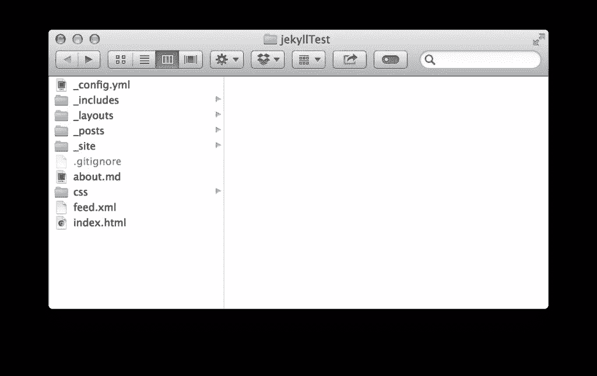
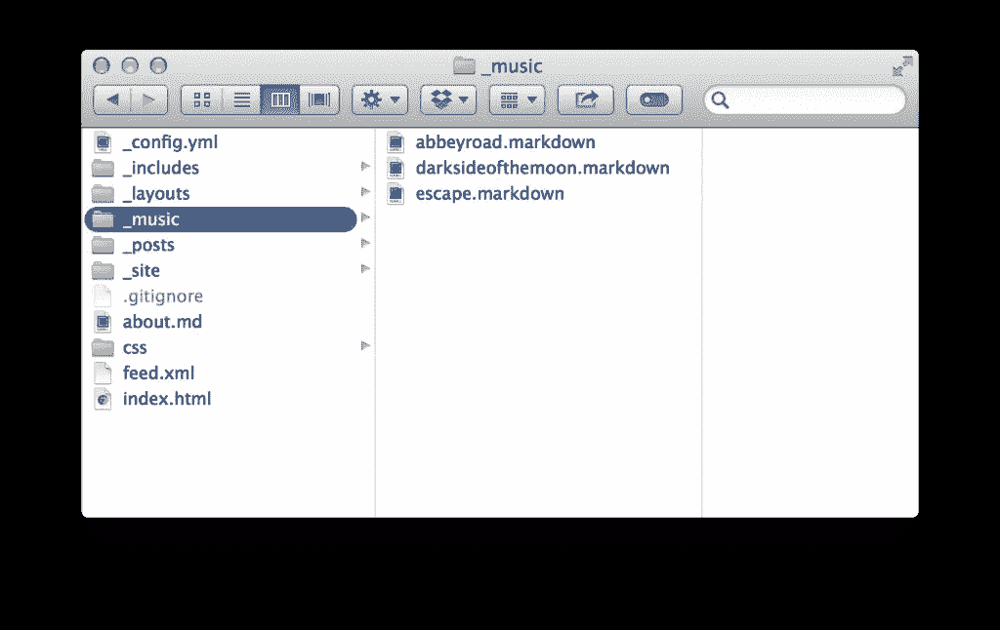

# Jekyll 收藏入门

> 原文：<https://www.sitepoint.com/getting-started-jekyll-collections/>


最近，我开始彻底改造我的投资组合网站，让人们更好地了解我是谁，我做什么。作为一名开发人员，参与个人项目并展示自己的能力总是一件有趣的事情。我重做我的作品集网站的第一个任务是决定我将如何构建这个东西。我决定用哲基尔。Jekyll 2.0 最近发布了，随之而来的是一个有趣的新特性——收藏。在这篇文章中，我将概述 Jekyll 的伟大之处，如何快速入门，并解释 Jekyll 系列的来龙去脉。关于 Jekyll 的初级读本，请查看文档。它做得非常好，非常有帮助，尤其是如果你想更深入地了解 Jekyll 的功能和特性。

## 是什么让哲基尔如此伟大

在决定重做我的作品集网站时，我知道我想要简单且易于定制的东西。我不一定需要一个数据库或任何后端。像 WordPress 或 Craft 这样的 CMS 解决方案会有些矫枉过正——我只是想要简单的东西。在寻找的过程中，我遇到了哲基尔。它简单、轻便，适合写博客。它解析 Markdown，内置代码格式，生成静态文件，甚至可以通过 GitHub 托管。所有这些(还有更多！)Jekyll 的各个方面让我很容易相处，也是我的正确选择。在 Jekyll 的 2.0 版本中有一些很大的改进，我最喜欢的是 Jekyll 的收藏。不过，首先让我们来看一下如何开始使用 Jekyll。

## 快速设置 Jekyll

要设置 Jekyll，有几个要求。您将需要安装 Ruby 和 RubyGems，并对终端有所掌握。另外，你在 Mac OSX 上可能遇到的一个常见问题是没有最新的 X-Code 命令行工具。最新的命令行工具可以在苹果开发者门户的下载部分找到。你需要一个 Apple ID 来访问下载。

需求出来后，在终端中只需 4 行代码就可以运行 Jekyll 项目。打开您的终端，运行以下 4 个命令:

```
~ $ gem install jekyll
~ $ jekyll new jekyllTest
~ $ cd jekyllTest
~/jekyllTest $ jekyll serve
```

按顺序，这里是怎么回事:

1.  将 Jekyll 安装到您的系统中。
2.  创建一个充满 Jekyll 样板文件的新目录。
3.  将工作目录更改为新创建的“jekyllTest”。
4.  启动一台服务器，在 localhost:4000 上提供这些文件。



在放入工作目录的所有样板文件中，我们对设置最关心的主要文件是 ***config.yml*** 。 **config.yml** 是 Jekyll 的全局配置文件。在这个文件中，您可以指定构建选项、服务器选项、声明集合，并使用 YAML 前台设置站点范围的元数据。使用 YAML 前沿物质的能力是 Jekyll 的一个特别好的特性。术语“封面”实际上来自书籍设计领域。在图书中，front matter 位于图书的开头，保存与图书相关的所有元数据:标题、作者、出版商、目录等等。类似地，我们可以使用 [YAML 格式](http://yaml.org/ "YAML Documentation and Specs")的 front matter 在 **_config.yml** 文件中声明站点范围的元数据，在**中声明特定于页面的元数据。降价**文件。然后可以使用 Jekyll 使用的[液体模板引擎](https://github.com/Shopify/liquid/wiki "Liquid Templating Documentation")将这些元数据作为变量引用。

## 什么是收藏？

集合是与帖子具有相同功能的文档集。收藏有帖子的力量，但都在你手里。需要注意的一点是，目前集合不支持像文章那样的分页，尽管文档集合可以单独呈现为页面。也可以使用 Jekyll 内置的液体模板引擎将它们呈现在列表中。集合在整个站点中都有自己的命名空间，带有可自定义的元数据和属性。

集合的工作原理是 Jekyll 读入您在站点构建的 **_config.yml** 文件中定义的集合。Jekyll 将集合文档的 YAML front matter 添加到站点的全局 Liquid templating 变量中，并可选地将每个文档呈现到自己的页面中。对于您想要在站点上组织的任意内容集合，收藏是一个很好的用途。收集的好例子是你做过的项目、事件的组织者、音乐的收集、API 文档等等。我们将用一组音乐作为例子。

## 配置收藏

配置集合的第一步是告诉 Jekyll 在 **_config.yml** 文件中有一个集合。

```
collections:
  - music
```

现在，向项目目录的根目录添加一个与集合同名的文件夹。请务必在文件夹前面加上下划线。将一些 markdown 格式的文档添加到收藏文件夹中。



如果您愿意，您可以通过修改 **_config.yml** 来指定为每个文档呈现一个页面。

```
collections:
  music:
    output: true
```

## 行动中的集合

既然集合已经定义，内容也已经添加到集合中，现在就可以在 Jekyll 站点中的任何页面上访问它了。举个例子，你的收藏中最近增加的东西可以使用 Liquid templating 语法显示在你的主页上。每个文档中声明的任何自定义 YAML 前台内容也可以访问。

```

      <li>
        
        <a href="{{ album.url }}">{{ album.title }}</a>
        <p>{{ album.short-description }}</p>
      </li>

```

这为显示相关图像、标题等提供了一种很好的方式。在文档列表中。您可以使用内置的`url`属性链接到文档的呈现页面。

## 结论

Jekyll 是构建小型静态网站的绝佳解决方案。值得一提的是，它将很难与需要强大后端(包括数据处理和搜索)的网站竞争。当你在为你的下一个项目选择 Jekyll 而争论时，这是要记住的。也就是说，Jekyll 的设置很快，它有一些可配置的选项，允许你指定你希望网站如何工作。要求是最低限度的，快速设置功能给你一个功能齐全的网站。

最近添加的集合功能有一个简单的声明配置和一些可定制的属性，允许您将文档呈现到它们自己的页面中。利用配置参数，以及 YAML 前沿问题，让您能够在网站的不同区域呈现文档。Jekyll 在它被设计的领域真的很出色，集合的功能打开了利用更多内容的网站的大门。

## 分享这篇文章