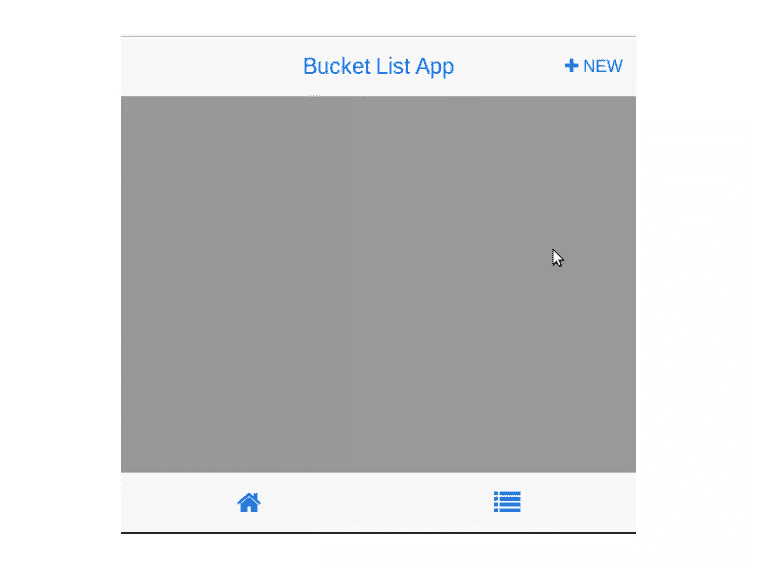
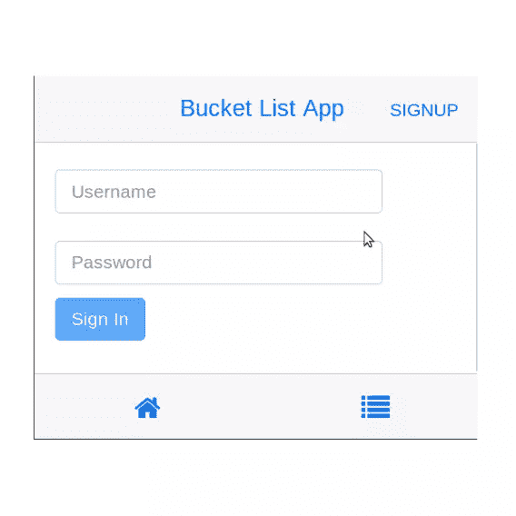
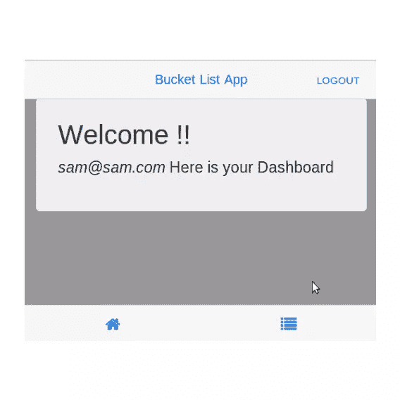

# 移动 Angular UI 入门

> 原文：<https://www.sitepoint.com/getting-started-mobile-angular-ui/>

[AngularJS](https://angularjs.org/) 是移动和网络开发中众多 buzz 框架之一。我们将使用[移动 Angular UI](http://mobileangularui.com/) 创建一个应用程序，这是一个开发 HTML 5 移动应用程序的框架，结合了 AngularJS 和 Bootstrap。它提供了 Bootstrap 3 中缺少的基本移动组件，如交换机和覆盖层等。它不依赖于 jQuery，而是依赖于像`fastclick.js`和`overthrow.js`这样的库来实现更好的移动体验。

## 入门指南

我们将创建的应用程序的演示可在 [Heroku](http://mobileangularuipart1.herokuapp.com/) 上获得。用户名为`sam@sam.com`，密码为`sam`。源代码可以在 [GitHub](https://github.com/sitepoint-examples/MobileAngularUIApp_Part_1) 上找到。

在本教程中，我们将了解如何使用 Mobile Angular UI 开发一个响应式移动应用程序。本教程期望读者对 AngularJS 和 Bootstrap 有基本的了解。

[下载](https://api.github.com/repos/mcasimir/mobile-angular-ui/zipball/)并安装移动 Angular UI，如下图所示:

```
cd mcasimir-mobile-angular-ui-90b1528
npm install
grunt
```

*上述文件夹路径中的版本号可能会有所不同。*

将你的浏览器指向`http://localhost:3000/`，你应该会看到一个移动 Angular UI 的演示。

## 创建主屏幕

让我们看看我们下载的移动 Angular UI 文件夹内部。与示例演示相关的文件位于演示文件夹中。除了 html 和 css 文件，我们还有一个`demo.js`文件。如果我们打开`demo.js`，我们可以看到 AngularJS 代码。

如果这个文件看起来有点复杂，不要担心。我们将尝试从头开始创建我们自己的小应用程序，同时破译里面的内容。

首先，在`mcasimir-mobile-angular-ui-90b1528`文件夹中创建一个名为`BucketApp`的文件夹。创建一个名为`index.html`的 html 文件。添加以下代码:

```
<!DOCTYPE html>
<html>

<head>
    <meta charset="utf-8" />
    <base href="/BucketApp/" />
    <title>Bucket App</title>
    <meta http-equiv="X-UA-Compatible" content="IE=edge,chrome=1" />
    <meta name="apple-mobile-web-app-capable" content="yes" />
    <meta name="viewport" content="user-scalable=no, initial-scale=1.0, maximum-scale=1.0, minimal-ui" />
    <meta name="apple-mobile-web-app-status-bar-style" content="yes" />
    <link rel="shortcut icon" href="/favicon.png" type="image/x-icon" />

    <link rel="stylesheet" href="/dist/css/mobile-angular-ui-hover.min.css" />
    <link rel="stylesheet" href="/dist/css/mobile-angular-ui-base.min.css" />
    <link rel="stylesheet" href="/dist/css/mobile-angular-ui-desktop.min.css" />

    <script src="//ajax.googleapis.com/ajax/libs/angularjs/1.2.15/angular.min.js"></script>
    <script src="//ajax.googleapis.com/ajax/libs/angularjs/1.2.15/angular-route.min.js"></script>
    <script src="//ajax.googleapis.com/ajax/libs/angularjs/1.2.15/angular-touch.min.js"></script>
    <script src="/dist/js/mobile-angular-ui.min.js"></script>

    <script src="BucketApp.js"></script>
</head>

<body ng-app="AngularUIBucketApp">

 // App Data will be here shortly :)

</body>

</html>
```

注意正文中的`ng-app`指令。接下来创建已经包含在`index.html`中的`BucketApp.js`。添加此代码:

```
var app = angular.module('AngularUIBucketApp', [
    "ngRoute",
    "ngTouch",
    "mobile-angular-ui"
]);

app.config(function($routeProvider, $locationProvider) {
    $routeProvider.when('/', {
        templateUrl: "signIn.html"
    });
});
```

我们在上面的代码中建立了两件事。首先，我们已经注册了`mobile-angular-ui`模块。我们已经为我们的应用程序声明了根路由为`signIn.html`。创建`signIn.html`,暂时留空。在`index.html`中，将下面的代码放入`body`标签中，它将作为基本模板。

```
<div class="app">

    <div class="navbar navbar-app navbar-absolute-top">

        <div class="navbar-brand navbar-brand-center" yield-to="title">
            <span>Bucket List App</span>
        </div>

        <div class="btn-group pull-right" yield-to="navbarAction">
            <div class="btn btn-navbar">
                <i class="fa fa-plus"></i> New
            </div>
        </div>

    </div>

    <div class="navbar navbar-app navbar-absolute-bottom">

        <div class="btn-group justified">
            <a href="#" class="btn btn-navbar btn-icon-only"><i class="fa fa-home fa-navbar"></i></a>
            <a href="#" class="btn btn-navbar btn-icon-only"><i class="fa fa-list fa-navbar"></i></a>
        </div>

    </div>

    <div class="app-body">
        <ng-view class="app-content"></ng-view>
    </div>

</div>
```

在上面的代码中，大部分代码都是自我解释的。最后一个`div`可能会引起一些混乱。它包含一个 [ngView](https://docs.angularjs.org/api/ngRoute/directive/ngView) 指令，将当前路线的模板渲染到`index.html`中。

重启服务器，将浏览器指向`http://localhost:3000/BucketApp/`，你应该会看到基本的应用模板。它应该是这样的:



接下来，在我们的基本模板中，我们需要包含一个登录表单。打开`signIn.html`并包含以下 html:

```
<div class="scrollable">
    <div class="scrollable-content section">

        <form action="" id="" ng-submit="signin()">

            <div bs-panel title="">

                <input bs-form-control type="text" ng-model="user.username" label="" label-class="col-xs-3 col-sm-2 col-lg-1" class="col-xs-10 col-sm-11 col-lg-12" placeholder="Username" />

                <input bs-form-control type="password" ng-model="user.password" label="" label-class="col-xs-3 col-sm-2 col-lg-1" class="col-xs-10 col-sm-11 col-lg-12" placeholder="Password" />

                <button type="submit" id="btnSignIn" class="btn btn-primary" data-style="expand-right">
                    Sign In
                </button>

            </div>

        </form>

    </div>
</div>
```

需要注意的是 html 代码中的 [ngSubmit](https://docs.angularjs.org/api/ng/directive/ngSubmit) 和 [ngModel](https://docs.angularjs.org/api/ng/directive/ngModel) 指令。我们必须将用户名和密码输入绑定到 [$scope](https://docs.angularjs.org/guide/scope) 。在表单提交时，它验证用户并调用`signIn`函数。下面我们在`BucketApp.js`中定义一下，如下图:

```
app.controller('MainController', ['$scope',
    function($scope) {

        // Initialized the user object
        $scope.user = {
            username: "",
            password: ""
        };

        // Sign In auth function
        $scope.signin = function() {
            var email = $scope.user.username;
            var password = $scope.user.password;
            if (email &amp;&amp; password) {
                // Sign In Logic
            }
        }

    }
]);
```

将 [ngController](https://docs.angularjs.org/api/ng/directive/ngController) 指令添加到`index.html`中的 body 标签，如下所示:

```
<body ng-app="AngularUIBucketApp" ng-controller="MainController">
```

在将用户名和密码传递给`signin`函数之前，我们需要检查空值。我们将利用[禁用](https://docs.angularjs.org/api/ng/directive/ngDisabled)来启用/禁用*签到*按钮。给`signIn.html`中的`SignIn`按钮添加`ng-disabled`属性，如下图所示:

```
ng-disabled = "user.username==undefined||user.username=='' || user.password=='' || user.password==undefined"
```

我们将使用 [Firebase](https://www.firebase.com) 作为我们应用的后端。要使用 Firebase，您首先需要注册一个免费帐户。注册后，你会得到一个 firebase 的网址。在我的例子中，firebase 的 url 是

```
https://burning-fire-1723.firebaseio.com
```

在`BucketApp.js`之前的`index.html`中包含以下 firebase 脚本:

```
<script src="https://cdn.firebase.com/js/client/1.0.18/firebase.js"></script>
<script src="https://cdn.firebase.com/libs/angularfire/0.8.0/angularfire.min.js"></script>
<script src="https://cdn.firebase.com/js/simple-login/1.6.2/firebase-simple-login.js"></script>
```

我们将使用电子邮件 id 和密码实现一个简单的登录。通过用以下代码替换`BucketApp.js`顶部的代码，将 firebase 模块包含在应用程序中:

```
var app = angular.module('AngularUIBucketApp', [
    "ngRoute",
    "ngTouch",
    "mobile-angular-ui",
    "firebase"
]);
```

接下来将`$firebaseSimpleLogin`注入到我们的控制器中，并定义 firebase 认证对象。用以下代码替换`BucketApp.js`中的当前控制器代码:

```
app.controller('MainController', ['$scope','$firebaseSimpleLogin',
    function($scope,$firebaseSimpleLogin) {

        // Init Firebase
        var ref = new Firebase("https://burning-fire-1723.firebaseio.com");
        var auth = $firebaseSimpleLogin(ref);

        // Initialized the user object
        $scope.user = {
            username: "",
            password: ""
        };

        // Sign In auth function
        $scope.signin = function() {
            var email = $scope.user.username;
            var password = $scope.user.password;
            if (email &amp;&amp; password) {
                // Sign In Logic
            }
        }

    }
]);
```

我们需要启用 Firebase 中的`Simple Login`来使用这个功能。登录 firebase，从左侧选择`Simple Login`选项卡。从列出的选项卡中选择`Email & Password`，并勾选启用。使用电子邮件 id 和密码添加新用户。

Firebase 提供了一个名为`login`的方法，我们将使用它进行身份验证。将`signin`功能更改如下:

```
$scope.signin = function() {
    var email = $scope.user.username;
    var password = $scope.user.password;
    if (email &amp;&amp; password) {
        // Sign In Logic
        auth.$login('password', {
                email: email,
                password: password
            })
            .then(function(user) {
                // On success callback
                console.log('Username and password found');
            }, function(error) {
                // On failure callback
                console.log('Username and password not found');
            });
    }
}
```

重启服务器，将浏览器指向`http://localhost:3000/BucketApp`，你应该会看到如下所示的登录页面:



尝试使用您在 firebase 中添加的用户凭据登录。如果一切顺利，您应该会在浏览器控制台中看到成功消息。

## 创建用户主页

使用以下代码创建一个名为`userHome.html`的新 html 文件:

```
<div class="container">
    <div class="jumbotron">
        <h1>Welcome !!</h1>
        <p class="lead"><i>{{userEmailId}}</i> Here is your Dashboard</p>

    </div>

</div>
```

将`userHome.html`页面添加到`BucketApp.js`中的`app.config`中，如下图所示:

```
$routeProvider.when('/userHome', {
    templateUrl: 'userHome.html'
});
```

当用户成功登录时，他们将被重定向到`/userHome`。更改控制器代码以注入 [$location](https://docs.angularjs.org/api/ng/service/%24location) 服务，如下所示:

```
app.controller('MainController', ['$scope','$firebaseSimpleLogin','$location',
    function($scope,$firebaseSimpleLogin,$location) {
```

在`signin`成功回调中，我们需要从返回的`user`对象中设置`$scope.userEmailId`，然后重定向到`/userHome`。下面是新添加的代码:

```
console.log('Username and password found');
$scope.userEmailId = user.email;
$location.path('/userHome');
```

重新启动服务器并尝试登录。成功登录后，您将被重定向到`/userHome`，并显示一条欢迎消息，如下所示:



接下来打开`index.html`并替换下面的 div

```
<div class="btn-group pull-right" yield-to="navbarAction">
    <div class="btn btn-navbar">
        <i class="fa fa-plus"></i> New
    </div>
</div>
```

使用:

```
<div class="btn-group pull-right" yield-to="navbarAction">
    <div class="btn btn-navbar">
        <i class="fa"></i><a ng-click="showSignUp()" ng-hide="loggedIn" class="btn">SignUp</a><a ng-click="logout()" ng-show="loggedIn" class="btn">Logout</a>
    </div>
</div>
```

当客人用户加载应用程序时，它会在右上角显示一个`SignUp`链接，当用户登录时，它会显示一个`Logout`链接。

我们使用了 [ngHide](https://docs.angularjs.org/api/ng/directive/ngHide) 和 [ngShow](https://docs.angularjs.org/api/ng/directive/ngShow) 指令来切换显示。现在，当用户登录时，我们将把`$scope.loggedIn`设置为 true，反之亦然。

将以下代码添加到`$scope.signin`函数的成功回调中:

```
$scope.loggedIn = true;
```

另外，如下所示定义`logout`和`showSignUp`函数:

```
$scope.logout = function() {
    $scope.loggedIn = false;   // to toggle display of SignUp/Logout
    $scope.user = {            // re init the user object
        username: "",
        password: ""
    };
    $location.path('/');       // redirect to home page after logout
}

$scope.showSignUp = function() {
    $scope.user = {            // re init the user object
        username: "",
        password: ""
    };
    $location.path('/signUp'); // redirect to SignUp page
}
```

重启服务器，将浏览器指向`http://localhost:3000/BucketApp/`并尝试登录。

## 结论

在本教程中，我们重点介绍了如何开始使用 Mobile AngularUI 开发一个移动 web 应用程序。在下一篇教程中，我们将进一步实现一个`SignUp`接口，将项目添加到我们的清单中，并将令人敬畏的 [Ladda](http://lab.hakim.se/ladda/) 集成到我们的应用程序中。我们还将使用由[移动 Angular UI](http://mobileangularui.com/docs/) 提供的一些其他组件。

## 分享这篇文章