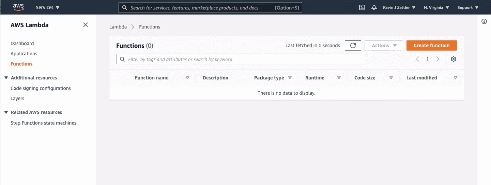
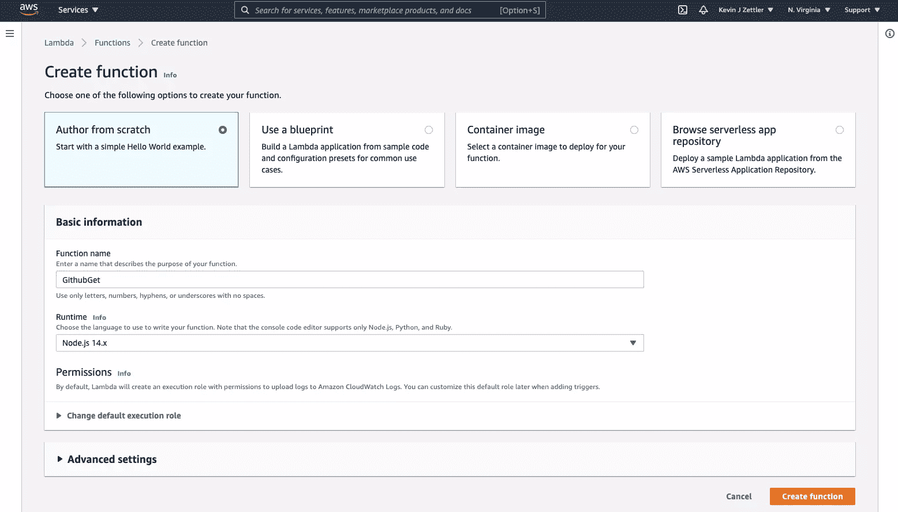
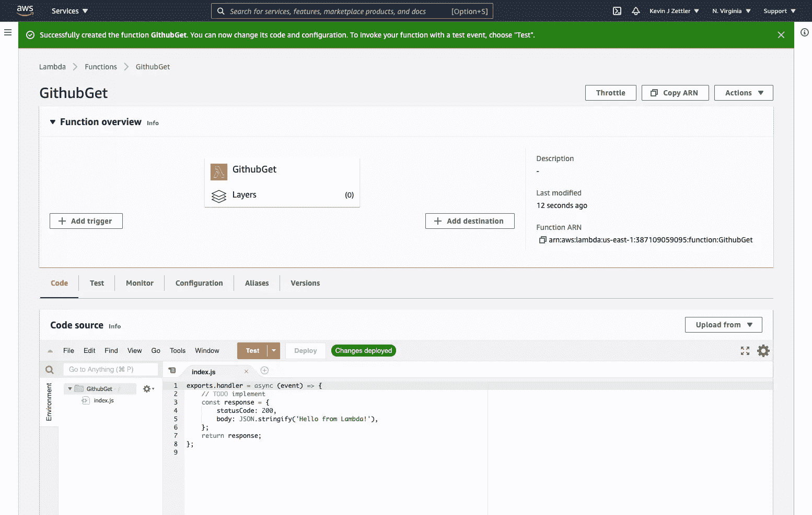
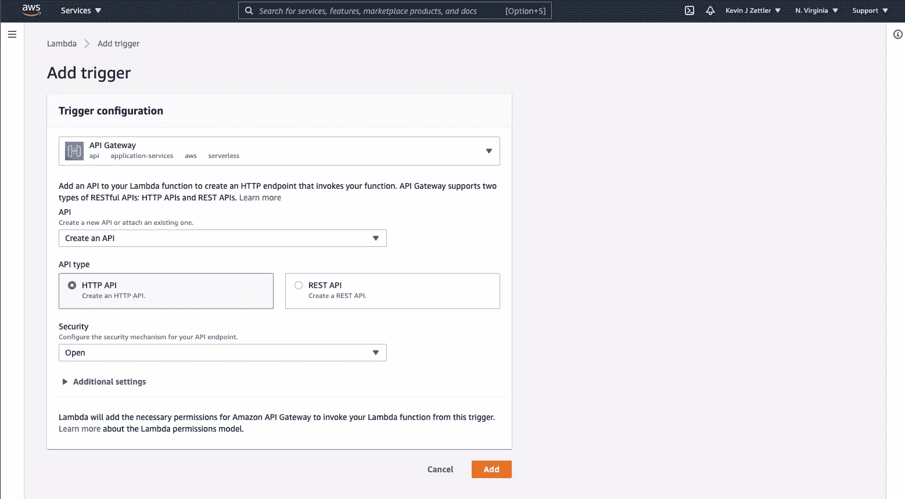
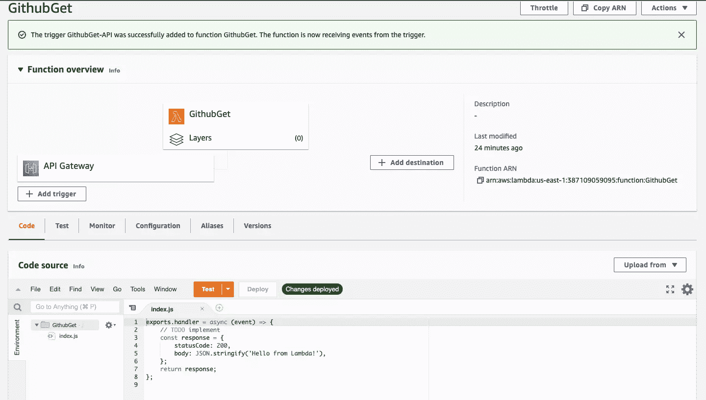
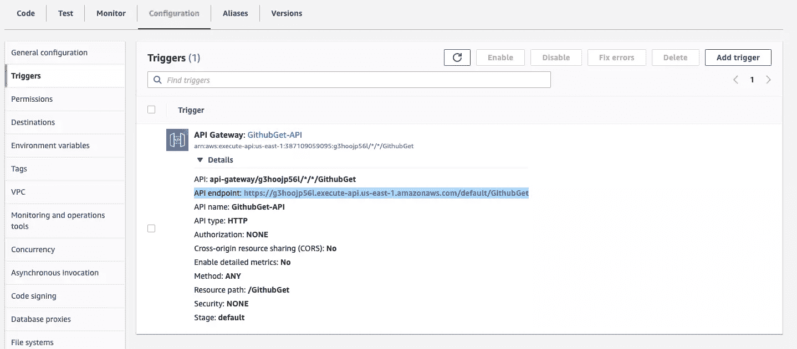
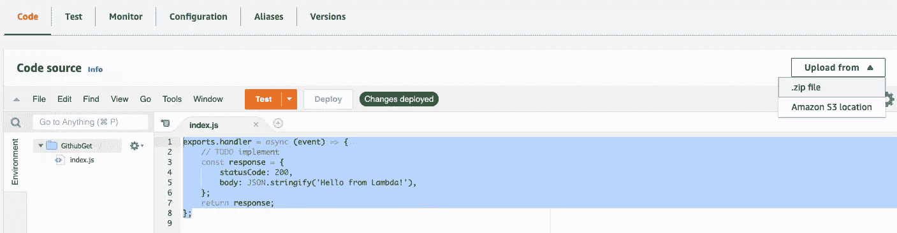

# 用 Node.js 和 AWS Lambda 创建无服务器微服务

> 原文：<https://www.sitepoint.com/getting-started-node-js-aws-lambda/>

**如果你曾经想写一个 web 应用程序或 API，而不去摆弄服务器， [**亚马逊的λ**](https://aws.amazon.com/lambda/)可能就是你要找的。**

Amazon Web Services (AWS)是 Amazon 开发并公开提供的开发者工具集合。本文将帮助您开始使用 Lambda，这是 AWS 套件中的一个工具。我们将使用 Lambda 创建一个 HTTP GET 端点，该端点将使用 [GitHub API](https://docs.github.com/en/rest/overview) 发出请求，从 GitHub 获取存储库信息并返回一个 JSON 响应。

Lambda 的口号是“运行代码而不考虑服务器”。乍一看，这可能听起来令人困惑。那么代码在哪里运行或者如何运行呢？让我们找出答案。

为了阅读这篇文章，你需要一个自己的 AWS 账户。你可以在 aws.amazon.com 创建一个免费的 AWS 账户。


## 无服务器，作为服务运行

“无服务器”是一个您可能听说过的软件基础设施术语。它描述了一个按需执行代码的解决方案。术语“无服务器”可能会产生误导，因为等式中仍然有服务器。一个更好的描述是 FaaS，或者“作为服务的功能”

这两个定义都描述了一种新的开发和部署体验。这种体验被认为是“无服务器的”，因为作为开发人员，您不再需要管理、监控或扩展任何运行您代码的服务器。你上传你的代码到一个 FaaS 提供者(这里是 AWS Lambda ), FaaS 提供者执行它并在幕后为你管理任何基础设施。

## 无服务器架构的利弊

给定这个“无服务器”架构的扩展定义，让我们看看使用 Lambda 的一些优点和缺点。

### 赞成的意见

*   **按需使用定价。**
    传统服务器托管采用循环计费周期。您的服务器总是启动并运行，使用资源并等待输入。您需要支付月费或年费，以使其在您的计费周期内保持运行。有了 Lambda，你只需要为你使用的计算资源付费，而不是空闲时间。Lambda 有两种使用定价模型:持续时间和并发性。

*   **持续定价**
    Lambda 持续定价根据函数开始执行到终止的时间来计算价格。这种价格计算有利于使用短期计算资源的项目。与传统的“闲置”托管解决方案相比，您可以节省大量资金。

    Lambda 久期定价如下:

    *   每 100 万次请求 0.20 美元
    *   每 GB 秒的计算时间为 0.00001667 美元，每次执行四舍五入到最接近的 100 毫秒

    持续时间定价取决于您部署的功能的预配置内存使用情况。这种持续时间和内存可变性创建了一个定价矩阵，该矩阵在 [Lambda 定价页面](https://aws.amazon.com/lambda/pricing/)上有更详细的描述。

*   **并发定价**
    “供应并发”模式定价计算从启用到禁用的价格。并发模式使 lambda 函数保持就绪，并从持续模式中移除任何启动时间。

    Lambda 并发定价如下:

    *   调配的并发量为每 GB 秒 0.0000041667 美元
    *   每 100 万次请求收费 0.20 美元
    *   持续时间为每 GB 秒 0.0000097222 美元

    AWS 定价页面包括定价矩阵的更多详细信息和示例。在 [Lambda 定价页面](https://aws.amazon.com/lambda/pricing/)了解更多信息。

*   **内置自动扩展**
    在传统的托管基础设施中，有时您可能需要担心性能和可扩展性。随着应用程序的流量和使用量的增加，您可能需要向基础架构添加更多的托管服务器来满足需求。自我管理的扩展会给用户带来失败和瓶颈。Lambda 会在需要时自动扩展，消除额外的认知开销。

### 骗局

*   **不一致的本地开发工作流程。**

    可以在本地编写 Lambda 函数代码，并隔离测试。不过，如果不创建自己拼凑的 Lambda 版本，就无法在本地模拟生产环境。

## Lambda 关键概念:代码和触发器

Lambda 有两个主要概念:**代码**和**触发器**。代码是自明的。在我们的例子中，是您编写并上传到 Lambda 的 JavaScript 代码来产生您想要的行为。

一旦上传，代码不会自己执行。这就是触发器发挥作用的地方。触发器是由其他 AWS 服务触发的事件，这些服务将数据传递给 Lambda 函数执行。

在以下情况下会看到一些示例触发器:

*   对 AWS API 网关的 HTTP 请求触发 Lambda 代码
*   事件按时间间隔触发，就像 CloudWatch 事件中的 cron 作业一样
*   DynamoDB 表被更新并触发 Lambda 代码

### λ代码函数签名

通过从 JavaScript 中导出与预期 Lambda 签名匹配的常规函数，可以定义 Lambda 函数:

```
exports.myLambdaFunction = (event, context, callback) => {
   // Use callback() and return
} 
```

该函数接收三个参数:

*   `event`:Lambda 传递给函数的“触发器数据”的键值对字典。

*   `context` : AWS 内部信息，如 AWS 请求 ID、Lambda 到期超时和日志信息。欲了解更多信息，请参阅[λ文档](https://docs.aws.amazon.com/lambda/latest/dg/nodejs-context.html)。

*   `callback`:一个标准的异步 JavaScript 回调处理器。更多信息见[λ文档](http://docs.aws.amazon.com/lambda/latest/dg/nodejs-prog-model-handler.html#nodejs-prog-model-handler-callback)

## 构建 Lambda 函数

要开始创建新的 Lambda 函数，请访问 [Lambda 仪表板](https://console.aws.amazon.com/lambda/home?region=us-east-1#/functions?display=list)。

它应该看起来像这样:



点击**创建功能**按钮开始。

### 创建功能

下一个屏幕将提示您创建 Lambda 函数的几个选项。



这些选项包括:

*   作者从零开始
*   使用蓝图
*   容器图像
*   浏览无服务器应用存储库

出于我们的目的，从头选择**作者**并填写“基本信息”部分。添加函数名。(下面我用过“GithubGet”。)点击**创建功能**按钮继续。

### 功能概述

我们现在在功能概览屏幕上。



上方的函数概览窗格包含函数触发器、函数和目标。下面的窗格包含其他配置的源代码和选项卡。接下来，我们将向函数添加一个触发器。点击**添加触发器**按钮。

### 添加触发器

在添加触发器屏幕上，执行以下操作:

1.  从下拉列表中选择“API 网关”
2.  从 API 下拉列表中选择“创建 API”
3.  选择 HTTP API 选项
4.  从安全性下拉列表中选择“打开”

最终的触发器配置应该如下所示:



点击**添加**按钮继续。

### 指定 Lambda 功能代码

现在，在 GithubGet 函数之前，我们在函数概述页面上注册了一个 API 网关触发器。



在下方窗格中，单击“代码”选项卡查看代码编辑器。有一个预先配置的“你好，世界！”类似如下的代码示例:

```
exports.handler = async (event) => {
    // TODO implement
    const response = {
        statusCode: 200,
        body: JSON.stringify('Hello from Lambda!'),
    };
    return response;
}; 
```

现在我们已经有了 API 网关触发器，我们可以公开访问这个函数了。单击“配置”选项卡和“触发器”选项卡，并展开“API 网关”触发器。



您应该看到一个带有 URL 的 *API 端点:*条目。单击该 URL，您应该会看到一个呈现“来自 Lambda 的问候”的页面消息。恭喜你！您已经设置了一个简单的 AWS Lambda 实例。内联编辑器需要很少的开销来启动和运行 Lambda 代码，但是我们将在本教程中做一些更高级的事情。

## 创建具有依赖性的复杂函数

在大多数真实场景中，您会希望使用通过 npm 安装的第三方库来创建更复杂的函数。

让我们创建一个使用 npm 依赖项的自定义函数，并将其上传到 Lambda。您可以遵循下面的步骤，或者随意从示例库的[中获取代码。](https://github.com/sitepoint-editors/sitepoint-aws-lambda-tutorial)

### 创建新功能

让我们为我们的新功能建立一个文件夹，并在其中用默认的`package.json`文件初始化 npm:

```
npm init -f 
```

接下来，我们将安装官方 GitHub 客户端:

```
npm install @octokit/rest 
```

使用以下代码创建文件`index.js`:

```
const { Octokit } = require("@octokit/rest");
const octokit = new Octokit();

exports.handler = async (event) => {
  try{
    const ghres = await octokit.rest.search.repos({
      q: "sitepoint",
      sort: "stars"
    });

    const result = ghres.data.items.map(function(repo){
      return { url: repo.html_url, "stars": repo.stargazers_count };
    });

    return {
      statusCode: 200,
      body: JSON.stringify(result)
    }

  }catch(error){
    return {
      statusCode: 500,
      body: {error: error}
    }
  }
}; 
```

下面是这段代码所做工作的分类:

*   它包含并初始化 GitHub“octo kit”rest API。
*   它定义了一个匹配 Lambda 签名的函数`handler`。
*   当调用`handler`时，它向 GitHub 发出一个搜索请求，搜索所有与`sitepoint`匹配的 repos 作为查询。
*   根据 Github 的响应，创建了一个映射，其中包括每个 repo 的 URL 和星计数。
*   最后，它返回一个 HTTP 响应，就像一个匹配 [API 网关的预期集成](https://github.com/awsdocs/aws-lambda-developer-guide/blob/main/sample-apps/nodejs-apig/function/index.js#L18-L31)的对象。

### 上传到 AWS Lambda

使用您熟悉的任何 zip 实用程序创建函数文件的 zip 文件。我在 macOS 上使用了命令行`zip`实用程序，如下所示:

```
zip -r lambdaupload.zip ./index.js ./node_modules/ 
```

要上传代码到 Lambda，返回到函数概览上的代码编辑器，点击**从**选择器上传并选择”。zip”。



然后从电脑中选择`lambdaupload.zip`文件，上传到 AWS。您应该会看到代码编辑器刷新，并上传了我们上面写的处理程序。如果您访问我们从触发器配置中找到的 API 端点 URL，您应该会看到一个新的响应，而不是“Hello from Lambda！”消息。恭喜你！你已经成功地在 Lambda 上部署并触发了代码。

## Lambda 的下一步和未来

我希望这个项目为您使用 AWS Lambda 打下了良好的基础。尽管我们在函数代码中使用了第三方客户端(GitHub)集成，但这可以由任何其他客户端 API 或数据库客户端连接来代替。

### 无服务器框架

本文演示了一个非常手动的、有点短暂的 Lambda 配置过程。还有其他方法来配置和初始化由 AWS API 驱动的 Lambda。

一些工具和框架构建在 AWS API 之上，有助于简化这一过程:

*   :这是最成熟的 FaaS 框架。它提供了非常全面的 Lambda 体验，并适用于其他非 AWS FaaS 提供商。它为快速迭代、自动化 Lambda 代码部署、多部署阶段环境等提供了本地开发环境设置。

*   **[terraform.io](https://www.terraform.io/)** :这是一个被广泛采用的基础设施即代码和配置管理工具。Terraform 允许开发人员以声明方式定义云基础架构配置，然后自动部署和同步这些配置。在之前的 Lambda 练习中，我们通过 AWS 浏览器 UI 进行了大量手动配置。这项工作相当繁琐，如果我们需要改变什么，我们必须在 AWS UI 中做进一步的工作。相反，我们可以用 Terraform 定义我们在 AWS 上使用的资源，并让 Terraform 自动部署 Lambda 函数。

### 你怎么想呢?

在未来的项目中，你会考虑 FaaS 吗？也许你已经开始使用 Lambda 作为你的应用架构的一部分了？不管怎样，我都想听听你的想法。

## 分享这篇文章